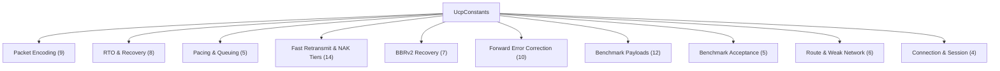
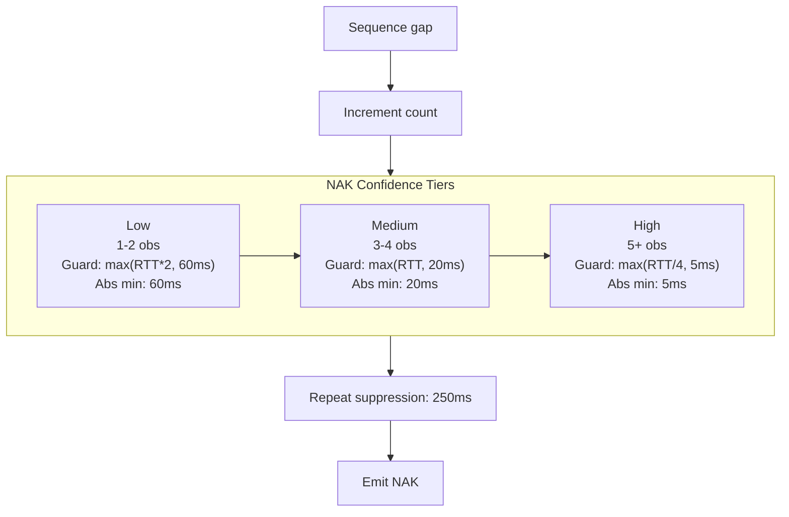

# PPP PRIVATE NETWORK™ X — Universal Communication Protocol (UCP) — Constants Reference

[中文](constants_CN.md) | [Documentation Index](index.md)

**Protocol designation: `ppp+ucp`** — This document catalogs all 77+ tunable and fixed constants in the UCP protocol implementation, organized by subsystem. All constants are defined in `UcpConstants` and exposed through `UcpConfiguration`. Time values are in microseconds unless explicitly named otherwise (e.g., `*Milliseconds`, `*Bytes`).

---

## Constants System Overview

---

## 1. Packet Encoding

| Constant | Value | Meaning |
|---|---|---|
| `MSS` | 1220 | Default maximum segment size including all headers. Increased to 9000 for high-bandwidth benchmarks. |
| `COMMON_HEADER_SIZE` | 12 | Mandatory common header: Type(1) + Flags(1) + ConnId(4) + Timestamp(6). |
| `DATA_HEADER_SIZE` | 20 | Common header plus DATA-specific: SeqNum(4) + FragTotal(2) + FragIndex(2). |
| `MAX_PAYLOAD_SIZE` | 1200 | Max application payload per DATA packet at default MSS. |
| `ACK_FIXED_SIZE` | 26 | ACK bytes before variable-length SACK blocks: AckNumber(4) + SackCount(2) + reserved. |
| `SACK_BLOCK_SIZE` | 8 | Encoded size of one SACK range: StartSequence(4) + EndSequence(4). |
| `DEFAULT_ACK_SACK_BLOCK_LIMIT` | 149 | Max SACK blocks per ACK at default MSS. Auto-reduced for smaller MSS. |
| `HAS_ACK_FLAG` | `0x01` | Bit in Flags byte indicating HasAckNumber field is present. |
| `PIGGYBACK_ACK_SIZE` | 4 | Size of optional AckNumber field when HasAckNumber is set. |

## 2. RTO and Recovery Timers

| Constant | Value | Meaning |
|---|---|---|
| `DEFAULT_RTO_MICROS` | 200,000 µs (200ms) | Optimized minimum RTO. Balances fast recovery on lossy LAN against premature timeout on jittery paths. |
| `INITIAL_RTO_MICROS` | 250,000 µs (250ms) | Initial RTO before any RTT samples collected. +50ms margin during handshake. |
| `DEFAULT_MAX_RTO_MICROS` | 15,000,000 µs (15s) | Absolute max RTO. Milder than TCP's ≥60s for faster dead-path detection. |
| `RTO_BACKOFF_FACTOR` | 1.2 | Multiplier per consecutive timeout. **Key design**: TCP uses 2.0x; UCP uses 1.2x since BBR doesn't reduce CWND on loss, making RTO more likely a true dead path. |
| `RTO_RETRANSMIT_BUDGET_PER_TICK` | 4 pkts/tick | Max RTO-triggered retransmits per timer tick. Prevents 1000+ packet bursts. |
| `RTO_ACK_PROGRESS_SUPPRESSION_MICROS` | 2,000 µs (2ms) | Suppress bulk RTO scanning if ACK progress occurred within this window. Mimics QUIC PTO behavior. |
| `URGENT_RETRANSMIT_BUDGET_PER_RTT` | 16 pkts/RTT | Max urgent retransmits bypassing pacing/FQ per RTT window. Resets at each new RTT estimate. |
| `URGENT_RETRANSMIT_DISCONNECT_THRESHOLD_PERCENT` | 75% | When idle time reaches this % of DisconnectTimeout, tail-loss probes become urgent. |

## 3. Pacing and Queuing

| Constant | Value | Meaning |
|---|---|---|
| `DEFAULT_MIN_PACING_INTERVAL_MICROS` | 0 µs | No artificial minimum inter-packet gap. Token bucket fully controls pacing. |
| `DEFAULT_PACING_BUCKET_DURATION_MICROS` | 10,000 µs (10ms) | Token bucket capacity window. 10ms allows full-packet sends even at low rates. |
| `MAX_NEGATIVE_TOKEN_BALANCE_MULTIPLIER` | 0.5 (50%) | Max negative token balance as fraction of bucket capacity. Caps urgent retransmit pacing debt. |
| `FAIR_QUEUE_ROUND_MILLISECONDS` | 10 ms | Fair-queue round duration. 10ms balances fairness granularity against scheduling overhead. |
| `MAX_BUFFERED_FAIR_QUEUE_ROUNDS` | 2 rounds | Max credit accumulation prevents "sleeping lion" bursts from long-idle connections. |

## 4. Fast Retransmit and NAK Tiers

### 4.1 SACK-Based Recovery

| Constant | Value | Meaning |
|---|---|---|
| `DUPLICATE_ACK_THRESHOLD` | 2 | Duplicate ACKs needed for fast retransmit. Lower than TCP's 3 because UCP's piggybacked ACK model reduces dup ACK frequency. |
| `SACK_FAST_RETRANSMIT_THRESHOLD` | 2 | SACK observations before first hole is repairable. Matches QUIC design. |
| `SACK_FAST_RETRANSMIT_DISTANCE_THRESHOLD` | 32 seqs | Parallel multi-hole distance threshold for simultaneous repair. |
| `SACK_FAST_RETRANSMIT_MIN_REORDER_GRACE_MICROS` | 3,000 µs (3ms) | Minimum reorder grace. Actual = `max(3ms, RTT/8)`. |
| `SACK_BLOCK_MAX_SENDS` | 2 | Max SACK advertisement count per range. Prevents SACK amplification. |

### 4.2 NAK Three-Tier Confidence

| Constant | Value | Meaning |
|---|---|---|
| `NAK_MISSING_THRESHOLD` | 2 | Minimum observations before gap becomes NAK-eligible. |
| `NAK_LOW_CONFIDENCE_GUARD_MULTIPLIER` | 2.0 | RTT multiplier for Low confidence: `max(RTT×2, 60ms)`. |
| `NAK_MEDIUM_CONFIDENCE_GUARD_MULTIPLIER` | 1.0 | RTT multiplier for Medium confidence: `max(RTT, 20ms)`. |
| `NAK_HIGH_CONFIDENCE_GUARD_MULTIPLIER` | 0.25 | RTT multiplier for High confidence: `max(RTT/4, 5ms)`. |
| `NAK_LOW_CONFIDENCE_MIN_GUARD_MICROS` | 60,000 µs (60ms) | Absolute minimum guard for Low confidence. |
| `NAK_MEDIUM_CONFIDENCE_MIN_GUARD_MICROS` | 20,000 µs (20ms) | Absolute minimum guard for Medium confidence. |
| `NAK_HIGH_CONFIDENCE_MIN_GUARD_MICROS` | 5,000 µs (5ms) | Absolute minimum guard for High confidence. |
| `NAK_REPEAT_INTERVAL_MICROS` | 250,000 µs (250ms) | Minimum interval between successive NAKs for the same sequence. |
| `MAX_NAK_SEQUENCES_PER_PACKET` | 256 | Max missing sequence entries per NAK packet. |

## 5. BBRv2 Recovery Parameters

| Constant | Value | Meaning |
|---|---|---|
| `BBR_FAST_RECOVERY_PACING_GAIN` | 1.25 | Fast-recovery pacing gain for non-congestion loss. Temporarily boosts send rate 25%. |
| `BBR_CONGESTION_LOSS_REDUCTION` | 0.98 | Gentle 2% reduction per congestion event. Far milder than TCP's 50% halving. |
| `BBR_MIN_LOSS_CWND_GAIN` | 0.95 | CWND floor after congestion: stays at ≥95% of BDP. |
| `BBR_LOSS_CWND_RECOVERY_STEP` | 0.04 / ACK | CWND gain recovery per ACK. ~25 ACKs to restore to 1.0. |
| `BBR_RANDOM_LOSS_MAX_DEDUPED_EVENTS` | 2 | Max isolated loss events in short window classified as random. |
| `BBR_CONGESTION_LOSS_WINDOW_THRESHOLD` | 3 | Loss events exceeding this count require RTT evidence for congestion. |
| `BBR_CONGESTION_LOSS_RTT_MULTIPLIER` | 1.10 | RTT must exceed `MinRtt × 1.10` for classifier to confirm congestion. 10% inflation threshold. |

## 6. Forward Error Correction

| Constant | Value | Meaning |
|---|---|---|
| `FEC_GROUP_SIZE` | 8 (default) | Default DATA packets per FEC group. O(N²) Gaussian elimination is trivial at N=8. |
| `FEC_MAX_GROUP_SIZE` | 64 | Max group size. GF(256) O(1) operations make even 64-equation systems microsecond-level. |
| `FEC_REPAIR_PACKET_TYPE` | `0x08` | Wire type identifier for FEC repair packets. |
| `FEC_MAX_REPAIR_PACKETS` | GroupSize | Theoretical max repair packets per group equals group size. |
| `FEC_GF256_FIELD_POLYNOMIAL` | `0x11B` | Irreducible polynomial: `x⁸ + x⁴ + x³ + x + 1`. Industry standard (shared with AES Rijndael). |
| `FEC_ADAPTIVE_MIN_LOSS_PERCENT` | 0.5% | Below 0.5% loss, use minimal base redundancy. |
| `FEC_ADAPTIVE_LOW_LOSS_PERCENT` | 2.0% | At 0.5-2% loss, increase redundancy 1.25x. |
| `FEC_ADAPTIVE_MEDIUM_LOSS_PERCENT` | 5.0% | At 2-5% loss, increase redundancy 1.5x and reduce group size. |
| `FEC_ADAPTIVE_HIGH_LOSS_PERCENT` | 10.0% | At 5-10% loss, max adaptive redundancy 2.0x. Above 10%, retransmission primary. |
| Adaptive redundancy calc | — | `base_redundancy × tier_multiplier × (base_group_size / current_group_size)`. |

## 7. Benchmark Payloads

| Constant | Value | Rationale |
|---|---|---|
| `BENCHMARK_100M_PAYLOAD_BYTES` | 16 MB | ~1.28s at 100 Mbps, sufficient for full BBRv2 startup→drain→ProbeBW convergence. |
| `BENCHMARK_100M_LOSS_PAYLOAD_BYTES` | 32 MB | Larger payload for lossy paths to measure sustained recovery over many RTTs. |
| `BENCHMARK_HIGH_LOSS_HIGH_RTT_PAYLOAD_BYTES` | 16 MB | Balances test duration against measurement adequacy on high-RTT paths. |
| `BENCHMARK_MOBILE_3G_PAYLOAD_BYTES` | 16 MB | 2 Mbps × 16 MB ≈ 64s. 3G is slow enough for 16 MB to provide adequate measurement. |
| `BENCHMARK_MOBILE_4G_PAYLOAD_BYTES` | 32 MB | 20 Mbps × 32 MB ≈ 12.8s. Higher BW 4G needs larger payload for reliable throughput. |
| `BENCHMARK_WEAK_4G_PAYLOAD_BYTES` | 16 MB | Covers mid-transfer 80ms outage + recovery. |
| `BENCHMARK_SATELLITE_PAYLOAD_BYTES` | 16 MB | 10 Mbps × 300ms. 16 MB ≈ 12.8s, covers ~43 RTTs for steady-state BBRv2. |
| `BENCHMARK_VPN_PAYLOAD_BYTES` | 16 MB | 50 Mbps ≈ 2.56s. Sufficient for asymmetric routing behavior analysis. |
| `BENCHMARK_1G_PAYLOAD_BYTES` | 16 MB | 1 Gbps ≈ 0.128s. Short but sufficient for no-loss convergence (2-5 RTT). |
| `BENCHMARK_1G_LOSS_PAYLOAD_BYTES` | 64 MB | 1 Gbps ≈ 0.512s. Larger for lossy gigabit—16 MB would only see ~10 loss events at 1%. |
| `BENCHMARK_10G_PAYLOAD_BYTES` | 32 MB | 10 Gbps ≈ 25.6ms. Logical clock serialization ensures accurate throughput despite in-process speed. |
| `BENCHMARK_LONG_FAT_100M_PAYLOAD_BYTES` | 16 MB | 100 Mbps × 150ms → BDP ≈ 1.875 MB. 16 MB covers ~8.5 BDP for sustained CWND growth. |

## 8. Benchmark Acceptance Criteria

| Constant | Value | Meaning |
|---|---|---|
| `BENCHMARK_MIN_NO_LOSS_UTILIZATION_PERCENT` | 70% | Minimum bottleneck utilization on no-loss paths. |
| `BENCHMARK_MIN_LOSS_UTILIZATION_PERCENT` | 45% | Minimum utilization on lossy paths. Accounts for recovery overhead. |
| `BENCHMARK_MIN_CONVERGED_PACING_RATIO` | 0.70 | Lower bound for converged pacing ratio. <0.70 = underutilizing. |
| `BENCHMARK_MAX_CONVERGED_PACING_RATIO` | 3.0 | Upper bound. >3.0 = over-sending (should not happen under virtual clock). |
| `BENCHMARK_MAX_JITTER_DELAY_MULTIPLIER` | 4.0 | Max acceptable jitter relative to configured propagation delay. |

## 9. Report Convergence Time Parser

`UcpPerformanceReport.ParseTimeDisplay()` interprets adaptive units:

| Format | Example | Parsed Value | Scenario Example |
|---|---|---|---|
| Nanoseconds | `843ns` | <1ms | Extreme-low-latency LAN |
| Microseconds | `127us` | <1ms | Loopback or intra-DC |
| Milliseconds | `193.0ms` | 193ms | Typical broadband (NoLoss <50ms) |
| Seconds (1 digit) | `1.76s` | 1760ms | Medium-RTT lossy (Lossy 5% <3s) |
| Seconds (2+ digits) | `28.71s` | 28710ms | Satellite (Satellite <30s) |

## 10. Route and Weak-Network Constants

| Constant | Value | Meaning |
|---|---|---|
| `BENCHMARK_ASYM_FORWARD_DELAY_MILLISECONDS` | 25 ms | AsymRoute A→B explicit propagation delay (~5000km fiber). |
| `BENCHMARK_ASYM_BACKWARD_DELAY_MILLISECONDS` | 15 ms | AsymRoute B→A delay. 10ms difference with forward simulates asymmetric routing. |
| `BENCHMARK_WEAK_4G_OUTAGE_PERIOD_MILLISECONDS` | 900 ms | Elapsed time before mid-transfer blackout in Weak4G scenario. |
| `BENCHMARK_WEAK_4G_OUTAGE_DURATION_MILLISECONDS` | 80 ms | Duration of complete blackout. Long enough to trigger RTO timeout (default 200ms never hits). |
| `BENCHMARK_DIRECTIONAL_DELAY_MAX_MS` | 15 ms | Max allowed one-way delay difference for auto-generated route models. |
| `BENCHMARK_DIRECTIONAL_DELAY_MIN_MS` | 3 ms | Minimum delay difference to ensure measurable asymmetry. |

## 11. Connection and Session Constants

| Constant | Value | Meaning |
|---|---|---|
| `CONNECTION_ID_BITS` | 32 bits | 2^32 ≈ 4.29 billion unique IDs. Collision probability negligible at practical deployment scales. |
| `SEQUENCE_NUMBER_BITS` | 32 bits | 2^32 ≈ 4.29 billion sequence numbers. Wrap-around time at 10 Gbps = ~3.4s. PAWS with 2^31 window ensures safety. |
| `MAX_CONNECTION_ID_COLLISION_RETRIES` | 3 | Max random ConnId generation retries before falling back to sequential assignment. |
| `DEFAULT_SERVER_RECV_WINDOW_PACKETS` | 16,384 | Default receive window: 16,384 × 1220B ≈ 20 MB. Large enough to not be a throughput bottleneck. |
