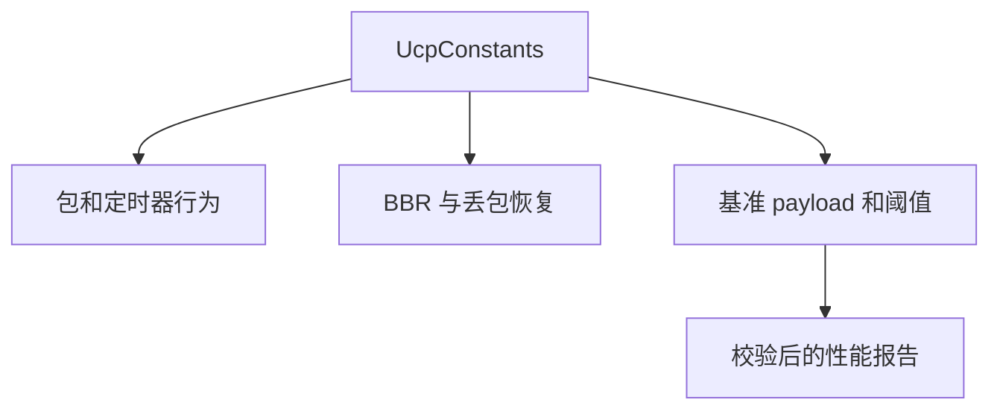

# UCP 常量参考

[English](constants.md) | [文档索引](index_CN.md)

所有协议常量集中在 `UcpConstants`。除名称另有说明外，时间值均为微秒。

## 包编码

| 常量 | 值 | 含义 |
|---|---:|---|
| `MSS` | 1220 | 默认最大分段大小，含头部。 |
| `DATA_HEADER_SIZE` | 20 | 公共头加 DATA 序号/分片字段。 |
| `MAX_PAYLOAD_SIZE` | 1200 | 默认 MSS 下最大 DATA payload。 |
| `ACK_FIXED_SIZE` | 26 | ACK 可变 SACK blocks 前的固定字节数。 |
| `SACK_BLOCK_SIZE` | 8 | 单个 SACK range 编码大小。 |
| `DEFAULT_ACK_SACK_BLOCK_LIMIT` | 149 | 默认 MSS 下 SACK block 上限。 |

## RTO 与恢复

| 常量 | 值 | 含义 |
|---|---:|---|
| `DEFAULT_RTO_MICROS` | 200,000 | 优化默认最小 RTO。 |
| `INITIAL_RTO_MICROS` | 250,000 | 无 RTT 样本时初始 RTO。 |
| `DEFAULT_MAX_RTO_MICROS` | 15,000,000 | 优化默认最大 RTO。 |
| `RTO_BACKOFF_FACTOR` | 1.2 | 超时退避乘数。 |
| `RTO_RETRANSMIT_BUDGET_PER_TICK` | 4 | 单个 timer tick 可触发的 RTO 重传数。 |
| `URGENT_RETRANSMIT_BUDGET_PER_RTT` | 16 | 每 RTT 窗口允许绕过 pacing/FQ 的紧急重传数。 |
| `URGENT_RETRANSMIT_DISCONNECT_THRESHOLD_PERCENT` | 75 | 空闲达到断连超时此比例后，tail-loss probe 可标记紧急。 |

## Pacing 与队列

| 常量 | 值 | 含义 |
|---|---:|---|
| `DEFAULT_MIN_PACING_INTERVAL_MICROS` | 0 | 默认不加人工最小包间隔，由 token bucket 控制。 |
| `DEFAULT_PACING_BUCKET_DURATION_MICROS` | 10,000 | Token bucket 容量窗口。 |
| `FAIR_QUEUE_ROUND_MILLISECONDS` | 10 | 服务端公平队列 credit 轮次。 |
| `MAX_BUFFERED_FAIR_QUEUE_ROUNDS` | 2 | 最大保留 FQ credit。 |

## 快重传与 NAK

| 常量 | 值 | 含义 |
|---|---:|---|
| `DUPLICATE_ACK_THRESHOLD` | 2 | 触发快重传所需重复 ACK 数。 |
| `SACK_FAST_RETRANSMIT_THRESHOLD` | 2 | 首个缺口所需 SACK 观测次数。 |
| `SACK_FAST_RETRANSMIT_DISTANCE_THRESHOLD` | 2 | 确认缺口所需的后续 SACK 距离。 |
| `SACK_FAST_RETRANSMIT_MIN_REORDER_GRACE_MICROS` | 5,000 | 发送端 SACK 修复最小乱序保护。 |
| `NAK_MISSING_THRESHOLD` | 2 | 接收端发 NAK 前的缺口观测次数。 |
| `NAK_REORDER_GRACE_MICROS` | 60,000 | 接收端 NAK 前的乱序保护。 |
| `NAK_REPEAT_INTERVAL_MICROS` | 250,000 | 同序号 NAK 重复抑制。 |
| `MAX_NAK_SEQUENCES_PER_PACKET` | 64 | 单个 NAK 最多携带缺失序号数。 |

## BBR 恢复常量

| 常量 | 值 | 含义 |
|---|---:|---|
| `BBR_FAST_RECOVERY_PACING_GAIN` | 1.25 | 非拥塞快恢复 pacing gain。 |
| `BBR_CONGESTION_LOSS_REDUCTION` | 0.98 | 拥塞丢包温和削减乘数。 |
| `BBR_MIN_LOSS_CWND_GAIN` | 0.95 | 拥塞丢包后 CWND gain 下限。 |
| `BBR_LOSS_CWND_RECOVERY_STEP` | 0.04 | 每 ACK 向完整 CWND gain 恢复的步长。 |
| `BBR_RANDOM_LOSS_MAX_DEDUPED_EVENTS` | 2 | 小规模孤立丢包视为随机。 |
| `BBR_CONGESTION_LOSS_WINDOW_THRESHOLD` | 3 | 更大丢包窗口需要 RTT 证据才判拥塞。 |
| `BBR_CONGESTION_LOSS_RTT_MULTIPLIER` | 1.10 | 拥塞分类 RTT 膨胀阈值。 |

## 基准 Payload

| 场景 | Payload |
|---|---:|
| `BENCHMARK_100M_PAYLOAD_BYTES` | 4 MB |
| `BENCHMARK_100M_LOSS_PAYLOAD_BYTES` | 16 MB |
| `BENCHMARK_HIGH_LOSS_HIGH_RTT_PAYLOAD_BYTES` | 4 MB |
| `BENCHMARK_MOBILE_3G_PAYLOAD_BYTES` | 4 MB |
| `BENCHMARK_MOBILE_4G_PAYLOAD_BYTES` | 8 MB |
| `BENCHMARK_WEAK_4G_PAYLOAD_BYTES` | 4 MB |
| `BENCHMARK_SATELLITE_PAYLOAD_BYTES` | 8 MB |
| `BENCHMARK_VPN_PAYLOAD_BYTES` | 32 MB |
| `BENCHMARK_1G_PAYLOAD_BYTES` | 4 MB |
| `BENCHMARK_1G_LOSS_PAYLOAD_BYTES` | 64 MB |
| `BENCHMARK_10G_PAYLOAD_BYTES` | 8 MB |
| `BENCHMARK_LONG_FAT_100M_PAYLOAD_BYTES` | 16 MB |

丢包场景 payload 故意比 smoke test 更大，使报告衡量稳态恢复，而不是主要被启动和一两个 RTT 的修复延迟摊薄。

## 基准验收

| 常量 | 值 | 含义 |
|---|---:|---|
| `BENCHMARK_MIN_NO_LOSS_UTILIZATION_PERCENT` | 70% | 无丢包最低利用率。 |
| `BENCHMARK_MIN_LOSS_UTILIZATION_PERCENT` | 45% | 受控丢包最低利用率目标。 |
| `BENCHMARK_MIN_CONVERGED_PACING_RATIO` | 0.70 | pacing 收敛下限。 |
| `BENCHMARK_MAX_CONVERGED_PACING_RATIO` | 1.35 | pacing 收敛上限。 |
| `BENCHMARK_MAX_JITTER_DELAY_MULTIPLIER` | 4 | 相对配置 delay 的最大可接受 jitter。 |

## 路由与弱网常量

| 常量 | 值 | 含义 |
|---|---:|---|
| `BENCHMARK_ASYM_FORWARD_DELAY_MILLISECONDS` | 25 | `AsymRoute` 显式 A->B 延迟。 |
| `BENCHMARK_ASYM_BACKWARD_DELAY_MILLISECONDS` | 15 | `AsymRoute` 显式 B->A 延迟。 |
| `BENCHMARK_WEAK_4G_OUTAGE_PERIOD_MILLISECONDS` | 900 | Weak4G 单次中段 outage 触发时间。 |
| `BENCHMARK_WEAK_4G_OUTAGE_DURATION_MILLISECONDS` | 80 | Weak4G blackout 持续时间。 |

