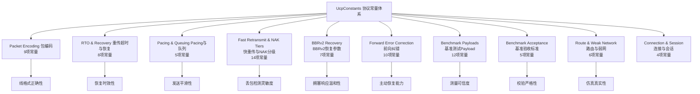
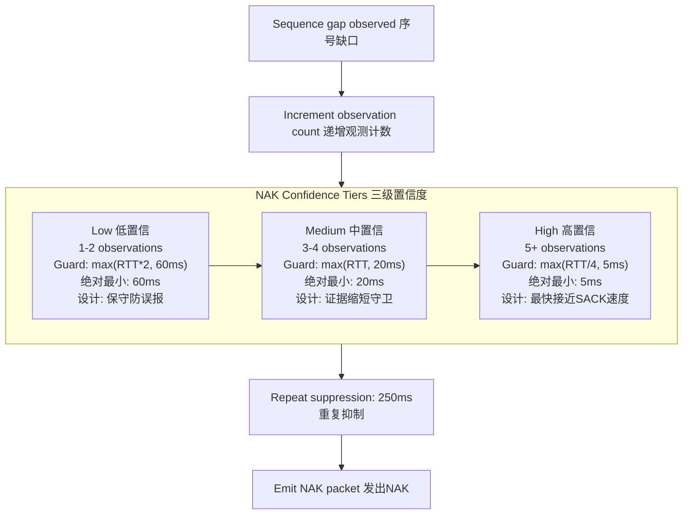

# PPP PRIVATE NETWORK™ X — 通用通信协议 (UCP) — 常量参考

[English](constants.md) | [文档索引](index_CN.md)

**协议标识: `ppp+ucp`** — 本文档按子系统分类详尽记录 UCP 协议实现中的全部 77+ 个可调和固定常量。所有常量定义在 `UcpConstants` 中并通过 `UcpConfiguration` 暴露。除显式命名外（如 `*Milliseconds`、`*Bytes`），时间值以微秒（µs）为单位，大小以字节为单位。

---

## 常量体系全景图

---

## 1. 包编码常量

定义 UCP 线格式的基础大小和限制。所有值单位为字节。

| 常量 | 值 | 含义与设计理由 |
|---|---|---|
| `MSS` | 1220 | 默认最大分段大小（含所有头部）。选择此值以适配多数互联网路径 MTU（1500−UDP头(8)−IP头(20)=1472），留有安全余量避免 IP 分片。高带宽基准场景动态增至 9000（巨型帧模式）。 |
| `COMMON_HEADER_SIZE` | 12 | 强制公共头大小：Type(1) + Flags(1) + ConnId(4) + Timestamp(6)。所有 8 种包类型的固定前缀。 |
| `DATA_HEADER_SIZE` | 20 | 公共头(12) + DATA 专有字段：SeqNum(4) + FragTotal(2) + FragIndex(2) = 20 字节。不含可选的捎带 ACK 字段。 |
| `MAX_PAYLOAD_SIZE` | 1200 | 默认 MSS(1220) − DATA_HEADER_SIZE(20) = 1200 字节。每个 DATA 包最大应用负载。捎带 ACK(含 HasAckNumber)时再减 16 字节。 |
| `ACK_FIXED_SIZE` | 26 | ACK 包中 SACK 块之前的固定部分：AckNumber(4) + SackCount(2) + 保留字段。注意 WindowSize(4) 和 EchoTimestamp(6) 紧随 SACK 块之后。 |
| `SACK_BLOCK_SIZE` | 8 | 单个 SACK 范围编码大小：StartSequence(4) + EndSequence(4)。每个范围最多通告 2 次。 |
| `DEFAULT_ACK_SACK_BLOCK_LIMIT` | 149 | 默认 MSS 下每 ACK 最大 SACK 块数。`(1220 − ACK_FIXED_SIZE − WindowSize − EchoTimestamp) / SACK_BLOCK_SIZE ≈ 149`。较小 MSS 自动缩减。 |
| `HAS_ACK_FLAG` | `0x01` | Flags 字节中指示 HasAckNumber 字段存在的位置。所有带捎带 ACK 的包类型均设置此位。 |
| `PIGGYBACK_ACK_SIZE` | 4 | HasAckNumber 置位时紧随公共头的可选 AckNumber 字段大小。整个捎带 ACK 扩展（含 SackCount + SACK + WindowSize + EchoTimestamp）在此字段之后。 |

---

## 2. RTO 与恢复定时器常量

| 常量 | 值 | 含义与设计理由 |
|---|---|---|
| `DEFAULT_RTO_MICROS` | 200,000 µs (200ms) | 优化默认最小 RTO。选择 200ms 平衡快速恢复（低延迟 LAN 足够短）与防过早超时（高抖动路径够长）。不同于 TCP 的 200ms 初始值 — 此处作为最小值而非初始值。 |
| `INITIAL_RTO_MICROS` | 250,000 µs (250ms) | 初始 RTO（无 RTT 样本时）。比最小值略高 50ms 以在握手期间提供额外余量。首次 RTT 样本到达后切换为基于 SRTT 的计算。 |
| `DEFAULT_MAX_RTO_MICROS` | 15,000,000 µs (15s) | 绝对最大 RTO。TCP 通常 ≥60s，UCP 选择 15s 以更快检测死路径。1.2×退避下从 200ms 到 15s 需约 35 次超时（约需被观测 ACK 进展重置）。 |
| `RTO_BACKOFF_FACTOR` | 1.2 | 连续超时 RTO 乘数。**关键设计选择**：TCP 用 2.0×（指数增长迅速），UCP 用 1.2× 更温和增长。原因：UCP 拥塞恢复不降低 CWND（BBR 响应在丢包分类之后），因此 RTO 更可能源于真实死路径而非拥塞，快速检测死路径比避免误判更重要。序列：200→240→288→346→415→498→...→15s。 |
| `RTO_RETRANSMIT_BUDGET_PER_TICK` | 4 包/Tick | 单个 Timer Tick（默认 20ms）RTO 可触发最大重传数。防止 1000+ 包因一次 RTO 同时涌出。选择 4 包以在恢复速度和突发控制间平衡。 |
| `RTO_ACK_PROGRESS_SUPPRESSION_MICROS` | 2,000 µs (2ms) | ACK 进展（累积 ACK 前移）后批量 RTO 扫描的抑制窗口。若 2ms 内有 ACK 进展，说明发送端仍在接收有效 ACK，不应触发 RTO。让 SACK 和 NAK 先处理恢复 — 模仿 QUIC 的 PTO（Probe Timeout）行为。 |
| `URGENT_RETRANSMIT_BUDGET_PER_RTT` | 16 包/RTT | 每 RTT 窗口绕过 Pacing 和 FQ 门控的紧急重传最大数。连接接近断连超时时触发（空闲 >75% DisconnectTimeout）。每个新 RTT 估计时重置，防止单连接垄断带宽。 |
| `URGENT_RETRANSMIT_DISCONNECT_THRESHOLD_PERCENT` | 75% | 空闲时间达 `DisconnectTimeoutMicros` 的此百分比时，尾丢包探测可标记为紧急。为断连前留出约 25% 的 DisconnectTimeout 窗口做最后紧急恢复尝试——在放弃前给连接最后一线生机。 |

---

## 3. Pacing 与队列常量

| 常量 | 值 | 含义与设计理由 |
|---|---|---|
| `DEFAULT_MIN_PACING_INTERVAL_MICROS` | 0 µs | 无人工最小包间隔。Token Bucket 全权控制 Pacing 时序而不设置下层最小间隙。BBRv2 的 PacingRate 计算已包含平滑控制，无需额外限制。 |
| `DEFAULT_PACING_BUCKET_DURATION_MICROS` | 10,000 µs (10ms) | Token Bucket 容量窗口。Bucket 容量 = PacingRate × 10ms。选择 10ms 在突发容忍和流量平滑间平衡：10ms 窗口允许在低速率时仍能发送整包（如 10Mbps 下 10ms=12.5KB 能发 ~10 个 MSS 包）。 |
| `MAX_NEGATIVE_TOKEN_BALANCE_MULTIPLIER` | 0.5 (50%) | `ForceConsume()` 产生的最大负 Token 余额为 Bucket 容量的 50%。限制紧急重传的 pacing 债务积累。选择 50% 使紧急恢复能有意义地穿越 Pacing 控制，但后续普通发送只需等待半个 Bucket 周期的偿还。 |
| `FAIR_QUEUE_ROUND_MILLISECONDS` | 10 ms | 服务端公平队列每轮时长。每 10ms，所有活跃连接获得 `roundCredit = ServerBandwidth × 10ms / ActiveCount` 的信用额度。10ms 在公平性粒度和调度开销间取得平衡。 |
| `MAX_BUFFERED_FAIR_QUEUE_ROUNDS` | 2 轮 | 空闲连接累积 credit 的最大轮数。长期空闲连接不可突发超过 2 轮的 credit（防止"睡狮"效应——空闲后突然爆发大量数据淹没队列）。超限 credit 被丢弃。 |

---

## 4. 快重传与 NAK 分级常量

### 4.1 基于 SACK 的恢复

| 常量 | 值 | 含义与设计理由 |
|---|---|---|
| `DUPLICATE_ACK_THRESHOLD` | 2 | 触发快速重传所需相同累积 ACK 值的重复次数。取 2 而非 TCP 的 3 次（TCP Fast Retransmit 用 3 DupACK）：UCP 的捎带 ACK 模型使重复 ACK 出现频率低于 TCP，因此降为 2 以加速恢复。 |
| `SACK_FAST_RETRANSMIT_THRESHOLD` | 2 | 首个缺口可修复所需 SACK 观测次数。**匹配 QUIC 设计**，取 2 观测：1 次观测可能是乱序，2 次观测高置信为真丢包。 |
| `SACK_FAST_RETRANSMIT_DISTANCE_THRESHOLD` | 32 序号 | 最高 SACK 序号以下额外缺口可并行修复的距离阈值。值为 32 意味着超出最高 SACK 观测 32 个序号的缺口与首个缺口同时修复。允许多洞并行非串行恢复。 |
| `SACK_FAST_RETRANSMIT_MIN_REORDER_GRACE_MICROS` | 3,000 µs (3ms) | 最小发送端乱序保护期。实际保护 = `max(3ms, RTT/8)`。3ms 是低 RTT 路径（<24ms）上的最小值（RTT/8 < 3ms 时使用 3ms）。高 RTT 路径自动延长保护。 |
| `SACK_BLOCK_MAX_SENDS` | 2 | 单个 SACK 块范围的最大通告次数。**QUIC 启发设计**：持久乱序下持续通告同一 SACK 范围不仅浪费带宽（SACK 放大），还可能使发送端误判为持续丢包。2 次后抑制让 NAK 接管恢复。 |

### 4.2 NAK 三级置信度

NAK 是 UCP 独有的分级置信度恢复路径。下列常量共同定义三级守卫体系：

| 常量 | 值 | 含义与设计理由 |
|---|---|---|
| `NAK_MISSING_THRESHOLD` | 2 | 缺口成为 NAK 候选前的最小接收端观测次数。1 次观测不足以排除乱序可能，2 次进入低置信层级触发更长的保守守卫。 |
| `NAK_LOW_CONFIDENCE_GUARD_MULTIPLIER` | 2.0 | 低置信（1-2 次观测）的 RTT 乘数。守卫 = `max(RTT × 2, 60ms)`。双倍 RTT 给乱序包充足时间到达。高抖动路径（如 4G RTT 50ms±30ms）上 2×RTT≈100ms 守卫足以让大多数乱序包自然到达。 |
| `NAK_MEDIUM_CONFIDENCE_GUARD_MULTIPLIER` | 1.0 | 中置信（3-4 次观测）的 RTT 乘数。守卫 = `max(RTT, 20ms)`。降至 1×RTT 因为 3-4 次观测说明高概率真丢包。 |
| `NAK_HIGH_CONFIDENCE_GUARD_MULTIPLIER` | 0.25 | 高置信（5+ 次观测）的 RTT 乘数。守卫 = `max(RTT/4, 5ms)`。极短守卫因为几乎确定为真实丢包，最快速度发出 NAK 接近 SACK 的恢复速度。 |
| `NAK_LOW_CONFIDENCE_MIN_GUARD_MICROS` | 60,000 µs (60ms) | 低置信绝对最小守卫。即使 2×RTT<60ms（低 RTT 路径），绝不短于 60ms 以防误判。 |
| `NAK_MEDIUM_CONFIDENCE_MIN_GUARD_MICROS` | 20,000 µs (20ms) | 中置信绝对最小守卫。即使 RTT<20ms，绝不短于 20ms——仍保留一定的防乱序余量。 |
| `NAK_HIGH_CONFIDENCE_MIN_GUARD_MICROS` | 5,000 µs (5ms) | 高置信绝对最小守卫。即使 RTT/4<5ms（极低 RTT），绝不短于 5ms——基本的时间操作精度和乱序现实下限。 |
| `NAK_REPEAT_INTERVAL_MICROS` | 250,000 µs (250ms) | 同一缺失序号连续 NAK 的最小间隔。选择 250ms 以给 SACK 和重传路径充足的恢复时间。对 50ms RTT 路径，250ms=5 RTT，足够发送端收到 NAK→重传→对端收到→累积 ACK 覆盖该序号的完整周期。 |
| `MAX_NAK_SEQUENCES_PER_PACKET` | 256 | 单个 NAK 包最多携带缺失序号条目数。256 × 4B = 1024 字节（接近默认 MSS 1200 减去其他头部开销后的安全上限）。允许一次 NAK 报告批量丢包——在突发丢包后特别有效。 |

---

## 5. BBRv2 恢复参数

这些常量控制 BBRv2 在丢包分类完成后的速率和窗口调整行为：

| 常量 | 值 | 含义与设计理由 |
|---|---|---|
| `BBR_FAST_RECOVERY_PACING_GAIN` | 1.25 | 非拥塞丢包（随机丢包）快恢复的 Pacing 增益乘数。暂时提高发送速率 25%（例如 100Mbps→125Mbps）快速补充空洞。选择 1.25 提供有意义加速但不至于过度驱动瓶颈——比 TCP 的"慢启动恢复"窗口膨胀更温和。 |
| `BBR_CONGESTION_LOSS_REDUCTION` | 0.98 | 拥塞丢包确认后对 `AdaptivePacingGain` 的乘数削减。**每次仅降 2%**，远温和于 TCP 的 50% 窗口减半。设计原理：BBRv2 已通过投递率估计知道瓶颈容量，不应该因拥塞事件大幅削减。2% 是对拥塞的微调而非过度惩罚。 |
| `BBR_MIN_LOSS_CWND_GAIN` | 0.95 | 拥塞丢包后 CWND 增益的最低下限。CWND 不低于 `BDP × 0.95`。防止拥塞后 CWND 坍缩导致的吞吐断崖式下降。TCP 的窗口减半在此场景下使吞吐暴跌 50%。 |
| `BBR_LOSS_CWND_RECOVERY_STEP` | 0.04 / ACK | 每个 ACK 的 CWND 增益恢复步长。约 25 个 ACK 后 CWND 增益恢复到 1.0（如果从 0.0 起始则约 2.5 个 MSS 的恢复时间）。在 100Mbps、0.5ms RTT 上 ~1.25ms 即可恢复。 |
| `BBR_RANDOM_LOSS_MAX_DEDUPED_EVENTS` | 2 | 短窗口内归为随机丢包（非拥塞）的最大孤立丢包事件数。孤立丢包 ≤2 次且 RTT 稳定时，BBR 将其视为随机（物理层干扰），不改变 Pacing 增益。 |
| `BBR_CONGESTION_LOSS_WINDOW_THRESHOLD` | 3 | 窗口中丢包事件数超过此阈值后，仍需 RTT 通胀证据才确认为拥塞。仅丢包次数多但不伴随 RTT 增长的路径（如高随机丢包率的长距离光纤）不会被误判为拥塞——防止在 LossyLongFat 路径上不必要的降速。 |
| `BBR_CONGESTION_LOSS_RTT_MULTIPLIER` | 1.10 | RTT 通胀确认阈值：需当前 RTT ≥ `MinRtt × 1.10`（即 RTT 增长 10% 以上），拥塞分类器才结合丢包证据判定为拥塞。选择 1.10 提供充足信号与噪声的比例：10% RTT 增长在稳定路径（抖动 <2ms）中真实反映瓶颈队列增长，而不被正常抖动触发误判。 |

---

## 6. 前向纠错常量

| 常量 | 值 | 含义与设计理由 |
|---|---|---|
| `FEC_GROUP_SIZE` | 8 (默认) | 每 FEC 组的默认 DATA 包数。通过 `UcpConfiguration.FecGroupSize` 配置覆盖。选择 8 作为默认组大小：编码/解码 O(N²)（高斯消元），8 的复杂度可忽略（64 方程/组），且足够小以快速开始（仅需等 8 包即可编码发送修复包）。 |
| `FEC_MAX_GROUP_SIZE` | 64 | `UcpFecCodec` 的最大支持组大小。64 包组的高斯消元 64 方程 × 每包 1200 字节 ≈ 77K 方程求解 — GF(256) 运算 O(1) 使得即使 64 包组也可在微秒级完成。更大组有更好编码效率（更少修复包比例开销）但需等更久编码/解码。 |
| `FEC_REPAIR_PACKET_TYPE` | `0x08` | FEC 修复包在线上的包类型标识。接收端根据此类型将修复包路由到 `UcpFecCodec` 解码器而非通用 DATA 处理路径。 |
| `FEC_MAX_REPAIR_PACKETS` | GroupSize | 每组理论最大修复包数等于组大小（完全冗余 — 每数据包一修复包）。实践中自适应模式将冗余上限设为数据包的 50%（通过 `FecRedundancy ≤ 0.5`），因为更高冗余在丢包已知的环境下（高丢包时修复包本身也会丢）边际收益递减。 |
| `FEC_GF256_FIELD_POLYNOMIAL` | `0x11B` | GF(256) 不可约多项式：`x⁸ + x⁴ + x³ + x + 1`。此多项式是 256 阶有限域的行业标准选择（AES 的 Rijndael 域也使用它），有丰富的数学特性和现成的对数/反对数表。 |
| `FEC_ADAPTIVE_MIN_LOSS_PERCENT` | 0.5% | 自适应 FEC 的最小阈值。丢包率 <0.5% 时使用基础冗余（不增加）。0.5% 以下丢包率太低无需增加冗余——修复增益被冗余本身的带宽消耗抵消。 |
| `FEC_ADAPTIVE_LOW_LOSS_PERCENT` | 2.0% | 低丢包自适应阈值。0.5%-2% 丢包时将冗余增加 1.25×。2% 丢包率下每 50 包丢 1 包，基础 0.125 冗余可覆盖每 8 包丢 1 包以内的场景（12.5% 丢包率），因此仅轻微提高冗余。 |
| `FEC_ADAPTIVE_MEDIUM_LOSS_PERCENT` | 5.0% | 中丢包自适应阈值。2%-5% 丢包时冗余 1.5× 并减小分组（最小 4）。5% 丢包率下每 20 包丢 1 包，需更高冗余和更小组以提高修复密度——减小分组降低每组期望丢包数从而更容易修复。 |
| `FEC_ADAPTIVE_HIGH_LOSS_PERCENT` | 10.0% | 高丢包自适应阈值。5%-10% 丢包时冗余最大 2.0×、分组最小 4。10% 丢包率是 FEC 有效作用的上限：在 10% 丢包环境中，发送的修复包本身也有 10% 概率丢失，修复可靠性下降——此时重传成为主要恢复手段。 |
| 自适应冗余计算 | — | 各层级的有效冗余 = `基础FecRedundancy × 层级乘数 × (基础FecGroupSize / 当前FecGroupSize)`。分组减小时冗余自动增加（更小组 = 更大修复包比例）。 |

---

## 7. 基准测试 Payload 常量

Payload 大小的选择原则：提供有意义的稳态传输测量，而非被启动瞬时主导的短突发。

| 常量 | 值 | 选择理由 |
|---|---|---|
| `BENCHMARK_100M_PAYLOAD_BYTES` | 16 MB | 100 Mbps 下约 1.28s 传输时间，足够让 BBRv2 完成 Startup→Drain→ProbeBW 的完整收敛周期（2-5 RTT）。 |
| `BENCHMARK_100M_LOSS_PAYLOAD_BYTES` | 32 MB | 丢包场景需要更大 payload 以在多 RTT 上测量稳态恢复吞吐：丢包率 5% 时需足够包观察 SACK/NAK/FEC 恢复统计的收敛。 |
| `BENCHMARK_HIGH_LOSS_HIGH_RTT_PAYLOAD_BYTES` | 16 MB | 高 RTT 路径加上更大 payload 会导致极度长时间测试（如 100Mbps×150ms+16MB≈1.28s 传输 + 高 RTT 重复延迟）。16 MB 在测试时长和测量可信度间取得平衡。 |
| `BENCHMARK_MOBILE_3G_PAYLOAD_BYTES` | 16 MB | 2 Mbps 下 16 MB ≈ 64s 传输。3G 路径足够慢，16 MB 已提供充分的稳态测量而不至于测试时间过长。 |
| `BENCHMARK_MOBILE_4G_PAYLOAD_BYTES` | 32 MB | 20 Mbps 下 32 MB ≈ 12.8s 传输。4G 更高带宽需更大 payload 以获取可靠测量——20 Mbps 下 12.8s 覆盖数百 RTT（50ms RTT 下 ≈256 RTT），充分采样统计。 |
| `BENCHMARK_WEAK_4G_PAYLOAD_BYTES` | 16 MB | 覆盖中段断网（900ms 触发 80ms 全断网）+ 恢复过程。16 MB 确保在断网前后均有充足传输期来观察恢复行为。 |
| `BENCHMARK_SATELLITE_PAYLOAD_BYTES` | 16 MB | 10 Mbps × 300ms RTT。16 MB ≈ 12.8s 传输，覆盖约 43 RTT（300ms），充分展示稳态 BBRv2 行为（包括 ProbeRTT 跳过逻辑）。更大 payload 会导致测试时间过长。 |
| `BENCHMARK_VPN_PAYLOAD_BYTES` | 16 MB | 50 Mbps 下约 2.56s。VPN 场景关注非对称路由下的协议行为，16 MB 提供足够多的 RTT 采样。 |
| `BENCHMARK_1G_PAYLOAD_BYTES` | 16 MB | 1 Gbps 下仅 0.128s—看似太短，但在无丢包场景下 UCP 收敛极快（2-5 RTT ≈ 10-50ms），0.128s 已涵盖数十轮 ProbeBW 循环。如需更长测量，使用 `BENCHMARK_1G_LOSS_PAYLOAD_BYTES`。 |
| `BENCHMARK_1G_LOSS_PAYLOAD_BYTES` | 64 MB | 千兆丢包场景的更优 payload。较短 payload（如 16 MB）在 1 Gbps 下仅 0.128s，丢包率 1% 时仅丢 ~10 包——不足以表征恢复行为。64 MB → 0.512s → ~50 丢包事件，提供充分恢复统计。 |
| `BENCHMARK_10G_PAYLOAD_BYTES` | 32 MB | 10 Gbps 下约 25.6ms。逻辑时钟序列化确保在进程内速度下吞吐测量仍然准确（虚拟时钟独立于主机速度）。10 Gbps 场景主要验证巨型帧处理和几乎零延迟瓶颈下的 Pacing 精度。 |
| `BENCHMARK_LONG_FAT_100M_PAYLOAD_BYTES` | 16 MB | 100 Mbps × 150ms RTT → BDP ≈ 1.875 MB。16 MB 覆盖约 8.5 BDP，需要持续 CWND 增长和多个 ProbeBW 循环。 |

---

## 8. 基准验收标准常量

这些阈值定义每个基准场景的最低可接受性能：

| 常量 | 值 | 含义 |
|---|---|---|
| `BENCHMARK_MIN_NO_LOSS_UTILIZATION_PERCENT` | 70% | 无丢包路径上的最低瓶颈利用率。理想无损伤链路协议应达到 ≥70% 的目标带宽。低于 70% 说明协议存在非外部因素导致的瓶颈（CWND 起点太低、Pacing 上限、MSS 偏小等）。 |
| `BENCHMARK_MIN_LOSS_UTILIZATION_PERCENT` | 45% | 丢包路径上的最低利用率。考虑丢包恢复开销（重传消耗带宽、等待恢复的 RTT 空转等），协议仍需达到 ≥45% 利用率。低于此值说明恢复机制未有效运作。 |
| `BENCHMARK_MIN_CONVERGED_PACING_RATIO` | 0.70 | 收敛 Pacing 比率下限（实际 PacingRate/TargetRate）。<0.70 说明协议远未利用可用带宽 — 可能是 CWND 增长不足或 ProbeBW 上探增益偏低。 |
| `BENCHMARK_MAX_CONVERGED_PACING_RATIO` | 3.0 | 收敛 Pacing 比率上限。>3.0 说明协议超额发送 —— 在虚拟逻辑时钟下不应发生（瓶颈容量由时钟强制），若有则说明 Pacing 计算 bug。 |
| `BENCHMARK_MAX_JITTER_DELAY_MULTIPLIER` | 4.0 | 最大可接受抖动/传播延迟比。RTT 抖动 ≥ 4× 配置传播延迟时路径"不稳定"。过高抖动可能表明模拟器参数异常或 RTO 估计器与虚拟时钟不协调。 |

---

## 9. 报告收敛时间说明

基准报告表混合使用自适应单位（`ns`/`us`/`ms`/`s`）显示收敛时间。`UcpPerformanceReport.ParseTimeDisplay()` 说明器正确解释所有格式：

| 格式 | 示例 | 说明值 | 场景示例 |
|---|---|---|---|
| 纳秒 | `843ns` | <1ms | 极低延迟 LAN 传输的瞬时收敛（亚毫秒级） |
| 微秒 | `127us` | <1ms | 回环或数据中心内部传输 |
| 毫秒 | `193.0ms` | 193ms | 典型宽带、低延迟链路（如 NoLoss 场景 <50ms） |
| 秒（一位小数） | `1.76s` | 1760ms | 中等 RTT、有丢包的传输（如 Lossy 5% <3s） |
| 秒（两位及以上） | `28.71s` | 28710ms | 卫星等高 RTT 场景的收敛时间 |

---

## 10. 路由与弱网模拟常量

| 常量 | 值 | 含义 |
|---|---|---|
| `BENCHMARK_ASYM_FORWARD_DELAY_MILLISECONDS` | 25 ms | AsymRoute 场景的 A→B 显式传播延迟。25ms 模拟典型的跨城光纤延迟（~5000km 光纤）。 |
| `BENCHMARK_ASYM_BACKWARD_DELAY_MILLISECONDS` | 15 ms | AsymRoute 场景的 B→A 显式传播延迟。与去程差 10ms，模拟非对称路由（如不同光纤路径或回程路径更短）。 |
| `BENCHMARK_WEAK_4G_OUTAGE_PERIOD_MILLISECONDS` | 900 ms | Weak4G 场景中单次中段断网触发前的传输时间。900ms 确保传输已进入稳态后触发断网，观察稳态→断网→恢复的全流程。 |
| `BENCHMARK_WEAK_4G_OUTAGE_DURATION_MILLISECONDS` | 80 ms | Weak4G 场景中完全断网的持续时间。80ms 足够长以触发 RTO（200ms 默认最小值触不到），迫使协议依赖定时器而非 ACK 检测丢包。模拟蜂窝切换或隧道重建的典型断网时长。 |
| `BENCHMARK_DIRECTIONAL_DELAY_MAX_MS` | 15 ms | 自动生成路由模型的双向延迟最大允许差。>15ms 差值的路由被认为过于不对称，可能产生协议行为偏差（如 ACK 路径严重拥堵导致不必要降速）。 |
| `BENCHMARK_DIRECTIONAL_DELAY_MIN_MS` | 3 ms | 延迟差的最小值。差值 <3ms 的路由无实际测量意义（噪声级误差），不应被视为非对称路由场景。 |

---

## 11. 连接与会话常量

| 常量 | 值 | 含义与设计理由 |
|---|---|---|
| `CONNECTION_ID_BITS` | 32 bits | 随机连接标识的位数。2^32 ≈ 42.9 亿个唯一 ID。每服务端实例有 40 亿个独立连接标识空间，碰撞概率在实用部署中可忽略（生日悖论估算：100 万活跃连接下碰撞概率 ≈0.01%）。 |
| `SEQUENCE_NUMBER_BITS` | 32 bits | 序号空间的位数。2^32 ≈ 42.9 亿个序号。在 10 Gbps 下绕回时间 = 2^32 × 8 bits / 10^10 bps ≈ 3.4s。PAWS（Protection Against Wrapped Sequences）机制使用 2^31 比较窗口确保即使在高带宽下也无法混淆新旧序号。 |
| `MAX_CONNECTION_ID_COLLISION_RETRIES` | 3 | 随机 ConnId 冲突时的最大重试生成次数。3 次重试提供足够概率找到未用 ID（每次重试空间缩小可忽略）。3 次后回退到顺序分配（递增上次 ConnId）——在极高连接数下保证分配成功。 |
| `DEFAULT_SERVER_RECV_WINDOW_PACKETS` | 16,384 | 默认每连接接收窗口（包数）。16,384 × 1220 B ≈ 20 MB 接收缓冲。在流控中通过 WindowSize 字段通告给发送端约束在途数据。足够大以不成为吞吐瓶颈（同时防止恶意发送端耗尽内存—可通过降低此值收紧）。 |
