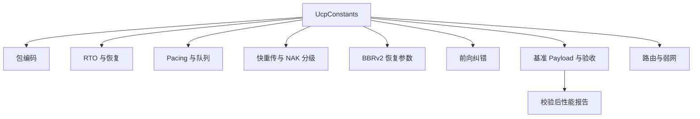
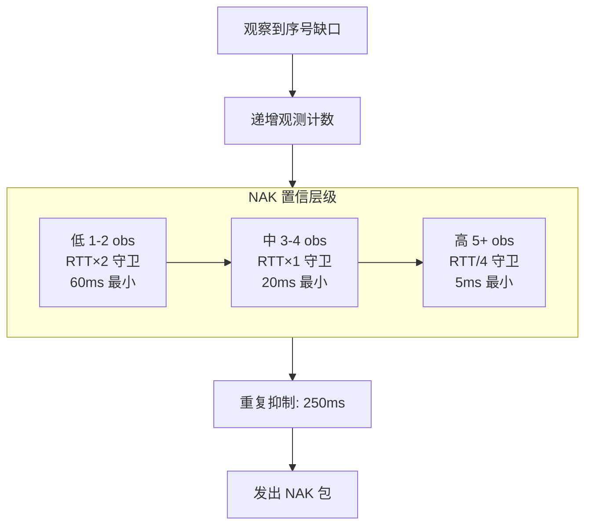

# PPP PRIVATE NETWORK™ X - 通用通信协议 (UCP) — 常量参考

[English](constants.md) | [文档索引](index_CN.md)

**协议标识: `ppp+ucp`** — 本文档分类记录 UCP 协议实现中所有可调和固定常量。所有常量定义在 `UcpConstants` 中，并通过 `UcpConfiguration` 可访问。时间值除显式命名外（如 `*Milliseconds`）均为微秒。

## 导航

## 包编码

这些常量定义线格式大小和限制。所有值单位为字节。

| 常量 | 值 | 含义 |
|---|---|---:|
| `MSS` | 1220 | 默认最大分段大小（含所有头部）。高带宽基准设为 9000。 |
| `COMMON_HEADER_SIZE` | 12 | 强制公共头大小: Type(1) + Flags(1) + ConnId(4) + Timestamp(6)。 |
| `DATA_HEADER_SIZE` | 20 | 公共头加 DATA 特定字段: SeqNum(4) + FragTotal(2) + FragIndex(2)。 |
| `MAX_PAYLOAD_SIZE` | 1200 | 默认 MSS 下每 DATA 包最大应用负载字节数。 |
| `ACK_FIXED_SIZE` | 26 | ACK 可变 SACK 块前的固定字节: AckNumber(4) + SackCount(2) + reserved(0)。不含 SACK 块后的 WindowSize 和 EchoTimestamp。 |
| `SACK_BLOCK_SIZE` | 8 | 一个 SACK 范围编码大小: StartSequence(4) + EndSequence(4)。 |
| `DEFAULT_ACK_SACK_BLOCK_LIMIT` | 149 | 默认 MSS 下每 ACK 最多 SACK 块数。较小 MSS 自动缩减确保 ACK 适合单个数据报。 |
| `HAS_ACK_FLAG` | 0x01 | Flags 字节中指示 HasAckNumber 字段存在的位置。所有带捎带 ACK 的包类型均置位。 |
| `PIGGYBACK_ACK_SIZE` | 4 | HasAckNumber 置位时可选的 AckNumber 字段大小。 |

## RTO 与恢复定时器

| 常量 | 值 | 含义 |
|---|---|---:|
| `DEFAULT_RTO_MICROS` | 200,000 | 优化默认最小 RTO。平衡丢包 LAN 快速恢复（200ms 足够短）与高抖动路径防过早超时。 |
| `INITIAL_RTO_MICROS` | 250,000 | 无 RTT 样本时初始 RTO。略高于最小值以在握手期间提供余量。 |
| `DEFAULT_MAX_RTO_MICROS` | 15,000,000 | 绝对最大 RTO。超此后若无 ACK 进展则连接判定死亡。 |
| `RTO_BACKOFF_FACTOR` | 1.2 | 连续 RTO 乘数。1.2× 下 RTO 递增为：200ms → 240ms → 288ms → 346ms → ... → 15s。比 TCP 2.0× 温和，更快检测死路径。 |
| `RTO_RETRANSMIT_BUDGET_PER_TICK` | 4 | 单 timer tick 可触发的最大 RTO 重传数。防止大量 RTO 一次性突发 1000 个包。 |
| `RTO_ACK_PROGRESS_SUPPRESSION_MICROS` | 2,000 | 若此窗口内有 ACK 进展（累积 ACK 前移），抑制批量 RTO 扫描。让 SACK 和 NAK 先处理恢复 — 镜像 QUIC PTO 行为。 |
| `URGENT_RETRANSMIT_BUDGET_PER_RTT` | 16 | 每 RTT 窗口允许绕过 pacing 和公平队列门控的最大紧急重传数。每个新 RTT 估计时重置。 |
| `URGENT_RETRANSMIT_DISCONNECT_THRESHOLD_PERCENT` | 75 | 空闲时间达到 `DisconnectTimeoutMicros` 此百分比时，尾丢包探测有资格标记为紧急。 |

## Pacing 与队列

| 常量 | 值 | 含义 |
|---|---|---:|
| `DEFAULT_MIN_PACING_INTERVAL_MICROS` | 0 | 无人工最小包间隔，token bucket 单独控制 pacing 时序。 |
| `DEFAULT_PACING_BUCKET_DURATION_MICROS` | 10,000 | Token bucket 容量窗口（微秒）。更大窗口允许更大突发（≤ PacingRate × 10ms）。 |
| `MAX_NEGATIVE_TOKEN_BALANCE_MULTIPLIER` | 0.5 | 最大负 token 余额为 bucket 容量的此分数。防止紧急重传导致无限 pacing 债务。 |
| `FAIR_QUEUE_ROUND_MILLISECONDS` | 10 | 服务端公平队列调度每轮时长。 |
| `MAX_BUFFERED_FAIR_QUEUE_ROUNDS` | 2 | 未用 credit 最多累积轮数。空闲 10 轮的连接不能一次性突发 10 轮的 credit。 |

## 快重传与 NAK 分级

这些常量定义多级恢复架构。

### 基于 SACK 的恢复

| 常量 | 值 | 含义 |
|---|---|---:|
| `DUPLICATE_ACK_THRESHOLD` | 2 | 触发快重传所需重复 ACK（相同累积 ACK 值）数量。 |
| `SACK_FAST_RETRANSMIT_THRESHOLD` | 2 | 首个缺失缺口可修复所需 SACK 观测次数。 |
| `SACK_FAST_RETRANSMIT_DISTANCE_THRESHOLD` | 32 | 最高 SACK 序号以下额外缺口，当最高观测序号到该缺口距离超此阈值时可修复。支持并行多缺口修复。 |
| `SACK_FAST_RETRANSMIT_MIN_REORDER_GRACE_MICROS` | 3,000 | SACK 触发修复最小发送端乱序保护。实际保护 = `max(3ms, RTT / 8)`。 |
| `SACK_BLOCK_MAX_SENDS` | 2 | 单个 SACK 块范围最多通告次数。2 次后抑制该块以防 SACK 放大。 |

### NAK 分级置信度

| 常量 | 值 | 含义 |
|---|---|---:|
| `NAK_MISSING_THRESHOLD` | 2 | 缺口有资格 NAK 的最小接收端观测次数。 |
| `NAK_LOW_CONFIDENCE_GUARD_MULTIPLIER` | 2.0 | 低置信层级乱序守卫乘数（1-2 次观测）：`max(RTT × 2, 60ms)`。 |
| `NAK_MEDIUM_CONFIDENCE_GUARD_MULTIPLIER` | 1.0 | 中置信层级乱序守卫乘数（3-4 次观测）：`max(RTT, 20ms)`。 |
| `NAK_HIGH_CONFIDENCE_GUARD_MULTIPLIER` | 0.25 | 高置信层级乱序守卫乘数（5+ 次观测）：`max(5ms, RTT / 4)`。 |
| `NAK_LOW_CONFIDENCE_MIN_GUARD_MICROS` | 60,000 | 低置信绝对最小乱序保护。 |
| `NAK_MEDIUM_CONFIDENCE_MIN_GUARD_MICROS` | 20,000 | 中置信绝对最小乱序保护。 |
| `NAK_HIGH_CONFIDENCE_MIN_GUARD_MICROS` | 5,000 | 高置信绝对最小乱序保护。 |
| `NAK_REPEAT_INTERVAL_MICROS` | 250,000 | 同一缺失序号连续 NAK 最小间隔。防止 NAK 风暴。 |
| `MAX_NAK_SEQUENCES_PER_PACKET` | 256 | 单个 NAK 包最多携带缺失序号条目数。 |

## BBRv2 恢复常量

这些常量控制 BBRv2 分类后对丢包事件的响应。

| 常量 | 值 | 含义 |
|---|---|---:|
| `BBR_FAST_RECOVERY_PACING_GAIN` | 1.25 | 非拥塞快恢复 pacing gain 乘数。快速补洞但不降低吞吐。 |
| `BBR_CONGESTION_LOSS_REDUCTION` | 0.98 | 温和拥塞丢包削减乘数，施加于 `AdaptivePacingGain`。每次拥塞事件降 2%。 |
| `BBR_MIN_LOSS_CWND_GAIN` | 0.95 | 拥塞丢包事件后 CWND gain 下限。防止 CWND 跌破 BDP 的 95%。 |
| `BBR_LOSS_CWND_RECOVERY_STEP` | 0.04 | 每 ACK 恢复步长，在拥塞削减后将 CWND gain 逐步恢复到 1.0。 |
| `BBR_RANDOM_LOSS_MAX_DEDUPED_EVENTS` | 2 | 短窗口内归类为随机丢包（非拥塞）的最大孤立丢包事件数。 |
| `BBR_CONGESTION_LOSS_WINDOW_THRESHOLD` | 3 | 窗口中丢包事件超此数时，拥塞分类需额外 RTT 证据。 |
| `BBR_CONGESTION_LOSS_RTT_MULTIPLIER` | 1.10 | RTT 膨胀阈值：需当前 RTT > `MinRtt × 1.10`，拥塞分类器才将丢包确认为拥塞。 |

## 前向纠错

| 常量 | 值 | 含义 |
|---|---|---:|
| `FEC_GROUP_SIZE` | 8（默认） | 每 FEC 组默认 DATA 包数。可通过 `UcpConfiguration.FecGroupSize` 配置。 |
| `FEC_MAX_GROUP_SIZE` | 64 | `UcpFecCodec` 最大支持组大小。更小组延迟低但开销高（需等组内所有成员编码/解码）。 |
| `FEC_REPAIR_PACKET_TYPE` | 0x08 | FEC 修复包线类型标识。 |
| `FEC_MAX_REPAIR_PACKETS` | GroupSize | 每组最大修复包数等于组大小（完全冗余）。实际自适应模式将冗余上限设为数据包的 50%。 |
| `FEC_GF256_FIELD_POLYNOMIAL` | 0x11B | GF(256) 不可约多项式：`x^8 + x^4 + x^3 + x + 1`。 |
| `FEC_ADAPTIVE_MIN_LOSS_PERCENT` | 0.5 | 丢包率低于此值时自适应 FEC 使用最小基础冗余。 |
| `FEC_ADAPTIVE_LOW_LOSS_PERCENT` | 2.0 | 丢包率达此值时自适应 FEC 冗余提高 1.25×。 |
| `FEC_ADAPTIVE_MEDIUM_LOSS_PERCENT` | 5.0 | 丢包率达此值时自适应 FEC 冗余提高 1.5× 并减小分组。 |
| `FEC_ADAPTIVE_HIGH_LOSS_PERCENT` | 10.0 | 丢包率超此值时 FEC 最大介入（2.0× 冗余）。以上则重传成为主要恢复手段。 |

## 基准 Payload

Payload 大小选择策略：提供有意义的稳态传输测量，而非由启动瞬时主导的短突发。

| 场景 | Payload | 原因 |
|---|---|---:|
| `BENCHMARK_100M_PAYLOAD_BYTES` | 16 MB | 100 Mbps 下足够有意义吞吐测量。 |
| `BENCHMARK_100M_LOSS_PAYLOAD_BYTES` | 32 MB | 丢包路径更大 payload 以在多 RTT 上测量稳态恢复吞吐。 |
| `BENCHMARK_HIGH_LOSS_HIGH_RTT_PAYLOAD_BYTES` | 16 MB | 平衡测试时长与高 RTT 路径恢复测量。 |
| `BENCHMARK_MOBILE_3G_PAYLOAD_BYTES` | 16 MB | 3G 路径足够慢，16 MB 提供充足测量。 |
| `BENCHMARK_MOBILE_4G_PAYLOAD_BYTES` | 32 MB | 更高带宽 4G 路径需更大 payload 以可靠吞吐测量。 |
| `BENCHMARK_WEAK_4G_PAYLOAD_BYTES` | 16 MB | 覆盖中段 80ms 断网及恢复。 |
| `BENCHMARK_SATELLITE_PAYLOAD_BYTES` | 16 MB | 高 RTT 路径；payload 用于测量稳态 BBRv2 行为。 |
| `BENCHMARK_VPN_PAYLOAD_BYTES` | 16 MB | 非对称路由特征的 VPN 路径。 |
| `BENCHMARK_1G_PAYLOAD_BYTES` | 16 MB | 千兆无丢包测量。 |
| `BENCHMARK_1G_LOSS_PAYLOAD_BYTES` | 64 MB | 千兆丢包大 payload — 更短 payload 完成太快无法表征恢复。 |
| `BENCHMARK_10G_PAYLOAD_BYTES` | 32 MB | 10 Gbps 测试。逻辑时钟序列化确保进程内速度下吞吐准确。 |
| `BENCHMARK_LONG_FAT_100M_PAYLOAD_BYTES` | 16 MB | 长肥管测量，高 BDP 需持续 CWND 增长。 |

## 基准验收标准

这些阈值定义基准场景的最低可接受性能。

| 常量 | 值 | 含义 |
|---|---|---:|
| `BENCHMARK_MIN_NO_LOSS_UTILIZATION_PERCENT` | 70% | 无丢包路径最低瓶颈利用率。必须至少达到目标带宽的 70%。 |
| `BENCHMARK_MIN_LOSS_UTILIZATION_PERCENT` | 45% | 受控丢包路径最低利用率。已考虑丢包恢复开销。 |
| `BENCHMARK_MIN_CONVERGED_PACING_RATIO` | 0.70 | 收敛 pacing 比率下限（实际 pacing rate / 目标速率）。低于此值表示协议未充分利用链路。 |
| `BENCHMARK_MAX_CONVERGED_PACING_RATIO` | 3.0 | 收敛 pacing 比率上限。高于此值表示协议可能超额使用链路。 |
| `BENCHMARK_MAX_JITTER_DELAY_MULTIPLIER` | 4 | 相对配置传播延迟的最大可接受抖动。抖动超 4 倍基础延迟表明路径不稳定。 |

## 报告收敛解析器

基准报告表以自适应单位（`ns`、`us`、`ms`、`s`）写入收敛时间。`UcpPerformanceReport` 中的 `ParseTimeDisplay` 解析器正确解释任何格式并转换为毫秒用于校验。

| 格式 | 示例 | 解析值 |
|---|---|---|
| 纳秒 | `843ns` | 0ms |
| 微秒 | `127us` | 0ms |
| 毫秒 | `193.0ms` | 193ms |
| 秒（1 位） | `1.76s` | 1760ms |
| 秒（2+ 位） | `28.71s` | 28710ms |

此自适应格式确保亚毫秒本地传输和多秒卫星传输均显示有意义的收敛值。

## 路由与弱网常量

| 常量 | 值 | 含义 |
|---|---|---:|
| `BENCHMARK_ASYM_FORWARD_DELAY_MILLISECONDS` | 25 | `AsymRoute` 场景显式 A→B 延迟。 |
| `BENCHMARK_ASYM_BACKWARD_DELAY_MILLISECONDS` | 15 | `AsymRoute` 场景显式 B→A 延迟。 |
| `BENCHMARK_WEAK_4G_OUTAGE_PERIOD_MILLISECONDS` | 900 | `Weak4G` 场景单次中段断网前已过时间。 |
| `BENCHMARK_WEAK_4G_OUTAGE_DURATION_MILLISECONDS` | 80 | 完全断网持续时间（双向无包交付）。 |
| `BENCHMARK_DIRECTIONAL_DELAY_MAX_MS` | 15 | 自动生成路由模型的 A→B 与 B→A 最大允许单向延迟差。 |
| `BENCHMARK_DIRECTIONAL_DELAY_MIN_MS` | 3 | 确保可测不对称的最小单向延迟差。 |

## 连接与会话常量

| 常量 | 值 | 含义 |
|---|---|---:|
| `CONNECTION_ID_BITS` | 32 | 随机连接标识的位数。每服务端实例提供 40 亿个唯一 ID。 |
| `SEQUENCE_NUMBER_BITS` | 32 | 序号空间位数。使用无符号比较配 2^31 比较窗口进行环绕。 |
| `MAX_CONNECTION_ID_COLLISION_RETRIES` | 3 | 生成不冲突随机 ConnId 的最大重试次数，超限后回退到顺序分配。 |
| `DEFAULT_SERVER_RECV_WINDOW_PACKETS` | 16,384 | 默认接收窗口包数。默认 MSS 下约为 20 MB。 |
