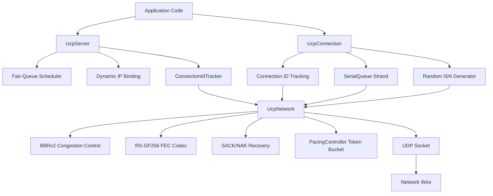
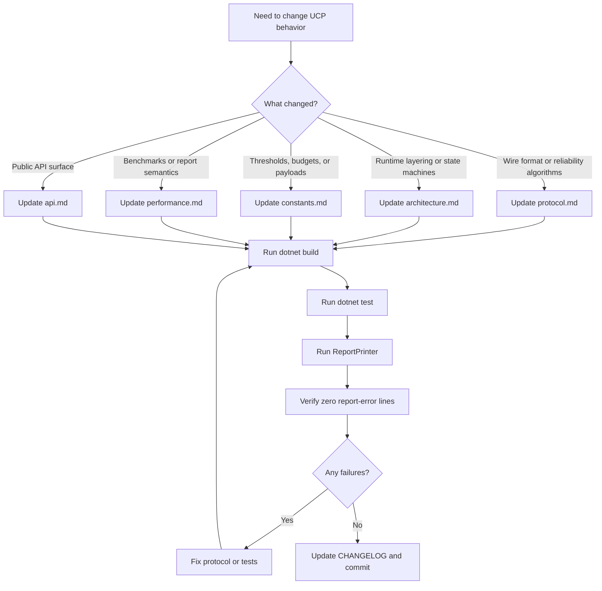

# PPP PRIVATE NETWORK™ X - Universal Communication Protocol (UCP)

**Protocol designation: `ppp+ucp`** — A next-generation reliable transport protocol built for modern networks where random loss, jitter, and asymmetric routing are the norm, not the exception. UCP combines QUIC-inspired fast recovery, BBRv2 congestion control, Reed-Solomon FEC over GF(256), and IP-agnostic connection tracking to deliver predictable high-throughput performance over any UDP-capable network path.

UCP operates at the transport layer above UDP, providing ordered reliable byte-stream delivery while maintaining the deployment flexibility of datagram-based communication. Unlike TCP, which interprets every packet loss as a congestion signal, UCP classifies loss events into random and congestion categories before making rate-control decisions. This allows UCP to achieve high throughput on lossy paths (wireless, satellite, long-fat pipes) where TCP would unnecessarily collapse its congestion window.

## Documentation Index

This is the global entry point for UCP documentation. English files are the default maintainer reference; each page links to its Chinese `_CN` counterpart for bilingual engineering teams. The documentation is organized into five vertical slices, each covering a distinct aspect of the protocol:

- **Protocol**: Wire format, state machines, and algorithmic behavior.
- **Architecture**: Internal runtime design, threading model, and component layering.
- **API**: Public surface for application integration.
- **Constants**: All tunable knobs and their default values.
- **Performance**: Benchmark methodology, validation, and acceptance criteria.

## Language Switch

| English | Chinese |
|---|---|
| [Documentation Index](index.md) | [文档索引](index_CN.md) |
| [Performance Guide](performance.md) | [性能与报告指南](performance_CN.md) |
| [Protocol Deep Dive](protocol.md) | [协议深度解析](protocol_CN.md) |
| [Architecture Deep Dive](architecture.md) | [架构深度解析](architecture_CN.md) |
| [Constants Reference](constants.md) | [常量参考](constants_CN.md) |
| [API Reference](api.md) | [API 参考](api_CN.md) |

## Quick Links

| Document | Purpose |
|---|---|
| [../README.md](../README.md) | Project overview, quick start, feature matrix, and report-field summary for first-time users. |
| [performance.md](performance.md) | Benchmark matrix with 14 scenarios, report column semantics, validation rules, directional route modeling, end-to-end loss-recovery flow diagrams, and BBRv2 throughput tuning strategies. |
| [protocol.md](protocol.md) | Authoritative wire format specification including piggybacked cumulative ACK on all packet types, QUIC-style SACK with per-block send limits, NAK tiered-confidence recovery (Low/Medium/High tiers), BBRv2 congestion control with adaptive pacing gain, FEC Reed-Solomon GF(256) with adaptive transmission, and the complete connection state machine. |
| [architecture.md](architecture.md) | Internal runtime layering from application API down to transport socket, Connection-ID-based session tracking (IP-agnostic, random ConnId), random ISN generation per connection, server dynamic IP binding, SerialQueue per-connection strand-based execution model, fair-queue server scheduling with credit accounting, pacing controller token bucket design, BBRv2 delivery-rate estimation internals, and the deterministic network simulator architecture. |
| [constants.md](constants.md) | Exhaustive catalog of every tunable and fixed constant in `UcpConstants`, organized by subsystem: packet encoding sizes, RTO and recovery timers, pacing and queuing parameters, SACK and NAK tiered-confidence thresholds, BBRv2 recovery constants, FEC group sizing and adaptive redundancy thresholds, benchmark payload selections with rationale, and acceptance criteria for performance validation. |
| [api.md](api.md) | Complete public API surface documentation including `UcpConfiguration.GetOptimizedConfig()` factory method with all parameter defaults, `UcpServer` lifecycle (Start/AcceptAsync/Stop), `UcpConnection` methods for connection management, sending (Send/Write), receiving (Receive/Read), event model (OnData/OnConnected/OnDisconnected), diagnostics (GetReport/GetRttMicros/GetCwndBytes), `UcpNetwork.DoEvents()` driver loop, `ITransport` interface for custom transport integration, and a full end-to-end code example with error handling. |

## Protocol Feature Overview

UCP (`ppp+ucp`) implements a comprehensive set of transport protocol primitives designed for loss-tolerant, high-throughput communication across diverse network environments:

```mermaid
mindmap
  root((ppp+ucp Protocol))
    Reliability
      Piggybacked cumulative ACK on all packets
      QUIC-style SACK recovery with 2-send-per-block limit
      NAK-based fast recovery with tiered confidence levels
      Duplicate ACK fast retransmit
      RTO/PTO last-resort guard with 1.2× backoff
    Congestion Control
      BBRv2 with adaptive pacing gain
      Loss classification before rate reduction
      Gentle congestion response 0.98× multiplier
      Network path classifier with 200ms windows
      ProbeBW cycling with 8-phase gain schedule
    Forward Error Correction
      Reed-Solomon GF(256) codec
      Adaptive redundancy transmission
      Multi-packet repair per group
      Recovered DATA retains original sequence
      Gaussian elimination decoder
    Connection Management
      Connection-ID-based session tracking (IP-agnostic)
      Random ISN per connection (TCP-style)
      Server dynamic IP binding
      Fair-queue server scheduling
      SerialQueue per-connection strand execution
```

### Reliability Architecture

UCP's reliability stack operates on three independent recovery paths, each with a specific role in the overall repair strategy:

| Recovery Path | Trigger | Latency | Use Case |
|---|---|---|---|
| **SACK (Selective ACK)** | Receiver observes out-of-order arrival; sender receives SACK blocks | Sub-RTT (RTT/8 grace) | Primary fast recovery for random independent losses. Bounded by 2-send-per-block limit. |
| **Duplicate ACK** | Same cumulative ACK received twice | Sub-RTT | Fast recovery when SACK blocks are suppressed or unavailable. |
| **NAK (Negative ACK)** | Receiver accumulates gap observations; confidence tier escalates | RTT/4 to RTT×2 depending on tier | Conservative receiver-driven recovery for unambiguous loss. Tiered guards prevent false positives on jittery paths. |
| **FEC (Forward Error Correction)** | Receiver has enough repair packets in the group | No additional RTT | Zero-latency recovery when parity information is available. Best for predictable loss patterns. |
| **RTO (Retransmission Timeout)** | No ACK progress within RTO | RTO × backoff | Last-resort recovery when all proactive mechanisms fail. Suppressed during recent ACK progress. |

### Congestion Control Philosophy

UCP's BBRv2 implementation departs from TCP's loss-based congestion control in several fundamental ways:

1. **Loss is not congestion by default.** UCP classifies each loss event before making rate-control decisions. Isolated losses with no RTT inflation are treated as random and trigger only retransmission — no rate reduction.
2. **Adaptive pacing gain.** BBRv2 adjusts the pacing gain multiplier based on ongoing network assessment, rather than using fixed cycle gains. Congestion evidence applies a gentle 0.98× reduction.
3. **CWND floor protection.** After a congestion event, the CWND is floored at 95% of BDP, preventing the window from collapsing below the path's fundamental capacity. Recovery is incremental at 0.04 per ACK.
4. **Network path classification.** A sliding-window classifier distinguishes LAN, mobile/unstable, lossy long-fat, congested bottleneck, and VPN-like paths, feeding differentiated behavior into the BBRv2 state machine.

### Forward Error Correction Design

UCP's FEC subsystem uses Reed-Solomon coding over the GF(256) finite field, which supports recovery from up to R packet losses in a group of N data packets, where R is the number of repair packets transmitted alongside the data. Key design characteristics:

- **Galois Field GF(256)**: Operations use the irreducible polynomial `x^8 + x^4 + x^3 + x + 1` (0x11B). Precomputed logarithm/antilogarithm tables provide O(1) multiplication and division.
- **Adaptive redundancy**: The effective redundancy ratio adjusts based on observed loss rate: minimum at <0.5% loss, 1.25× at 0.5-2%, 1.5× at 2-5%, 2.0× at 5-10%. Above 10% loss, retransmission becomes the primary recovery mechanism.
- **Recovered packet integrity**: FEC-recovered DATA packets retain their original sequence numbers and fragment metadata, so cumulative ACK processing and in-order delivery remain correct regardless of which packets arrived naturally and which were reconstructed.

### Connection Model

UCP connections are identified by random 32-bit Connection IDs rather than by IP:port tuples. This design choice provides:

- **NAT rebinding resilience**: If a client's NAT mapping changes mid-session, the server routes packets to the correct session using the Connection ID from the common header.
- **IP mobility**: A client can migrate between network interfaces (Wi-Fi to cellular) while maintaining the same session state.
- **Server-side scalability**: The server uses fair-queue scheduling with per-connection credit accounting (10ms rounds, 2-round credit buffer) to prevent any single connection from monopolizing egress bandwidth.
- **Lock-free concurrency**: Each connection's protocol processing executes on a dedicated SerialQueue strand, eliminating lock contention while maintaining strict ordering guarantees for all state mutations.

## Architecture At A Glance



## Getting Started

### Prerequisites

- .NET 8.0 SDK or later
- Windows, Linux, or macOS
- Git for source control

### Build And Test

```powershell
# Clone and build
git clone <repository-url>
cd ucp
dotnet build ".\Ucp.Tests\UcpTest.csproj"

# Run the full test suite
dotnet test ".\Ucp.Tests\UcpTest.csproj" --no-build

# Generate and validate the performance benchmark report
dotnet run --project ".\Ucp.Tests\UcpTest.csproj" --no-build -- ".\Ucp.Tests\bin\Debug\net8.0\reports\test_report.txt"
```

### Quick Start Example

```csharp
using Ucp;
using System.Net;
using System.Text;

var config = UcpConfiguration.GetOptimizedConfig();

// Server
using var server = new UcpServer(config);
server.Start(9000);
var acceptTask = server.AcceptAsync();

// Client
using var client = new UcpConnection(config);
await client.ConnectAsync(new IPEndPoint(IPAddress.Loopback, 9000));
var serverConn = await acceptTask;

// Exchange
byte[] msg = Encoding.UTF8.GetBytes("Hello, ppp+ucp!");
await client.WriteAsync(msg, 0, msg.Length);
byte[] buf = new byte[msg.Length];
await serverConn.ReadAsync(buf, 0, buf.Length);

Console.WriteLine($"Received: {Encoding.UTF8.GetString(buf)}");
```

## Test Suite Coverage

The UCP test suite validates the protocol across five dimensions:

| Dimension | Tests | What's Validated |
|---|---|---|
| **Core Protocol** | Sequence wrapping, packet codec round-trip, RTO estimator convergence, pacing controller token accounting. | Wire-format correctness, timer behavior, basic send/receive integrity. |
| **Connection Management** | Connection ID demultiplexing, random ISN uniqueness, server dynamic IP rebinding, serial queue ordering guarantees. | Session tracking, handshake completion, thread safety. |
| **Reliability** | Lossy transfer, burst loss, SACK 2-send-per-range limit, NAK tiered confidence activation, FEC single and multi-loss repair. | Recovery correctness under all loss patterns. |
| **Stream Integrity** | Reordering, duplication, partial reads, full-duplex non-interleaving, piggybacked ACK correctness on all packet types. | Application data integrity under all network impairments. |
| **Performance** | 14 benchmark scenarios spanning 4 Mbps to 10 Gbps, 0-10% loss, mobile, satellite, VPN, and long-fat pipes. | Throughput, convergence, utilization against acceptance criteria. |

## Maintenance Map



## Design Philosophy And Key Differentiators

UCP was designed with a clear philosophy that distinguishes it from both TCP and QUIC in several important ways.

### Why Not TCP?

TCP's fundamental design assumption is that all packet loss indicates congestion. This was a reasonable assumption in the 1980s when most links were wired and loss was rare outside of congestion events. In modern networks — wireless, cellular, satellite, and long-distance fiber — random loss is common and independent of congestion. TCP's response of cutting the congestion window in half on every loss event dramatically underutilizes these paths.

UCP breaks this assumption by making loss classification a first-class protocol function:
- Isolated losses with stable RTT are treated as random and trigger only retransmission.
- Clustered losses with RTT inflation are classified as congestion and trigger gentle rate reduction.
- The BBRv2 controller independently measures bottleneck bandwidth from delivery rate, not from loss events.

### Why Not QUIC?

QUIC improves on TCP with features like stream multiplexing, 0-RTT handshakes, and better loss recovery. However, QUIC is tightly coupled to HTTP/3 and the web ecosystem. UCP is designed as a general-purpose transport that can be embedded in any application — game engines, IoT telemetry, financial data feeds, VPN tunnels — without requiring the HTTP ecosystem.

UCP's Connection-ID-based session tracking goes beyond QUIC's connection migration: while QUIC supports connection migration as an optional feature, UCP makes it the default model. Every connection is identified by a random ID from inception, making IP address changes transparent at the protocol level.

### Deployment Scenarios

| Scenario | Why UCP Is Suitable |
|---|---|
| **VPN tunnels** | High-throughput over lossy long-distance paths with asymmetric routing. BBRv2 maintains throughput where TCP collapses. |
| **Real-time multiplayer games** | Low-latency recovery with FEC for predictable loss patterns. Connection-ID tracking survives Wi-Fi-to-cellular handoffs. |
| **Satellite backhaul** | Long RTT (500ms+) paths with moderate random loss. BBRv2's ProbeRTT skipping on lossy paths avoids unnecessary throughput dips. |
| **IoT sensor networks** | Lightweight wire format, random ISN security, and IP-agnostic connections survive DHCP renumbering behind NAT. |
| **Financial data distribution** | Ordered reliable delivery with sub-RTT loss recovery. Piggybacked ACK eliminates control-packet overhead under bidirectional traffic. |
| **Content delivery at the edge** | Fair-queue server scheduling prevents any single slow client from starving others. Adaptive FEC reduces retransmission overhead on last-mile wireless. |

### Configuration Philosophy

UCP's `GetOptimizedConfig()` provides sensible defaults that work well across most network environments. The defaults are tuned for the 80th percentile of use cases: moderate bandwidth (up to ~100 Mbps), moderate RTT (up to ~100ms), and moderate loss (up to ~5%). Applications with extreme requirements — 10 Gbps datacenter links, 600ms satellite paths, or 10%+ loss environments — should tune the parameters accordingly:

- **High bandwidth (>1 Gbps)**: Increase `Mss` to 9000, increase `MaxCongestionWindowBytes` to 256 MB or higher, and set `MaxPacingRateBytesPerSecond` to 0 (unlimited).
- **High RTT (>300ms)**: Increase `InitialCwndPackets` and `SendBufferSize` to ensure the BDP can be filled. Consider increasing `ProbeRttIntervalMicros` to reduce ProbeRTT frequency.
- **High loss (>5%)**: Enable FEC with `FecRedundancy = 0.25` or higher, enable adaptive FEC, and ensure `MaxRetransmissions` is adequate for the path's loss characteristics.
- **Mobile/low-power**: Reduce `Mss` to avoid fragmentation, reduce `SendBufferSize` to conserve memory, and increase `DisconnectTimeoutMicros` to tolerate longer idle periods.

## Report Files

| File | Location | Purpose |
|---|---|---|
| `summary.txt` | `Ucp.Tests/bin/Debug/net8.0/reports/` | Append-only detailed per-scenario records with byte-level integrity traces, retransmission logs, and convergence timing details. |
| `test_report.txt` | `Ucp.Tests/bin/Debug/net8.0/reports/` | Normalized ASCII table validated by `ReportPrinter`. Contains all 14 scenario rows with throughput, utilization, retransmission ratio, directional RTT statistics, CWND, pacing rate, and convergence time. |

Always validate both tests and the generated report. Passing xUnit alone is insufficient when report semantics change — the report must reflect physically plausible throughput, independent loss/retransmission separation, and correct convergence timing. The `ValidateReportFile()` method enforces all constraints automatically.
