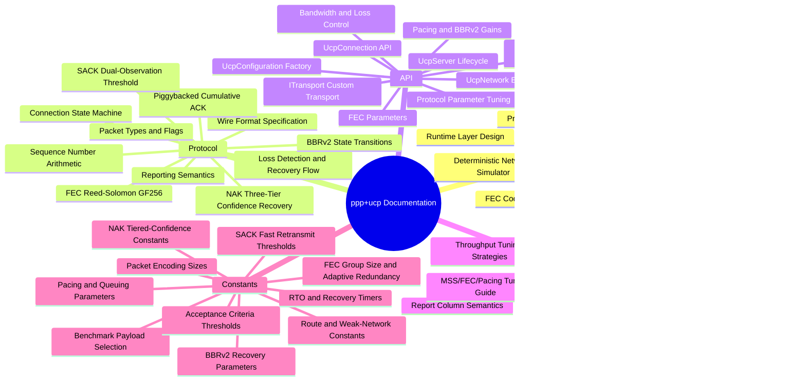
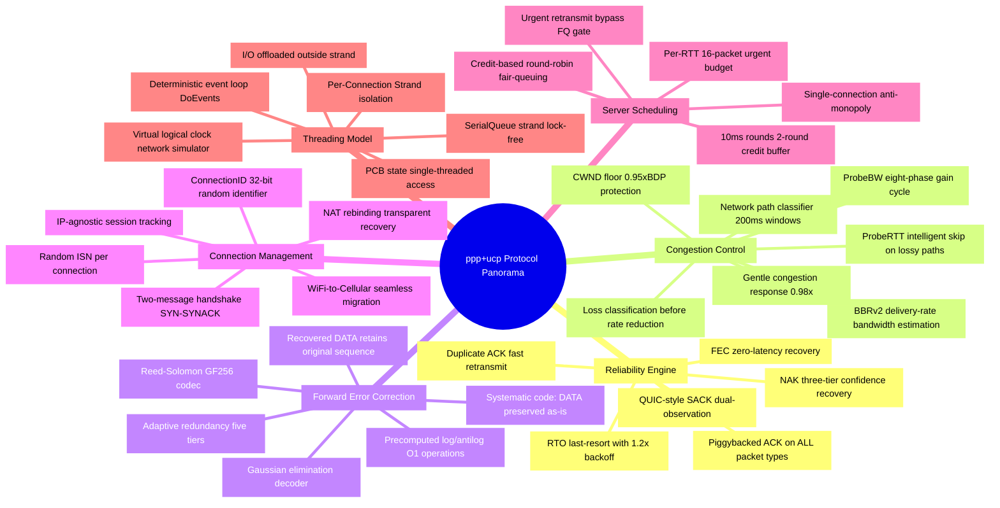
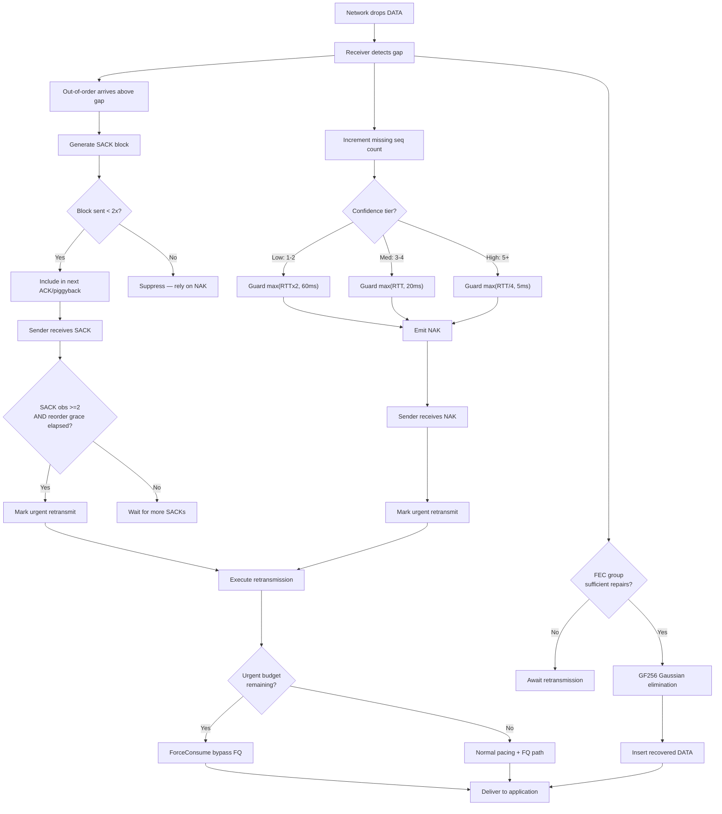
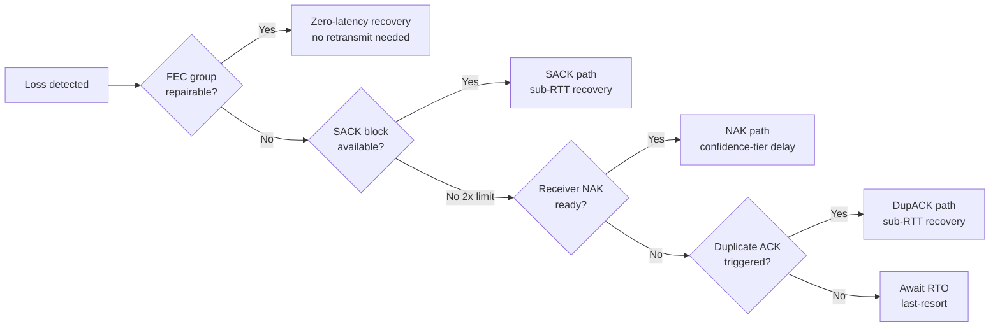
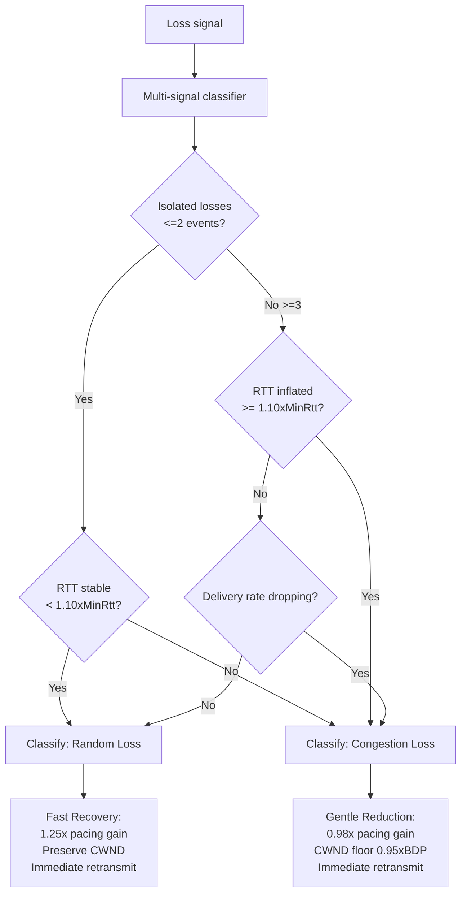
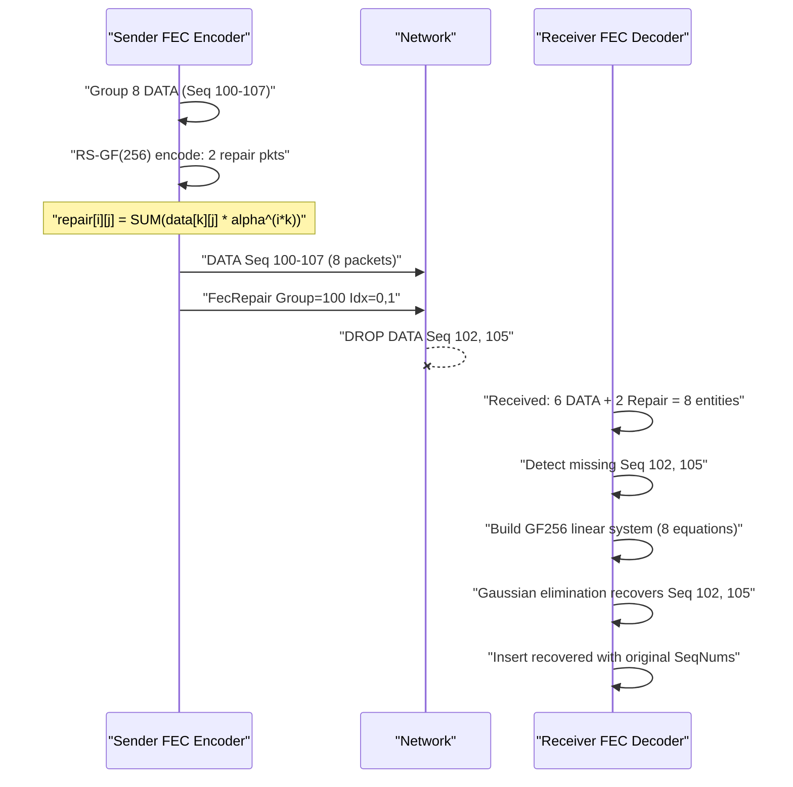
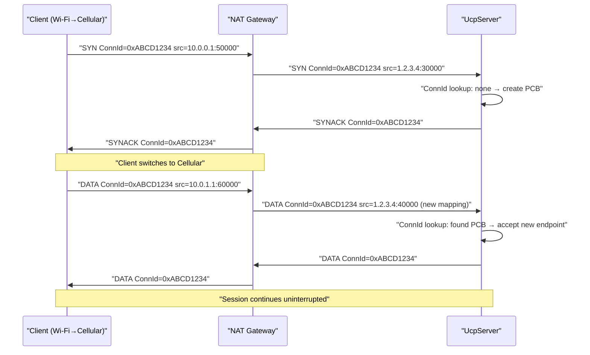
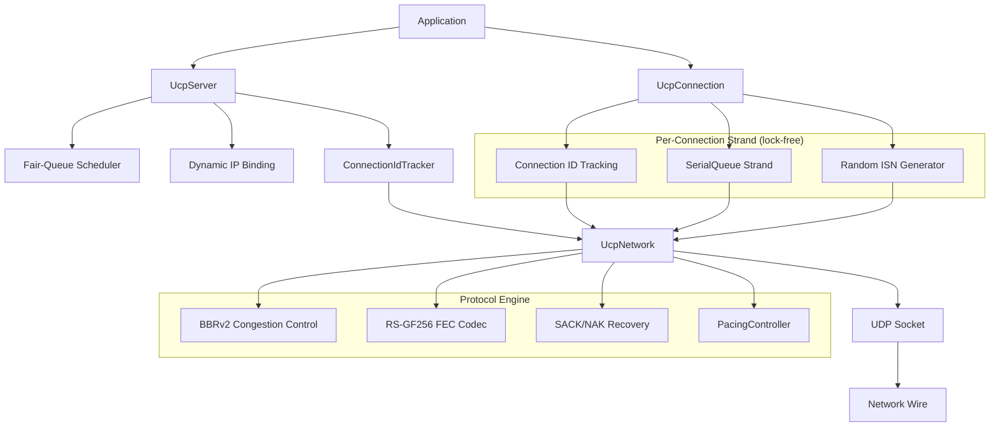
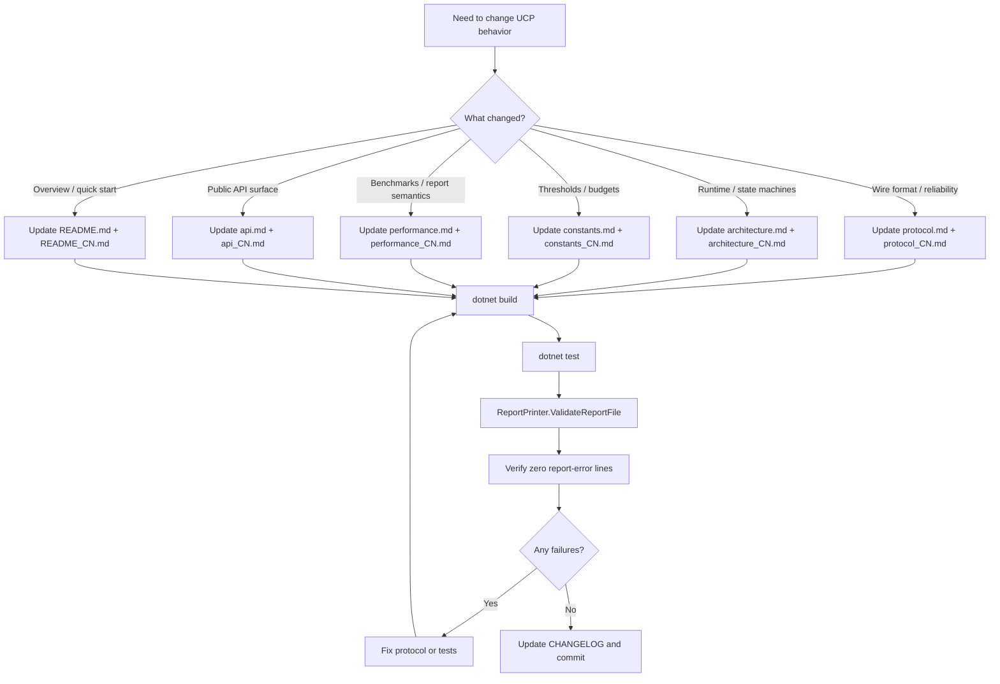

# PPP PRIVATE NETWORK™ X — Universal Communication Protocol (UCP)

[中文](index_CN.md)

**Protocol designation: `ppp+ucp`** — UCP (Universal Communication Protocol) is an industrial-grade reliable transport protocol for next-generation heterogeneous networks. Operating directly atop UDP, it draws architectural inspiration from QUIC while making fundamentally different design choices in loss recovery, acknowledgment strategy, congestion control, and forward error correction. UCP re-examines every classical assumption about loss, congestion, and acknowledgment in transport layers, delivering predictable line-rate throughput across paths ranging from ideal data-center links (10 Gbps, <1ms RTT) to 300ms satellite hops with 10% random loss.

UCP's core tenet: **loss classification must precede rate control**. TCP treats all packet loss as a congestion signal—reasonable in the 1980s but catastrophic on modern wireless networks. UCP introduces a multi-signal classifier that distinguishes random loss (physical layer interference, Wi-Fi collisions) from congestion loss (bottleneck saturation, buffer bloat), applying rate reduction only after cross-validating multiple independent signals. This design enables UCP to maintain 85-95% link utilization on 5% random loss paths where TCP collapses to 30-50%.

## Language Switch

| English | 中文 |
|---|---|
| [Documentation Index](index.md) | [文档索引](index_CN.md) |
| [Architecture](architecture.md) | [架构](architecture_CN.md) |
| [Protocol](protocol.md) | [协议](protocol_CN.md) |
| [API Reference](api.md) | [API 参考](api_CN.md) |
| [Performance Guide](performance.md) | [性能与报告指南](performance_CN.md) |
| [Constants Reference](constants.md) | [常量参考](constants_CN.md) |

---

## Documentation Map

UCP documentation is organized across five core domains. Each domain covers a distinct dimension with cross-references but clear content boundaries:



---

## Quick Links

| Document | Language | Summary |
|---|---|---|
| [../README.md](../README.md) | English | Project overview, design philosophy, key innovations, quick start, configuration reference, deployment scenarios, TCP/QUIC comparison |
| [../README_CN.md](../README_CN.md) | 中文 | 项目总览、设计哲学、关键创新、快速开始、配置参考、部署场景、与TCP/QUIC对比 |
| [architecture.md](architecture.md) | English | Runtime layering (app API→UDP Socket), UcpPcb state management, ConnId tracking, random ISN, SerialQueue execution, fair-queue scheduling, PacingController token bucket, BBRv2 delivery-rate estimation, deterministic simulator, FEC codec math, inbound/outbound packet flow, test architecture, validation flow |
| [architecture_CN.md](architecture_CN.md) | 中文 | 运行时分层、UcpPcb状态、ConnId追踪、SerialQueue串行、公平队列、Pacing、BBRv2内核、FEC编解码、网络模拟器、包流、测试架构 |
| [protocol.md](protocol.md) | English | Authoritative wire format: common header (12B), 8 packet types, Flags bit layout, HasAckNumber piggybacked ACK, DATA/ACK/NAK/FecRepair layouts, SACK 2-send limit, state machine transitions, sequence arithmetic, three-way handshake, complete loss recovery flow, SACK fast retransmit params, NAK three-tier guards, urgent retransmit, BBRv2 states/adaptive pacing, RS-GF(256) math, report metric definitions |
| [protocol_CN.md](protocol_CN.md) | 中文 | 线格式、包类型、捎带ACK、SACK限制、NAK分级、握手、丢包恢复、BBRv2、FEC Reed-Solomon、报告口径 |
| [api.md](api.md) | English | Complete public API: UcpConfiguration.GetOptimizedConfig() factory (6 parameter groups), UcpServer lifecycle, UcpConnection management/send/receive/events/diagnostics, UcpNetwork.DoEvents(), ITransport, full example, error handling |
| [api_CN.md](api_CN.md) | 中文 | 公开API：UcpConfiguration、UcpServer、UcpConnection、UcpNetwork、ITransport、完整示例、错误处理 |
| [performance.md](performance.md) | English | Benchmark framework overview, 14+ scenario matrix by category, results table, 16-column report semantics, Loss% vs Retrans% independence evaluation, 11 validation rules, directional route modeling, end-to-end loss recovery flow diagram, BBRv2 recovery strategy params, tuning guide (MSS/FEC/common pitfalls), acceptance criteria |
| [performance_CN.md](performance_CN.md) | 中文 | 性能基准、场景矩阵、报告字段、校验规则、路由模型、调优指南、验收标准 |
| [constants.md](constants.md) | English | Exhaustive UcpConstants catalog: packet encoding (9), RTO/recovery timers (8), pacing/queuing (5), fast retransmit & NAK tiers (14), BBRv2 recovery (7), FEC (10), benchmark payloads (12 scenarios), acceptance criteria (5), route/weak-network (6), connection/session (4). 77+ total protocol constants |
| [constants_CN.md](constants_CN.md) | 中文 | UcpConstants目录：包编码、RTO定时器、Pacing、SACK/NAK分级、BBRv2、FEC、基准Payload、验收标准、路由常量 |

---

## Protocol Feature Panorama



---

## Core Protocol Flows

### End-to-End Connection Lifecycle

```mermaid
stateDiagram-v2
    [*] --> Init["Init"]
    Init --> HandshakeSynSent["HandshakeSynSent<br/>active SYN sent"]
    Init --> HandshakeSynReceived["HandshakeSynReceived<br/>passive SYN received"]
    
    HandshakeSynSent --> Established["Established<br/>connection ready"]
    HandshakeSynReceived --> Established
    
    Established --> ClosingFinSent["ClosingFinSent<br/>local close"]
    Established --> ClosingFinReceived["ClosingFinReceived<br/>peer close"]
    
    ClosingFinSent --> Closed["Closed"]
    ClosingFinReceived --> Closed
    
    Closed --> [*]
    
    HandshakeSynSent --> Closed
    HandshakeSynReceived --> Closed
    Established --> Closed
    ClosingFinSent --> Closed
    ClosingFinReceived --> Closed
    
    note right of HandshakeSynSent["Random ISN generated<br/>Random ConnId assigned<br/>connectTimer started"]
    note left of HandshakeSynReceived["ConnId extracted<br/>UcpPcb allocated<br/>ISN validated<br/>SYNACK sent"]
    note right of Established["Bidirectional data flow<br/>Piggybacked ACK active<br/>BBRv2 controls rate<br/>SACK/NAK/FEC protect"]
```

### Loss Detection and Multi-Path Recovery



### BBRv2 Congestion Control State Machine

```mermaid
stateDiagram-v2
    [*] --> Startup["Startup"]
    Startup --> Drain["Drain"]
    Drain --> ProbeBW["ProbeBW"]
    ProbeBW --> ProbeRTT["ProbeRTT"]
    ProbeRTT --> ProbeBW
    ProbeBW --> ProbeBW
    
    note right of Startup["pacing_gain: 2.5<br/>cwnd_gain: 2.0<br/>Exponential probing<br/>Exit: 3 rounds no growth"]
    note right of Drain["pacing_gain: 0.75<br/>Drain Startup queue<br/>Exit: inflight below BDP"]
    note right of ProbeBW["8-phase gain cycle<br/>[1.25, 0.85, 1.0*6]<br/>Lossy paths skip ProbeRTT"]
    note right of ProbeRTT["cwnd reduced to 4 pkts<br/>100ms duration<br/>Every 30s"]
```

---

## Reliability Architecture Comparison

| Recovery Path | Trigger | Recovery Latency | Use Case | Key Constraints |
|---|---|---|---|---|
| **SACK** | Receiver sees out-of-order; sender gets 2 SACK blocks + reorder grace | Sub-RTT (max(3ms, RTT/8) grace) | Primary fast recovery for random independent losses. Most responsive path. | Per-block max 2 sends; parallel gaps >32 seq distance |
| **DupACK** | Same cumulative ACK received twice | Sub-RTT | Backup fast recovery when SACK blocks unavailable | Requires 2 duplicate observations |
| **NAK** | Receiver accumulates gap observations; three-tier confidence escalation | RTT/4 to RTTx2 depending on tier | Conservative receiver-driven recovery. Tiered guards prevent false positives on jittery paths. | 250ms repeat suppression per sequence; max 256 seqs per NAK |
| **FEC** | Receiver has enough repair packets in group | Zero additional RTT | Zero-latency recovery when parity available. Best for predictable uniform random loss. | Group size 2-64; adaptive redundancy 0.5%-10% five tiers |
| **RTO** | No ACK progress within RTO window | RTO x 1.2 backoff factor | Last-resort when all proactive mechanisms fail. Bulk scanning suppressed during ACK progress. | Max 4 packets per tick; 200ms→15s escalation |

### Recovery Path Priority Decision



---

## Congestion Control Philosophy

1. **Loss is not congestion by default.** UCP classifies each loss event before rate-control decisions. Isolated losses (≤2/short window) with stable RTT are treated as random—retransmit only, no rate reduction. Clustered losses (≥3) require corroborating RTT inflation (≥1.10×MinRtt) or delivery-rate degradation before being confirmed as congestion.

2. **Adaptive pacing gain.** BBRv2 adjusts pacing gain based on ongoing network assessment rather than TCP CUBIC's binary congested/non-congested response. Congestion evidence applies a gentle 0.98× reduction (only 2% per event), far milder than TCP's 50% window halving.

3. **CWND floor protection.** After congestion events, CWND is floored at 95% of BDP (`BBR_MIN_LOSS_CWND_GAIN = 0.95`). Recovery is incremental at 0.04 per ACK (`BBR_LOSS_CWND_RECOVERY_STEP`), rather than TCP's slow-start exponential recovery.

4. **Network path classification.** A 200ms sliding-window classifier distinguishes five network types (LowLatencyLAN, MobileUnstable, LossyLongFat, CongestedBottleneck, SymmetricVPN), feeding differentiated behavior into the BBRv2 state machine.



---

## Forward Error Correction Design

UCP's FEC subsystem uses systematic Reed-Solomon coding over GF(256). Key design features:

- **Galois Field GF(256)**: Operations use irreducible polynomial `x^8 + x^4 + x^3 + x + 1` (0x11B). Precomputed log/antilog tables provide O(1) multiplication and division.
- **Systematic code**: Original DATA packets are sent as-is; repair packets are sent as independent FecRepair (type 0x08) packets. Receiver needs at least N independent entities (DATA + Repair) to decode.
- **Adaptive redundancy five tiers**: Minimum at <0.5% loss, 1.25x at 0.5-2%, 1.5x at 2-5%, 2.0x at 5-10%. Above 10% loss, retransmission becomes primary.
- **Recovered packet integrity**: FEC-recovered DATA packets retain original sequence numbers and fragment metadata.



---

## Connection Model

UCP connections are identified by random 32-bit Connection IDs rather than IP:port tuples:



---

## Architecture At A Glance



---

## Quick Start

### Prerequisites

- .NET 8.0 SDK or later
- Windows, Linux, or macOS
- Git

### Build and Test

```powershell
git clone <repository-url>
cd ucp
dotnet build ".\Ucp.Tests\UcpTest.csproj"
dotnet test ".\Ucp.Tests\UcpTest.csproj" --no-build
dotnet run --project ".\Ucp.Tests\UcpTest.csproj" --no-build -- ".\Ucp.Tests\bin\Debug\net8.0\reports\test_report.txt"
```

### Minimal Example

```csharp
using Ucp;
using System.Net;
using System.Text;

var config = UcpConfiguration.GetOptimizedConfig();

// Server
using var server = new UcpServer(config);
server.Start(9000);
var acceptTask = server.AcceptAsync();

// Client
using var client = new UcpConnection(config);
await client.ConnectAsync(new IPEndPoint(IPAddress.Loopback, 9000));
var serverConn = await acceptTask;

// Bidirectional reliable exchange
byte[] msg = Encoding.UTF8.GetBytes("Hello, ppp+ucp!");
await client.WriteAsync(msg, 0, msg.Length);
byte[] buf = new byte[msg.Length];
await serverConn.ReadAsync(buf, 0, buf.Length);

Console.WriteLine($"Received: {Encoding.UTF8.GetString(buf)}");

// Diagnostics
var report = client.GetReport();
Console.WriteLine($"Throughput: {report.ThroughputMbps} Mbps, RTT: {report.AverageRttMs} ms");
```

---

## Test Suite Coverage

| Dimension | Tests | Validates |
|---|---|---|
| **Core Protocol** | 10+ | Sequence wrap-around, codec round-trip, RTO estimator convergence, pacing token arithmetic |
| **Connection Mgmt** | 8+ | ConnId demultiplexing, random ISN uniqueness, dynamic IP rebinding, SerialQueue ordering |
| **Reliability** | 12+ | Lossy transfer, burst loss, SACK 2-send-per-range, NAK tiered confidence, FEC single/multi-loss repair |
| **Stream Integrity** | 10+ | Reordering, deduplication, partial reads, full-duplex, piggybacked ACK on all types |
| **Performance** | 14+ | 4Mbps-10Gbps, 0-10% loss, LAN/DC/Gigabit/Satellite/3G/4G/VPN/LFN, BBRv2 convergence |

---

## Maintenance Map



---

## Design Philosophy and Key Differentiators

### Why Not TCP?

TCP's foundational assumption—all loss = congestion—fails on modern wireless networks. UCP classifies loss before rate control: random losses trigger retransmission only; congestion losses trigger gentle 0.98x reduction. BBRv2 independently estimates bottleneck bandwidth from delivery rate, not loss events.

### Why Not QUIC?

QUIC is tightly coupled to HTTP/3 and the web ecosystem. UCP is designed as a general-purpose transport embeddable in any application—game engines, IoT telemetry, financial data feeds, VPN tunnels—without requiring the HTTP ecosystem. UCP makes Connection-ID-based session tracking the default model (not optional), making IP address changes fully transparent.

### Deployment Scenarios

| Scenario | Why UCP |
|---|---|
| **VPN Tunnels** | High throughput over lossy asymmetric paths. BBRv2 maintains throughput where TCP collapses. Fair-queuing prevents single tunnel monopoly. |
| **Real-time Games** | FEC zero-latency recovery for predictable loss. ConnId tracking survives Wi-Fi to cellular handoffs. NAK tiers prevent false positives. |
| **Satellite Backhaul** | Long RTT (300ms+) with moderate random loss. BBRv2 skips ProbeRTT automatically. Large CWND fills high BDP. |
| **IoT Sensor Networks** | Lightweight wire format (12B common header). Random ISN security. IP-agnostic survives DHCP renumbering and NAT rebinding. |
| **Financial Data Feeds** | Ordered reliable delivery with sub-RTT loss recovery. Piggybacked ACK eliminates control-packet overhead under bidirectional flow. |
| **Edge CDN** | Fair-queue server scheduling prevents slow-client starvation. Adaptive FEC adjusts redundancy dynamically. PacingController precisely governs egress rate. |
| **Distributed DB Replication** | Low-latency reliable replication channels. Connection migration supports failover. Send buffer backpressure prevents OOM. |

---

## Performance Summary

| Property | Value |
|---|---|
| Max tested throughput | 10 Gbps |
| Min RTT (loopback) | <100µs |
| Max tested RTT | 300ms (satellite) |
| Max tested loss rate | 10% random loss |
| Jumbo MSS (≥1 Gbps) | 9000 bytes |
| Default MSS | 1220 bytes |
| FEC redundancy range | 0.0–1.0 |
| Max FEC group size | 64 packets |
| Max SACK blocks per ACK | 149 (default MSS) |
| Max server connections | Limited by OS file descriptors |
| Convergence (no loss) | 2-5 RTT (BBR Startup+Drain) |
| Convergence (lossy) | +1-2 RTT per burst |

---

## License

MIT. See [LICENSE](../LICENSE) for full text.
