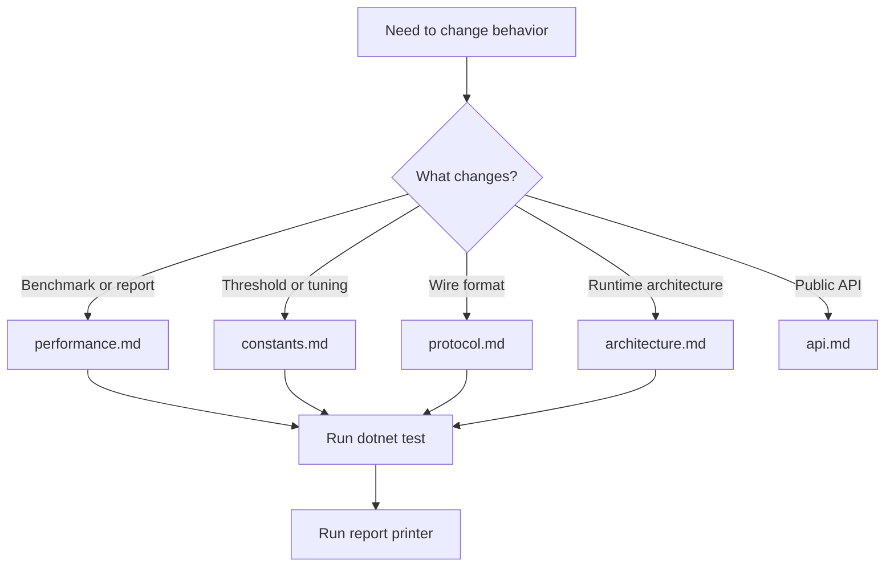

# UCP 文档索引 / Documentation Index

本索引用于维护者快速找到协议、性能、API、常量和测试报告相关资料。English descriptions are included for reviewers who do not read Chinese.

## 快速入口 / Quick Links

| 文档 | 中文说明 | English |
|---|---|---|
| [../README.md](../README.md) | 项目概览、快速开始、功能列表、报告字段摘要 | Project overview, quick start, feature list, report field summary |
| [performance.md](performance.md) | 性能报告、链路模型、场景矩阵、优化策略 | Performance reporting, route model, scenario matrix, tuning strategy |
| [protocol.md](protocol.md) | 包格式、可靠性、BBR、SACK/NAK/FEC | Packet format, reliability, BBR, SACK/NAK/FEC |
| [architecture.md](architecture.md) | 运行时分层、PCB、pacing、测试架构 | Runtime layers, PCB, pacing, test architecture |
| [constants.md](constants.md) | 所有关键常量、阈值、基准参数 | Constants, thresholds, benchmark parameters |
| [api.md](api.md) | `UcpConfiguration`、`UcpServer`、`UcpConnection` API | Public configuration, server, and connection API |

## 维护路径 / Maintenance Map

## 报告文件 / Report Files

| 文件 | 作用 |
|---|---|
| `Ucp.Tests/bin/Debug/net8.0/reports/summary.txt` | 每个场景的详细追加记录 |
| `Ucp.Tests/bin/Debug/net8.0/reports/test_report.txt` | 汇总 ASCII 表格，供 `ReportPrinter` 校验和展示 |

English: `summary.txt` is append-oriented per scenario; `test_report.txt` is the normalized table used by validation and console output.
