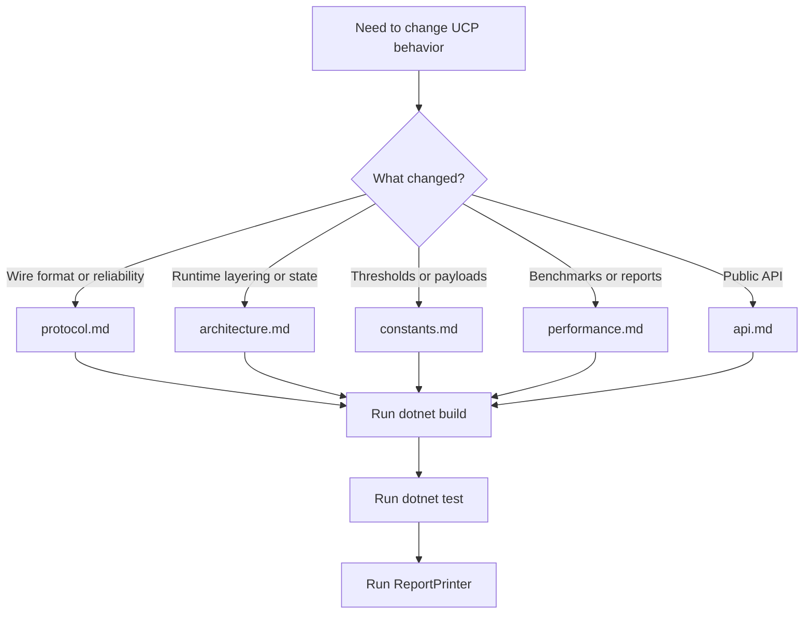

# UCP Documentation Index

This is the global entry point for UCP documentation. English files are the default maintainer reference; each page links to its Chinese `_CN` counterpart.

## Language Switch

| English | Chinese |
|---|---|
| [Documentation Index](index.md) | [文档索引](index_CN.md) |
| [Performance Guide](performance.md) | [性能与报告指南](performance_CN.md) |
| [Protocol Deep Dive](protocol.md) | [协议深度解析](protocol_CN.md) |
| [Architecture Deep Dive](architecture.md) | [架构深度解析](architecture_CN.md) |
| [Constants Reference](constants.md) | [常量参考](constants_CN.md) |
| [API Reference](api.md) | [API 参考](api_CN.md) |

## Quick Links

| Document | Purpose |
|---|---|
| [../README.md](../README.md) | Project overview, quick start, feature list, and report-field summary. |
| [performance.md](performance.md) | Benchmark matrix, report semantics, validation rules, and throughput tuning. |
| [protocol.md](protocol.md) | Packet format, reliability, BBR, SACK/NAK, urgent retransmit, and FEC. |
| [architecture.md](architecture.md) | Runtime layers, PCB state, pacing, fair queue, and simulator architecture. |
| [constants.md](constants.md) | Tunable constants, thresholds, benchmark payloads, and acceptance targets. |
| [api.md](api.md) | Public configuration, server, connection, network driver, and report API. |

## Maintenance Map

## Report Files

| File | Purpose |
|---|---|
| `Ucp.Tests/bin/Debug/net8.0/reports/summary.txt` | Append-only detailed records for individual scenarios. |
| `Ucp.Tests/bin/Debug/net8.0/reports/test_report.txt` | Normalized ASCII table validated by `ReportPrinter`. |

Always validate both tests and the generated report. Passing xUnit alone is insufficient when report semantics change.
