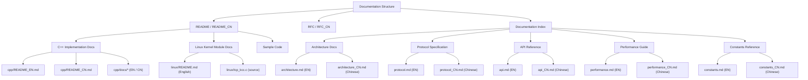

# UCP (Universal Communication Protocol) — Documentation Index

[Chinese](index_CN.md)

UCP (Universal Communication Protocol) is a pure control protocol operating over UDP. It provides CID rotation, FEC, piggybacked ACK, and SACK/NAK recovery — all feeding high-fidelity delivery samples into the KCC (Geodesic Congestion Control, KF component from tcp_kcc.c v2.0) congestion control for accurate BDP and RTT estimation.

---

## Quick Navigation

| Section | Key Documents | Purpose |
|---|---|---|
| Project Overview | [README.md](../README.md), [README_CN.md](../README_CN.md) | High-level project introduction, feature highlights, quick start, configuration reference, test guide |
| Protocol Specification | [RFC.txt](../RFC.txt), [RFC_CN.txt](../RFC_CN.txt) | Authoritative IETF-format protocol specification defining wire format, state machines, and algorithms |
| Core Protocol Docs | [architecture.md](architecture.md), [protocol.md](protocol.md), [api.md](api.md), [performance.md](performance.md), [constants.md](constants.md) | C# reference implementation — architecture, protocol, API, performance, constants (all bilingual) |
| C++ Implementation | [cpp/README_EN.md](../cpp/README_EN.md), [cpp/README_CN.md](../cpp/README_CN.md) | C++ build system, coding style, memory management, full doc suite under cpp/docs/ |
| Linux Kernel Module | [linux/README.md](../linux/README.md) | KCC kernel congestion control module — build, parameters, performance comparison |
| Sample Code | [samples/cs/Server/Program.cs](../samples/cs/Server/Program.cs), [samples/cs/Client/Program.cs](../samples/cs/Client/Program.cs), [samples/cs/Benchmark/Program.cs](../samples/cs/Benchmark/Program.cs) | End-to-end C# usage patterns |

---

## 1. Project Overview

UCP is a general-purpose transport protocol designed to operate across heterogeneous network paths ranging from data-center links at 10 Gbps with sub-millisecond RTT to satellite hops at 300 ms with 10 percent random loss. It re-engineers each subsystem of reliable transport from first principles, decoupling loss detection, loss recovery, and rate control into independently operating subsystems.

UCP is a pure control protocol: CID round-robin switching, FEC forward error correction, piggybacked ACK, and SACK/NAK recovery operate as independent subsystems that feed high-fidelity delivery samples into the KCC (Geodesic Congestion Control, KF component from tcp_kcc.c v2.0) congestion control for accurate BDP and RTT estimation. Congestion control combines the KCC 3-mode state machine (STARTUP/DRAIN/PROBE_BW) with a geodesic structural estimator (G1/G2/G3) for propagation delay estimation, using fixed open-loop gains. MinRTT tracking is handled automatically by geodesic G1/G3. The sendable upper limit is min(cwnd, peer-declared receive window); the initial cwnd is NOT a fixed 10-packet cap. FEC proactively recovers lost data via repair packets, while NAK reactively reports missing sequences — both provide delivery samples to the congestion control (FEC-recovered bytes maintain bandwidth estimates through loss bursts, NAK loss-samples improve long-term bandwidth estimation) for more accurate bandwidth/delay estimation.

UCP provides three independent implementations covering different deployment scenarios. The C# (.NET 8+) reference implementation offers a complete protocol stack with cross-platform support and is the primary development target, featuring 40-plus tunable configuration parameters and a comprehensive test suite with 644 tests. The C++17 implementation provides byte-identical wire format compatibility for native applications, using Boost.Asio for network abstraction and CMake as the build system, with 729 passing tests across unit, integration, and performance categories. The Linux kernel module (tcp_kcc.c) implements KCC v2.0 (Geodesic Congestion Control, with KF (cross-connection Kalman filter) component), UCP's congestion control algorithm, as a Linux TCP congestion control plug-in installable via insmod, allowing existing TCP applications to benefit from KCC's delivery-rate-driven bandwidth estimation without modifying application code or recompiling the kernel.

### Key Features Summary

| Feature | Description |
|---|---|
| Piggybacked Cumulative ACK | Every packet carries ACK fields at only 1.3 percent overhead, dramatically reducing dedicated ACK packets |
| SACK Fast Retransmit | Dual-observation threshold with reorder guard eliminates false retransmits from packet reordering |
| NAK Three-Tier Recovery | Receiver-driven confidence escalation with tiered guard delays for aggressive recovery on lossy paths |
| KCC Congestion Control (Geodesic Congestion Control, KF component from tcp_kcc.c v2.0) | Delivery-rate-driven bandwidth estimation with the BBR-style 3-mode state machine (STARTUP/DRAIN/PROBE_BW) and fixed open-loop gains, a geodesic G1/G2/G3 estimator for propagation delay (three-component behavioral model: T_prop/T_queue/T_noise), LT bandwidth EMA, ACK aggregation compensation (dual-window 5-RTT rotation), ECN-aware backoff (disabled by default), and the optional cross-connection Kalman filter (KF). MinRTT tracking via G1/G3. Sendable upper limit = min(cwnd, peer-declared receive window); initial cwnd is not a fixed 10-packet cap |
| GF(256) Reed-Solomon FEC | Systematic forward error correction with an adaptive 2% loss-threshold switch and O(1) Galois field arithmetic |
| Dynamic CID Rotation | 32-bit random connection ID rotated every 60 seconds with 120-second dual-acceptance window |
| Fair-Queue Scheduling | Credit-based round-robin server scheduling preventing single-connection bandwidth monopolization |
| Urgent Retransmit | Recovery retransmits bypass pacing by draining tokens to zero via ForceConsume (no negative token debt), with a per-RTT budget of 8192 packets |
| DPLPMTUD | Automatic path MTU discovery using binary-search probing, enabled by default |
| Deterministic Testing | NetworkSimulator with virtual logical clock produces cross-hardware reproducible results |
| Serial Execution Model | Per-connection SerialQueue serialized strand ensures deterministic state changes |

---

UCP is designed from the ground up for verifiability: all protocol behavior can be tested deterministically using the NetworkSimulator with a virtual logical clock. This means that test results are reproducible across different hardware, operating systems, and execution environments — a critical property for a transport protocol where timing sensitivity traditionally makes tests non-deterministic. The complete protocol implementation, including all three language variants, is validated against the same test vectors and scenario definitions.

## 2. Documentation Structure

```mermaid
flowchart TD
    A["Documentation Structure"] --> B["README / README_CN"]
    A --> C["RFC / RFC_CN"]
    A --> D["Documentation Index"]
    B --> E["C++ Implementation Docs"]
    B --> F["Linux Kernel Module Docs"]
    B --> G["Sample Code"]
    D --> H["Architecture Docs"]
    D --> I["Protocol Specification"]
    D --> J["API Reference"]
    D --> K["Performance Guide"]
    D --> L["Constants Reference"]
    H --> M["architecture.md (EN)"]
    H --> N["architecture_CN.md (Chinese)"]
    I --> O["protocol.md (EN)"]
    I --> P["protocol_CN.md (Chinese)"]
    J --> Q["api.md (EN)"]
    J --> R["api_CN.md (Chinese)"]
    K --> S["performance.md (EN)"]
    K --> T["performance_CN.md (Chinese)"]
    L --> U["constants.md (EN)"]
    L --> V["constants_CN.md (Chinese)"]
    E --> W["cpp/README_EN.md"]
    E --> X["cpp/README_CN.md"]
    E --> Y["cpp/docs/* (EN / CN)"]
    F --> Z["linux/README.md (English)"]
    F --> AB["linux/tcp_kcc.c (source)"]
```

---

## 3. Core Protocol Documentation (C# Reference Implementation)

The five core documents listed below cover the complete C# reference implementation. Each document is available in both English and Chinese, providing identical technical content in both languages.

### 3.1 Architecture Documentation

| Version | Link |
|---|---|
| English | [architecture.md](architecture.md) |
| Chinese | [architecture_CN.md](architecture_CN.md) |

Documents the six-layer runtime architecture of the UCP protocol stack, including the UcpPcb (Protocol Control Block) state management, SerialQueue serialized strand execution model, fair-queue credit-based round-robin scheduling, KCC congestion control internals (KF component from tcp_kcc.c v2.0) with fixed per-mode gains and geodesic RTT estimation, GF(256) Reed-Solomon FEC codec implementation, dynamic CID rotation mechanism, the deterministic NetworkSimulator with virtual logical clock, and C++-specific implementation optimizations such as move-semantics deletion and noexcept annotations.

### 3.2 Protocol Specification

| Version | Link |
|---|---|
| English | [protocol.md](protocol.md) |
| Chinese | [protocol_CN.md](protocol_CN.md) |

Defines the complete wire format specification: the 12-byte common header layout with Type, Flags, ConnectionId, and Timestamp fields; all eight packet types (SYN, SYNACK, ACK, NAK, DATA, FIN, RST, FecRepair) with type-specific extension fields; Flags bit layout including HasAckNumber, MtuProbe, and PathChallenge; piggybacked cumulative ACK mechanism with 16-byte extension; SACK block format with dual-observation threshold recovery; NAK three-tier confidence recovery algorithm; the connection state machine from Init through Handshake to Established and Closing; sequence number arithmetic with 32-bit space and 2^31 comparison window; KCC congestion control state transitions across the 3-mode FSM (Startup → Drain → ProbeBW); and FEC Reed-Solomon coding over GF(256) with the irreducible polynomial 0x11d.

### 3.3 API Reference

| Version | Link |
|---|---|
| English | [api.md](api.md) |
| Chinese | [api_CN.md](api_CN.md) |

Complete public API surface documentation covering all six groups of UcpConfiguration parameters (RTO and Timer Configuration, Pacing and KCC Congestion Control Gains, Bandwidth and Loss Control, FEC Parameters, Connection and Session Parameters, Protocol Tuning), the UcpServer lifecycle including Start, AcceptAsync, Stop, and fair-queue management, the UcpConnection send and receive API with WriteAsync and ReadAsync, event handling via OnData/OnConnected/OnDisconnected and diagnostic metrics via GetReport, the UcpNetwork event loop with DoEvents driving timers and pacing flushes, and the ITransport custom transport interface enabling encryption layer insertion without modifying the protocol engine. Includes a complete worked example demonstrating server-client bidirectional data transfer with diagnostic output.

### 3.4 Performance Guide

| Version | Link |
|---|---|
| English | [performance.md](performance.md) |
| Chinese | [performance_CN.md](performance_CN.md) |

Comprehensive performance documentation covering the benchmark framework methodology, the 14-plus scenario matrix spanning from 4 Mbps to 10 Gbps with loss rates from 0 to 10 percent, the 18-column report field semantics including ThroughputMbps, RetransmissionRatio, AverageRttMs, CwndBytes, and ConvergenceTime, the 13 validation rules for test report verification, the directional route model with independent forward and reverse path characteristics, KCC congestion control recovery strategies under different loss conditions, MSS and FEC and pacing tuning guidelines for various deployment scenarios, common performance pitfalls and their mitigation strategies, and the acceptance criteria thresholds used for automated report validation.

### 3.5 Constants Reference

| Version | Link |
|---|---|
| English | [constants.md](constants.md) |
| Chinese | [constants_CN.md](constants_CN.md) |

Complete catalog of all protocol constants organized by subsystem: packet encoding sizes (common header, type-specific fields, SACK block format, NAK format), RTO and recovery timers with minimum and maximum bounds, pacing and queuing parameters including token bucket capacity and refill rate, SACK fast retransmit thresholds including observation count and parallel repair distance, NAK tiered confidence parameters with guard delay multipliers and absolute minima, KCC congestion control gains and recovery parameters across all states (including the 8-phase gain cycle, geodesic estimator, ECN, LT BW, ACK aggregation), FEC group size and redundancy bounds, benchmark payload sizes for each scenario, and acceptance criteria thresholds for throughput utilization and retransmission ratio.

---

## 4. C++ Implementation Documentation

| Document | Language | Description |
|---|---|---|
| [cpp/README_EN.md](../cpp/README_EN.md) | English | C++ implementation main README covering build system, CMake targets, coding style conventions, cross-platform support notes, memory management via ucp::Malloc and ucp::Mfree, and integration guide |
| [cpp/README_CN.md](../cpp/README_CN.md) | Chinese | C++ implementation README in Chinese with identical technical content |
| [cpp/docs/index_EN.md](../cpp/docs/index_EN.md) | English | C++ documentation index and navigation hub for all C++-specific documents |
| [cpp/docs/index_CN.md](../cpp/docs/index_CN.md) | Chinese | C++ documentation index in Chinese |
| [cpp/docs/architecture_EN.md](../cpp/docs/architecture_EN.md) | English | C++ architecture documentation covering the six-layer runtime, UcpPcb, Worker Thread model with std::deque and std::condition_variable, and fair-queue implementation |
| [cpp/docs/architecture_CN.md](../cpp/docs/architecture_CN.md) | Chinese | C++ architecture documentation in Chinese |
| [cpp/docs/protocol_EN.md](../cpp/docs/protocol_EN.md) | English | C++ protocol specification covering wire format, packet types, flags, and connection state machine |
| [cpp/docs/protocol_CN.md](../cpp/docs/protocol_CN.md) | Chinese | C++ protocol specification in Chinese |
| [cpp/docs/api_EN.md](../cpp/docs/api_EN.md) | English | C++ API reference for UcpConfiguration, UcpServer, and UcpConnection public interfaces |
| [cpp/docs/api_CN.md](../cpp/docs/api_CN.md) | Chinese | C++ API reference in Chinese |
| [cpp/docs/performance_EN.md](../cpp/docs/performance_EN.md) | English | C++ performance guide with KCC congestion control (KF component from tcp_kcc.c v2.0) details, geodesic structural estimator, and NetworkSimulator benchmarks |
| [cpp/docs/performance_CN.md](../cpp/docs/performance_CN.md) | Chinese | C++ performance guide in Chinese |
| [cpp/docs/constants_EN.md](../cpp/docs/constants_EN.md) | English | C++ constants reference with 77-plus protocol constants organized by subsystem |
| [cpp/docs/constants_CN.md](../cpp/docs/constants_CN.md) | Chinese | C++ constants reference in Chinese |

The C++17 implementation shares the identical wire format specification and protocol semantics as the C# reference implementation, supporting full cross-language interoperability. A C# server can communicate with a C++ client and vice versa without any compatibility layer — this has been validated through dedicated cross-validation tests covering wire format encoding and decoding for all eight packet types, handshake sequences in both directions, loss recovery interactions across SACK, NAK, and FEC paths, FEC codec cross-implementation compatibility for GF(256) encoding and decoding, and statistical equivalence of throughput and retransmission metrics under identical scenario parameters. C++-specific optimizations include move-semantics deletion for copy-prohibited types, shared_ptr memory management with custom deleters through make_shared_object, and noexcept annotations on all Boost.Asio callbacks and non-throwing functions. Memory allocation is unified through ucp::Malloc and ucp::Mfree, with all STL containers accessed via ucp:: namespace aliases for consistent memory tracking.

---

## 5. Linux Kernel Module (KCC) Documentation

| Document | Language | Description |
|---|---|---|
| [linux/README.md](../linux/README.md) | English | Linux kernel module full documentation: build, architecture, parameters, performance |
| [linux/tcp_kcc.c](../linux/tcp_kcc.c) | C | Kernel module source code |

The KCC Linux kernel module implements the KCC v2.0 (Geodesic Congestion Control) congestion control algorithm (KF component from tcp_kcc.c) as a Linux kernel tcp_congestion_ops plug-in, compatible with Linux 3.10 and later kernels. Once loaded, the module can replace the default CUBIC congestion control algorithm, giving existing unmodified TCP applications better throughput on lossy paths. Key features include delivery-rate-driven bandwidth estimation with a 10-round sliding-window max filter, the geodesic G1/G2/G3 estimator for propagation delay (three-component behavioral model), LT bandwidth EMA estimation, ACK aggregation compensation (dual-window 5-RTT rotation), automatic geodesic min_rtt tracking via G1/G3, ECN-aware backoff (disabled by default), the optional cross-connection Kalman filter (KF), and TSO divisor adaptation. Module parameters (10+) are configurable at load time or at runtime via `/proc/sys/net/kcc/`. At one percent random loss rate, tcp_kcc throughput can be 2-5x higher than CUBIC depending on RTT and bandwidth conditions. The module is suitable for satellite communication links, mobile wireless access (LTE and 5G), trans-oceanic long-distance transmission, and data center disaster recovery replication.

---

## 6. RFC Documents

| Document | Language | Description |
|---|---|---|
| [RFC.txt](../RFC.txt) | English | Authoritative IETF-format protocol specification defining wire format, state machines, and algorithmic descriptions |
| [RFC_CN.txt](../RFC_CN.txt) | Chinese | Authoritative protocol specification in Chinese |

The RFC documents define the authoritative protocol specification that all three implementations (C#, C++, Linux kernel module) conform to. These documents are the source of truth for protocol behavior — any implementation detail in the architecture or API documentation that contradicts the RFC must defer to the RFC specification. The specification covers the complete wire format with big-endian encoding for all multi-byte fields, the 12-byte common header and eight packet type definitions, the piggybacked cumulative ACK mechanism, SACK block format with dual-observation threshold recovery, NAK three-tier confidence recovery, the connection state machine with all state transitions and timeout behaviors, KCC (Geodesic Congestion Control, KF component from tcp_kcc.c v2.0) congestion control with delivery-rate estimation and geodesic RTT estimation, fixed per-mode gains, and ECN-aware backoff, GF(256) Reed-Solomon FEC codec specification, fair-queue scheduling algorithm, dynamic CID rotation and connection migration protocol, and DPLPMTUD path MTU discovery procedure. Any implementation claiming UCP compliance must pass the test vectors and conform to the behavioral specifications defined in these RFC documents.

---

## 7. Sample Code

| Sample | Language | Path | Description |
|---|---|---|---|
| UCP Server | C# | [samples/cs/Server/Program.cs](../samples/cs/Server/Program.cs) | Demonstrates server startup, connection acceptance, bidirectional data transfer, event handling, and graceful shutdown |
| UCP Client | C# | [samples/cs/Client/Program.cs](../samples/cs/Client/Program.cs) | Demonstrates client connection establishment, data writing, reading, and connection closure |
| UCP Benchmark | C# | [samples/cs/Benchmark/Program.cs](../samples/cs/Benchmark/Program.cs) | Demonstrates benchmark execution with configurable scenarios, report generation, and validation |

The sample projects provide end-to-end UCP usage patterns that serve as both learning resources and starting points for custom integration. The server sample demonstrates the full server lifecycle including port binding, asynchronous connection acceptance, fair-queue scheduling with configurable bandwidth limits, and concurrent handling of multiple client connections. The client sample shows connection setup with configurable endpoints, reliable data transfer with WriteAsync and ReadAsync, diagnostic report retrieval, and clean connection teardown. The benchmark sample runs multiple performance scenarios with configurable parameters and generates validated test reports.

---

## 8. License

This project is licensed under the MIT License. See [LICENSE](../LICENSE) for the full license text.

Copyright (c) 2026 PPP PRIVATE NETWORK™ X

