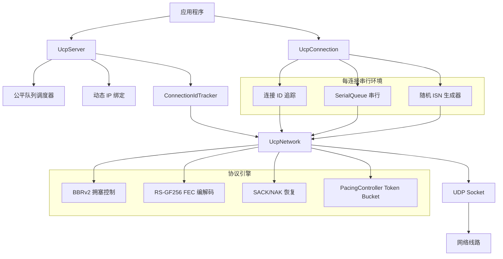
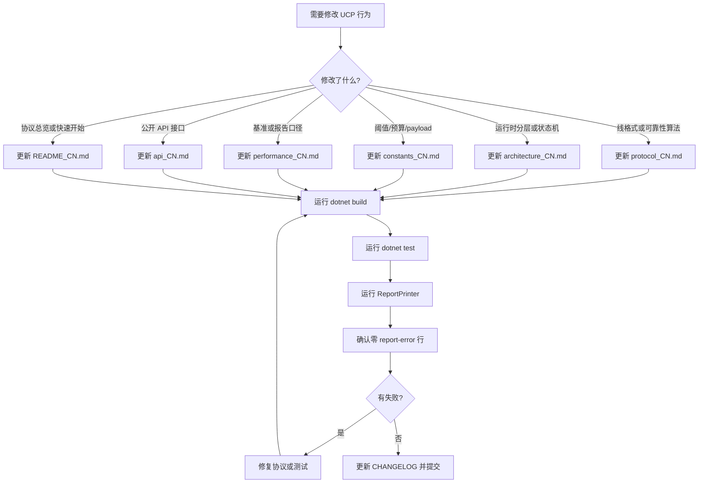

# PPP PRIVATE NETWORK™ X - 通用通信协议 (UCP)

[English](index.md)

**协议标识: `ppp+ucp`** — 面向现代网络的下一代可靠传输协议。在随机丢包、抖动和非对称路由成为常态的网络环境中，UCP 融合 QUIC 风格快速恢复、BBRv2 拥塞控制、GF(256) 上 Reed-Solomon FEC 以及 IP 无关的连接追踪，在任何支持 UDP 的网络通路上交付可预测的高吞吐性能。

UCP 运行在 UDP 之上的传输层，提供有序可靠的字节流交付，同时保持数据报通信的部署灵活性。与将所有丢包都解释为拥塞信号的 TCP 不同，UCP 在做出速率控制决策前先将丢包事件分类为随机丢包和拥塞丢包。这使 UCP 能在丢包路径（无线、卫星、长肥管）上实现高吞吐，而 TCP 在这些场景下会不必要地坍缩拥塞窗口。

## 语言切换 / Language Switch

| 中文 | English |
|---|---|
| [文档索引](index_CN.md) | [Documentation Index](index.md) |
| [架构深度解析](architecture_CN.md) | [Architecture Deep Dive](architecture.md) |
| [协议深度解析](protocol_CN.md) | [Protocol Specification](protocol.md) |
| [API 参考](api_CN.md) | [API Reference](api.md) |
| [性能与报告指南](performance_CN.md) | [Performance Guide](performance.md) |
| [常量参考](constants_CN.md) | [Constants Reference](constants.md) |

---

## 文档索引

这是 UCP 文档的全局入口。英文文档是默认维护者参考；每个中文页面都链接到对应英文页面，便于双语维护团队协作。文档按五个纵向切片组织，每部分覆盖协议的一个独特方面：

- **协议**：线格式、状态机和算法行为。
- **架构**：内部运行时设计、线程模型和组件分层。
- **API**：应用集成的公开接口。
- **常量**：所有可调参数及其默认值。
- **性能**：基准方法、校验和验收标准。

## 快速入口

| 文档 | 作用 |
|---|---|
| [../README.md](../README.md) | 项目总览、快速开始、功能矩阵和配置参考，面向首次使用者。 |
| [../README_CN.md](../README_CN.md) | 项目总览中文版，支持双语切换。 |
| [architecture_CN.md](architecture_CN.md) | 内部运行时分层（从应用 API 到传输 socket）、基于连接 ID 的会话追踪、随机 ISN 生成、每连接 SerialQueue 串行执行模型、服务端公平队列调度、pacing controller token bucket 设计、BBRv2 投递率估计内核以及确定性网络模拟器架构。包含连接状态机、PCB 组件关系、协议栈数据包流、BBR 状态机和线程模型的 mermaid 图。 |
| [architecture.md](architecture.md) | 架构深度解析英文版，含所有 mermaid 图。 |
| [protocol_CN.md](protocol_CN.md) | 权威线格式规范，含公共头、所有包类型（SYN、SYNACK、ACK、NAK、DATA、FIN、RST、FecRepair）、通过 HasAckNumber 标志在所有包类型上捎带累积 ACK、QUIC 风格 SACK 配每块发送限制、NAK 分级置信度恢复（低/中/高三级）、BBRv2 自适应 pacing 增益拥塞控制、RS-GF(256) 自适应 FEC、紧急重传机制、丢包检测恢复流程和完整连接状态机。 |
| [protocol.md](protocol.md) | 协议规范英文版，含所有 mermaid 图。 |
| [api_CN.md](api_CN.md) | 完整公开 API 接口文档，含 `UcpConfiguration.GetOptimizedConfig()` 工厂方法及所有参数默认值（按协议调优、RTO/定时器、pacing/BBRv2、带宽/丢包控制、FEC、连接/会话分类）、`UcpServer` 生命周期（Start/AcceptAsync/Stop）配时序图、`UcpConnection` 连接管理/发送/接收/事件/诊断方法、`UcpNetwork.DoEvents()` 驱动循环、`ITransport` 自定义传输接口以及含错误处理的完整端到端代码示例。 |
| [api.md](api.md) | API 参考英文版，含所有 mermaid 图。 |
| [performance_CN.md](performance_CN.md) | 基准方法论、按类别组织的 14+ 场景矩阵（稳定无丢包、随机丢包、长肥管、非对称路由、弱移动网络、突发丢包）、报告字段口径和校验规则、方向路由建模、端到端丢包恢复交互流程图、BBRv2 吞吐调优策略、MSS/发送缓冲/CWND/FEC/pacing 调优指南、常见性能陷阱及症状和解决方案以及验收标准。 |
| [performance.md](performance.md) | 性能指南英文版，含所有 mermaid 图。 |
| [constants_CN.md](constants_CN.md) | 按子系统分类的 `UcpConstants` 中所有可调和固定常量的详尽目录：包编码大小、RTO 和恢复定时器、pacing 和队列参数、SACK 和 NAK 分级置信度阈值、BBRv2 恢复常量、FEC 组大小和自适应冗余阈值、基准 payload 选择依据以及性能校验验收标准。 |
| [constants.md](constants.md) | 常量参考英文版，含所有 mermaid 图。 |

---

## 协议功能总览

UCP (`ppp+ucp`) 实现了一套完整的传输协议原语，专为跨多样化网络环境的容忍丢包高吞吐通信设计：

```mermaid
mindmap
  root((ppp+ucp 协议))
    可靠性
      所有包捎带累积 ACK
      QUIC 风格 SACK 恢复（每块 2 次发送限制）
      分级置信度 NAK 快速恢复
      重复 ACK 快速重传
      RTO/PTO 兜底守卫配 1.2× 退避
    拥塞控制
      BBRv2 自适应 pacing 增益
      丢包分类后降速
      温和拥塞响应 0.98× 乘数
      200ms 窗口网络路径分类器
      ProbeBW 8 阶段增益循环
    前向纠错
      Reed-Solomon GF(256) 编解码
      自适应冗余传输
      每组多修复包
      恢复 DATA 保留原始序号
      高斯消元解码器
    连接管理
      基于连接 ID 的会话追踪（IP 无关）
      每连接随机 ISN（类 TCP）
      服务端动态 IP 绑定
      服务端公平队列调度
      每连接 SerialQueue 串行执行
```

---

## 可靠性架构

UCP 的可靠性栈运行在三条独立的恢复路径上，每条在整个修复策略中承担特定角色：

| 恢复路径 | 触发条件 | 延迟 | 适用场景 |
|---|---|---|---|
| **SACK（选择性 ACK）** | 接收端观测乱序到达；发送端收到 SACK 块 | 亚 RTT（RTT/8 保护） | 随机独立丢包的主要快速恢复。受每块 2 次发送限制约束。 |
| **重复 ACK** | 相同累积 ACK 收到两次 | 亚 RTT | SACK 块被抑制或不可用时的快速恢复。 |
| **NAK（否定 ACK）** | 接收端累积缺口观测；置信层级升级 | RTT/4 至 RTT×2（视层级） | 对明确丢包的保守接收端驱动恢复。分级守卫防止抖动路径误报。 |
| **FEC（前向纠错）** | 接收端拥有组内足够的修复包 | 无额外 RTT | 有校验信息时的零延迟恢复。最适合可预测丢包模式。 |
| **RTO（重传超时）** | RTO 内无 ACK 进展 | RTO × 退避 | 所有主动机制失效时的兜底恢复。近期 ACK 进展期间抑制。 |

---

## 拥塞控制理念

UCP 的 BBRv2 实现在以下多个基本方面与 TCP 基于丢包的拥塞控制不同：

1. **丢包默认不等同拥塞。** UCP 在做速率控制决策前对每个丢包事件分类。无 RTT 膨胀的孤立丢包视为随机丢包，仅触发重传不降速。

2. **自适应 pacing 增益。** BBRv2 根据持续网络评估调整 pacing 增益乘数，而非使用固定周期增益。拥塞证据施加温和 0.98× 削减。

3. **CWND 下限保护。** 拥塞事件后 CWND 下限为 BDP 的 95%，防止窗口跌破路径基本容量。恢复按每 ACK 0.04 递增。

4. **网络路径分类。** 滑动窗口分类器区分 LAN、移动/不稳定、丢包长肥管、拥塞瓶颈和 VPN 类路径，将差异化行为馈入 BBRv2 状态机。

---

## 前向纠错设计

UCP 的 FEC 子系统使用 GF(256) 有限域上的 Reed-Solomon 编码，支持从 N 个数据包组中恢复最多 R 个丢包（R 为与数据一同发送的修复包数量）。关键设计特征：

- **伽罗瓦域 GF(256)**：运算使用不可约多项式 `x^8 + x^4 + x^3 + x + 1` (0x11B)。预计算对数/反对数表提供 O(1) 乘除法。
- **自适应冗余**：有效冗余率按观测丢包率调整：<0.5% 丢包时最小、0.5-2% 时 1.25×、2-5% 时 1.5×、5-10% 时 2.0×。超过 10% 丢包则重传成为主要恢复手段。
- **恢复包完整性**：FEC 恢复的 DATA 包保留其原始序号和分片元数据，因此无论包是自然到达还是重建，累积 ACK 处理和有序交付均保持正确。

---

## 连接模型

UCP 连接由随机 32 位连接 ID 标识而非 IP:port 元组。此设计选择提供：

- **NAT 重绑定韧性**：客户端 NAT 映射在会话中途变化时，服务端使用公共头中的连接 ID 将包路由到正确会话。
- **IP 移动性**：客户端可在网络接口间迁移（Wi-Fi 到蜂窝）同时保持相同会话状态。
- **服务端可伸缩性**：服务端使用公平队列调度配每连接 credit 记账（10ms 轮次、2 轮 credit 缓冲）防止任何单连接独占出口带宽。
- **无锁并发**：每个连接的协议处理运行在专用 SerialQueue 串行执行环境上，消除锁竞争同时保持所有状态变更的严格顺序保证。

---

## 架构速览



---

## 快速开始

### 前置条件

- .NET 8.0 SDK 或更高版本
- Windows、Linux 或 macOS
- Git 用于源码管理

### 构建与测试

```powershell
# 克隆并构建
git clone <repository-url>
cd ucp
dotnet build ".\Ucp.Tests\UcpTest.csproj"

# 运行完整测试套件
dotnet test ".\Ucp.Tests\UcpTest.csproj" --no-build

# 生成并校验性能基准报告
dotnet run --project ".\Ucp.Tests\UcpTest.csproj" --no-build -- ".\Ucp.Tests\bin\Debug\net8.0\reports\test_report.txt"
```

### 快速开始示例

```csharp
using Ucp;
using System.Net;
using System.Text;

var config = UcpConfiguration.GetOptimizedConfig();

// 服务端
using var server = new UcpServer(config);
server.Start(9000);
var acceptTask = server.AcceptAsync();

// 客户端
using var client = new UcpConnection(config);
await client.ConnectAsync(new IPEndPoint(IPAddress.Loopback, 9000));
var serverConn = await acceptTask;

// 数据交换
byte[] msg = Encoding.UTF8.GetBytes("你好，ppp+ucp！");
await client.WriteAsync(msg, 0, msg.Length);
byte[] buf = new byte[msg.Length];
await serverConn.ReadAsync(buf, 0, buf.Length);

Console.WriteLine($"收到: {Encoding.UTF8.GetString(buf)}");
```

---

## 测试套件覆盖范围

UCP 测试套件从五个维度验证协议：

| 维度 | 测试内容 | 验证目标 |
|---|---|---|
| **核心协议** | 序号环绕、包编解码往返、RTO 估计器收敛、pacing controller token 记账。 | 线格式正确性、定时器行为、基本收发完整性。 |
| **连接管理** | 连接 ID 多路分解、随机 ISN 唯一性、服务端动态 IP 重绑定、串行队列顺序保证。 | 会话追踪、握手完成、线程安全。 |
| **可靠性** | 丢包传输、突发丢包、SACK 每范围 2 次发送限制、NAK 分级置信度激活、FEC 单丢包和多丢包修复。 | 所有丢包模式下的恢复正确性。 |
| **流完整性** | 乱序、重复、部分读取、全双工不交错、所有包类型捎带 ACK 正确性。 | 所有网络损伤下的应用数据完整性。 |
| **性能** | 14 个基准场景覆盖 4 Mbps 到 10 Gbps、0-10% 丢包、移动、卫星、VPN 和长肥管。 | 吞吐、收敛、利用率对比验收标准。 |

---

## 维护路径



---

## 设计理念与关键区分点

UCP 以清晰理念设计，在多个重要方面与 TCP 和 QUIC 区分开来。

### 为何不用 TCP？

TCP 的根本设计假设是所有丢包都表示拥塞。这在 1980 年代大多数链路为有线且拥塞事件外丢包罕见时是合理的。在现代网络（无线、蜂窝、卫星和长距离光纤）中，随机丢包常见且独立于拥塞。TCP 每次丢包事件都将拥塞窗口减半的响应显著低效利用这些路径。

UCP 通过将丢包分类作为一级协议功能打破此假设：
- RTT 稳定的孤立丢包视为随机，仅重传不降速。
- RTT 膨胀的聚集丢包归类为拥塞，触发温和降速。
- BBRv2 控制器独立于丢包事件从投递率测量瓶颈带宽。

### 为何不用 QUIC？

QUIC 通过流多路复用、0-RTT 握手和更好的丢包恢复改进 TCP。但 QUIC 紧密耦合 HTTP/3 和 Web 生态。UCP 设计为可嵌入任意应用的通用传输层（游戏引擎、IoT 遥测、金融数据馈送、VPN 隧道），无需 HTTP 生态。

UCP 基于连接 ID 的会话追踪超越 QUIC 的连接迁移：QUIC 将连接迁移作为可选功能，UCP 将其作为默认模型。每个连接从创建时即以随机 ID 标识，IP 地址变化在协议层透明。

### 部署场景

| 场景 | UCP 适用原因 |
|---|---|
| **VPN 隧道** | 丢包长距离路径高吞吐，非对称路由下 BBRv2 维持吞吐 |
| **实时多人游戏** | FEC 低延迟恢复，连接 ID 追踪幸存 Wi-Fi 到蜂窝切换 |
| **卫星回传** | 长 RTT 路径配合中度随机丢包，BBRv2 跳过 ProbeRTT |
| **IoT 传感器网络** | 轻量线格式，随机 ISN 安全，IP 无关连接幸存 DHCP 重编号 |
| **金融数据分发** | 有序可靠交付配亚 RTT 丢包恢复，捎带 ACK 消除控制包开销 |
| **内容分发** | 公平队列防止单客户端饿死其他，自适应 FEC 减少重传开销 |

### 配置理念

UCP 的 `GetOptimizedConfig()` 提供在大多数网络环境中运行良好的合理默认值。默认值为 80 分位用例调优：中等带宽（~100 Mbps）、中等 RTT（~100ms）、中等丢包（~5%）。有极端需求的应用应相应调优：

- **高带宽 (>1 Gbps)**：MSS 升至 9000，MaxCongestionWindowBytes 升至 256 MB，MaxPacingRateBytesPerSecond 设为 0。
- **高 RTT (>300ms)**：增加 InitialCwndPackets 和 SendBufferSize 以填充 BDP，考虑增加 ProbeRttIntervalMicros。
- **高丢包 (>5%)**：启用 FEC 配 FecRedundancy = 0.25 或更高，启用自适应 FEC。
- **移动/低功耗**：降低 MSS，降低 SendBufferSize，增加 DisconnectTimeoutMicros。

---

## 报告文件

| 文件 | 位置 | 作用 |
|---|---|---|
| `summary.txt` | `Ucp.Tests/bin/Debug/net8.0/reports/` | 每个场景的追加式详细记录，含字节级完整性追踪、重传日志和收敛时序详情。 |
| `test_report.txt` | `Ucp.Tests/bin/Debug/net8.0/reports/` | 由 `ReportPrinter` 校验的标准 ASCII 汇总表。包含所有场景行，含吞吐、利用率、重传率、方向 RTT 统计、CWND、pacing 速率和收敛时间。 |

必须同时验证测试和生成报告。只通过 xUnit 不足以证明报告口径可信 — 报告必须反映物理上可行的吞吐、独立的丢包/重传拆分以及正确的收敛时序。`ValidateReportFile()` 方法自动强制执行所有约束。
