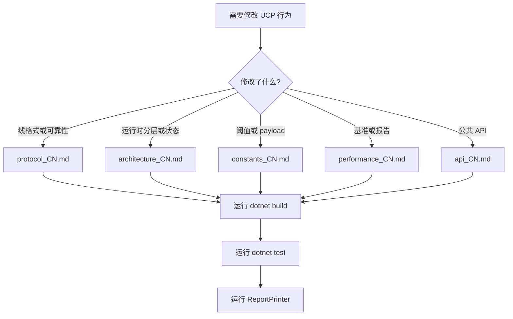

# UCP 文档索引

这是 UCP 文档的全局入口。中文文档使用 `_CN` 后缀；每个中文页面都链接到对应英文页面，便于双语维护。

## 语言切换

| 中文 | English |
|---|---|
| [文档索引](index_CN.md) | [Documentation Index](index.md) |
| [性能与报告指南](performance_CN.md) | [Performance Guide](performance.md) |
| [协议深度解析](protocol_CN.md) | [Protocol Deep Dive](protocol.md) |
| [架构深度解析](architecture_CN.md) | [Architecture Deep Dive](architecture.md) |
| [常量参考](constants_CN.md) | [Constants Reference](constants.md) |
| [API 参考](api_CN.md) | [API Reference](api.md) |

## 快速入口

| 文档 | 作用 |
|---|---|
| [../README.md](../README.md) | 项目概览、快速开始、功能列表和报告字段摘要。 |
| [performance_CN.md](performance_CN.md) | 基准矩阵、报告口径、校验规则和吞吐调优。 |
| [protocol_CN.md](protocol_CN.md) | 包格式、可靠性、BBR、SACK/NAK、紧急重传和 FEC。 |
| [architecture_CN.md](architecture_CN.md) | 运行时分层、PCB 状态、pacing、公平队列和模拟器架构。 |
| [constants_CN.md](constants_CN.md) | 可调常量、阈值、基准 payload 和验收目标。 |
| [api_CN.md](api_CN.md) | 公共配置、服务端、连接、网络驱动和报告 API。 |

## 维护路径

## 报告文件

| 文件 | 作用 |
|---|---|
| `Ucp.Tests/bin/Debug/net8.0/reports/summary.txt` | 每个场景的追加式详细记录。 |
| `Ucp.Tests/bin/Debug/net8.0/reports/test_report.txt` | 由 `ReportPrinter` 校验的标准 ASCII 汇总表。 |

必须同时验证测试和生成报告。只通过 xUnit 不足以证明报告口径可信。
