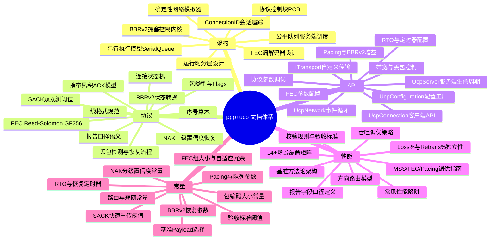
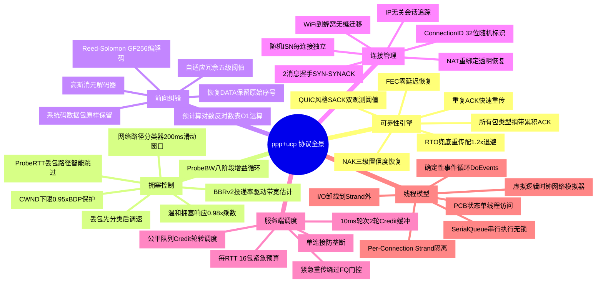
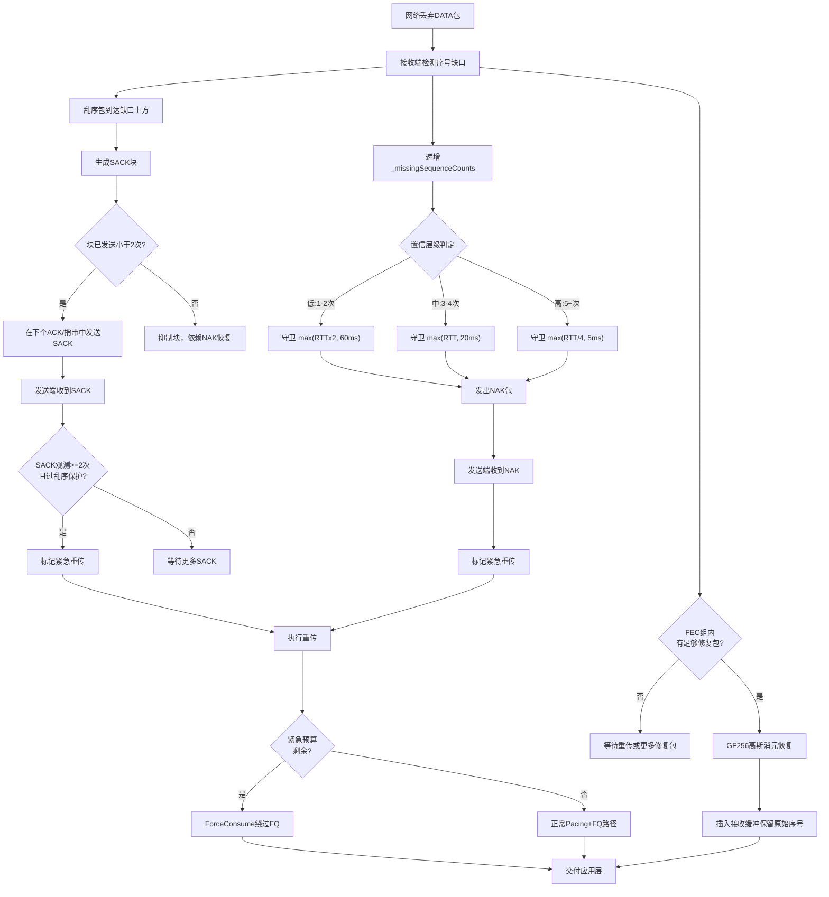
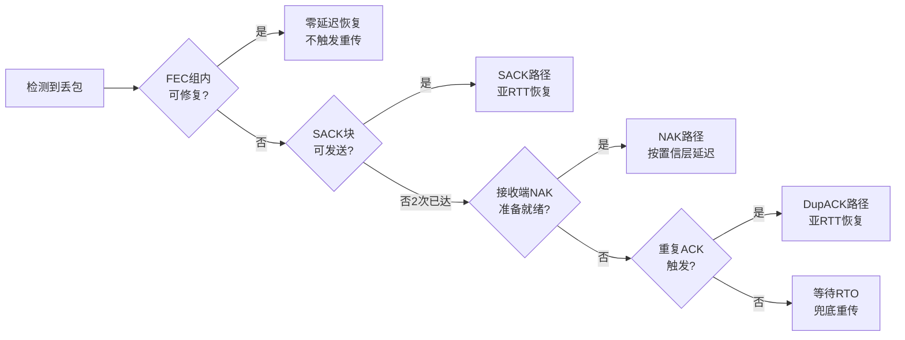
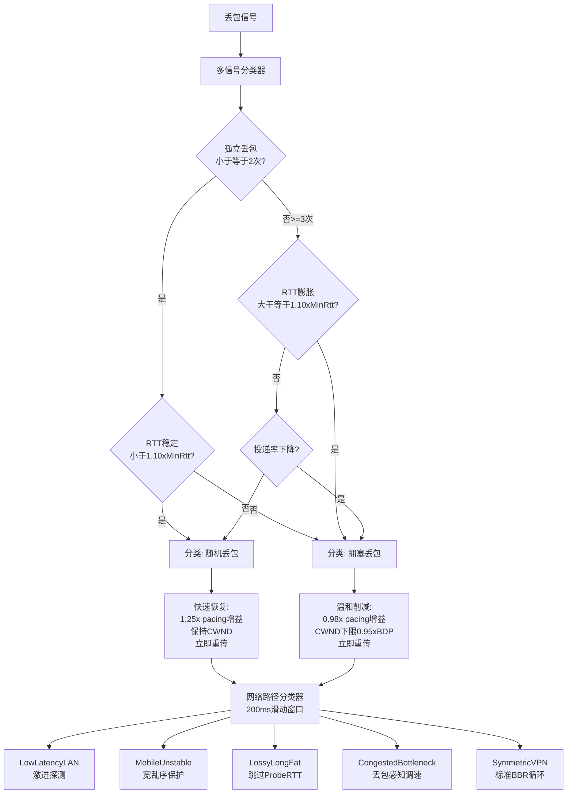
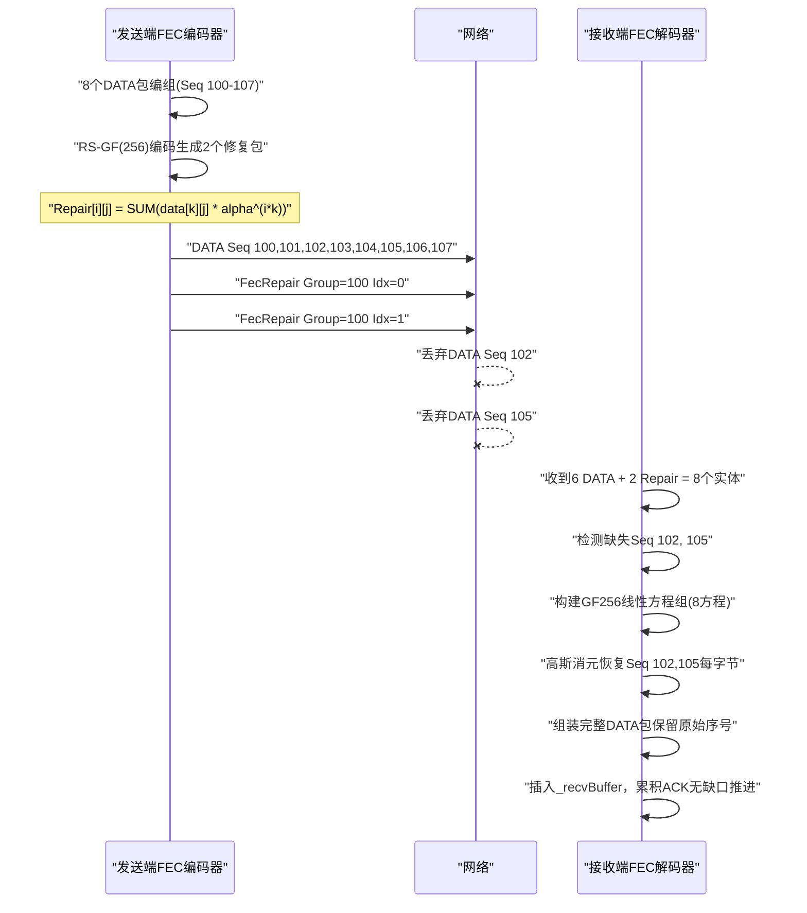
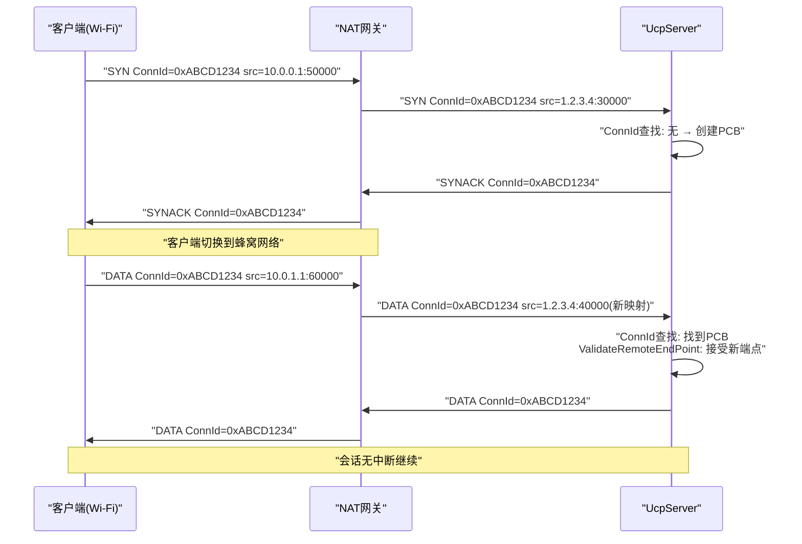
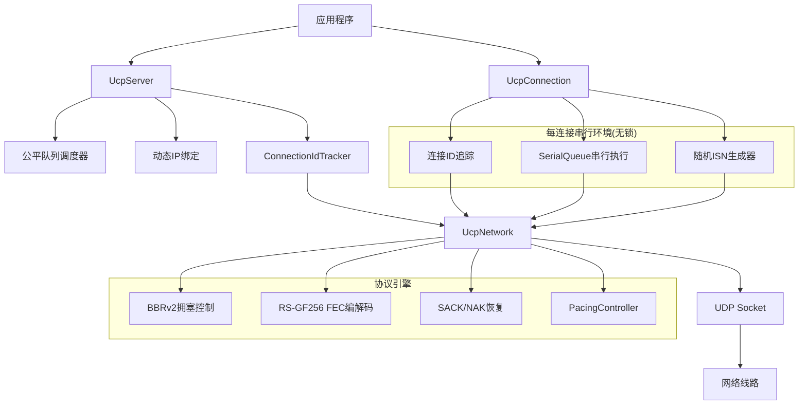
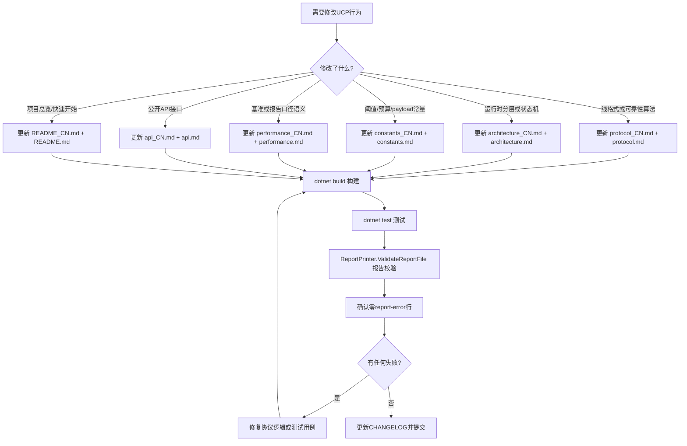

# PPP PRIVATE NETWORK™ X — 通用通信协议 (UCP)

[English](index.md)

**协议标识: `ppp+ucp`** — UCP（Universal Communication Protocol）是面向下一代异构网络的工业级可靠传输协议。它直接运行在 UDP 之上，从 QUIC 汲取架构灵感，但在丢包恢复、确认策略、拥塞控制和前向纠错方面做出了根本性不同的设计选择。UCP 重新审视传输层中每一个关于丢包、拥塞和确认的经典假设，在从理想数据中心链路（10 Gbps、<1ms RTT）到 300ms 卫星跳转（带 10% 随机丢包）的广阔路径范围内交付可预测的线速吞吐性能。

UCP 的核心信条是：**丢包分类必须在调速之前完成**。TCP 将所有丢包视为拥塞信号，这在 1980 年代合理但在现代无线网络中灾难性失效。UCP 引入多信号分类器，区分随机丢包（物理层干扰、Wi-Fi 碰撞）和拥塞丢包（瓶颈饱和、缓冲膨胀），仅在多信号交叉验证后才执行调速。这一设计使 UCP 能够在 5% 随机丢包路径上维持 85-95% 链路利用率，而 TCP 会在同一路径上坍缩至 30-50%。

## 语言切换 / Language Switch

| 中文 | English |
|---|---|
| [文档索引](index_CN.md) | [Documentation Index](index.md) |
| [架构](architecture_CN.md) | [Architecture Deep Dive](architecture.md) |
| [协议](protocol_CN.md) | [Protocol Specification](protocol.md) |
| [API 参考](api_CN.md) | [API Reference](api.md) |
| [性能与报告指南](performance_CN.md) | [Performance Guide](performance.md) |
| [常量参考](constants_CN.md) | [Constants Reference](constants.md) |

---

## 文档导航地图

UCP 文档按五个核心领域组织。每个领域深入覆盖协议的一个独立维度，相互之间可交叉引用但保持内容边界清晰：



---

## 快速入口

| 文档 | 语言 | 内容概述 |
|---|---|---|
| [../README_CN.md](../README_CN.md) | 中文 | 项目总览、设计哲学、关键创新、快速开始、配置参考、部署场景、与TCP/QUIC对比 |
| [../README.md](../README.md) | English | Project overview, design philosophy, key innovations, quick start, configuration, deployment |
| [architecture_CN.md](architecture_CN.md) | 中文 | 运行时分层（应用API→UDP Socket）、UcpPcb状态管理、连接ID追踪、随机ISN生成、SerialQueue串行执行模型、公平队列调度、PacingController Token Bucket设计、BBRv2投递率估计、确定性网络模拟器架构、FEC编解码器数学基础、入站/出站包流序列、测试架构与验证流程 |
| [architecture.md](architecture.md) | English | Runtime layering, UcpPcb state, ConnId tracking, SerialQueue strands, fair-queue, pacing, BBRv2 internals, FEC codec, network simulator, packet flow, test architecture |
| [protocol_CN.md](protocol_CN.md) | 中文 | 权威线格式规范：公共头(12B)、8种包类型(SYN/SYNACK/ACK/NAK/DATA/FIN/RST/FecRepair)、Flags位布局、HasAckNumber捎带ACK扩展、DATA/ACK/NAK/FecRepair包详细布局、SACK块2次发送限制、连接状态机与转换表、序号算术(32位+2^31窗口)、三次握手序列、丢包检测完整恢复流程、SACK快速重传参数、NAK三级置信度守卫、紧急重传机制、BBRv2状态转换与自适应Pacing增益、RS-GF(256)编解码数学基础、报告指标口径定义 |
| [protocol.md](protocol.md) | English | Wire format, packet types, piggybacked ACK, SACK limits, NAK tiers, handshake, loss recovery, BBRv2, FEC Reed-Solomon, reporting semantics |
| [api_CN.md](api_CN.md) | 中文 | 公开API接口完整参考：UcpConfiguration.GetOptimizedConfig()工厂方法(按协议调优/RTO定时器/Pacing与BBRv2/带宽与丢包控制/FEC/连接会话分类共6组参数)、UcpServer生命周期方法(Start/AcceptAsync/Stop)、UcpConnection连接管理(ConnectAsync/Close/Dispose)、发送(Send/SendAsync/Write/WriteAsync)、接收(Receive/ReceiveAsync/Read/ReadAsync)、事件模型(OnData/OnConnected/OnDisconnected)、诊断(GetReport/GetRttMicros/GetCwndBytes)、UcpNetwork.DoEvents()驱动循环、ITransport自定义传输接口、完整端到端代码示例、错误处理 |
| [api.md](api.md) | English | Public API: UcpConfiguration, UcpServer, UcpConnection, UcpNetwork, ITransport, full example, error handling |
| [performance_CN.md](performance_CN.md) | 中文 | 性能基准框架总览、14+场景分类矩阵(稳定无丢包/随机丢包/长肥管/非对称路由/弱移动网络/突发丢包)、基准结果数据表、报告16列字段口径详解、Retrans%与Loss%独立性分析及Mermaid图、7条校验规则(吞吐封顶/重传合法范围/方向延迟差/损失独立计算/收敛非零/CWND非零)、方向路由非对称建模(Mermaid图)、端到端丢包恢复完整流程图、BBRv2拥塞恢复策略参数表、性能调优指南(MSS/发送缓冲/FEC/常见陷阱)、验收标准矩阵 |
| [performance.md](performance.md) | English | Performance benchmarks, scenario matrix, report columns, validation rules, route model, tuning guide, acceptance criteria |
| [constants_CN.md](constants_CN.md) | 中文 | `UcpConstants`所有常量的详尽目录：包编码(9项)、RTO与恢复定时器(8项)、Pacing与队列(5项)、快重传与NAK分级(14项含SACK 5项+NAK 9项)、BBRv2恢复参数(7项)、前向纠错(10项含组大小/GF256多项式/自适应阈值)、基准Payload选择(12场景+原因)、基准验收标准(5项)、报告收敛解析器格式表、路由与弱网常量(6项)、连接与会话常量(4项)。合计77+个协议常量 |
| [constants.md](constants.md) | English | UcpConstants catalog: packet encoding, RTO timers, pacing, SACK/NAK tiers, BBRv2, FEC, benchmark payloads, acceptance criteria, route constants |

---

## 协议功能全景图

UCP (`ppp+ucp`) 实现了一整套专为异构网络环境设计的传输协议原语。以下 Mermaid 思维导图展示了协议的完整功能矩阵：



---

## 协议核心流程

### 端到端连接生命周期

下图展示了 UCP 连接从初始化到关闭的完整状态转换和关键事件：

```mermaid
stateDiagram-v2
    [*] --> Init["Init 初始化"]
    Init --> HandshakeSynSent["HandshakeSynSent<br/>主动发起SYN"]
    Init --> HandshakeSynReceived["HandshakeSynReceived<br/>被动接收SYN"]
    
    HandshakeSynSent --> Established["Established<br/>连接已建立"]
    HandshakeSynReceived --> Established
    
    Established --> ClosingFinSent["ClosingFinSent<br/>本地主动关闭"]
    Established --> ClosingFinReceived["ClosingFinReceived<br/>对端发起关闭"]
    
    ClosingFinSent --> Closed["Closed 已关闭"]
    ClosingFinReceived --> Closed
    
    Closed --> [*]
    
    HandshakeSynSent --> Closed
    HandshakeSynReceived --> Closed
    Established --> Closed
    ClosingFinSent --> Closed
    ClosingFinReceived --> Closed
    
    note right of HandshakeSynSent["生成随机ISN<br/>分配随机ConnId<br/>启动connectTimer"]
    note left of HandshakeSynReceived["提取ConnId<br/>分配UcpPcb<br/>验证ISN<br/>发送SYNACK"]
    note right of Established["双向数据流动<br/>捎带ACK运行<br/>BBRv2控制速率<br/>SACK/NAK/FEC保护"]
    note left of ClosingFinSent["发送FIN<br/>启动disconnectTimer<br/>排空在途数据"]
```

### 丢包检测与多路径恢复

UCP 拥有业界最完整的丢包恢复体系，五条路径各司其职，从不竞速：



### BBRv2 拥塞控制状态机

```mermaid
stateDiagram-v2
    [*] --> Startup["Startup 启动探测"]
    Startup --> Drain["Drain 队列排空"]
    Drain --> ProbeBW["ProbeBW 稳态循环"]
    ProbeBW --> ProbeRTT["ProbeRTT 刷新MinRTT"]
    ProbeRTT --> ProbeBW
    ProbeBW --> ProbeBW
    
    note right of Startup["pacing_gain: 2.5<br/>cwnd_gain: 2.0<br/>指数探测瓶颈带宽<br/>退出: 3轮吞吐不增"]
    note right of Drain["pacing_gain: 0.75<br/>排空Startup累积队列<br/>退出: inflight小于BDP"]
    note right of ProbeBW["8阶段增益循环<br/>[1.25, 0.85, 1.0*6]<br/>丢包长肥路径跳过ProbeRTT"]
    note right of ProbeRTT["cwnd降至4包<br/>持续100ms<br/>每30s触发一次"]
```

---

## 可靠性架构对比

UCP 的可靠性栈运行在五条独立的恢复路径上，每条在整个修复策略中承担特定角色：

| 恢复路径 | 触发条件 | 恢复延迟 | 适用场景 | 关键约束 |
|---|---|---|---|---|
| **SACK（选择性ACK）** | 接收端观测乱序到达；发送端收2次SACK块+过乱序保护 | 亚RTT（max(3ms, RTT/8)保护） | 随机独立丢包的主要快速恢复。最为敏捷的恢复路径。 | 每块范围最多2次发送；并行缺口距离>32序号 |
| **DupACK（重复ACK）** | 相同累积ACK值收到2次 | 亚RTT | SACK块被抑制或不可用时的备选快速恢复 | 需2次重复观测 |
| **NAK（否定ACK）** | 接收端累积缺口观测；置信层级三级升级 | RTT/4至RTT×2（视层级） | 对明确丢包的保守接收端驱动恢复。分级守卫防止抖动路径误报NAK。 | 每序号250ms重复抑制；每NAK包最多256缺失序号 |
| **FEC（前向纠错）** | 接收端拥有足够组内修复包 | 零额外RTT | 有校验信息时的零延迟恢复。最适合可预测的均匀随机丢包模式。 | 组大小2-64；自适应冗余0.5%-10%五级 |
| **RTO（重传超时）** | RTO窗口内无ACK进展 | RTO×1.2退避因子 | 上述所有主动机制均失效时的最后兜底恢复。ACK进展期间抑制批量RTO扫描。 | 每tick最多4包；200ms→15s逐步退避 |

### 恢复路径优先级决策



---

## 拥塞控制理念

UCP 的 BBRv2 实现在以下关键方面与 TCP 基于丢包的拥塞控制截然不同：

1. **丢包默认不等于拥塞。** UCP 在做速率控制决策前对每个丢包事件分类。无 RTT 膨胀的孤立丢包（≤2次/短窗口）视为随机丢包，仅触发重传不降速。较大丢包聚集（≥3次）需叠加 RTT 膨胀证据（≥1.10×MinRtt）或投递率下降趋势才确认为拥塞。

2. **自适应 Pacing 增益。** BBRv2 根据持续网络评估调整 pacing 增益乘数，而非 TCP CUBIC 的二值化拥塞/非拥塞反应。拥塞证据施加温和 0.98× 削减（每次仅降 2%），远低于 TCP 的 50% 窗口减半。

3. **CWND 下限保护。** 拥塞事件后 CWND 下限为 BDP 的 95%（`BBR_MIN_LOSS_CWND_GAIN = 0.95`），防止窗口跌破路径基本容量。恢复按每 ACK 0.04 递增（`BBR_LOSS_CWND_RECOVERY_STEP`），而非 TCP 的慢启动指数恢复。

4. **网络路径分类。** 200ms 滑动窗口分类器区分五种网络类型（LowLatencyLAN、MobileUnstable、LossyLongFat、CongestedBottleneck、SymmetricVPN），将差异化行为馈入 BBRv2 状态机。例如，LossyLongFat 路径自动跳过 ProbeRTT 以避免不必要的吞吐坍缩。



---

## 前向纠错设计

UCP 的 FEC 子系统使用 GF(256) 有限域上的系统 Reed-Solomon 编码，支持从 N 个数据包组中恢复最多 R 个丢包（R 为与数据一同发送的修复包数量）。

**关键设计特征：**
- **伽罗瓦域 GF(256)**：运算使用不可约多项式 `x^8 + x^4 + x^3 + x + 1` (0x11B)。预计算 256 项对数表和 512 项反对数表提供 O(1) 乘除法。
- **系统码编码**：原始 DATA 包原样发送，修复包作为独立 FecRepair 包发送。接收端持有至少 N 个独立包（DATA+Repair）即可解码恢复。
- **自适应冗余五级阈值**：<0.5% 丢包时最小冗余、0.5-2% 时 1.25×、2-5% 时 1.5× 并减小分组、5-10% 时最大 2.0× 冗余和最小 4 分组。超过 10% 丢包则重传成为主要恢复手段，FEC 退居辅助。
- **恢复包完整性**：FEC 恢复的 DATA 包保留其原始序号和分片元数据，因此累积 ACK 处理和有序交付保证与自然到达包完全一致。



---

## 连接模型

UCP 连接由随机 32 位连接 ID 标识而非 IP:port 元组。此设计提供：

- **NAT 重绑定韧性**：客户端 NAT 映射在会话中途变化时，服务端使用公共头中的 ConnectionId 将包路由到正确会话。`ValidateRemoteEndPoint()` 透明接受新 IP:port。
- **IP 移动性**：客户端可在网络接口间迁移（Wi-Fi→蜂窝）同时保持相同会话状态。ConnectionId 不变，服务端多路分解不依赖 IP 地址。
- **服务端可伸缩性**：服务端使用公平队列调度配每连接 credit 记账（10ms 轮次、2 轮 credit 缓冲）防止任何单连接独占出口带宽。
- **无锁并发**：每个连接的协议处理运行在专用 SerialQueue 串行执行环境上，消除锁竞争同时保持所有状态变更的严格顺序保证。



---

## 架构速览



---

## 快速开始

### 前置条件

- .NET 8.0 SDK 或更高版本
- Windows、Linux 或 macOS
- Git 用于源码管理

### 构建与测试

```powershell
# 克隆并构建
git clone <repository-url>
cd ucp
dotnet build ".\Ucp.Tests\UcpTest.csproj"

# 运行完整测试套件（54个测试）
dotnet test ".\Ucp.Tests\UcpTest.csproj" --no-build

# 生成并校验性能基准报告
dotnet run --project ".\Ucp.Tests\UcpTest.csproj" --no-build -- ".\Ucp.Tests\bin\Debug\net8.0\reports\test_report.txt"
```

### 最小可用示例

```csharp
using Ucp;
using System.Net;
using System.Text;

var config = UcpConfiguration.GetOptimizedConfig();

// 服务端
using var server = new UcpServer(config);
server.Start(9000);
var acceptTask = server.AcceptAsync();

// 客户端
using var client = new UcpConnection(config);
await client.ConnectAsync(new IPEndPoint(IPAddress.Loopback, 9000));
var serverConn = await acceptTask;

// 双向可靠数据交换
byte[] msg = Encoding.UTF8.GetBytes("你好，ppp+ucp！");
await client.WriteAsync(msg, 0, msg.Length);
byte[] buf = new byte[msg.Length];
await serverConn.ReadAsync(buf, 0, buf.Length);

Console.WriteLine($"收到: {Encoding.UTF8.GetString(buf)}");

// 传输诊断
var report = client.GetReport();
Console.WriteLine($"吞吐: {report.ThroughputMbps} Mbps, RTT: {report.AverageRttMs} ms");
```

---

## 测试套件覆盖

UCP 测试套件从五个维度验证协议，总计 54 个测试覆盖核心正确性到极端性能边界：

| 维度 | 测试数 | 验证内容 |
|---|---|---|
| **核心协议** | 10+ | 序号环绕算术、包编解码往返正确性、RTO估计器收敛验证、pacing token算术正确性、Flags位编码解码 |
| **连接管理** | 8+ | 连接ID多路分解正确性、随机ISN唯一性验证、服务端动态IP重绑定、SerialQueue顺序性保证、握手完成状态转换 |
| **可靠性** | 12+ | 有丢包传输完整性、突发丢包恢复、SACK每范围2次发送限制、NAK分级置信度激活与时序、FEC单丢包和多丢包修复、RTO退避正确性 |
| **流完整性** | 10+ | 乱序包重排、重复包去重、部分读取语义、全双工不交错、捎带ACK在所有包类型上的正确性、定长精读ReadAsync |
| **性能** | 14+ | 4Mbps到10Gbps全带宽谱、0-10%丢包率、LAN/数据中心/千兆/卫星/3G/4G/VPN/长肥管全场景、BBRv2收敛验证、报告校验 |

---

## 维护路径

当需要修改 UCP 的协议行为、配置默认值或公开 API 时，请遵循以下维护地图：



---

## 设计哲学与关键区分

### 为何不用 TCP？

TCP 的根本设计假设是所有丢包都表示拥塞。在 1980 年代大多链路为有线且拥塞事件外的丢包罕见时这是合理假设。在现代网络中（无线、蜂窝、卫星、长距离光纤），随机丢包常见且独立于拥塞。TCP 每次丢包事件将拥塞窗口减半的响应极大浪费可用带宽。

UCP 将此假设打破：
- RTT 稳定的孤立丢包视为随机，仅重传不降速
- RTT 膨胀的聚集丢包归类为拥塞，触发温和 2% 降速
- BBRv2 独立于丢包事件从投递率测量瓶颈带宽

### 为何不用 QUIC？

QUIC 对流多路复用、0-RTT 握手和更好丢包恢复的改进远优于 TCP。但 QUIC 紧密耦合 HTTP/3 和 Web 生态系统。UCP 设计为可嵌入任意应用的通用传输协议（游戏引擎、IoT 遥测、金融数据分发、VPN 隧道），不依赖 HTTP 生态。

UCP 的 Connection-ID 追踪超越 QUIC 的可选连接迁移 — UCP 将其作为默认模型，每个连接从创建时即以随机 ID 标识，IP 地址变化在协议层完全透明。

### 部署场景

| 场景 | UCP 适用原因 |
|---|---|
| **VPN 隧道** | 高吞吐穿越丢包长距离非对称路由路径。BBRv2 在 TCP 坍缩之处维持吞吐。公平队列防止单隧道垄断带宽。 |
| **实时多人游戏** | FEC 零延迟恢复可预测丢包。Connection-ID 追踪幸存 Wi-Fi 到蜂窝切换。NAK 三级置信度防止抖动路径误报。 |
| **卫星回传** | 长 RTT（300ms+）路径配合中度随机丢包。BBRv2 ProbeRTT 智能跳过避免不必要吞吐骤降。大 CWND 填充高 BDP。 |
| **IoT 传感器网络** | 轻量线格式（12B公共头）。随机 ISN 安全无每包认证开销。IP 无关连接幸存 DHCP 重编号和 NAT 重绑定。 |
| **金融数据分发** | 有序可靠交付配亚 RTT 丢包恢复。捎带 ACK 在双向流量下完全消除控制包开销。每连接 SerialQueue 保证事件顺序性。 |
| **边缘内容分发** | 公平队列服务端调度防止单慢客户端饿死其他。自适应 FEC 按观测丢包率动态调整冗余。PacingController 精确控制出口速率。 |
| **分布式数据库复制** | 低延迟可靠复制通道。连接迁移支持故障切换和 Leader 选举后重连。发送缓冲背压防止内存溢出。 |

### 配置理念

UCP 的 `GetOptimizedConfig()` 为 80% 使用场景提供合理默认值：
- 中等带宽（~100 Mbps）、中等 RTT（~100ms）、中等丢包（~5%）

有极端需求的场景应调优：
- **高带宽（>1 Gbps）**：MSS 升至 9000，MaxCongestionWindowBytes 升至 256 MB，MaxPacingRateBytesPerSecond 设为 0
- **高 RTT（>300ms）**：增加 InitialCwndPackets 和 SendBufferSize 以填充 BDP，考虑增加 ProbeRttIntervalMicros
- **高丢包（>5%）**：启用 FEC 配 FecRedundancy=0.25+，启用自适应 FEC
- **移动/低功耗**：降低 MSS，降低 SendBufferSize，增加 DisconnectTimeoutMicros

---

## 报告文件

| 文件 | 位置 | 用途 |
|---|---|---|
| `summary.txt` | `Ucp.Tests/bin/Debug/net8.0/reports/` | 追加式详细每场景记录：字节级完整性追踪、重传日志、收敛时序详情 |
| `test_report.txt` | `Ucp.Tests/bin/Debug/net8.0/reports/` | 由 `ReportPrinter.ValidateReportFile()` 校验的标准化 ASCII 汇总表 |

始终同时验证测试和生成报告。仅通过 xUnit 不足以证明报告口径可信 — 报告必须反映物理可行的吞吐、独立的丢包/重传拆分以及正确的收敛时序。

---

## 性能特征摘要

| 属性 | 数值 |
|---|---|
| 最大测试吞吐 | 10 Gbps |
| 最小时延（回环） | <100µs |
| 最大测试 RTT | 300ms（卫星） |
| 最大测试丢包率 | 10% 随机丢包 |
| 巨型帧 MSS（≥1 Gbps） | 9000 字节 |
| 默认 MSS | 1220 字节 |
| FEC 冗余范围 | 0.0–1.0 |
| 最大 FEC 组大小 | 64 包 |
| 每 ACK 最大 SACK 块 | 149（默认 MSS） |
| 最大服务端连接数 | 受限于 OS 文件描述符 |
| 收敛时间（无丢包） | 2-5 RTT（BBR Startup+Drain） |
| 收敛时间（有丢包） | +1-2 RTT/突发 |

---

## 许可证

MIT。详见 [LICENSE](../LICENSE) 全文。
