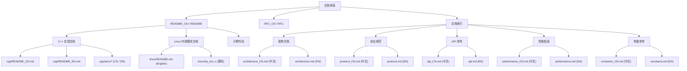

# UCP（通用通信协议）— 文档索引

[English](index.md)

UCP（Universal Communication Protocol）是运行于 UDP 之上的纯控制协议。它提供 CID 轮换、FEC、捎带 ACK 和 SACK/NAK 恢复——所有这些机制为 KCC（Geodesic Congestion Control，KF 组件源于 tcp_kcc.c v2.0）拥塞控制提供高保真投递率样本，实现精确的 BDP/RTT 估计。C# (.NET 8+) 和 C++17 两种实现共享完全相同的协议定义和线格式。本文档索引是所有 UCP 技术文档的中心导航枢纽，涵盖协议规范、架构指南、API 参考、性能调优指南、常量目录、跨平台实现和示例代码。

---

## 快速导航

| 章节 | 关键文档 | 用途 |
|---|---|---|
| 项目总览 | [README_CN.md](../README_CN.md)、[README.md](../README.md) | 项目介绍、功能亮点、快速开始、配置参考、测试指南 |
| 协议规范 | [RFC_CN.txt](../RFC_CN.txt)、[RFC.txt](../RFC.txt) | 权威 IETF 格式协议规范，定义线格式、状态机和算法 |
| 核心协议文档 | [architecture_CN.md](architecture_CN.md)、[protocol_CN.md](protocol_CN.md)、[api_CN.md](api_CN.md)、[performance_CN.md](performance_CN.md)、[constants_CN.md](constants_CN.md) | C# 参考实现：架构、协议、API、性能、常量（全双语） |
| C++ 实现 | [cpp/README_CN.md](../cpp/README_CN.md)、[cpp/README_EN.md](../cpp/README_EN.md) | C++ 构建系统、编码风格、内存管理，完整文档位于 cpp/docs/ |
| Linux 内核模块 | [linux/README.md](../linux/README.md) | KCC 内核拥塞控制模块：构建、参数、性能对比 |
| 示例代码 | [samples/cs/Server/Program.cs](../samples/cs/Server/Program.cs)、[samples/cs/Client/Program.cs](../samples/cs/Client/Program.cs)、[samples/cs/Benchmark/Program.cs](../samples/cs/Benchmark/Program.cs) | 端到端 C# 使用模式演示 |

---

## 1. 项目总览

UCP 是一个通用传输协议，设计用于在异构网络路径上运行，路径范围从数据中心链路（10 Gbps、亚毫秒 RTT）到卫星链路（300 毫秒、10% 随机丢包）。它从第一性原理重新构建了可靠传输的各个子系统，将丢包检测、丢包恢复和速率控制解耦为独立运行的子系统。

UCP 是纯控制协议：CID 轮换切换、FEC 前向纠错、捎带 ACK 和 SACK/NAK 恢复作为独立子系统运行，为 KCC（Geodesic Congestion Control，KF 组件源于 tcp_kcc.c v2.0）拥塞控制提供高保真投递率样本，实现精确的 BDP/RTT 估计。拥塞控制结合 KCC 3 模式状态机（STARTUP/DRAIN/PROBE_BW）和 Geodesic 估计器（G1/G2/G3）传播延迟估计（三分量行为模型：T_prop/T_queue/T_noise），采用固定开环增益。MinRTT 跟踪由 Geodesic G1/G3 自动处理。可发送上限为 min(cwnd, 对端宣告的接收窗口)；初始 cwnd 并非固定的 10 包上限。FEC 主动通过修复包恢复丢失数据，NAK 被动报告缺失序列——两者都为拥塞控制提供投递样本（FEC 恢复的字节在丢包突发期间维持带宽估计，NAK 丢包样本改善长期带宽估计），以实现更精确的带宽/延迟估计。

UCP 提供三种独立实现，覆盖不同部署场景。C# (.NET 8+) 参考实现提供完整的协议栈，支持跨平台运行，是主要开发目标，拥有 40 多个可调配置参数和包含 644 项测试的全面测试套件。C++17 实现提供字节级相同的线格式兼容性，适用于原生应用，使用 Boost.Asio 进行网络抽象，CMake 作为构建系统，拥有 729 项通过的单元、集成和性能测试。Linux 内核模块（tcp_kcc.c）将 UCP 使用的 KCC（Geodesic Congestion Control）拥塞控制算法实现为 Linux TCP 拥塞控制插件（含 KF（跨连接 Kalman 滤波器）组件），使现有 TCP 应用无需修改代码即可受益于 KCC 的基于投递率的带宽估计能力。

### 关键特性总结

| 特性 | 描述 |
|---|---|
| 捎带累积确认 | 每个数据包携带确认字段，开销仅 1.3%，大幅减少独立确认包 |
| SACK 快速重传 | 双观测阈值配合重排序保护，消除由包重排序引发的误重传 |
| NAK 三级置信度恢复 | 接收端驱动的置信度逐级提升，根据观测次数使用不同的保护延迟 |
| KCC 拥塞控制（Geodesic Congestion Control，KF 组件源于 tcp_kcc.c v2.0） | 基于投递率样本的带宽估计，BBR 风格 3 模式状态机（STARTUP/DRAIN/PROBE_BW）与固定开环增益，Geodesic 估计器 RTT 估计（G1/G2/G3 三分量行为模型），LT 带宽 EMA，ACK 聚合补偿（双窗口 5-RTT 轮换），ECN 感知退避（默认禁用），可选跨连接卡尔曼滤波器（KF）。MinRTT 跟踪由 G1/G3 自动处理。可发送上限 = min(cwnd, 对端宣告的接收窗口)；初始 cwnd 并非固定的 10 包上限 |
| GF(256) Reed-Solomon 前向纠错 | 系统性前向纠错，自适应 2% 丢包阈值开关，O(1) 伽罗瓦域运算 |
| 动态 CID 轮换 | 32 位随机连接标识符，每 60 秒轮换，120 秒双接收窗口 |
| 公平队列调度 | 基于信用的轮转服务端调度，防止单连接独占带宽 |
| 紧急重传 | 恢复重传绕过 pacing 限制，通过 ForceConsume 将令牌清至零（无负令牌债务），每 RTT 8192 包预算 |
| 路径 MTU 发现 | DPLPMTUD 自动探测，二分搜索算法，默认启用 |
| 确定性测试 | NetworkSimulator 使用虚拟逻辑时钟，产生跨硬件可复现的测试结果 |
| 串行执行模型 | 每连接 SerialQueue 串行化执行，保证确定性状态变更 |

---

## 2. 文档体系结构

```mermaid
flowchart TD
    A["文档体系"] --> B["README_CN / README"]
    A --> C["RFC_CN / RFC"]
    A --> D["文档索引"]
    B --> E["C++ 实现文档"]
    B --> F["Linux 内核模块文档"]
    B --> G["示例代码"]
    D --> H["架构文档"]
    D --> I["协议规范"]
    D --> J["API 参考"]
    D --> K["性能指南"]
    D --> L["常量参考"]
    H --> M["architecture_CN.md (中文)"]
    H --> N["architecture.md (EN)"]
    I --> O["protocol_CN.md (中文)"]
    I --> P["protocol.md (EN)"]
    J --> Q["api_CN.md (中文)"]
    J --> R["api.md (EN)"]
    K --> S["performance_CN.md (中文)"]
    K --> T["performance.md (EN)"]
    L --> U["constants_CN.md (中文)"]
    L --> V["constants.md (EN)"]
    E --> W["cpp/README_CN.md"]
    E --> X["cpp/README_EN.md"]
    E --> Y["cpp/docs/* (CN / EN)"]
    F --> AA["linux/README.md (English)"]
    F --> AB["linux/tcp_kcc.c (源码)"]
```

---

## 3. 核心协议文档（C# 参考实现）

以下五篇核心文档覆盖完整的 C# 参考实现。每篇文档均提供中文和英文版本，技术内容完全一致。

### 3.1 架构文档

| 版本 | 链接 |
|---|---|
| 中文 | [architecture_CN.md](architecture_CN.md) |
| English | [architecture.md](architecture.md) |

详细描述 UCP 协议栈的六层运行时架构，包括 UcpPcb（协议控制块）状态管理、SerialQueue 串行化执行模型、基于信用的公平队列轮转调度、KCC 拥塞控制内部机制（KF 组件源于 tcp_kcc.c v2.0，含固定逐模式增益和 Geodesic RTT 估计）、GF(256) Reed-Solomon FEC 编解码器实现、动态 CID 轮换机制、使用虚拟逻辑时钟的确定性 NetworkSimulator，以及 C++ 实现特有的优化措施（移动语义显式删除、noexcept 标注等）。

### 3.2 协议规范

| 版本 | 链接 |
|---|---|
| 中文 | [protocol_CN.md](protocol_CN.md) |
| English | [protocol.md](protocol.md) |

定义完整的线格式规范：12 字节公共头部布局（Type、Flags、ConnectionId、Timestamp）；全部八种包类型（SYN、SYNACK、ACK、NAK、DATA、FIN、RST、FecRepair）及其类型特定扩展字段；Flags 位布局（包含 HasAckNumber、MtuProbe、PathChallenge）；捎带累积确认机制及 16 字节扩展字段；SACK 块格式与双观测阈值恢复算法；NAK 三级置信度恢复算法；从 Init 经 Handshake 到 Established 再到 Closing 的连接状态机；32 位序号空间与 2^31 比较窗口的序号算术；KCC 拥塞控制在 3 模式 FSM（Startup → Drain → ProbeBW）各状态间的转换；以及基于不可约多项式 0x11d 的 GF(256) Reed-Solomon 纠错编码。

### 3.3 API 参考

| 版本 | 链接 |
|---|---|
| 中文 | [api_CN.md](api_CN.md) |
| English | [api.md](api.md) |

完整的公开 API 接口文档，涵盖 UcpConfiguration 全部六组参数（RTO 与定时器配置、Pacing 与 KCC 拥塞控制增益、带宽与丢包控制、FEC 参数、连接与会话参数、协议调优参数）、UcpServer 生命周期（Start、AcceptAsync、Stop 及公平队列管理）、UcpConnection 收发 API（WriteAsync 和 ReadAsync）、通过 OnData/OnConnected/OnDisconnected 的事件处理、通过 GetReport 的诊断指标、UcpNetwork 事件循环（DoEvents 驱动定时器和 pacing 刷新），以及 ITransport 自定义传输接口（可在不修改协议引擎的情况下插入加密层）。包含完整的服务端-客户端双向数据传输和诊断输出示例。

### 3.4 性能指南

| 版本 | 链接 |
|---|---|
| 中文 | [performance_CN.md](performance_CN.md) |
| English | [performance.md](performance.md) |

全面的性能文档，涵盖基准框架方法论、14 个以上测试场景矩阵（从 4 Mbps 到 10 Gbps，丢包率 0% 到 10%）、18 列报告字段语义（ThroughputMbps、RetransmissionRatio、AverageRttMs、CwndBytes、ConvergenceTime 等）、13 条测试报告校验规则、具有独立正向和反向路径特性的方向路由模型、不同丢包条件下的 KCC 拥塞控制恢复策略、各种部署场景下的 MSS 和 FEC 和 pacing 调优建议、常见性能陷阱及其缓解策略，以及用于自动化报告校验的验收标准阈值。

### 3.5 常量参考

| 版本 | 链接 |
|---|---|
| 中文 | [constants_CN.md](constants_CN.md) |
| English | [constants.md](constants.md) |

按子系统组织的完整协议常量目录：包编码尺寸（公共头部、类型特定字段、SACK 块格式、NAK 格式）、RTO 与恢复定时器的最小最大值、Pacing 与队列参数（令牌桶容量和补充速率）、SACK 快速重传阈值（观测计数和并行修复距离）、NAK 分级置信度参数（保护延迟乘数和绝对最小值）、KCC 拥塞控制各状态的增益和恢复参数（含 8 阶段增益循环、Geodesic 估计器、ECN、LT 带宽、ACK 聚合）、FEC 组大小和冗余度边界、各场景的基准测试负载大小、吞吐利用率和重传比例的验收标准阈值。

---

## 4. C++ 实现文档

| 文档 | 语言 | 描述 |
|---|---|---|
| [cpp/README_CN.md](../cpp/README_CN.md) | 中文 | C++ 实现主 README，涵盖构建系统、CMake 目标、编码风格规范、跨平台支持说明、ucp::Malloc 和 ucp::Mfree 内存管理、集成指南 |
| [cpp/README_EN.md](../cpp/README_EN.md) | English | C++ 实现 README 英文版，技术内容与中文版完全一致 |
| [cpp/docs/index_CN.md](../cpp/docs/index_CN.md) | 中文 | C++ 文档索引，所有 C++ 特定文档的导航枢纽 |
| [cpp/docs/index_EN.md](../cpp/docs/index_EN.md) | English | C++ 文档索引英文版 |
| [cpp/docs/architecture_CN.md](../cpp/docs/architecture_CN.md) | 中文 | C++ 架构文档：六层运行时、UcpPcb、Worker Thread 模型（std::deque + std::condition_variable）、公平队列实现 |
| [cpp/docs/architecture_EN.md](../cpp/docs/architecture_EN.md) | English | C++ 架构文档英文版 |
| [cpp/docs/protocol_CN.md](../cpp/docs/protocol_CN.md) | 中文 | C++ 协议规范：线格式、包类型、Flags、连接状态机 |
| [cpp/docs/protocol_EN.md](../cpp/docs/protocol_EN.md) | English | C++ 协议规范英文版 |
| [cpp/docs/api_CN.md](../cpp/docs/api_CN.md) | 中文 | C++ API 参考：UcpConfiguration、UcpServer、UcpConnection 公开接口 |
| [cpp/docs/api_EN.md](../cpp/docs/api_EN.md) | English | C++ API 参考英文版 |
| [cpp/docs/performance_CN.md](../cpp/docs/performance_CN.md) | 中文 | C++ 性能指南：KF 组件源于 tcp_kcc.c v2.0 的拥塞控制细节、Geodesic 估计器、NetworkSimulator 基准测试 |
| [cpp/docs/performance_EN.md](../cpp/docs/performance_EN.md) | English | C++ 性能指南英文版 |
| [cpp/docs/constants_CN.md](../cpp/docs/constants_CN.md) | 中文 | C++ 常量参考：77 个以上按子系统组织的协议常量 |
| [cpp/docs/constants_EN.md](../cpp/docs/constants_EN.md) | English | C++ 常量参考英文版 |

C++17 实现与 C# 参考实现共享完全相同的线格式规范和协议语义，支持完整的跨语言互操作。C# 服务端可与 C++ 客户端通信，反之亦然，无需任何兼容层。C++ 特有的优化包括：对禁止复制的类型使用移动语义显式删除、通过 make_shared_object 使用自定义删除器的 shared_ptr 内存管理、所有 Boost.Asio 回调和非抛出函数的 noexcept 标注。内存分配统一通过 ucp::Malloc 和 ucp::Mfree 进行，所有 STL 容器通过 ucp:: 命名空间别名访问。

---

## 5. Linux 内核模块（KCC）文档

| 文档 | 语言 | 描述 |
|---|---|---|
| [linux/README.md](../linux/README.md) | English | Linux 内核模块完整文档：构建、架构、参数、性能 |
| [linux/tcp_kcc.c](../linux/tcp_kcc.c) | C | 内核模块源码 |

KCC Linux 内核模块将 UCP 使用的 KCC（Geodesic Congestion Control）拥塞控制算法（KF 组件源于 tcp_kcc.c v2.0）实现为 Linux 内核 tcp_congestion_ops 插件，兼容 Linux 3.10 及以上内核。加载后即可替换默认的 CUBIC 拥塞控制算法，使现有未修改的 TCP 应用在有损路径上获得更高的吞吐量。关键特性包括：基于投递率驱动的带宽估计（10 轮滑动窗口最大值滤波器）、Geodesic G1/G2/G3 估计器传播延迟估计（三分量行为模型）、LT 带宽 EMA 估计、ACK 聚合补偿（双窗口 5-RTT 轮换）、Geodesic G1/G3 自动 min_rtt 跟踪、ECN 感知退避（默认禁用）、可选跨连接卡尔曼滤波器（KF），以及 TSO 除数自适应。模块参数（10+个）可在加载时或运行时通过 `/proc/sys/net/kcc/` 配置。在 1% 随机丢包率下，tcp_kcc 的吞吐量可比 CUBIC 高出 2 到 5 倍（取决于 RTT 和带宽条件）。该模块适用于卫星通信链路、移动无线接入（LTE 和 5G）、跨洋长距离传输以及数据中心灾备复制等场景。

---

## 6. RFC 文档

| 文档 | 语言 | 描述 |
|---|---|---|
| [RFC_CN.txt](../RFC_CN.txt) | 中文 | 权威协议规范，定义线格式、状态机和算法描述 |
| [RFC.txt](../RFC.txt) | English | 权威协议规范英文版 |

RFC 文档定义了所有三种实现（C#、C++、Linux 内核模块）共同遵循的权威协议规范。规范涵盖完整的线格式（所有多字节字段采用大端序编码）、12 字节公共头部和八种包类型定义、捎带累积确认机制、带双观测阈值恢复的 SACK 块格式、NAK 三级置信度恢复、包含所有状态转换和超时行为的连接状态机、带投递率估计和 Geodesic 估计器 RTT 估计的 KCC 拥塞控制（tcp_kcc.c 验证）、GF(256) Reed-Solomon FEC 编解码器规范、公平队列调度算法、动态 CID 轮换和连接迁移协议，以及 DPLPMTUD 路径 MTU 发现过程。任何声称符合 UCP 规范的实现必须通过这些 RFC 文档中定义的测试向量和行为规范。

---

## 7. 示例代码

| 示例 | 语言 | 路径 | 描述 |
|---|---|---|---|
| UCP 服务端 | C# | [samples/cs/Server/Program.cs](../samples/cs/Server/Program.cs) | 演示服务端启动、连接接受、双向数据传输、事件处理和优雅关闭 |
| UCP 客户端 | C# | [samples/cs/Client/Program.cs](../samples/cs/Client/Program.cs) | 演示客户端连接建立、数据写入、读取和连接关闭 |
| UCP 基准测试 | C# | [samples/cs/Benchmark/Program.cs](../samples/cs/Benchmark/Program.cs) | 演示可配置场景的基准测试执行、报告生成和校验 |

示例项目提供了端到端的 UCP 使用模式，既可作为学习资源，也可作为自定义集成的基础。服务端示例演示了完整的服务端生命周期，包括端口绑定、异步连接接受、带可配置带宽限制的公平队列调度以及多客户端并发处理。客户端示例演示了带可配置端点的连接建立、使用 WriteAsync 和 ReadAsync 的可靠数据传输、诊断报告获取以及干净连接断开。基准测试示例运行多个带可配置参数的性能场景并生成经过校验的测试报告。

---

## 8. 许可

本项目基于 MIT 许可证发布。完整许可证文本请参见 [LICENSE](../LICENSE)。

版权所有 (c) 2026 PPP PRIVATE NETWORK™ X

