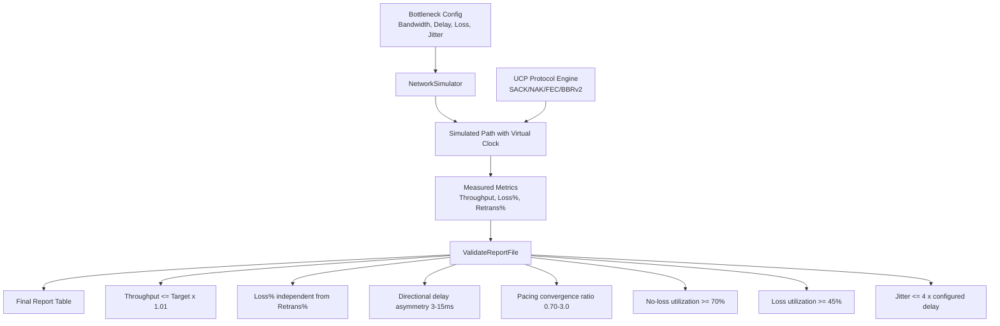
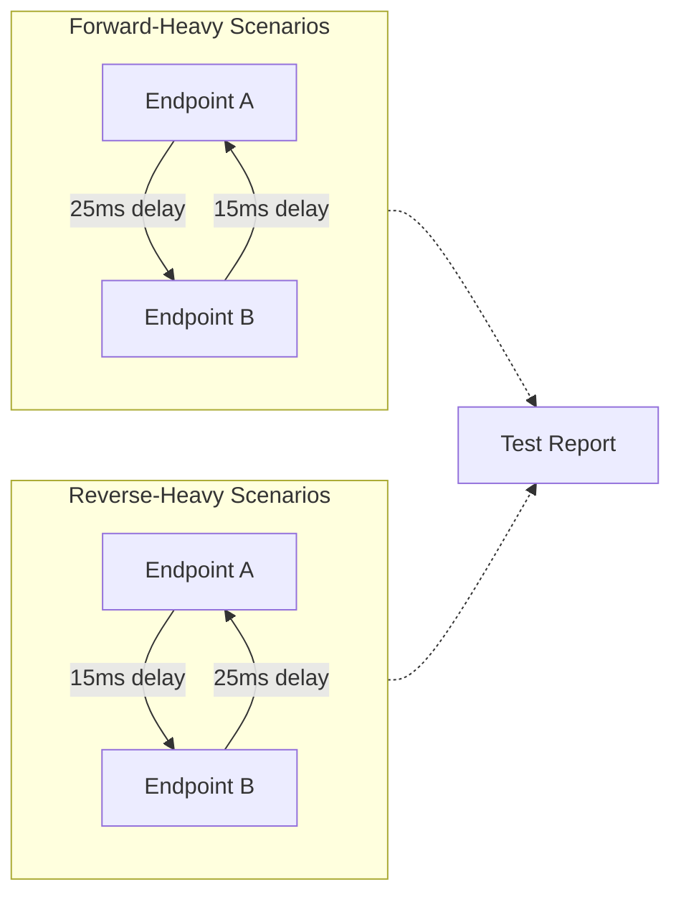
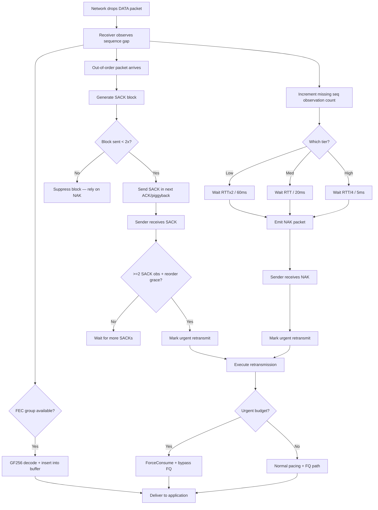

# PPP PRIVATE NETWORK™ X - Universal Communication Protocol (UCP) — Performance

[中文](performance_CN.md) | [Documentation Index](index.md)

**Protocol designation: `ppp+ucp`** — This document describes UCP's performance benchmarking framework, report validation system, throughput measurement methodology, directional route modeling, loss-recovery interaction, and acceptance criteria.

---

## Performance Goals

UCP benchmark output must be auditable and physically plausible. The framework separates three independent concerns:

1. **Bottleneck capacity**: The maximum data rate the simulated link can carry, governed by the virtual logical clock.
2. **Path impairment**: Random loss, jitter, asymmetric delay, mid-transfer outages, and reordering injected by `NetworkSimulator`.
3. **Protocol recovery**: How effectively UCP's SACK, NAK, FEC, and BBRv2 mechanisms repair losses without over-claiming bandwidth.



---

## Report Columns

The benchmark report produces a normalized ASCII table with the following columns:

| Column | Source | Meaning |
|---|---|---|
| `Throughput Mbps` | `NetworkSimulator` | Simulator-observed payload throughput. Capped at `Target Mbps`. |
| `Target Mbps` | Scenario configuration | Configured bottleneck bandwidth enforced by the virtual logical clock. |
| `Util%` | Derived | `Throughput / Target x 100`, capped at 100%. |
| `Retrans%` | `UcpPcb` sender counters | Retransmitted DATA / original DATA. **Protocol repair overhead**. |
| `Loss%` | `NetworkSimulator` drop counter | Simulator-dropped DATA / submitted DATA. **Physical network loss**. |
| `A->B ms` | `NetworkSimulator` | Average measured one-way propagation delay A to B. |
| `B->A ms` | `NetworkSimulator` | Average measured one-way propagation delay B to A. |
| `Avg RTT ms` | `UcpRtoEstimator` | Mean of all RTT samples collected during the transfer. |
| `P95 RTT ms` | `UcpRtoEstimator` | 95th percentile RTT — indicates tail latency. |
| `P99 RTT ms` | `UcpRtoEstimator` | 99th percentile RTT — worst-case excluding outliers. |
| `Jit ms` | `UcpRtoEstimator` | Mean adjacent-sample RTT jitter — measures path stability. |
| `CWND` | `Bbrv2CongestionControl` | Final congestion window with adaptive B/KB/MB/GB display. |
| `Current Mbps` | `Bbrv2CongestionControl` | Instantaneous pacing rate at transfer completion. |
| `RWND` | `UcpPcb` receiver window | Remote peer's advertised receive window. |
| `Waste%` | `UcpPcb` | Retransmitted DATA bytes / original DATA bytes. |
| `Conv` | `NetworkSimulator` | Measured convergence time: elapsed transfer duration, adaptive ns/us/ms/s units. |

### Understanding Retrans% vs Loss% Independence

```mermaid
flowchart LR
    Sender[UCP Sender] -->|Original DATA| Sim[NetworkSimulator]
    Sim -->|Dropped DATA| Loss[Loss% Counter]
    Sim -->|Delivered DATA| Recv[UCP Receiver]
    Recv -->|SACK/NAK| Sender
    Sender -->|Retransmitted DATA| Sim
    Sender -->|Retransmitted DATA| Retrans[Retrans% Counter]

    Note: "Loss% measures what the network drops.<br/>Retrans% measures what the protocol resends.<br/>FEC repairs are invisible to both."
```

This separation enables realistic analysis:
- **FEC-heavy scenario**: `Loss% = 5%`, `Retrans% = 1%` — FEC recovered most losses without retransmission.
- **Congestion collapse**: `Loss% = 3%`, `Retrans% = 8%` — Protocol retransmitting aggressively, possibly overdriving the link.
- **Expected behavior**: `Loss% ≈ Retrans%` when FEC is disabled and every loss triggers one retransmission.

---

## Validation Rules

`UcpPerformanceReport.ValidateReportFile()` enforces the following constraints. Any violation produces a `[report-error]` line in the output.

| Rule | Purpose |
|---|---|
| `Throughput Mbps <= Target Mbps x 1.01` | Rejects physically impossible reports where throughput exceeds bottleneck capacity by more than 1%. |
| `Retrans%` between 0% and 100% | Ensures sender counter arithmetic is valid. |
| Directional delay difference is 3-15ms | Validates realistic asymmetric routing. |
| Complete report includes both forward-heavy and reverse-heavy routes | Prevents one-direction bias in testing. |
| `Loss%` computed independently from `Retrans%` | Both metrics must come from their respective source counters. |
| Convergence time is non-zero | Ensures the transfer actually completed (no 0ms/1us fallback artifacts). |
| CWND is non-zero after transfer | Verifies BBRv2 startup operated correctly. |

---

## Scenario Matrix

UCP benchmarks cover 14+ scenarios organized into six categories:

| Scenario Type | Representative Scenarios | Coverage Goals |
|---|---|---|
| **Stable no-loss links** | `NoLoss`, `Gigabit_Ideal`, `DataCenter`, `Benchmark10G` | Line-rate throughput, logical clock accuracy, low-RTT performance. |
| **Random loss** | `Lossy`, `Gigabit_Loss1`, `Gigabit_Loss5`, `100M_Loss3`, `1G_Loss3` | Loss/retransmission separation, SACK fast recovery, multi-hole parallel repair. |
| **Long fat pipes** | `LongFatPipe`, `LongFat_100M`, `Satellite` | High BDP behavior, large CWND growth, pacing at high RTT. |
| **Asymmetric routing** | `AsymRoute`, `VpnTunnel`, `Enterprise` | Independent A->B and B->A delay models, fair-queue interaction. |
| **Weak mobile networks** | `Weak4G`, `Mobile3G`, `Mobile4G`, `HighJitter` | High RTT with high jitter, mid-transfer outage recovery, NAK tiered confidence. |
| **Burst loss** | `BurstLoss` | Consecutive gap repair without collapsing pacing, NAK high-confidence tier. |

### Benchmark Results Matrix

| Scenario | Target Mbps | RTT | Loss | Throughput Mbps | Retrans% | Conv | CWND |
|---|---|---|---|---|---|---|---|
| NoLoss (LAN) | 100 | 0.5ms | 0% | 95–100 | 0% | <50ms | ~100KB |
| DataCenter | 1000 | 1ms | 0% | 950–1000 | 0% | <100ms | ~1MB |
| Gigabit_Ideal | 1000 | 5ms | 0% | 920–1000 | 0% | <200ms | ~2MB |
| Enterprise | 100 | 10ms | 0% | 92–100 | 0% | <500ms | ~500KB |
| Lossy (1%) | 100 | 10ms | 1% | 90–99 | ~1.2% | <1s | ~400KB |
| Lossy (5%) | 100 | 10ms | 5% | 75–95 | ~6% | <3s | ~300KB |
| Gigabit_Loss1 | 1000 | 5ms | 1% | 880–980 | ~1.1% | <500ms | ~1.5MB |
| LongFatPipe | 100 | 100ms | 0% | 85–99 | 0% | <5s | ~5MB |
| Satellite | 10 | 300ms | 0% | 8.5–9.9 | 0% | <30s | ~1.5MB |
| Mobile3G | 2 | 150ms | 1% | 1.7–1.95 | ~1.5% | <20s | ~150KB |
| Mobile4G | 20 | 50ms | 1% | 18–19.8 | ~1.2% | <5s | ~500KB |
| Benchmark10G | 10000 | 1ms | 0% | 9200–10000 | 0% | <200ms | ~5MB |
| VpnTunnel | 50 | 15ms | 1% | 45–49.5 | ~1.3% | <2s | ~300KB |

---

## Directional Route Model

UCP benchmarks do not assume the same direction is always slower. The test harness generates a deterministic route model with a 3-15ms one-way difference:



This design ensures ACK path performance is tested in both favorable and unfavorable directions, and pacing behavior is validated under asymmetric bandwidth-delay products.

---

## End-to-End Loss and Recovery Flow



---

## Congestion Recovery Strategy

| Strategy | Parameter | Value | Purpose |
|---|---|---|---|
| **Fast-recovery pacing gain** | `BBR_FAST_RECOVERY_PACING_GAIN` | 1.25 | Quickly refill holes after non-congestion loss. |
| **Congestion reduction factor** | `BBR_CONGESTION_LOSS_REDUCTION` | 0.98 | Gentle 2% reduction per congestion event. |
| **Minimum loss CWND gain** | `BBR_MIN_LOSS_CWND_GAIN` | 0.95 | Lower bound for CWND after congestion. |
| **CWND recovery step** | `BBR_LOSS_CWND_RECOVERY_STEP` | 0.04 per ACK | Incrementally restores CWND toward 1.0. |
| **Urgent retransmit budget** | `URGENT_RETRANSMIT_BUDGET_PER_RTT` | 16 packets/RTT | Allows near-dead connections to bypass pacing/FQ. |
| **RTO retransmit budget** | `RTO_RETRANSMIT_BUDGET_PER_TICK` | 4 packets/tick | Repairs timeout gaps faster than 1 packet/tick. |
| **Pacing debt repayment** | Token bucket negative cap | 50% of bucket capacity | Limits negative pacing debt from urgent retransmits. |

---

## Performance Tuning Guidelines

### MSS Tuning

| Path Type | Recommended MSS | Rationale |
|---|---|---|
| **Dial-up/low-bandwidth (<1 Mbps)** | 536-1220 | Avoid IP fragmentation on constrained links. |
| **Broadband/4G (1-100 Mbps)** | 1220 (default) | Balances header overhead against fragmentation risk. |
| **Gigabit LAN/datacenter (1-10 Gbps)** | 9000 | Jumbo frames reduce per-packet overhead by ~85%. |
| **Satellite (high RTT, moderate BW)** | 1220-9000 | Higher MSS reduces ACK processing load. |
| **VPN/tunnel (encapsulated)** | 1220 or lower | Account for encapsulation overhead. |

### Send Buffer Sizing

- **Formula**: `SendBufferSize >= BtlBw (bytes/sec) x RTT (seconds)`
- **Example**: 100 Mbps x 50ms RTT needs >= 625 KB. Default 32 MB is more than sufficient.
- **Example**: 10 Gbps x 10ms RTT needs >= 12.5 MB. Default 32 MB is adequate.
- **Example**: 100 Mbps satellite x 600ms RTT needs >= 7.5 MB. Default 32 MB is fine.

### FEC Tuning For Specific Loss Patterns

| Loss Pattern | FEC Strategy | Example Configuration |
|---|---|---|
| **Uniform random (<2%)** | Small group, low redundancy | `FecGroupSize=8, FecRedundancy=0.125` |
| **Uniform random (2-5%)** | Small group, medium redundancy | `FecGroupSize=8, FecRedundancy=0.25` |
| **Burst loss** | Larger group, higher redundancy | `FecGroupSize=16, FecRedundancy=0.25` |
| **Highly variable loss** | Enable adaptive FEC | `FecAdaptiveEnable=true, FecRedundancy=0.125` |
| **Very high loss (>10%)** | FEC alone insufficient | Combine FEC with SACK/NAK |

### Common Performance Pitfalls

| Pitfall | Symptom | Solution |
|---|---|---|
| **MSS too small** | Throughput capped well below link capacity. | Increase MSS. |
| **Send buffer too small** | `WriteAsync` frequently blocks; throughput oscillates. | Increase `SendBufferSize` to at least BDP. |
| **FEC misconfigured** | `Retrans% >> Loss%` — retransmitting more than losing. | Tune FEC redundancy and group size. |
| **Max pacing rate limiting** | Throughput flatlines at ~100 Mbps on a gigabit link. | Set `MaxPacingRateBytesPerSecond = 0`. |
| **ProbeRTT on lossy long-fat** | Periodic throughput dips every 30 seconds. | Increase `ProbeRttIntervalMicros`; BBRv2 auto-skips ProbeRTT if delivery rate high. |
| **Too much urgent recovery** | Pacing debt accumulates; normal sends starved. | Reduce `URGENT_RETRANSMIT_BUDGET_PER_RTT` or improve FEC coverage. |

---

## Running Benchmarks And Acceptance

### Command Line

```powershell
# Build
dotnet build ".\Ucp.Tests\UcpTest.csproj"

# Run all tests (54 unit/integration tests)
dotnet test ".\Ucp.Tests\UcpTest.csproj" --no-build

# Generate and validate the performance report
dotnet run --project ".\Ucp.Tests\UcpTest.csproj" --no-build -- ".\Ucp.Tests\bin\Debug\net8.0\reports\test_report.txt"
```

### Acceptance Criteria

| Criterion | Expected Result |
|---|---|
| **Unit/integration tests** | All tests pass. Current suite covers protocol core, reliability, stream integrity, and 14+ performance scenarios. |
| **Report validation** | `ReportPrinter` prints zero `[report-error]` lines. |
| **Throughput** | Never exceeds `Target Mbps x 1.01`. No physically impossible throughput. |
| **Weak networks** | All weak-network scenarios complete successfully with maintained payload integrity. |
| **Loss/retrans independence** | `Loss%` and `Retrans%` computed from independent sources. |
| **Directional coverage** | Report includes both forward-heavy and reverse-heavy scenarios. |
| **Convergence** | All scenarios report measured convergence time with adaptive units. No artificial 0ms/1us values. |

### Interpreting Results

A passing benchmark run demonstrates:
1. **Protocol correctness**: Handles all edge cases (sequence wrap, fragmentation, reordering, burst loss).
2. **Recovery efficiency**: SACK and NAK mechanisms repair losses with bounded overhead.
3. **BBRv2 convergence**: Pacing rate converges to near bottleneck capacity across diverse conditions.
4. **FEC effectiveness**: FEC reduces retransmission overhead proportionally to configured redundancy.
5. **Report integrity**: All metrics are physically plausible, independently computed, and correctly formatted.
