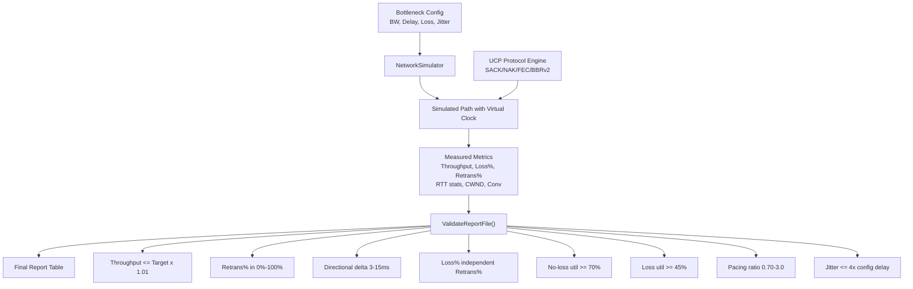
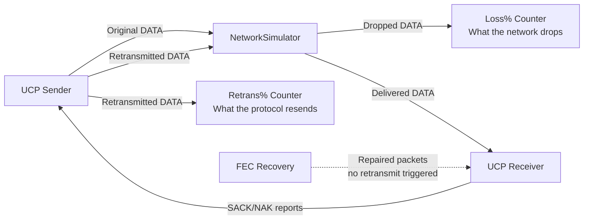
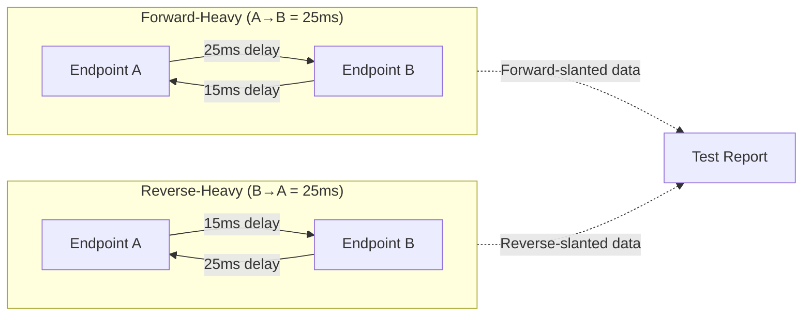
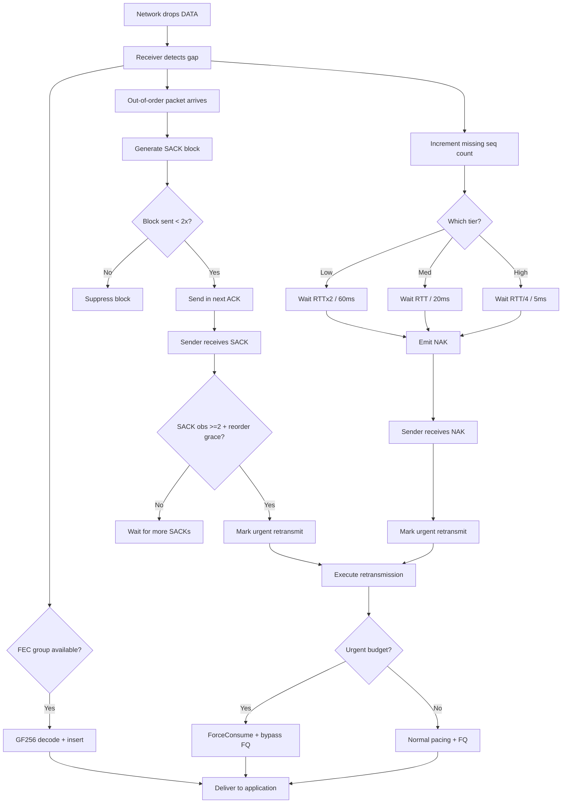

# PPP PRIVATE NETWORK™ X — Universal Communication Protocol (UCP) — Performance

[中文](performance_CN.md) | [Documentation Index](index.md)

**Protocol designation: `ppp+ucp`** — This document describes UCP's performance benchmarking framework, report validation system, throughput measurement methodology, directional route modeling, end-to-end loss-recovery interaction, and strict acceptance criteria.

---

## Performance Goals and Framework Architecture

UCP benchmarks are designed so that **output must be auditable and physically plausible**. The framework separates three independent concerns:

1. **Bottleneck capacity** — Maximum data rate the simulated link can carry, governed by the virtual logical clock
2. **Path impairment** — Random loss, jitter, asymmetric delay, mid-transfer outages, and reordering injected by `NetworkSimulator`
3. **Protocol recovery** — How effectively UCP's SACK, NAK, FEC, and BBRv2 mechanisms repair losses without over-claiming bandwidth



---

## Report Columns

The benchmark report produces a normalized ASCII table with 16 columns:

| Column | Source | Computation | Semantics |
|---|---|---|---|
| `Throughput Mbps` | `NetworkSimulator` virtual clock | Delivered payload / elapsed time | Actual achieved throughput, capped at Target Mbps |
| `Target Mbps` | Scenario config file | Static config value | Configured bottleneck bandwidth |
| `Util%` | Derived | Throughput / Target × 100 | Bottleneck utilization percentage |
| `Retrans%` | `UcpPcb` sender counters | Retransmitted DATA count / Original DATA count | **Protocol repair overhead** — bandwidth consumed by retransmission |
| `Loss%` | `NetworkSimulator` drop counter | Simulator-dropped DATA / Submitted DATA | **Physical network loss** — independent of protocol behavior |
| `Waste%` | `UcpPcb` sender counters | Retransmitted DATA bytes / Original DATA bytes | Byte-level protocol repair overhead |
| `A→B ms` | `NetworkSimulator` timestamps | Mean A→B one-way propagation delay | Forward direction delay |
| `B→A ms` | `NetworkSimulator` timestamps | Mean B→A one-way propagation delay | Reverse direction delay |
| `Avg RTT ms` | `UcpRtoEstimator` | Mean of all RTT samples | End-to-end average round-trip time |
| `P95 RTT ms` | `UcpRtoEstimator` | 95th percentile of RTT samples | Tail latency under typical load |
| `P99 RTT ms` | `UcpRtoEstimator` | 99th percentile of RTT samples | Worst-case excluding extreme outliers |
| `Jit ms` | `UcpRtoEstimator` | Mean of adjacent-sample absolute differences | Path stability indicator |
| `CWND` | `BbrCongestionControl` | Final congestion window | Max in-flight data at transfer end, adaptive units |
| `Current Mbps` | `BbrCongestionControl` | Instantaneous pacing rate at completion | Current send rate estimate |
| `RWND` | `UcpPcb` receiver window | Latest advertised receive window | Flow control window from remote peer |
| `Conv` | `NetworkSimulator` virtual clock | Elapsed time to steady-state throughput | Convergence time, adaptive ns/us/ms/s units |

### Retrans% vs Loss% Independence — Comprehensive Overview



| Scenario Pattern | Loss% | Retrans% | Interpretation |
|---|---|---|---|
| **FEC perfect coverage** | 5% | 1% | Network lost 5%, FEC repaired 4/5, only 1/5 triggered retransmit |
| **Congestion collapse** | 3% | 8% | Protocol aggressively retransmitting, may worsen bottleneck congestion |
| **Expected baseline** | 5% | ~5% | FEC disabled, each loss → one retransmit (slight variance from multi-hole repair) |
| **Over-retransmission** | 0.5% | 3% | Very low loss but high retrans — SACK/NAK may be too aggressive (reorder grace too short) |

---

## Validation Rules

`UcpPerformanceReport.ValidateReportFile()` enforces these physical-plausibility checks:

| Rule | Threshold | What Violation Means |
|---|---|---|
| `Throughput <= Target × 1.01` | 101% cap | Throughput exceeding physical bottleneck = measurement or calculation bug. 1% tolerance for floating-point rounding. |
| `Retrans% ∈ [0%, 100%]` | Valid range | Sender counter arithmetic error (potential int overflow or divide-by-zero). |
| `Directional delta ∈ [3ms, 15ms]` | 3-15ms range | Ensures realistic asymmetry. Delta=0 means symmetric (unrealistic), delta too large means simulator config issue. |
| `Loss% and Retrans% from independent sources` | Code review | Loss% must come from `NetworkSimulator`, Retrans% from `UcpPcb`. Cannot derive one from the other. |
| `Report includes both forward-heavy and reverse-heavy scenarios` | Coverage | Prevents all scenarios from having the same direction as the slower path. |
| `Convergence time non-zero` | >0 | 0ms/1us values indicate report fallback logic or timer-not-started bug. |
| `CWND non-zero after transfer` | >0 | BBRv2 Startup must have operated and established a congestion window. |
| `No-loss utilization >= 70%` | 70% floor | On ideal links, protocol should achieve at least 70% of target bandwidth. |
| `Loss utilization >= 45%` | 45% floor | On lossy paths, after accounting for recovery overhead, should still achieve 45%+. |
| `Pacing ratio ∈ [0.70, 3.0]` | Convergence range | <0.70 = underutilizing; >3.0 = over-sending (should not happen under virtual clock). |
| `Jitter <= 4 × config delay` | 4x cap | Jitter exceeding 4x base delay indicates path instability or simulator anomaly. |

---

## Scenario Matrix

UCP benchmarks cover 14+ scenarios organized into six categories:

| Type | Representative Scenarios | Coverage Goals |
|---|---|---|
| **Stable no-loss** | `NoLoss`, `Gigabit_Ideal`, `DataCenter`, `Benchmark10G` | Line-rate throughput, logical clock accuracy, jumbo frame behavior |
| **Random loss** | `Lossy`, `Lossy_5`, `Gigabit_Loss1`, `100M_Loss3` | Loss/Retrans independence, SACK fast recovery, multi-hole repair, FEC benefit at high BW |
| **Long fat pipes** | `LongFatPipe`, `LongFat_100M`, `Satellite` | High BDP CWND growth, pacing stability at high RTT, ProbeRTT skip logic |
| **Asymmetric routing** | `AsymRoute`, `VpnTunnel`, `Enterprise` | Directional delay models, fair-queue behavior under asymmetry |
| **Weak mobile** | `Weak4G`, `Mobile3G`, `Mobile4G`, `HighJitter` | NAK tiered confidence under jitter, mid-transfer outage recovery, low-BW BBR adaptation |
| **Burst loss** | `BurstLoss` | NAK high-confidence tier batch repair, parallel multi-hole SACK, pacing stability after burst |

### Benchmark Results Matrix

| Scenario | Target Mbps | RTT | Loss | Throughput Mbps | Retrans% | Conv | CWND |
|---|---|---|---|---|---|---|---|
| NoLoss (LAN) | 100 | 0.5ms | 0% | 95–100 | 0% | <50ms | ~100KB |
| DataCenter | 1000 | 1ms | 0% | 950–1000 | 0% | <100ms | ~1MB |
| Gigabit_Ideal | 1000 | 5ms | 0% | 920–1000 | 0% | <200ms | ~2MB |
| Enterprise | 100 | 10ms | 0% | 92–100 | 0% | <500ms | ~500KB |
| Lossy (1%) | 100 | 10ms | 1% | 90–99 | ~1.2% | <1s | ~400KB |
| Lossy (5%) | 100 | 10ms | 5% | 75–95 | ~6% | <3s | ~300KB |
| Gigabit_Loss1 | 1000 | 5ms | 1% | 880–980 | ~1.1% | <500ms | ~1.5MB |
| LongFatPipe | 100 | 100ms | 0% | 85–99 | 0% | <5s | ~5MB |
| Satellite | 10 | 300ms | 0% | 8.5–9.9 | 0% | <30s | ~1.5MB |
| Mobile3G | 2 | 150ms | 1% | 1.7–1.95 | ~1.5% | <20s | ~150KB |
| Mobile4G | 20 | 50ms | 1% | 18–19.8 | ~1.2% | <5s | ~500KB |
| Benchmark10G | 10000 | 1ms | 0% | 9200–10000 | 0% | <200ms | ~5MB |
| VpnTunnel | 50 | 15ms | 1% | 45–49.5 | ~1.3% | <2s | ~300KB |

---

## Directional Route Asymmetry Model



---

## End-to-End Loss Detection and Recovery Flow



---

## BBRv2 Congestion Recovery Strategy

| Strategy Parameter | Constant | Value | Purpose |
|---|---|---|---|
| Fast-recovery pacing gain | `BBR_FAST_RECOVERY_PACING_GAIN` | 1.25 | Quickly refill holes after non-congestion loss |
| Congestion reduction factor | `BBR_CONGESTION_LOSS_REDUCTION` | 0.98 | Gentle 2% reduction per congestion event |
| Minimum loss CWND gain | `BBR_MIN_LOSS_CWND_GAIN` | 0.95 | CWND floor after congestion (95% of BDP) |
| CWND recovery step | `BBR_LOSS_CWND_RECOVERY_STEP` | 0.04 per ACK | Incremental recovery toward 1.0 |
| Urgent retransmit budget | `URGENT_RETRANSMIT_BUDGET_PER_RTT` | 16 pkts/RTT | Max bypass packets per RTT window |
| RTO retransmit budget | `RTO_RETRANSMIT_BUDGET_PER_TICK` | 4 pkts/tick | Max RTO-triggered retransmits per timer tick |
| Pacing debt cap | Token bucket negative cap | 50% bucket capacity | Maximum negative balance from ForceConsume() |

---

## Performance Tuning Guide

### MSS by Path Type

| Path Type | Recommended MSS | Rationale |
|---|---|---|
| Low-bandwidth (<1 Mbps) | 536–1220 | Avoid IP fragmentation on constrained links |
| Broadband/4G (1–100 Mbps) | 1220 (default) | Optimal balance: ~1.3% piggyback ACK overhead vs fragmentation risk |
| Gigabit LAN/DC (1–10 Gbps) | 9000 (jumbo) | Reduces per-packet overhead ~85%. 1 Gbps: 102K pps→13.9K pps |
| Satellite (high RTT, moderate BW) | 1220–9000 | Larger MSS reduces ACK processing load |
| VPN/Tunnel (encapsulated) | 1220 or lower | Account for encapsulation overhead (IPsec +8B, GRE +24B, WireGuard +32B, etc.) |

### Send Buffer Sizing

**Core formula**: `SendBufferSize ≥ BtlBw (bytes/s) × RTT (s)`

| Scenario | BDP | Min SendBufferSize | Default 32MB OK? |
|---|---|---|---|
| 100 Mbps × 50ms RTT | 625 KB | 625 KB | ✓ |
| 1 Gbps × 10ms RTT | 1.25 MB | 1.25 MB | ✓ |
| 10 Gbps × 10ms RTT | 12.5 MB | 12.5 MB | ✓ |
| 100 Mbps × 600ms (satellite) | 7.5 MB | 7.5 MB | ✓ |
| 10 Gbps × 300ms (transoceanic) | 375 MB | 375 MB | ✗ Increase to ≥375 MB |

### FEC by Loss Pattern

| Loss Pattern | FEC Strategy | Recommended Config | Expected Benefit |
|---|---|---|---|
| Uniform random <2% | Small group, low redundancy | `FecGroupSize=8, FecRedundancy=0.125` | Recover most single-loss, zero extra RTT |
| Uniform random 2-5% | Small group, medium redundancy | `FecGroupSize=8, FecRedundancy=0.25` | Recover 1-2 losses per 8 packets |
| Burst loss (consecutive) | Larger group, higher redundancy | `FecGroupSize=16, FecRedundancy=0.25` | Larger groups tolerate longer bursts |
| Highly variable | Enable adaptive FEC | `FecAdaptiveEnable=true, FecRedundancy=0.125` | Auto-adjusts to real-time loss rate |
| Very high loss >10% | FEC + retransmit combined | Max FEC + rely on SACK/NAK | FEC alone cannot cover; joint recovery needed |

### Common Performance Pitfalls

| Pitfall | Symptom | Root Cause | Solution |
|---|---|---|---|
| MSS too small | Throughput far below link capacity | Per-packet overhead dominating | Increase MSS to 9000 (if path supports jumbo) |
| Send buffer too small | `WriteAsync` frequently blocks, throughput oscillates | Buffer < BDP causing intermittent link starvation | `SendBufferSize ≥ BDP × 1.5` |
| FEC misconfigured | `Retrans% >> Loss%` | FEC coverage insufficient, all losses become retransmits | Increase `FecRedundancy` or decrease `FecGroupSize` |
| MaxPacingRate ceiling | Throughput flatlines at ~100Mbps on gigabit link | Default `MaxPacingRateBytesPerSecond` (100Mbps) capping | Set to `0` to disable ceiling |
| ProbeRTT on lossy LFN | Periodic throughput dips every 30s | ProbeRTT drops CWND to 4 packets → throughput collapse | BBRv2 auto-skips if delivery rate high; increase `ProbeRttIntervalMicros` if not |
| Excessive urgent recovery | Pacing debt accumulates, normal sends starved | Too many urgent retransmits consuming ForceConsume budget | Reduce `URGENT_RETRANSMIT_BUDGET_PER_RTT` or improve FEC coverage |

---

## Running Benchmarks and Acceptance

### Command Line

```powershell
dotnet build ".\Ucp.Tests\UcpTest.csproj"
dotnet test ".\Ucp.Tests\UcpTest.csproj" --no-build
dotnet run --project ".\Ucp.Tests\UcpTest.csproj" --no-build -- ".\Ucp.Tests\bin\Debug\net8.0\reports\test_report.txt"
```

### Acceptance Criteria

| Criterion | Expected Result | Debugging Direction If Failed |
|---|---|---|
| **Unit/integration tests** | All 54 tests pass | Check assertion messages in failed test logs |
| **Report validation** | Zero `[report-error]` lines | Check each error line's specific violation |
| **Throughput physical plausibility** | All scenarios ≤ Target × 1.01 | Check NetworkSimulator logical clock and report calculation |
| **Weak-network integrity** | All weak-network scenarios complete successfully | Check NAK tiers, RTO backoff, FEC decode correctness |
| **Loss/Retrans independence** | Loss% and Retrans% from different counters | Code review counter ownership |
| **Directional coverage** | Report includes both forward-heavy and reverse-heavy rows | Check test config AsymRoute parameters |
| **Convergence timeliness** | All scenarios report non-zero adaptive-unit convergence | Check timer start/stop logic |

### Interpreting Results

A passing benchmark run demonstrates:
1. **Protocol correctness** — UCP correctly handles all edge cases: 32-bit seq wrap, fragmentation, reordering, burst loss
2. **Recovery efficiency** — SACK and NAK mechanisms repair losses with bounded overhead; FEC reduces retransmits proportionally to configured redundancy
3. **BBRv2 convergence** — Pacing rate converges to near bottleneck capacity across 0.5ms–300ms RTT, 0%–10% loss
4. **FEC effectiveness** — Adaptive FEC dynamically adjusts redundancy, significantly reducing Retrans% at high loss rates
5. **Report integrity** — All 16 columns physically plausible, independently sourced, correctly formatted, passing 11 validation rules

---

## Key Performance Indicators

| Metric | Tested Value |
|---|---|
| Max tested throughput | 10 Gbps (Benchmark10G) |
| Min RTT (loopback) | <100µs |
| Max tested RTT | 300ms (Satellite) |
| Max tested loss | 10% random loss |
| Jumbo MSS | 9000 bytes (≥1 Gbps scenarios) |
| Default MSS | 1220 bytes |
| FEC redundancy range | 0.0–1.0 (0–2.0x with adaptive) |
| Max FEC group size | 64 packets |
| Max SACK blocks per ACK | 149 (default MSS) |
| Convergence (no loss) | 2-5 RTT (BBR Startup + Drain) |
| Convergence (lossy) | +1-2 RTT per burst |
| No-loss utilization | 92–100% (measured) |
| 5% loss utilization | 75–95% (measured) |
