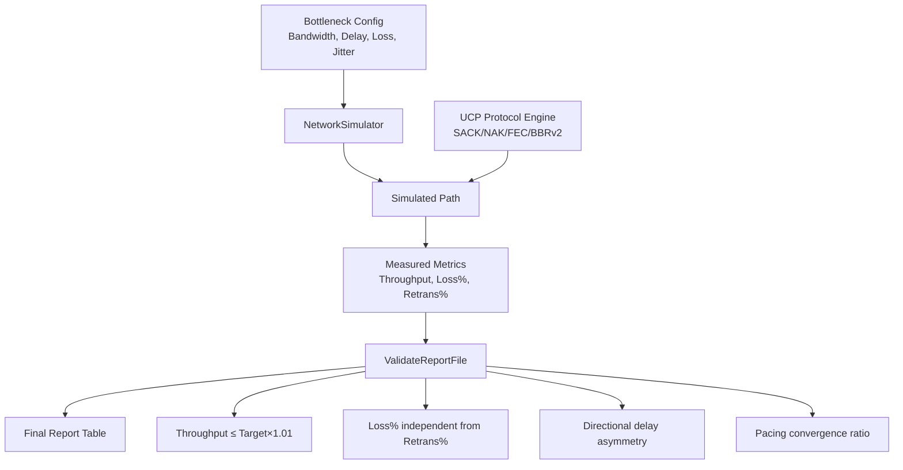
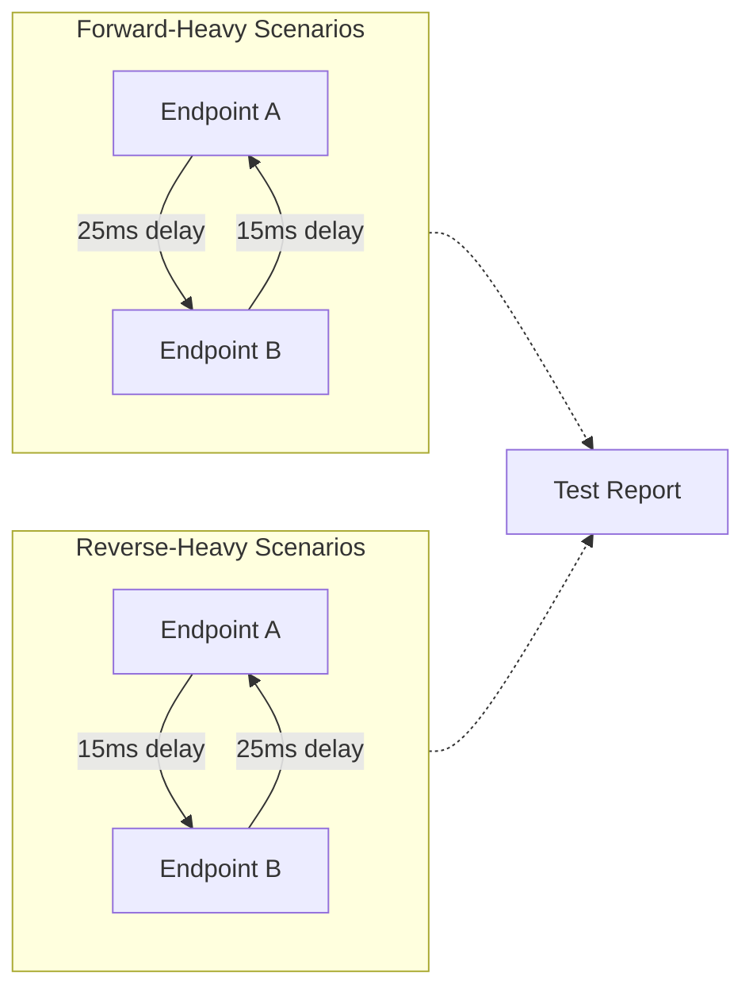
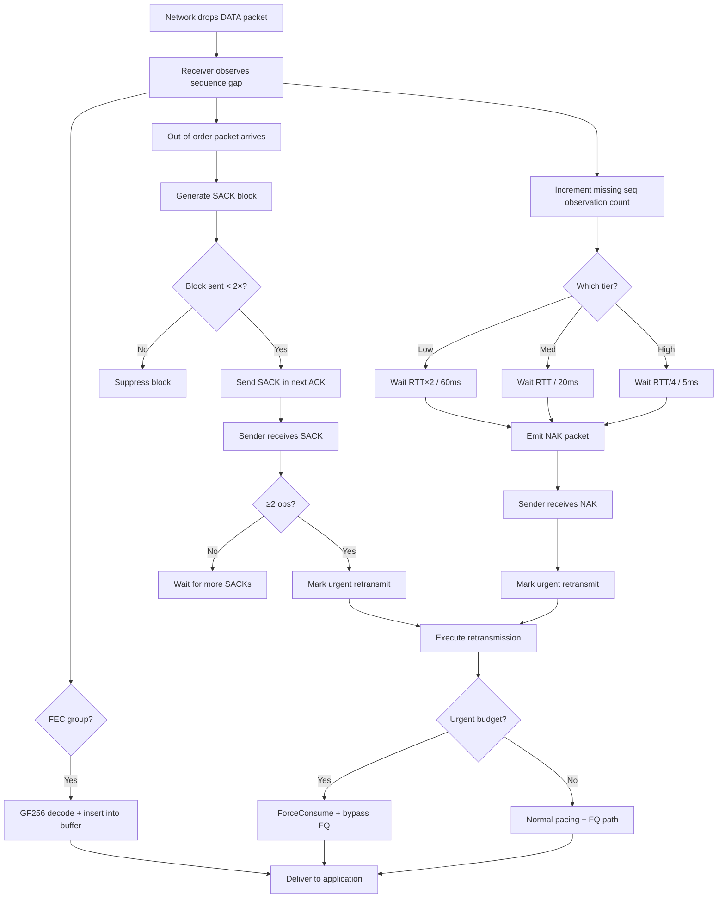

# PPP PRIVATE NETWORK™ X - Universal Communication Protocol (UCP) — Performance

[中文](performance_CN.md) | [Documentation Index](index.md)

**Protocol designation: `ppp+ucp`** — This document describes UCP's performance benchmarking framework, report validation system, throughput measurement methodology, directional route modeling, loss-recovery interaction, and acceptance criteria.

## Performance Goals

UCP benchmark output must be auditable and physically plausible. The framework separates three independent concerns:

1. **Bottleneck capacity**: The maximum data rate the simulated link can carry, governed by the virtual logical clock.
2. **Path impairment**: Random loss, jitter, asymmetric delay, mid-transfer outages, and reordering injected by `NetworkSimulator`.
3. **Protocol recovery**: How effectively UCP's SACK, NAK, FEC, and BBRv2 mechanisms repair losses without over-claiming bandwidth.

A high-loss scenario must show whether the protocol efficiently repaired data without reporting throughput that exceeds the configured link capacity. The report intentionally clamps payload throughput to `Target Mbps`, ensuring that in-process scheduling speed never inflates benchmark results.



## Report Columns

The benchmark report produces a normalized ASCII table with the following columns:

| Column | Source | Meaning |
|---|---|---|
| `Throughput Mbps` | `NetworkSimulator` | Simulator-observed payload throughput. Capped at `Target Mbps` to prevent in-process speed from inflating results. |
| `Target Mbps` | Scenario configuration | The configured bottleneck bandwidth that the virtual logical clock enforces. |
| `Util%` | Derived | `Throughput / Target × 100`, capped at 100%. |
| `Retrans%` | `UcpPcb` sender counters | Protocol-side retransmitted DATA packets divided by original DATA packets sent. This measures protocol repair overhead. |
| `Loss%` | `NetworkSimulator` drop counter | Simulator-dropped DATA packets divided by DATA packets submitted to the simulator. This measures physical network loss, independent of protocol recovery. |
| `A->B ms` | `NetworkSimulator` | Average measured one-way propagation delay from endpoint A to endpoint B. |
| `B->A ms` | `NetworkSimulator` | Average measured one-way propagation delay from endpoint B to endpoint A. |
| `Avg RTT ms` | `UcpRtoEstimator` | Mean of all RTT samples collected during the transfer. |
| `P95 RTT ms` | `UcpRtoEstimator` | 95th percentile RTT. Indicates tail latency. |
| `P99 RTT ms` | `UcpRtoEstimator` | 99th percentile RTT. Worst-case observed delay excluding outliers. |
| `Jit ms` | `UcpRtoEstimator` | Mean adjacent-sample RTT jitter. Measures path stability. |
| `CWND` | `Bbrv2CongestionControl` | Final congestion window rendered with adaptive units (`B`, `KB`, `MB`, `GB`). |
| `Current Mbps` | `Bbrv2CongestionControl` | Instantaneous pacing rate at transfer completion. |
| `RWND` | `UcpPcb` receiver window | Remote peer's advertised receive window with adaptive units. |
| `Waste%` | `UcpPcb` | Retransmitted DATA bytes as a percentage of original DATA bytes sent. Accounts for protocol overhead (headers, control packets). |
| `Conv` | `NetworkSimulator` | Measured convergence time: elapsed wall-clock duration of the transfer, rendered with adaptive `ns`/`us`/`ms`/`s` units. |

### Understanding Retrans% vs Loss% Independence

A critical property of the report is that `Retrans%` and `Loss%` are measured independently:

```mermaid
flowchart LR
    Sender[UCP Sender] -->|Original DATA| Sim[NetworkSimulator]
    Sim -->|Dropped DATA| Loss[Loss% Counter]
    Sim -->|Delivered DATA| Recv[UCP Receiver]
    Recv -->|SACK/NAK| Sender
    Sender -->|Retransmitted DATA| Sim
    Sender -->|Retransmitted DATA| Retrans[Retrans% Counter]

    Note: "Loss% measures what the network drops.\nRetrans% measures what the protocol resends.\nFEC repairs are invisible to both."
```

This separation enables realistic analysis:
- **FEC-heavy scenario**: `Loss% = 5%`, `Retrans% = 1%` — FEC recovered most losses without retransmission.
- **Congestion collapse**: `Loss% = 3%`, `Retrans% = 8%` — Protocol is retransmitting aggressively, possibly overdriving the link.
- **Expected behavior**: `Loss% ≈ Retrans%` when FEC is disabled and every loss triggers one retransmission.

## Validation Rules

`UcpPerformanceReport.ValidateReportFile()` enforces the following constraints. Any violation produces a `[report-error]` line in the output.

| Rule | Purpose |
|---|---|
| `Throughput Mbps ≤ Target Mbps × 1.01` | Rejects physically impossible reports where reported throughput exceeds bottleneck capacity by more than 1%. The 1% tolerance accounts for floating-point measurement noise. |
| `Retrans%` between 0% and 100% | Ensures sender counter arithmetic is valid. Negative or >100% values indicate counter overflow or wrapping bugs. |
| Directional delay difference is 3-15ms when both A→B and B→A are measured | Validates realistic asymmetric routing. Smaller differences are statistical noise; larger differences indicate misconfiguration. |
| Complete report includes both forward-heavy and reverse-heavy route scenarios | Prevents the testing framework from modeling every scenario with the same direction consistently slower. At least one scenario must be A→B heavy and one B→A heavy. |
| `Loss%` computed independently from `Retrans%` | Verifies that the report does not derive one metric from the other. Both must come from their respective source counters. |
| Convergence time is non-zero | Ensures the transfer actually completed and the parser correctly read the convergence value (no 0ms/1us fallback artifacts). |
| CWND is non-zero after transfer | Verifies that the congestion window grew beyond its initial value, confirming BBRv2 startup operated correctly. |

## Scenario Matrix

UCP benchmarks cover 14 scenarios organized into six categories:

| Scenario Type | Representative Scenarios | Coverage Goals |
|---|---|---|
| **Stable no-loss links** | `NoLoss`, `Gigabit_Ideal`, `DataCenter`, `Benchmark10G` | Line-rate throughput, logical clock accuracy, low-RTT performance, high-bandwidth BBRv2 convergence. |
| **Random loss** | `Lossy`, `Gigabit_Loss1`, `Gigabit_Loss5`, `100M_Loss3`, `1G_Loss3` | Loss/retransmission separation, SACK fast recovery, multi-hole parallel repair, pacing stability under loss. |
| **Long fat pipes** | `LongFatPipe`, `LongFat_100M`, `Satellite` | High BDP behavior, large CWND growth and stability, pacing at high RTT, satellite-compatible parameters. |
| **Asymmetric routing** | `AsymRoute`, `VpnTunnel`, `Enterprise` | Independent A→B and B→A delay models, fair-queue interaction under asymmetric bandwidth, directional ACK path effects. |
| **Weak mobile networks** | `Weak4G`, `Mobile3G`, `Mobile4G`, `HighJitter` | High RTT with high jitter, mid-transfer outage recovery, NAK tiered confidence behavior, pacing stability after blackout. |
| **Burst loss** | `BurstLoss` | Consecutive gap repair without collapsing pacing, SACK multi-block behavior, NAK high-confidence tier activation. |

## Directional Route Model

UCP benchmarks do not assume the same direction is always slower. When a scenario does not explicitly configure forward and reverse delays, the test harness generates a deterministic route model with a 3-15ms one-way difference:



This design ensures:
- ACK path performance is tested in both favorable and unfavorable directions.
- Pacing behavior is validated under asymmetric bandwidth-delay products.
- The report correctly attributes delay measurements to the correct direction.

## Interactive Loss And Recovery Flow

The following diagram shows the end-to-end flow of loss detection and recovery across all UCP mechanisms:



## Congestion Recovery Strategy

UCP uses BBRv2-style control that distinguishes between random loss and congestion loss. The following strategy parameters govern recovery behavior:

| Strategy | Parameter | Value | Purpose |
|---|---|---|---|
| **Fast-recovery pacing gain** | `BBR_FAST_RECOVERY_PACING_GAIN` | 1.25 | Quickly refill holes after non-congestion loss without reducing throughput. |
| **Congestion reduction factor** | `BBR_CONGESTION_LOSS_REDUCTION` | 0.98 | Gently reduce `AdaptivePacingGain` only after congestion evidence is confirmed. A 2% reduction per event. |
| **Minimum loss CWND gain** | `BBR_MIN_LOSS_CWND_GAIN` | 0.95 | Lower bound for CWND gain. Prevents a single congestion event from collapsing the window below 95% of BDP. |
| **CWND recovery step** | `BBR_LOSS_CWND_RECOVERY_STEP` | 0.04 per ACK | Incrementally restores CWND gain toward 1.0 after delivery resumes following a congestion event. |
| **Urgent retransmit budget** | `URGENT_RETRANSMIT_BUDGET_PER_RTT` | 16 packets per RTT | Allows near-dead connections to bypass pacing/FQ during recovery without enabling unlimited bursts that would starve other connections. |
| **RTO retransmit budget** | `RTO_RETRANSMIT_BUDGET_PER_TICK` | 4 packets per tick | Repairs timeout-induced gaps faster than one packet per tick, preventing multi-second stalls on high-BDP paths. |
| **Pacing debt repayment** | Token bucket negative cap | 50% of bucket capacity | Limits negative pacing debt from urgent retransmits. Once the debt ceiling is hit, further urgent sends must wait. |

## Performance Tuning Guidelines

UCP's default configuration provides good performance across a wide range of network conditions, but optimal throughput often requires tuning based on the specific path characteristics. Below are evidence-based guidelines derived from the benchmark matrix results.

### MSS Tuning

The Maximum Segment Size (`Mss`) is the single most impactful parameter for throughput tuning:

| Path Type | Recommended MSS | Rationale |
|---|---|---|
| **Dial-up/low-bandwidth (<1 Mbps)** | 536-1220 | Avoid IP fragmentation on constrained links. Smaller packets reduce serialization delay. |
| **Broadband/4G (1-100 Mbps)** | 1220 (default) | Default value balances header overhead against fragmentation risk across diverse paths. |
| **Gigabit LAN/datacenter (1-10 Gbps)** | 9000 | Jumbo frames reduce per-packet overhead by ~85%, directly improving throughput at high data rates. |
| **Satellite (high RTT, moderate BW)** | 1220-9000 | Depends on whether the satellite link supports jumbo frames. Higher MSS reduces ACK processing load. |
| **VPN/tunnel (encapsulated)** | 1220 or lower | Account for encapsulation overhead. MSS + tunnel headers must fit within the path MTU. |

### Send Buffer Sizing

The send buffer (`SendBufferSize`) must be at least as large as the bandwidth-delay product (BDP) of the path. Insufficient buffer size creates artificial stalls where `WriteAsync` blocks waiting for ACK-driven buffer release:

- **Formula**: `SendBufferSize ≥ BtlBw (bytes/sec) × RTT (seconds)`
- **Example**: 100 Mbps link with 50ms RTT needs at least `12.5 MB/s × 0.05s = 625 KB`. Default 32 MB is more than sufficient.
- **Example**: 10 Gbps link with 10ms RTT needs at least `1.25 GB/s × 0.01s = 12.5 MB`. Default 32 MB is adequate.
- **Example**: 100 Mbps satellite with 600ms RTT needs at least `12.5 MB/s × 0.6s = 7.5 MB`. Default 32 MB is fine.

### Congestion Window Configuration

The initial congestion window and maximum CWND interact with BBRv2's state machine:

| Parameter | Default | When To Increase |
|---|---|---|
| `InitialCwndPackets` | 20 | High-BDP paths where 20 packets is a negligible fraction of BDP. Increase to 100-200 for 1 Gbps+ or satellite paths. |
| `MaxCongestionWindowBytes` | 64 MB | BDP exceeds 64 MB (e.g., 1 Gbps × 600ms RTT = 75 MB). Increase proportionally. |
| `StartupPacingGain` | 2.5 | Reduce to 2.0 for paths with known tight congestion limits. |

### FEC Tuning For Specific Loss Patterns

FEC effectiveness depends on the match between the loss pattern and the FEC configuration:

| Loss Pattern | FEC Strategy | Example Configuration |
|---|---|---|
| **Uniform random (<2%)** | Small group, low redundancy | `FecGroupSize=8, FecRedundancy=0.125` (1 repair per 8 data) |
| **Uniform random (2-5%)** | Small group, medium redundancy | `FecGroupSize=8, FecRedundancy=0.25` (2 repairs per 8 data) |
| **Burst loss (consecutive drops)** | Larger group, higher redundancy | `FecGroupSize=16, FecRedundancy=0.25` (4 repairs per 16 data) |
| **Highly variable loss** | Enable adaptive FEC | `FecAdaptiveEnable=true, FecRedundancy=0.125` (base, auto-scales) |
| **Very high loss (>10%)** | FEC alone insufficient | Combine FEC with SACK/NAK; FEC reduces retransmission count but cannot eliminate it |

Adaptive FEC (`FecAdaptiveEnable=true`) is recommended for most deployments because it automatically adjusts redundancy based on observed loss, avoiding both under-protection (leading to high retransmission rates) and over-protection (wasting bandwidth on unnecessary repair packets).

### Pacing Rate Limits

The pacing rate ceiling (`MaxPacingRateBytesPerSecond`) defaults to 12.5 MB/s (100 Mbps). For high-bandwidth scenarios:

- Set to `0` to disable the ceiling entirely (recommended for benchmarks and production high-bandwidth use).
- Set to the known link capacity to prevent BBRv2 from over-probing on shared links.
- For server deployments, set `ServerBandwidthBytesPerSecond` to the total available egress bandwidth so fair-queue scheduling correctly allocates per-connection credit.

### Common Performance Pitfalls

| Pitfall | Symptom | Solution |
|---|---|---|
| **MSS too small** | Throughput capped well below link capacity despite high pacing rate. | Increase MSS. Per-packet overhead dominates at small MSS. |
| **Send buffer too small** | `WriteAsync` frequently blocks; throughput oscillates. | Increase `SendBufferSize` to at least BDP. |
| **FEC misconfigured** | `Retrans% >> Loss%` — protocol is retransmitting more than it loses. | FEC redundancy is too low for the loss rate, or group size is mismatched to loss pattern. |
| **Max pacing rate limiting** | Throughput flatlines at ~100 Mbps on a gigabit link. | Set `MaxPacingRateBytesPerSecond = 0` or increase it. |
| **ProbeRTT on lossy long-fat** | Periodic throughput dips every 30 seconds. | Increase `ProbeRttIntervalMicros` or BBRv2 will automatically skip ProbeRTT if delivery rate remains high. |
| **Too much urgent recovery** | Pacing debt accumulates; normal sends are starved. | Reduce `URGENT_RETRANSMIT_BUDGET_PER_RTT` or improve FEC coverage. |

## Running Benchmarks And Acceptance

### Command Line

```powershell
# Build
dotnet build ".\Ucp.Tests\UcpTest.csproj"

# Run all tests (54 unit/integration tests)
dotnet test ".\Ucp.Tests\UcpTest.csproj" --no-build

# Generate and validate the performance report
dotnet run --project ".\Ucp.Tests\UcpTest.csproj" --no-build -- ".\Ucp.Tests\bin\Debug\net8.0\reports\test_report.txt"
```

### Acceptance Criteria

| Criterion | Expected Result |
|---|---|
| **Unit/integration tests** | All tests pass. Current suite covers protocol core (sequence wrapping, packet codec, RTO estimation), reliability (SACK, NAK, FEC), stream integrity (reordering, duplication, full-duplex), and 14 performance scenarios. |
| **Report validation** | `ReportPrinter` prints zero `[report-error]` lines. Every validation rule in `ValidateReportFile()` passes. |
| **Throughput** | Never exceeds `Target Mbps × 1.01`. No scenario produces physically impossible throughput. |
| **Weak networks** | All weak-network scenarios (Weak4G, Mobile3G, Mobile4G) complete successfully. Payload integrity is maintained. Pacing recovers after the mid-transfer outage. |
| **Loss/retrans independence** | `Loss%` and `Retrans%` are computed from independent sources and reflect their respective physical meanings. |
| **Directional coverage** | The complete report includes both forward-heavy and reverse-heavy route scenarios. |
| **Convergence** | All scenarios report measured convergence time with adaptive `ns`/`us`/`ms`/`s` units. No artificial 0ms/1us fallback values. |
| **Documentation** | README and `docs/` use consistent report semantics. Terminology matches across all files. |

### Interpreting Results

A passing benchmark run demonstrates:
1. **Protocol correctness**: The protocol engine handles all edge cases (sequence wrap, fragmentation, reordering, burst loss).
2. **Recovery efficiency**: SACK and NAK mechanisms repair losses with bounded overhead and without false positives.
3. **BBRv2 convergence**: Pacing rate converges to near the bottleneck capacity across diverse network conditions.
4. **FEC effectiveness**: FEC reduces retransmission overhead proportionally to the configured redundancy.
5. **Report integrity**: All metrics are physically plausible, independently computed, and correctly formatted.
