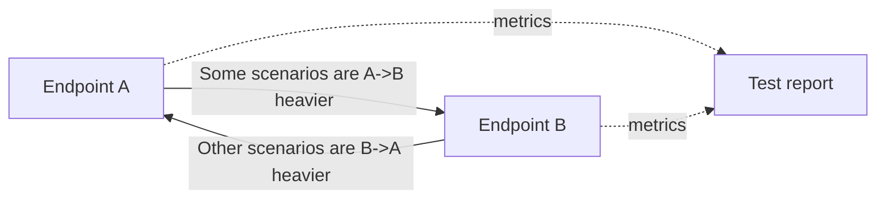
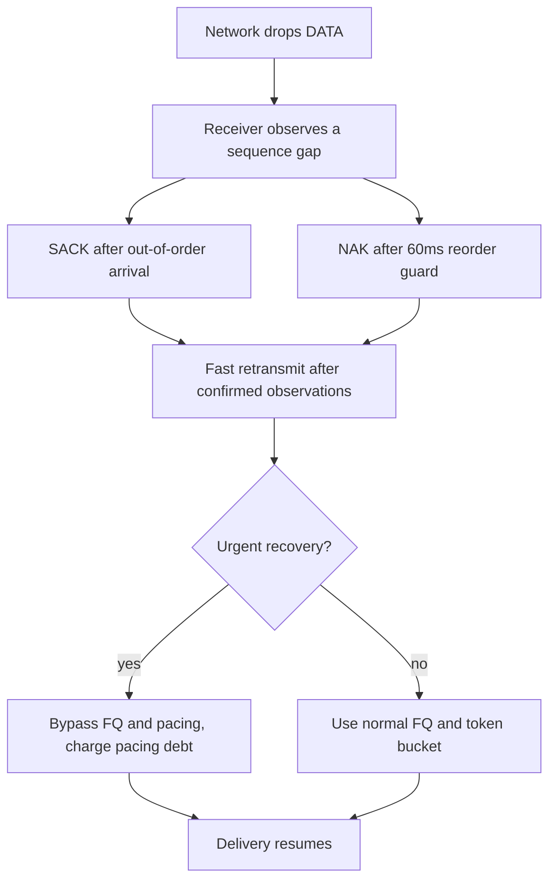

# UCP Performance And Reporting Guide

[中文](performance_CN.md) | [Documentation Index](index.md)

## Goals

UCP benchmark output must be auditable. It separates bottleneck capacity, path impairment, and protocol recovery so a high-loss scenario can show whether the protocol repaired data efficiently without claiming more bandwidth than the configured link can carry.

The report intentionally clamps payload throughput to `Target Mbps`. Local in-process scheduling can complete faster than a real NIC, but the reported value remains bounded by the simulator serialization budget.

## Report Columns

| Column | Meaning |
|---|---|
| `Throughput Mbps` | Simulator-observed payload throughput capped by `Target Mbps`. |
| `Target Mbps` | Configured bottleneck bandwidth. |
| `Util%` | `Throughput / Target * 100`, capped at 100%. |
| `Retrans%` | Sender retransmitted DATA packets divided by original DATA packets. |
| `Loss%` | Simulator-dropped DATA packets divided by DATA packets sent into the simulator. |
| `A->B ms` | Average one-way propagation delay from endpoint A to endpoint B. |
| `B->A ms` | Average one-way propagation delay from endpoint B to endpoint A. |
| `Avg/P95/P99/Jit ms` | RTT statistics and average adjacent-sample jitter. |
| `CWND` | Congestion window rendered with adaptive `B`/`KB`/`MB`/`GB` units. |
| `Current Mbps` | Current instantaneous BBR pacing rate. |
| `RWND` | Remote receive window rendered with adaptive units. |
| `Waste%` | Retransmitted DATA packets as a percentage of original DATA packets. |
| `Conv ms` | Estimated time until pacing reached the stable target band. |

## Validation Rules

`UcpPerformanceReport.ValidateReportFile()` enforces these constraints:

| Rule | Purpose |
|---|---|
| `Throughput Mbps <= Target Mbps * 1.01` | Rejects physically impossible benchmark reports. |
| `Retrans%` is between 0% and 100% | Ensures sender counters are valid. |
| Directional delay differs by 3-15ms when both directions are known | Covers realistic asymmetric routing without unbounded skew. |
| The complete report includes both forward-heavy and reverse-heavy routes | Prevents modeling every scenario with the same direction slower. |
| `Loss%` is independent from `Retrans%` | Keeps network drops separate from protocol repair overhead. |

## Scenario Matrix

| Scenario Type | Representative Scenarios | Coverage |
|---|---|---|
| Stable no-loss links | `NoLoss`, `Gigabit_Ideal`, `DataCenter`, `Benchmark10G` | Line rate, logical clock, low RTT, high bandwidth. |
| Random loss | `Lossy`, `Gigabit_Loss1`, `Gigabit_Loss5`, `100M_Loss*`, `1G_Loss3` | Loss/retransmission separation, SACK fast recovery. |
| Long fat pipes | `LongFatPipe`, `LongFat_100M`, `Satellite` | High BDP, large CWND, stable pacing. |
| Asymmetric routing | `AsymRoute`, `VpnTunnel`, `Enterprise` | Independent A->B and B->A delay models. |
| Weak mobile networks | `Weak4G`, `Mobile3G`, `Mobile4G`, `HighJitter` | High RTT, high jitter, mid-transfer outage, recovery speed. |
| Burst loss | `BurstLoss` | Consecutive gap repair without collapsing pacing. |

## Directional Route Model

Benchmarks do not assume the same direction is always slower. When a scenario does not explicitly configure forward and reverse delays, `RunLineRateBenchmarkAsync` generates a deterministic route model with a 3-15ms one-way difference. Explicit scenarios, such as `AsymRoute`, use fixed forward/backward delays.



## Loss And Retransmission

Packet loss is not an error by itself. A scenario is suspicious only when loss causes excessive retransmission overhead, stalls pacing, or fails payload integrity.



SACK is the first-line fast recovery path. Receiver NAK is intentionally more conservative because high-jitter routes can reorder packets for tens of milliseconds.

## Congestion Recovery Strategy

UCP uses BBR-style control and does not equate every loss event with congestion.

| Strategy | Current Value | Purpose |
|---|---|---|
| Fast-recovery pacing gain | `1.25` | Quickly refill holes after non-congestion loss. |
| Congestion reduction factor | `0.98` | Gently reduce only after congestion evidence. |
| Minimum loss CWND gain | `0.95` | Prevent temporary loss from punching the window too low. |
| CWND recovery step | `0.04` per ACK | Restore window after delivery resumes. |
| Urgent retransmit budget | `16` packets per RTT window | Allow near-dead recovery to bypass smoothing without unlimited bursts. |
| RTO retransmit budget | `4` packets per timer tick | Repair timeout gaps faster than one packet per tick. |

## Running And Acceptance

```powershell
dotnet build ".\Ucp.Tests\UcpTest.csproj"
dotnet test ".\Ucp.Tests\UcpTest.csproj" --no-build
dotnet run --project ".\Ucp.Tests\UcpTest.csproj" --no-build -- ".\Ucp.Tests\bin\Debug\net8.0\reports\test_report.txt"
```

Acceptance criteria:

| Item | Expected Result |
|---|---|
| Unit/integration tests | All tests pass; current suite has 52 tests. |
| Report validation | `ReportPrinter` prints no `[report-error]`. |
| Throughput | Never exceeds target bandwidth; low-loss high-bandwidth scenarios approach target. |
| Weak networks | Transfer completes, payload stays intact, and pacing recovers after loss/outage. |
| Documentation | README and `docs/` use the same report semantics. |
