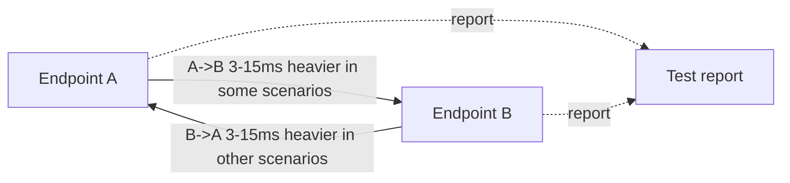
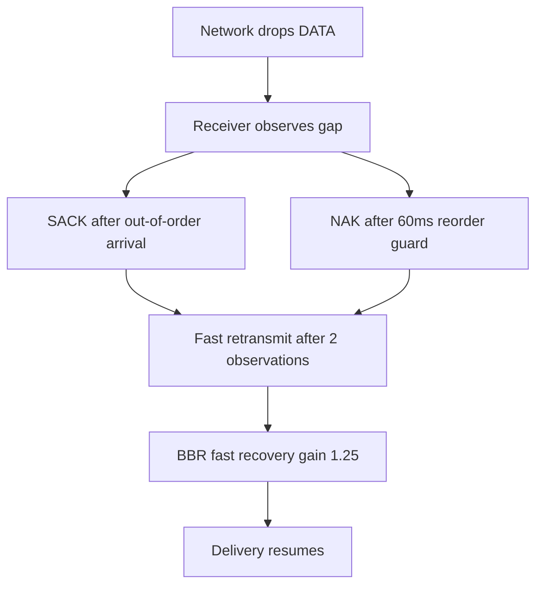

# UCP 性能与报告深度文档 / Performance And Reporting Guide

## 1. 目标 / Goals

UCP 的性能报告必须可信。它不能把本地线程调度造成的瞬时完成时间解释成超过链路目标的带宽，也不能把物理丢包率和协议重传率混成一个数字。当前实现把三个概念拆开：链路容量、网络损伤、协议恢复。

English: the benchmark report is designed to be auditable. It separates bottleneck capacity, network impairment, and protocol recovery so a high-loss scenario can still show whether UCP repaired data efficiently without pretending the path carried more than its configured line rate.

## 2. 报告字段 / Report Columns

| 字段 | 中文定义 | English Definition |
|---|---|---|
| `Throughput Mbps` | 仿真器观测 payload 吞吐，并按 `Target Mbps` 封顶。 | Payload throughput observed by the simulator, capped by `Target Mbps`. |
| `Target Mbps` | 场景配置的瓶颈带宽。 | Configured bottleneck bandwidth. |
| `Util%` | `Throughput / Target * 100`，最大 100%。 | `Throughput / Target * 100`, capped at 100%. |
| `Retrans%` | 发送端重传 DATA 包数 / 原始 DATA 包数。 | Sender retransmitted DATA packets divided by original DATA packets. |
| `Loss%` | 仿真器丢弃的 DATA 包数 / 发送到仿真器的 DATA 包数。 | Simulator-dropped DATA packets divided by DATA packets sent into the simulator. |
| `A->B ms` | A 到 B 的平均单向传播延迟。 | Average one-way propagation delay from A to B. |
| `B->A ms` | B 到 A 的平均单向传播延迟。 | Average one-way propagation delay from B to A. |
| `Avg/P95/P99/Jit ms` | RTT 样本统计和相邻 RTT 差的平均抖动。 | RTT statistics and average adjacent-sample jitter. |
| `CWND` | 拥塞窗口，自适应 B/KB/MB/GB 单位。 | Congestion window with adaptive byte units. |
| `Current Mbps` | BBR 当前瞬时 pacing rate。 | Current BBR instantaneous pacing rate. |
| `RWND` | 对端通告接收窗口，自适应 B/KB/MB/GB 单位。 | Remote receive window with adaptive byte units. |
| `Waste%` | 重传 DATA 包占原始 DATA 包比例，用于观察带宽浪费。 | Retransmitted DATA packets as a percentage of original DATA packets. |
| `Conv ms` | pacing 进入稳定目标带宽区间的估算时间。 | Estimated time until pacing reached the stable target band. |

## 3. 关键校验 / Validation Rules

报告校验器 `UcpPerformanceReport.ValidateReportFile()` 执行以下约束：

| 规则 | 原因 |
|---|---|
| `Throughput Mbps <= Target Mbps * 1.01` | 防止报告出现超过物理瓶颈的虚假带宽。 |
| `Retrans%` 在 0-100% 范围 | 保证发送端统计有效。 |
| 每个有方向延迟的场景必须有 3-15ms 的方向差 | 模拟真实动态路由，避免所有场景同向或完全对称。 |
| 全报告必须同时包含 A->B 更高和 B->A 更高的场景 | 覆盖 M247 类动态路由的去程高/回程高两种情况。 |
| `Loss%` 独立于 `Retrans%` | 丢包是网络事件，重传是恢复动作。 |

English: validation is intentionally strict where the report could otherwise mislead humans. Throughput cannot exceed the target; route direction must vary; loss and retransmission are independent columns.

## 4. 场景矩阵 / Scenario Matrix

| 场景类型 | 代表场景 | 覆盖点 |
|---|---|---|
| 无丢包稳定链路 | `NoLoss`, `Gigabit_Ideal`, `DataCenter`, `Benchmark10G` | 线速、逻辑时钟、低 RTT、高带宽。 |
| 随机丢包 | `Lossy`, `Gigabit_Loss1`, `Gigabit_Loss5`, `100M_Loss*`, `1G_Loss3` | Loss% 与 Retrans% 分离、SACK 快恢复。 |
| 长肥管 | `LongFatPipe`, `LongFat_100M`, `Satellite` | 高 BDP、较大 CWND、稳定 pacing。 |
| 路由不对称 | `AsymRoute`, `VpnTunnel`, `Enterprise` | A->B/B->A 延迟方向不同，验证 3-15ms 差距。 |
| 弱移动网络 | `Weak4G`, `Mobile3G`, `Mobile4G`, `HighJitter` | 高 RTT、高抖动、短 outage、恢复速度。 |
| 突发丢包 | `BurstLoss` | 连续缺口恢复和带宽不崩塌。 |

## 5. 方向延迟模型 / Directional Route Model

测试不会假设单向网络总是同一方向更慢。`RunLineRateBenchmarkAsync` 在未显式配置方向延迟时会给每个场景生成稳定的方向模型，并让差值落在 3-15ms 范围。部分场景显式指定方向，例如 `AsymRoute` 使用 25ms/15ms。

English: route asymmetry is first-class. The benchmark matrix includes both forward-heavy and reverse-heavy paths, matching real networks where return routing can differ from outbound routing.



## 6. 丢包和重传 / Loss And Retransmission

丢包不是错误。`Loss%` 是仿真器在网络层丢掉的 DATA 包比例；`Retrans%` 是发送端为了恢复这些缺口而实际发出的重传比例。二者可能接近，但不应该被认为相同。

English: packet loss is not an error by itself. The protocol should recover quickly. A scenario is suspicious only when loss creates excessive retransmission overhead, stalls pacing, or fails payload integrity.



## 7. 拥塞恢复策略 / Congestion Recovery Strategy

UCP 使用 BBR 风格控制，不把丢包直接等同拥塞。关键策略如下：

| 策略 | 当前值 | 目的 |
|---|---|---|
| 快恢复 pacing gain | `1.25` | 非拥塞丢包后快速补洞。 |
| 拥塞削减因子 | `0.98` | 只在确认拥塞后温和降速。 |
| 最低 loss CWND gain | `0.95` | 避免窗口被临时丢包打穿。 |
| CWND 恢复步长 | `0.04/ACK` | ACK 到达后更快恢复窗口。 |
| ProbeRTT 拥塞丢包阈值 | `5` | 避免随机丢包频繁进入 ProbeRTT。 |

English: the controller is recovery-biased. It reduces gently only when the path is congested, and it restores pacing/CWND quickly when delivery resumes.

## 8. 运行与验收 / Running And Acceptance

```powershell
.\run-tests.ps1
```

验收标准：

| 项目 | 期望 |
|---|---|
| 单元/集成测试 | `48/48` 通过 |
| 报告校验 | `ReportPrinter` 无 `[report-error]` |
| 吞吐 | 不超过目标带宽，低损耗高带宽场景接近目标 |
| 弱网 | 完成传输、保持 payload 完整、恢复后 pacing 接近目标 |
| 文档 | README 与 `docs/` 中指标口径一致 |

English: always run both the xUnit suite and the report printer. Passing tests alone is not enough if the report is misleading or fails validation.
