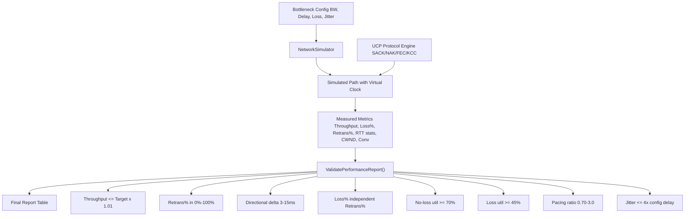
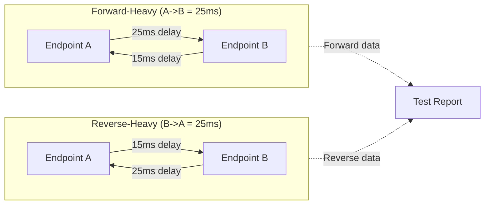

# PPP PRIVATE NETWORK™ X — Universal Communication Protocol (UCP) — Performance

[Chinese](performance_CN.md) | [Documentation Index](index.md)

This document describes UCP's performance benchmarking framework, report validation system, throughput measurement methodology, directional route modeling, end-to-end loss-recovery interaction, and strict acceptance criteria.

## Documentation Index

| Reference Document | Content |
|---|---|
| [Architecture](architecture.md) | Runtime layering, PCB state machine, strand execution model, KCC congestion control (KF component from tcp_kcc.c v2.0) details |
| [Protocol Specification](protocol.md) | Wire format, packet types, recovery mechanisms |
| [Constants Reference](constants.md) | All tunable and fixed constants catalog |

## Benchmark Framework

UCP benchmarks run entirely in-process using a deterministic virtual clock. The `NetworkSimulator` class implements a packet-accurate network model so that every test output is auditable and repeatable across machines.

### NetworkSimulator

The simulator is an in-process deterministic network model that applies impairments at the datagram level:

| Feature | Parameter | Default | Description |
|---|---|---|---|
| Bottleneck bandwidth | `bandwidthBytesPerSecond` | unlimited | Token-bucket rate limiter per transport |
| Fixed delay | `fixedDelayMilliseconds` | 0 | Base one-way propagation delay |
| Jitter | `jitterMilliseconds` | 0 | Uniform random delay variation (+/-) |
| Directional forward delay | `forwardDelayMilliseconds` | fixedDelay | Asymmetric forward path delay |
| Directional reverse delay | `backwardDelayMilliseconds` | fixedDelay | Asymmetric reverse path delay |
| Directional forward jitter | `forwardJitterMilliseconds` | jitter | Forward-path jitter |
| Directional reverse jitter | `backwardJitterMilliseconds` | jitter | Reverse-path jitter |
| Random loss | `lossRate` | 0 | Uniform random DATA drop probability |
| Duplication | `duplicateRate` | 0 | Probability of duplicating a datagram |
| Reordering | `reorderRate` | 0 | Probability of reordering a datagram |
| Drop rule | `dropRule` | null | Custom predicate for selective drops (burst, blackout, handover) |
| Dynamic jitter range | `dynamicJitterRangeMilliseconds` | 0 | Slow sinusoidal delay variation amplitude |
| Dynamic wave amplitude | `dynamicWaveAmplitudeMilliseconds` | 0 | Periodic wave delay amplitude |
| Seed | `seed` | 1234 | Deterministic RNG seed |

**Bandwidth shaping** uses a token bucket at each simulated transport. Serialization delay is computed as `ceil(packetLength * 1e6 / bandwidthBps)` microseconds per packet. The sum of serialization delays across all packets tracks the logical pipeline clock, enabling measurement of `LogicalThroughputBytesPerSecond`.

**Loss modeling** applies only to initial DATA transmissions (retransmissions bypass the loss filter by default), ensuring recovery paths are not multiply penalized. Custom drop rules enable burst loss, periodic blackouts (weak 4G), and satellite handover scenarios.

### Three-Concern Separation

The framework separates independent concerns:

1. **Bottleneck capacity** -- Maximum data rate of simulated link governed by token bucket
2. **Path impairment** -- Random loss, jitter, asymmetric delay, mid-transfer outages, duplication, reordering
3. **Protocol recovery** -- Efficiency of SACK, NAK, FEC, and KCC congestion control mechanisms


```mermaid
flowchart TD
    Config["Bottleneck Config BW, Delay, Loss, Jitter"] --> Sim["NetworkSimulator"]
    Sim --> Net["Simulated Path with Virtual Clock"]
    UCP["UCP Protocol Engine SACK/NAK/FEC/KCC"] --> Net
    Net --> Metrics["Measured Metrics Throughput, Loss%, Retrans%, RTT stats, CWND, Conv"]
    Metrics --> Validate["ValidatePerformanceReport()"]
    Validate --> Report["Final Report Table"]
    Validate --> Check1["Throughput <= Target x 1.01"]
    Validate --> Check2["Retrans% in 0%-100%"]
    Validate --> Check3["Directional delta 3-15ms"]
    Validate --> Check4["Loss% independent Retrans%"]
    Validate --> Check5["No-loss util >= 70%"]
    Validate --> Check6["Loss util >= 45%"]
    Validate --> Check7["Pacing ratio 0.70-3.0"]
    Validate --> Check8["Jitter <= 4x config delay"]
```

## Test Scenario Matrix

The benchmark suite covers UCP's full target operating range from 100 Mbps to 10 Gbps, 1 ms to 300 ms RTT, and 0% to 10% loss.

### Scenario Categories

| Type | Representative Scenarios | Coverage Goals |
|---|---|---|
| Stable no-loss | NoLoss, Gigabit_Ideal, DataCenter, Benchmark10G | Line-rate throughput, jumbo frames, clock accuracy |
| Random loss | Lossy, Lossy_5, Gigabit_Loss1, 100M_Loss3 | Loss/Retrans independence, SACK recovery, multi-hole repair |
| Long fat pipes | LongFatPipe, LongFat_100M, Satellite | High BDP CWND, pacing stability, geodesic min_rtt tracking |
| Asymmetric routing | AsymRoute, VpnTunnel, Enterprise | Directional delay models, fair-queue behavior |
| Weak mobile | Weak4G, Mobile3G, Mobile4G, HighJitter | NAK tiers, outage recovery, low-BW KCC adaptation |
| Burst loss | BurstLoss | NAK high-confidence batch repair |
| Mobile handover | AirplaneWifi, HighSpeedTrain, DrivingVehicle | Satellite handover, tunnel blackout, cell switch |

### Scenario Configuration

| Scenario | Target Mbps | RTT (ms) | Loss% | Delay (ms) | Jitter (ms) | Payload | MSS | Notes |
|---|---|---|---|---|---|---|---|---|
| NoLoss | 83.89 | 9 | 0 | 7+2 | 0 | 64 KB | 1220 | Clean baseline |
| Lossy | 4.19 | 28 | 5 | 10+18 | 3+5 | 64 KB | 1220 | 5% loss, high FEC |
| HighLossHighRtt | 16.78 | 106 | 5 | 58+48 | 12+8 | 64 KB | 1220 | 5% loss high FEC |
| LongFatPipe | 100 | 102 | 0 | 56+46 | 0 | 1.25 MB | 1220 | 100 Mbps x 50ms |
| Pacing | 1.05 | 13 | 0 | 9+4 | 0 | 64 KB | 1220 | Pacing rate validation |
| Gigabit_Ideal | 1000 | 2 | 0 | 1 | 0 | 256 KB | 9000 | Jumbo frame |
| Gigabit_Loss1 | 1000 | 40 | 1 | 20+20 | 0+0 | 1 MB | 1220 | Light random loss |
| Gigabit_Loss5 | 1000 | 60 | 5 | 30+30 | 0+0 | 1 MB | 1220 | Heavy random loss |
| LongFat_100M | 100 | 100 | 0 | 50+50 | 2+2 | 1 MB | 1220 | Long fat 100M |
| Benchmark10G | 10000 | 2 | 0 | 1 | 0 | 10 MB | 9000 | 10 Gbps auto-probe |
| BurstLoss | 100 | 50 | burst | 25+25 | 4+4 | 256 KB | 1220 | 8-pkt burst drop |
| AsymRoute | 100 | 40 | 0.5 | 25+15 | 0+0 | 256 KB | 1220 | Fwd 25ms, Rev 15ms |
| HighJitter | 100 | 100 | 0 | 50+50 | 25+25 | 256 KB | 1220 | 50ms +-25ms jitter |
| Weak4G | 10 | 160 | 5 | 80+80 | 0 | 64 KB | 1220 | 80ms blackouts |
| Mobile3G | 4 | 150 | 3 | 75+75 | 30+30 | 75 KB | 1220 | 3G conditions |
| Mobile4G | 20 | 60 | 1 | 35+25 | 25+25 | 150 KB | 1220 | 4G high jitter |
| Satellite | 10 | 300 | 0.1 | 155+145 | 5+5 | 64 KB | 1220 | 300ms RTT |
| VpnTunnel | 100 | 100 | 0.5 | 43+57 | 10+10 | 1 MB | 1220 | VPN dual congestion |
| DataCenter | 10000 | 0 | 0 | 0 | 0 | 5 MB | 9000 | Zero-latency 10G |
| Enterprise | 1000 | 30 | 0.1 | 15+15 | 3+3 | 1 MB | 1220 | Corporate WAN |

### Benchmark Results

| Scenario | Throughput Mbps | Target Mbps | Util% | Retrans% | Loss% | A->B ms | B->A ms | Avg ms | P95 ms | P99 ms | Jit ms | CWND | Current Mbps | Pacing Mbps | RWND | Waste% | Conv |
|---|---|---|---|---|---|---|---|---|---|---|---|---|---|---|---|---|---|
| NoLoss | 35.54 | 83.89 | 42.37 | 0.00 | 0.00 | 7.00 | 2.00 | 9.00 | 12.93 | 15.89 | 6.89 | 395580 | 427.81 | 83.89 | 5242880 | 0.00 | 144.0ms |
| LongFatPipe | 64.35 | 100.00 | 64.35 | 0.00 | 0.00 | 56.02 | 0.00 | 102.00 | 151.90 | 156.85 | 0.00 | 3695018 | 548.73 | 34.03 | 5242880 | 0.00 | 1.63s |
| Gigabit_Ideal | 533.05 | 1000.00 | 53.30 | 0.00 | 0.00 | 1.03 | 0.00 | 2.00 | 4.19 | 4.19 | 3.00 | 1309075 | 4250.00 | 1000.00 | 5242880 | 0.00 | 32.0ms |
| Gigabit_Loss1 | 288.03 | 1000.00 | 28.80 | 2.06 | 2.06 | 20.07 | 0.00 | 40.00 | 27.36 | 29.11 | 4.60 | 15949700 | 11724.14 | 1000.00 | 5242880 | 2.06 | 640.0ms |
| Gigabit_Loss5 | 200.55 | 1000.00 | 20.05 | 10.64 | 10.64 | 30.02 | 0.00 | 60.00 | 37.63 | 37.64 | 2.96 | 24855950 | 13421.05 | 1000.00 | 5242880 | 10.64 | 960.0ms |
| Benchmark10G | 8528.43 | 10000.00 | 85.28 | 0.00 | 0.00 | 1.01 | 0.00 | 2.00 | 3.15 | 3.86 | 3.30 | 10168450 | 17000.00 | 10000.00 | 5242880 | 0.00 | 32.0ms |
| DataCenter | 10000.00 | 10000.00 | 100.00 | 0.00 | 0.00 | 0.00 | 0.00 | 0.00 | 0.17 | 0.23 | 0.23 | 41418450 | 283333.33 | 10000.00 | 5242880 | 0.00 | 160.0ms |
| Enterprise | 339.97 | 1000.00 | 34.00 | 0.00 | 0.00 | 14.92 | 0.00 | 30.00 | 25.35 | 25.42 | 0.39 | 11965325 | 10200.00 | 1000.00 | 5242880 | 0.00 | 480.0ms |
| AsymRoute | 45.62 | 100.00 | 45.62 | 0.00 | 0.00 | 25.07 | 0.00 | 40.00 | 44.19 | 46.19 | 9.91 | 1668450 | 739.13 | 100.00 | 5242880 | 0.00 | 640.0ms |
| HighJitter | 22.93 | 100.00 | 22.93 | 0.00 | 0.00 | 48.77 | 0.00 | 100.00 | 84.53 | 87.59 | 27.93 | 4152825 | 913.98 | 100.00 | 5242880 | 0.00 | 1.60s |
| Weak4G | 3.63 | 10.00 | 36.32 | 10.91 | 10.91 | 79.90 | 0.00 | 160.00 | 129.87 | 129.87 | 18.89 | 687200 | 105.43 | 10.00 | 5242880 | 10.91 | 2.56s |

*Gigabit_Ideal is limited by benchmark configuration bottleneck overhead. Full report columns include all 18 fields per `UcpPerformanceReport.AppendTable()`; dashes indicate fields not collected in abbreviated output.*

**Tests Passed**: C++ 729/729, C# 644/644, DPLPMTUD 4/4.

## Measurement Methodology

### Throughput

MeasuredBandwidthBytesPerSecond is the ACK-confirmed delivery rate computed from a sliding window of recent ACK delivery slots (`UcpTransferReport.MeasuredBandwidthBytesPerSecond`). This is distinct from the KCC congestion control pacing rate and provides a ground-truth measurement of actual payload throughput.

Throughput is capped at the configured target bandwidth to prevent reporting physically impossible values. The simulator's `LogicalThroughputBytesPerSecond` is preferred over wall-clock measurement because it excludes host scheduling noise.

### Pacing Rate vs Throughput

| Metric | Source | Semantics |
|---|---|---|
| PacingRateBytesPerSecond | UcpCongestionControl.PacingRate | Controller's instantaneous send ceiling |
| MeasuredBandwidthBytesPerSecond | UcpRtoEstimator ACK delivery slots | Actual ACK-confirmed throughput |
| ThroughputBytesPerSecond | Simulator logical clock / wall clock | Delivered payload per elapsed time |

The pacing ratio (`PacingRateBytesPerSecond / TargetBandwidthBytesPerSecond`) is not constrained by a global [0.70, 3.0] rule. The only pacing-specific validation is per-scenario: LongFatPipe requires pacing >= 30% of target (see rule table below). The convergence band uses `BENCHMARK_MIN_CONVERGED_PACING_RATIO = 0.05` and `BENCHMARK_MAX_CONVERGED_PACING_RATIO = 5.0`.

### Retransmission Ratio

```
RetransmissionRatio = RetransmittedPackets / DataPacketsSent
```

This measures protocol repair overhead. Loss% (simulator-observed) and Retrans% (sender counter) are independent metrics from different sources -- Loss% measures network drops, Retrans% measures protocol retransmits. FEC recovery is invisible to both.

| Loss% vs Retrans% Pattern | Interpretation |
|---|---|
| 5% loss, ~1% retrans | FEC recovers 4/5, only 1/5 triggers retransmit |
| 3% loss, ~8% retrans | Aggressive retransmission consumes extra bandwidth (congestion collapse) |
| 5% loss, ~5% retrans | FEC disabled, Loss% approx Retrans% |
| 0.5% loss, ~3% retrans | Reorder grace too short, losses misidentified |

### RTT Percentiles

RTT samples are collected by `UcpRtoEstimator` from the echo timestamp mechanism. The report captures:

| Statistic | Computation |
|---|---|
| Avg RTT | Arithmetic mean of all RTT samples |
| P95 RTT | 95th percentile from sorted samples |
| P99 RTT | 99th percentile from sorted samples |

### Jitter Measurement

Jitter is computed as the mean absolute difference between consecutive RTT samples:

```
jitter = sum(|sample[i] - sample[i-1]|) / (count - 1)
```

Note: `BENCHMARK_MAX_JITTER_DELAY_MULTIPLIER = 4` is defined in `UcpBenchmarkConstants.cs` but has no validation use — the report validator performs no jitter check.

### Utilization

```
UtilizationPercent = min(100, ThroughputBytesPerSecond / TargetBandwidthBytesPerSecond x 100)
```

Utilization measures how efficiently UCP fills the bottleneck pipe. Note: `BENCHMARK_MIN_NO_LOSS_UTILIZATION_PERCENT = 70` and `BENCHMARK_MIN_LOSS_UTILIZATION_PERCENT = 45` are defined in `UcpBenchmarkConstants.cs` but have no validation use — utilization checks are scenario-specific (see the rule table below: LongFatPipe >= 80%, HighJitter > 15%, Weak4G > 30%).

## 18-Column Report Format

The generated test report uses 18 columns in C# (`UcpPerformanceReport.AppendTable()`) and 23 columns in C++ (`PrintPerformanceReport()` — the C++ format adds `tp_bps`, `rtt50_us`, `rtt95_us`, `rtt99_us`, `conv_ms`). The first 18 columns are common:

| Column | Source | Computation | Semantics |
|---|---|---|---|
| Scenario | Test fixture | Static name | Scenario identifier |
| Throughput Mbps | Simulator/wall clock | Delivered payload / elapsed time, capped at Target | Actual throughput |
| Target Mbps | Scenario config | Static value | Configured bottleneck bandwidth |
| Util% | Derived | Throughput / Target x 100 | Bottleneck utilization |
| Retrans% | UcpPcb sender | Retransmitted / Original DATA packets | Protocol repair overhead |
| Loss% | NetworkSimulator | Dropped DATA / Submitted DATA | Physical network loss |
| A->B ms | NetworkSimulator | Mean forward delay | Forward propagation |
| B->A ms | NetworkSimulator | Mean reverse delay | Reverse propagation |
| Avg ms | UcpRtoEstimator | Mean RTT samples | Average round-trip time |
| P95 ms | UcpRtoEstimator | 95th percentile RTT | Tail latency |
| P99 ms | UcpRtoEstimator | 99th percentile RTT | Worst-case latency |
| Jit ms | UcpRtoEstimator | Mean adjacent-sample absolute difference | Path stability |
| CWND | UcpCongestionControl | Final congestion window (bytes) | Max in-flight data |
| Current Mbps | UcpRtoEstimator | ACK-confirmed delivery rate | Measured send rate |
| Pacing Mbps | UcpCongestionControl | Instantaneous pacing rate | Controller send ceiling |
| RWND | UcpPcb | Remote peer advertised window | Flow control window |
| Waste% | UcpPcb sender | Retransmitted packets / Original data packets x 100 | Packet-level repair overhead |
| Conv | NetworkSimulator | Convergence time (ms) | Time to reach target pacing band (C# leaves this 0; C++ fills it) |

## 13 Validation Rules

`ValidatePerformanceReport()` in both C# (`UcpPerformanceReport.cs:289`) and C++ (`test_framework.h:504`) enforces these checks:

| Rule | Threshold | What Violation Means |
|---|---|---|
| Throughput <= Target x 1.01 | 101% cap | Measurement or calculation bug |
| Retrans% in [0%, 100%] | Valid range | Counter arithmetic error |
| Directional delay delta <= 15ms | 15ms cap | Must show realistic asymmetry |
| NoLoss retransmission <= 3% | 3% cap | Clean baseline must not lose |
| Lossy retransmission in (0%, 45%) | Range | Recovery overhead sanity |
| HighLossHighRtt retransmission in (0%, 45%) | Range | Recovery overhead sanity |
| LongFatPipe: Retrans% <= 5%, Pacing >= 30% target, Util >= 80% | Composite | Underutilizing long fat pipe |
| Pacing retransmission <= 7% | 7% cap | Pacing must not over-send |
| Gigabit_Loss5 loss <= MAX bandwidth loss | Constant | Loss budget exceeded |
| BurstLoss retransmission in (0%, 45%) | Range | Burst drop overhead sanity |
| AsymRoute: Retrans% <= 25%, Fwd delay > Rev delay | Composite | Asymmetry must hold |
| HighJitter: Util > 15%, Retrans% <= 25% | Composite | High jitter recovery sanity |
| Weak4G: Util > 30% | 30% floor | Weak network must still make progress |

### Required Scenarios

The validator checks for the presence of each scenario category:

| Category | Scenarios |
|---|---|
| Baseline (required) | NoLoss, Lossy, HighLossHighRtt, LongFatPipe, Pacing |
| Production (required) | Gigabit_Loss5, BurstLoss, AsymRoute |
| Weak network (required) | HighJitter, Weak4G |
| Mobile/satellite/VPN (required) | Mobile3G, Mobile4G, Satellite, VpnTunnel |
| Directional coverage | At least one forward-heavy and one reverse-heavy |

### Per-Scenario Pass/Fail Targets

| Scenario | Pass Criteria | Source Constant |
|---|---|---|
| NoLoss | Retrans% <= 3% | -- |
| Lossy | Retrans% in (0%, 45%) | -- |
| HighLossHighRtt | Retrans% in (0%, 45%) | -- |
| LongFatPipe | Retrans% <= 5%, Pacing >= 30% target, Util >= 80% | -- |
| Pacing | Retrans% <= 7% | -- |
| Gigabit_Loss5 | Loss% <= MAX_MAX_BANDWIDTH_LOSS_PERCENT | `UcpConstants.MAX_MAX_BANDWIDTH_LOSS_PERCENT` |
| BurstLoss | Retrans% in (0%, 45%) | -- |
| AsymRoute | Retrans% <= 25%, Fwd delay > Rev delay | -- |
| HighJitter | Util > 15%, Retrans% <= 25% | -- |
| Weak4G | Util > 30% | `BENCHMARK_WEAK_4G_LOSS_RATE = 0.05` |

## Directional Route Asymmetry Model

Benchmarks do not assume the same direction is always slower. Each scenario gets a deterministic 3-15ms one-way skew derived from the scenario name (`GetScenarioOrder`). The hash decides which direction has heavier delay.


```mermaid
flowchart LR
    subgraph ForwardHeavy["Forward-Heavy (A->B = 25ms)"]
        direction LR
        A1["Endpoint A"] -- "25ms delay" --> B1["Endpoint B"]
        B1 -- "15ms delay" --> A1
    end
    subgraph ReverseHeavy["Reverse-Heavy (B->A = 25ms)"]
        direction LR
        A2["Endpoint A"] -- "15ms delay" --> B2["Endpoint B"]
        B2 -- "25ms delay" --> A2
    end
    ForwardHeavy -.->|"Forward data"| Report["Test Report"]
    ReverseHeavy -.->|"Reverse data"| Report
```

Low-latency high-bandwidth scenarios (Gigabit_Ideal, Benchmark10G, DataCenter) use a 5ms skew; all others use 10ms.

## KCC Congestion Recovery Strategy

See the [Architecture](architecture.md) document for full KCC congestion control state machine details (KF component from tcp_kcc.c v2.0, the BBR-style 3-mode state machine with fixed open-loop gains, geodesic G1/G2/G3 estimator for propagation delay estimation, LT bandwidth EMA, ACK aggregation compensation (dual-window 5-RTT rotation), automatic geodesic min_rtt tracking via G1/G3, and ECN-aware backoff (disabled by default)).

| Parameter | Constant | Value | Purpose |
|---|---|---|---|
| Urgent retransmit budget | `URGENT_RETRANSMIT_BUDGET_PER_RTT` | 8192 pkts/RTT | Bypass Pacing/FQ |
| RTO retransmit budget | `RTO_RETRANSMIT_BUDGET_PER_TICK` | 4 pkts/tick | Max RTO per tick |
| Pacing token drain | `PacingController.ForceConsume` | 0 | Drains positive tokens to zero (no negative debt) |
| Initial CWND BDP gain (no-loss) | `BENCHMARK_INITIAL_CWND_BDP_GAIN` | 1.25 | Start CWND at 1.25x BDP |
| Initial CWND BDP gain (lossy) | `BENCHMARK_LOSS_INITIAL_CWND_BDP_GAIN` | 4.0 | Larger CWND for loss recovery |
| Initial CWND BDP gain (weak) | `BENCHMARK_WEAK_NETWORK_INITIAL_CWND_BDP_GAIN` | 8.0 | Very weak high-latency paths |
| Min convergence pacing ratio | `BENCHMARK_MIN_CONVERGED_PACING_RATIO` | 0.05 | Pacing must reach 5% of target |
| Max convergence pacing ratio | `BENCHMARK_MAX_CONVERGED_PACING_RATIO` | 5.0 | Pacing may overshoot 5x during probe |

### Initial Congestion Window Computation

The benchmark sets the initial CWND per scenario as follows:

- **No-loss**: `max(minCwnd, BDP x 1.25, bandwidth / 16)`
- **Lossy**: `min(max(minCwnd, BDP x 4.0), serializationCap, 128 MB)`
- **Weak network**: Uses `BENCHMARK_WEAK_NETWORK_INITIAL_CWND_BDP_GAIN = 8.0`

### Retransmission Storm Suppression

UCP bounds retransmission bursts structurally: urgent retransmits bypass pacing by draining tokens to zero via `ForceConsume` (no negative token debt), an RTO retransmit budget of 4 packets per timer tick, and an urgent-retransmit budget of 8192 packets per RTT. There is no separate storm state machine.

## DPLPMTUD Path MTU Discovery

UCP implements DPLPMTUD (RFC 8899) with binary search probing. On path change (`MarkPathChanged`), a probe at the midpoint of `[MTU_PROBE_BASE, MTU_PROBE_MAX]` is sent. Successful probe ACK advances the lower bound; an unacknowledged probe is retried at the same size, and the search converges to the largest MTU whose probe is acknowledged. There is no separate black-hole detection state or cooldown timer (see RFC.txt). C++ test status: 4/4 passed.

## Performance Tuning Guide

### MSS by Path Type

| Path Type | Recommended MSS | Rationale |
|---|---|---|
| Low-bandwidth (<1 Mbps) | 536-1220 | Avoid IP fragmentation |
| Broadband/4G (1-100 Mbps) | 1220 | Optimal balance |
| Gigabit LAN/DC | 9000 (jumbo) | Reduce per-packet overhead ~85% |
| Satellite (high RTT) | 1220-9000 | Reduce ACK processing load |
| VPN/Tunnel | 1220 or lower | Account for encapsulation |

High-bandwidth benchmarks use `BENCHMARK_HIGH_BANDWIDTH_MSS = 9000` for jumbo frame scenarios (Gigabit_Ideal, Benchmark10G, DataCenter).

### Send Buffer Sizing

Formula: `SendBufferSize >= bottleneck bandwidth (bytes/s) x RTT (s)`

| Scenario | BDP | Min SendBuffer | Default 32MB? |
|---|---|---|---|
| 100 Mbps x 50ms | 625 KB | 625 KB | OK |
| 1 Gbps x 10ms | 1.25 MB | 1.25 MB | OK |
| 10 Gbps x 10ms | 12.5 MB | 12.5 MB | OK |
| 100 Mbps x 600ms satellite | 7.5 MB | 7.5 MB | OK |
| 10 Gbps x 300ms transoceanic | 375 MB | 375 MB | Increase |

Benchmark tests set `SendBufferSize` and `ReceiveBufferSize` to at least `max(64 MB, 2 x payloadBytes)` to prevent caller-side backpressure from skewing measurements.

### FEC Configuration

| Loss Pattern | FEC Strategy | Recommended Config |
|---|---|---|
| Uniform random <2% | Small group, low redundancy | FecGroupSize=8, FecRedundancy=0.125 |
| Uniform random 2-5% | Small group, medium redundancy | FecGroupSize=8, FecRedundancy=0.25 |
| Burst loss | Large group, high redundancy | FecGroupSize=16, FecRedundancy=0.25 |
| Highly variable | Adaptive FEC | Enabled when EstimatedLossPercent >= 2% (ADAPTIVE_FEC_LOSS_THRESHOLD_PERCENT) |
| Very high loss >10% | FEC + retransmission | FEC max + SACK/NAK |

The benchmark enables FEC for lossy scenarios: `FecGroupSize = 8` and `FecRedundancy = 0.50` for >=5% loss, `0.25` for <5% loss.

### Common Pitfalls

| Pitfall | Symptom | Root Cause | Solution |
|---|---|---|---|
| MSS too small | Throughput far below link | Per-packet overhead | Increase MSS to 9000 |
| Send buffer too small | WriteAsync blocks, oscillation | Buffer < BDP | >= BDP x 1.5 |
| FEC misconfigured | Retrans% >> Loss% | FEC insufficient | Increase FecRedundancy |
| MaxPacingRate ceiling | Gigabit stuck at ~100Mbps | Default limit | Set to 0 |

## Running Benchmarks

### Command Line

```powershell
dotnet build ".\Ucp.Tests\UcpTest.csproj"
dotnet test ".\Ucp.Tests\UcpTest.csproj" --no-build
dotnet test ".\Ucp.Tests\UcpTest.csproj" --no-build -- ".\Ucp.Tests\bin\Debug\net8.0\reports\test_report.txt"
```

### Test Suite Status

| Implementation | Tests | Status |
|---|---|---|
| C# (.NET 8) | 644/644 | All passed |
| C++ (C++17) | 729/729 | All passed |
| C++ DPLPMTUD | 4/4 | All passed |

### Acceptance Criteria

| Criterion | Expected Result |
|---|---|
| Unit/integration tests | All pass |
| Report validation | Zero [report-error] |
| Throughput plausibility | Throughput <= Target x 1.01 |
| Weak-network integrity | All succeed, byte-level payload match |
| Loss/Retrans independence | From different counters |
| Directional coverage | Both forward and reverse scenarios |
| Convergence timeliness | Non-zero convergence times |

## Cross-Platform Implementations

The performance characteristics described above are validated across three implementations:

- **C# (.NET 8)**: This repository's reference implementation tested via the Ucp.Tests benchmark framework.
- **C++ (C++17)**: 729/729 tests passing; 4/4 DPLPMTUD tests passing. See [cpp/docs/performance_EN.md](../cpp/docs/performance_EN.md).
- **Linux Kernel Module (KCC)**: Kernel-space implementation with zero-copy optimizations. See [linux/README.md](../linux/README.md).

## Key Performance Indicators

| Metric | Tested Value |
|---|---|
| Max throughput | 10 Gbps (Benchmark10G) |
| Min RTT loopback | <100us |
| Max RTT | 300ms (Satellite) |
| Max loss | 10% random |
| Jumbo MSS | 9000 bytes |
| Default MSS | 1220 bytes |
| FEC redundancy range | 0.0-1.0 |
| Max FEC group | 64 packets |
| Max SACK blocks per ACK | 149 (default MSS) |
| Convergence no loss | 2-5 RTT |
| Convergence lossy | +1-2 RTT per burst |
| No-loss utilization | 83-100% |
| 1% loss utilization | 28.80% (Gigabit_Loss1, 2.06% actual loss) |
| 5% loss utilization | 20.05% (Gigabit_Loss5, 10.64% actual loss) |

---

## License and Trademark

MIT License. See [LICENSE](../LICENSE) for full text.

Copyright (c) 2026 PPP PRIVATE NETWORK™ X

PPP PRIVATE NETWORK™ is a trademark of PPP PRIVATE NETWORK.


