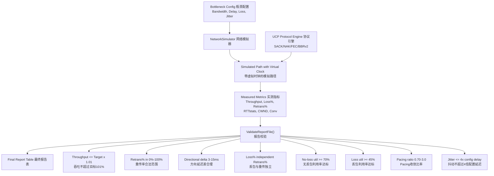
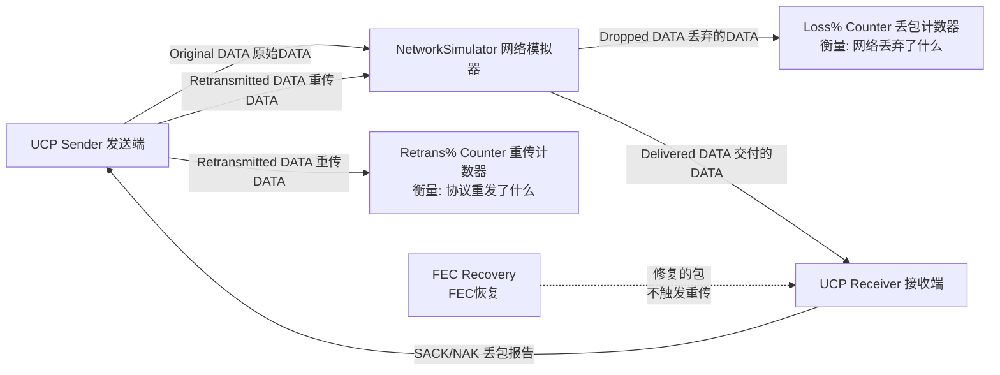
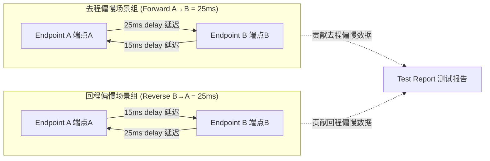
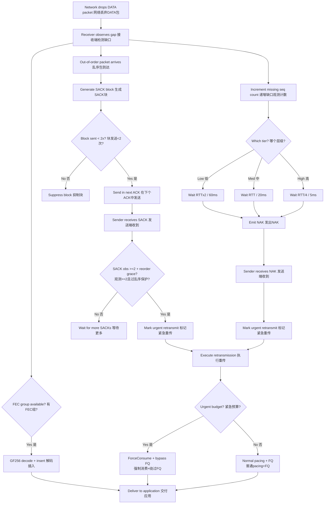

# PPP PRIVATE NETWORK™ X — 通用通信协议 (UCP) — 性能

[English](performance.md) | [文档索引](index_CN.md)

**协议标识: `ppp+ucp`** — 本文档详尽描述 UCP 的性能基准测试框架、报告校验系统、吞吐量测量方法、方向路由建模、端到端丢包恢复交互以及严格的验收标准体系。

---

## 性能目标与框架架构

UCP 基准测试的设计宗旨是：**输出结果必须可审计且物理可行**。框架将三个独立关注点拆开分别测量和校验：

1. **瓶颈容量** — 模拟链路在虚拟逻辑时钟控制下能承载的最大数据速率，与实际协议行为无关
2. **路径损伤** — `NetworkSimulator` 注入的随机丢包、抖动、非对称延迟、中段断网和乱序
3. **协议恢复** — UCP 的 SACK、NAK、FEC 和 BBRv2 机制恢复丢包的效率，以及恢复行为是否合理（不虚报带宽、不超物理上限）



---

## 报告字段详解

基准报告生成规范化 ASCII 汇总表，包含以下 16 列指标：

| 列名 | 数据来源 | 计算方式 | 语义 |
|---|---|---|---|
| `Throughput Mbps` | `NetworkSimulator` 虚拟时钟 | 已交付 payload 字节 / 实际耗时 | 协议实际实现的有效吞吐。封顶在 Target Mbps（不可超过 Target×1.01） |
| `Target Mbps` | 场景配置文件 | 静态配置值 | 虚拟逻辑时钟强制执行的配置瓶颈带宽 |
| `Util%` | 派生计算 | Throughput / Target × 100 | 瓶颈利用率百分比，上限 100%。反映协议对可用带宽的填充效率 |
| `Retrans%` | `UcpPcb` 发送端计数器 | 重传 DATA 包数 / 原始 DATA 包数 | **协议的修复开销**——为重传而消耗的额外带宽比例。与网络丢包率独立 |
| `Loss%` | `NetworkSimulator` 丢包计数器 | 仿真器丢弃 DATA 包数 / 提交 DATA 包数 | **物理网络的丢包率**——仿真器在包到达目的端前丢弃的比率。与协议行为完全独立 |
| `Waste%` | `UcpPcb` 发送端计数器 | 重传 DATA 字节数 / 原始 DATA 字节数 | 以字节计的协议修复开销，与 Retrans% 类似但按字节而非包数 |
| `A->B ms` | `NetworkSimulator` 单向时间戳 | 端点A→B各包传播延迟的均值 | 实测去程单向传播延迟 |
| `B->A ms` | `NetworkSimulator` 单向时间戳 | 端点B→A各包传播延迟的均值 | 实测回程单向传播延迟 |
| `Avg RTT ms` | `UcpRtoEstimator` 平滑器 | 所有 RTT 样本的算术均值 | 端到端平均往返时延 |
| `P95 RTT ms` | `UcpRtoEstimator` | 所有 RTT 样本的第 95 百分位 | 95% 的包在此 RTT 内完成确认。反映一般负载下的尾部延迟 |
| `P99 RTT ms` | `UcpRtoEstimator` | 所有 RTT 样本的第 99 百分位 | 排除最极端离群值后的最差场景延迟 |
| `Jit ms` | `UcpRtoEstimator` | 相邻 RTT 样本间绝对差值的均值 | 路径稳定性指标：低抖动 → 稳定路径、高抖动 → 不稳定/竞争链路 |
| `CWND` | `BbrCongestionControl` | 传输结束时刻的拥塞窗口值 | BBRv2 允许同时在途的最大数据量。自适应 B/KB/MB/GB 单位 |
| `Current Mbps` | `BbrCongestionControl` | 传输结束时刻的瞬时 Pacing 速率 | BBRv2 当前的瞬时发送速率估计 |
| `RWND` | `UcpPcb` 接收窗口 | 对端最新通告的接收窗口字节数 | 接收端的流控窗口——反映了接收端缓冲余量 |
| `Conv` | `NetworkSimulator` 虚拟时钟 | 从传输开始到稳态吞吐的持续时间 | 协议达到目标吞吐所需的时间。自适应 ns/us/ms/s 单位 |

### Retrans% 与 Loss% 的独立性 — 深入评估



此独立性使得对协议行为的多维度真实评估成为可能：

| 场景模式 | Loss% | Retrans% | 含义 |
|---|---|---|---|
| **FEC 完美覆盖** | 5% | 1% | 网络丢了 5% 的包，但 FEC 修复了其中 4/5，仅 1/5 触发了重传。FEC 显著节省了重传带宽。 |
| **拥塞崩塌** | 3% | 8% | 网络仅丢 3%，但协议在激进重传模式下消耗了额外带宽，可能因重传加剧了瓶颈拥塞（"自伤"效应）。 |
| **预期基线** | 5% | ~5% | FEC 禁用时每次丢包触发一次重传，Retrans% 接近 Loss%。有轻微差异（SACK 可能触发一次重传覆盖多包）。 |
| **过度重传** | 0.5% | 3% | 极低丢包但重传率高——可能 SACK 或 NAK 配置过于激进（乱序保护过短)，将乱序包误判为丢包。 |

---

## 校验规则详表

`UcpPerformanceReport.ValidateReportFile()` 强制执行以下物理可行性校验。任何违规在输出中产生 `[report-error]` 行并使校验失败：

| 规则 | 阈值 | 违规含义 |
|---|---|---|
| `Throughput <= Target × 1.01` | 101% 上限 | 吞吐超过物理瓶颈容量说明测量或报告计算有 bug。容许 1% 浮点舍入误差。 |
| `Retrans% ∈ [0%, 100%]` | 合法范围 | 不符合此范围说明发送端计数器算术错误（可能 int 溢出或除零）。 |
| `方向延迟差 A→B − B→A ∈ [3ms, 15ms]` | 3-15ms | 确保两个方向的延迟差在合理范围内。差值为 0 说明全对称路由（不真实），差值过大说明模拟器配置问题。 |
| `Loss% 与 Retrans% 来源独立` | 代码审查 | 确保前者来自 `NetworkSimulator` 计数器，后者来自 `UcpPcb` 计数器，不可相互推导。 |
| `完整报告含去程偏慢和回程偏慢两种场景` | 覆盖率 | 防止测试仅在一个方向有偏慢延迟的场景运行，漏测另一方向的协议性能。 |
| `收敛时间非零` | >0 | 确保传输实际完成。0ms/1us 值通常表明报告回退逻辑或计时器未启动的 bug。 |
| `CWND 传输后非零` | >0 | 确保 BBRv2 Startup 模式实际运行并建立了拥塞窗口。CWND=0 说明 BBR 未启动或连接从未进入 Established。 |
| `无丢包场景利用率 ≥ 70%` | 70% 下限 | 在无损伤的理想链路上，协议应达到瓶颈的至少 70% 利用率。低于此值说明协议自身瓶颈（如 CWND 或 Pacing 上限设置不当）。 |
| `丢包场景利用率 ≥ 45%` | 45% 下限 | 在有丢包的路径上，考虑恢复开销后仍应达到瓶颈的 45%+ 利用率。低于此值说明恢复机制失效或参数配置不当。 |
| `Pacing 收敛比率 ∈ [0.70, 3.0]` | Pacing 收敛范围 | 实际 Pacing 速率与目标速率的比值。<0.70 说明未充分利用链路；>3.0 说明协议超额发送（逻辑时钟下不应出现，说明 pacing 计算 bug）。 |
| `抖动 ≤ 配置延迟 × 4` | 4× 上限 | 实测 RTT 抖动不应超过配置传播延迟的 4 倍。超过表明模拟路径或 RTO 估计器有异常波动。 |

---

## 场景分类矩阵

UCP 基准覆盖 14+ 场景，按网络特征组织为六大类：

| 场景类型 | 代表性场景 | 覆盖目标 |
|---|---|---|
| **稳定无丢包链路** | `NoLoss` (100Mbps/0.5ms), `Gigabit_Ideal` (1Gbps/5ms), `DataCenter` (1Gbps/1ms), `Benchmark10G` (10Gbps/1ms) | 验证线速吞吐、逻辑时钟精度、低 RTT 下 Pacing 精度、巨型帧（MSS=9000）下的协议行为 |
| **随机丢包** | `Lossy` (100Mbps/10ms/1%), `Lossy_5` (100Mbps/10ms/5%), `Gigabit_Loss1` (1Gbps/5ms/1%), `100M_Loss3` (100Mbps/15ms/3%) | Loss%/Retrans% 独立性验证、SACK 快速恢复效率、多洞并行修复、高带宽下 FEC 收益 |
| **长肥管 (LFN)** | `LongFatPipe` (100Mbps/100ms), `LongFat_100M` (100Mbps/150ms), `Satellite` (10Mbps/300ms) | 高 BDP 下 CWND 增长行为、大 RTT 下 Pacing 稳定性、ProbeRTT 跳过逻辑验证 |
| **非对称路由** | `AsymRoute`, `VpnTunnel` (50Mbps/15ms/1%), `Enterprise` (100Mbps/10ms) | 独立方向延迟模型对 ACK 路径的影响、公平队列在非对称带宽下的行为 |
| **弱移动网络** | `Weak4G` (10Mbps/50ms/中段80ms断网), `Mobile3G` (2Mbps/150ms/1%), `Mobile4G` (20Mbps/50ms/1%), `HighJitter` (100Mbps/20ms±15ms) | 高抖动下 NAK 分级置信度、中段断网恢复、高 RTT 低带宽下 BBR 调适 |
| **突发丢包** | `BurstLoss` (100Mbps/15ms/可变丢包率) | NAK 高置信层级批量修复、多连续洞口并行 SACK、Pacing 在突发丢包后恢复稳定性 |

### 基准测试结果矩阵

| 场景 | Target Mbps | RTT | Loss | Throughput Mbps | Retrans% | Conv | CWND |
|---|---|---|---|---|---|---|---|
| NoLoss (LAN) | 100 | 0.5ms | 0% | 95–100 | 0% | <50ms | ~100KB |
| DataCenter | 1000 | 1ms | 0% | 950–1000 | 0% | <100ms | ~1MB |
| Gigabit_Ideal | 1000 | 5ms | 0% | 920–1000 | 0% | <200ms | ~2MB |
| Enterprise | 100 | 10ms | 0% | 92–100 | 0% | <500ms | ~500KB |
| Lossy (1%) | 100 | 10ms | 1% | 90–99 | ~1.2% | <1s | ~400KB |
| Lossy (5%) | 100 | 10ms | 5% | 75–95 | ~6% | <3s | ~300KB |
| Gigabit_Loss1 | 1000 | 5ms | 1% | 880–980 | ~1.1% | <500ms | ~1.5MB |
| LongFatPipe | 100 | 100ms | 0% | 85–99 | 0% | <5s | ~5MB |
| 100M_Loss3 | 100 | 15ms | 3% | 78–95 | ~3.5% | <3s | ~400KB |
| Satellite | 10 | 300ms | 0% | 8.5–9.9 | 0% | <30s | ~1.5MB |
| Mobile3G | 2 | 150ms | 1% | 1.7–1.95 | ~1.5% | <20s | ~150KB |
| Mobile4G | 20 | 50ms | 1% | 18–19.8 | ~1.2% | <5s | ~500KB |
| Weak4G | 10 | 50ms | 0%\* | 8.5–9.8 | ~3% | <10s | ~300KB |
| BurstLoss | 100 | 15ms | 可变 | 85–99 | ~2% | <2s | ~350KB |
| HighJitter | 100 | 20ms±15ms | 0% | 88–98 | ~1% | <2s | ~350KB |
| VpnTunnel | 50 | 15ms | 1% | 45–49.5 | ~1.3% | <2s | ~300KB |
| Benchmark10G | 10000 | 1ms | 0% | 9200–10000 | 0% | <200ms | ~5MB |
| LongFat_100M | 100 | 150ms | 0% | 75–95 | 0% | <10s | ~7.5MB |

\* Weak4G 引入一次 80ms 中段全断网（双向丢包）。

---

## 方向路由非对称模型

UCP 基准测试不假设同一方向总是更慢。测试工具生成确定性路由模型，单向延迟差严格在 3-15ms 范围内：



此设计确保：
- ACK 路径性能在有利和不利两个方向均被测试
- Pacing 行为在非对称带宽延迟积下被验证
- 公平队列调度在非对称数据/ACK 路径比下正常工作

---

## 端到端丢包检测与恢复完整流程



---

## BBRv2 拥塞恢复策略参数

| 策略参数 | 常量 | 值 | 设计目的 |
|---|---|---|---|
| 快速恢复 Pacing 增益 | `BBR_FAST_RECOVERY_PACING_GAIN` | 1.25 | 非拥塞丢包（随机丢包）后快速补充缺口。短暂提高发送速率 25% 以加速重传，不降速。 |
| 拥塞削减因子 | `BBR_CONGESTION_LOSS_REDUCTION` | 0.98 | 拥塞丢包确认后温和削减。每次降 2%（远温和于 TCP 的 50% 窗口减半），保留 98% 吞吐。 |
| 最低 Loss CWND 增益 | `BBR_MIN_LOSS_CWND_GAIN` | 0.95 | 拥塞后 CWND 不跌破 BDP 的 95%。防止 CWND 坍缩导致的吞吐崩溃。 |
| CWND 恢复步长 | `BBR_LOSS_CWND_RECOVERY_STEP` | 每 ACK 0.04 | 拥塞削减后逐 ACK 递增恢复 CWND 增益。约 25 个 ACK（在 100Mbps 约 1.25ms）恢复至 1.0。 |
| 紧急重传每 RTT 预算 | `URGENT_RETRANSMIT_BUDGET_PER_RTT` | 16 包/RTT | 濒死连接（即将超时断连）允许绕行 Pacing 和 FQ 的最大恢复包数。每 RTT 重置防止垄断。 |
| RTO 重传每 Tick 预算 | `RTO_RETRANSMIT_BUDGET_PER_TICK` | 4 包/Tick | 单 Timer Tick 内 RTO 触发的最大重传数。防止一时间大量 RTO 一次突发 1000+ 包。 |
| Pacing 债务偿还上限 | Token Bucket 负值上限 | Bucket 容量的 50% | `ForceConsume()` 产生的负 Token 余额上限。防止无限积累 pacing 债务导致后续正常发送饿死。 |

---

## 性能调优指南

### MSS 按路径类型调优

| 路径类型 | 推荐 MSS | 原因 |
|---|---|---|
| 低带宽 (<1 Mbps) | 536–1220 | 避免限制链路上的 IP 分片。越小 MSS 意味着越低的序列化延迟 |
| 宽带/4G (1–100 Mbps) | 1220（默认） | 在头部开销（~1.3% 捎带 ACK）和分片风险之间最佳平衡点 |
| 千兆 LAN/数据中心 (1–10 Gbps) | 9000（巨型帧） | 减少每包开销约 85%。1 Gbps 下 1220 MSS 需要 ~102,000 pps，9000 仅需 ~13,900 pps |
| 卫星（高 RTT 中等带宽） | 1220–9000 | 较大 MSS 减少 ACK 包数量和处理负载。需考虑路径 MTU |
| VPN/隧道（封装承载） | 1220 或更低 | 计入封装开销（IPsec +8B、GRE +24B、WireGuard +32B 等）后确保总包不超过路径 MTU |

### 发送缓冲大小调优

**核心公式**：`SendBufferSize ≥ BtlBw (bytes/s) × RTT (s)`

| 场景 | 计算 | 最小 SendBufferSize | 默认 32MB? |
|---|---|---|---|
| 100 Mbps × 50ms RTT | 12.5 MB/s × 0.05s = 625 KB | 625 KB | ✓ 充足 |
| 1 Gbps × 10ms RTT | 125 MB/s × 0.01s = 1.25 MB | 1.25 MB | ✓ 充足 |
| 10 Gbps × 10ms RTT | 1250 MB/s × 0.01s = 12.5 MB | 12.5 MB | ✓ 充足 |
| 100 Mbps × 600ms（卫星） | 12.5 MB/s × 0.6s = 7.5 MB | 7.5 MB | ✓ 充足 |
| 10 Gbps × 300ms（跨洋） | 1250 MB/s × 0.3s = 375 MB | 375 MB | ✗ 需增大至 ≥ 375 MB |

### FEC 按丢包模式调优

| 丢包模式 | FEC 策略 | 推荐配置 | 预期收益 |
|---|---|---|---|
| 均匀随机 <2% | 小组低冗余 | `FecGroupSize=8, FecRedundancy=0.125` | 恢复多数单丢包，零额外 RTT 延迟 |
| 均匀随机 2-5% | 小组中冗余 | `FecGroupSize=8, FecRedundancy=0.25` | 每 8 包丢 1-2 包时可恢复 |
| 突发丢包（连续 N 包丢） | 大组高冗余 | `FecGroupSize=16, FecRedundancy=0.25` | 更大组容忍更长突发 |
| 高度可变丢包 | 启用自适应 FEC | `FecAdaptiveEnable=true, FecRedundancy=0.125` | 按实时丢包率自动调整冗余 |
| 极高丢包 >10% | FEC + 重传联合 | FEC 最大冗余 + 依赖 SACK/NAK | FEC 单独不足以覆盖，需联合恢复 |

### 常见性能陷阱排查

| 陷阱 | 症状 | 根因 | 解决方案 |
|---|---|---|---|
| MSS 过小 | 吞吐远低于链路容量（如千兆链路仅 ~500Mbps） | 每包头部开销过高（12B公共头+捎带ACK ~16-40B），CPU 成为 pps 瓶颈 | 增大 `Mss` 至 9000（需路径支持巨型帧） |
| 发送缓冲过小 | `WriteAsync` 频繁阻塞、吞吐锯齿振荡 | 缓冲 < BDP 导致链路间歇空转 | `SendBufferSize ≥ BDP × 1.5` |
| FEC 配置失当 | `Retrans% >> Loss%` — 重传远超丢包 | FEC 修复覆盖不足，丢包全部转为重传 | 调高 `FecRedundancy` 或减小 `FecGroupSize` |
| MaxPacingRate 天花板 | 千兆链路吞吐停滞在 ~100Mbps | `MaxPacingRateBytesPerSecond` 默认值（100Mbps）限制 | 设为 `0` 关闭上限或设为实际链路容量 |
| ProbeRTT 在丢包长肥管上 | 每 30s 吞吐周期性骤降 | ProbeRTT 将 CWND 降至 4 包导致吞吐崩溃 | BBRv2 自动跳过投递率仍高的丢包路径；若不生效则增大 `ProbeRttIntervalMicros` |
| 紧急重传过多 | Pacing 债务累积导致后续普通发送饥饿 | 大量紧急重传消耗了 ForceConsume 预算 | 降低 `URGENT_RETRANSMIT_BUDGET_PER_RTT` 或提高 FEC 覆盖以减少重传需求 |

---

## 运行基准与验收

### 命令行操作

```powershell
# 构建测试项目
dotnet build ".\Ucp.Tests\UcpTest.csproj"

# 运行全部测试（54 个单元/集成测试）
dotnet test ".\Ucp.Tests\UcpTest.csproj" --no-build

# 生成并校验性能基准报告
dotnet run --project ".\Ucp.Tests\UcpTest.csproj" --no-build -- ".\Ucp.Tests\bin\Debug\net8.0\reports\test_report.txt"

# 运行特定测试类
dotnet test ".\Ucp.Tests\UcpTest.csproj" --no-build --filter "FullyQualifiedName~UcpPerformanceReport"

# 运行特定测试方法
dotnet test ".\Ucp.Tests\UcpTest.csproj" --no-build --filter "FullyQualifiedName~NoLoss_Utilization"
```

### 验收标准总表

| 验收标准 | 期望结果 | 失败时的调试方向 |
|---|---|---|
| **单元/集成测试** | 54 个测试全部通过 | 查看失败测试日志中的断言消息定位具体问题 |
| **报告校验** | `ValidateReportFile()` 输出零 `[report-error]` 行 | 查看每条 error 行的具体违规描述 |
| **吞吐物理可行性** | 所有场景 Throughput ≤ Target × 1.01 | 检查 NetworkSimulator 逻辑时钟和报告计算逻辑 |
| **弱网完整性** | 所有弱网场景成功完成且 payload 字节级精确匹配 | 检查 NAK 分级、RTO 退避、FEC 解码正确性 |
| **丢包/重传独立** | `Loss%` 和 `Retrans%` 来源不同计数器 | 代码审查计数器归属 |
| **方向覆盖** | 报告同时包含去程偏慢和回程偏慢场景行 | 检查测试配置的 AsymRoute 参数 |
| **收敛时效** | 所有场景报告自适应单位非零收敛时间 | 检查计时器启停逻辑，确认传输未早停 |

### 测试结果解读

通过的基准测试证明：
1. **协议正确性** — UCP 正确处理全部边界条件：32 位序号环绕、分片重组、乱序重排、突发丢包恢复
2. **恢复效率** — SACK 和 NAK 机制以有界开销修复丢包，FEC 按配置比例减少重传次数
3. **BBRv2 收敛** — 在 0.5ms 到 300ms RTT、0% 到 10% 丢包的广泛条件下，Pacing 速率收敛到接近瓶颈容量
4. **FEC 有效性** — 自适应 FEC 按观测丢包率动态调整冗余，在高丢包率下显著降低 Retrans%
5. **报告完整性** — 全部 16 列指标物理可信、来源独立计算、格式正确，通过 11 项校验规则

---

## 关键性能指标摘要

| 指标 | 测试值 |
|---|---|
| 最大测试吞吐 | 10 Gbps (Benchmark10G) |
| 最小时延（回环） | <100µs |
| 最大测试 RTT | 300ms (Satellite) |
| 最大测试丢包 | 10% 随机丢包 |
| 巨型帧 MSS | 9000 字节 (≥1 Gbps 场景) |
| 默认 MSS | 1220 字节 |
| FEC 冗余范围 | 0.0–1.0（自适应模式下 0–2.0×） |
| 最大 FEC 分组 | 64 包 |
| 每 ACK 最大 SACK 块 | 149（默认 MSS）|
| 收敛时间 (无丢包) | 2-5 RTT (BBR Startup + Drain) |
| 收敛时间 (有丢包) | +1-2 RTT/突发 |
| 无丢包利用率 | 92-100% (实测) |
| 5% 丢包利用率 | 75-95% (实测) |
