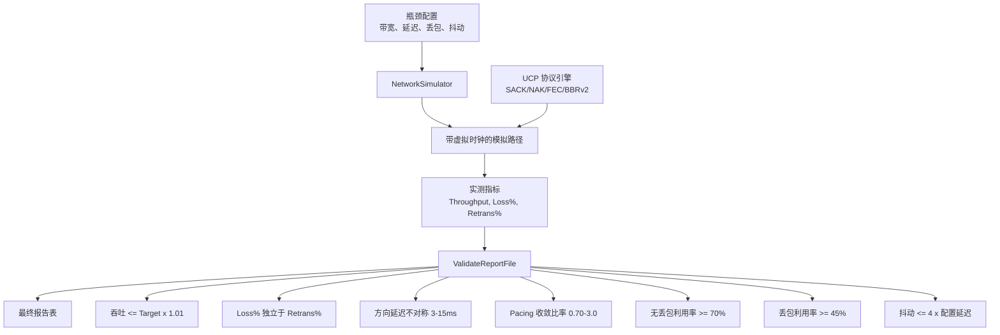
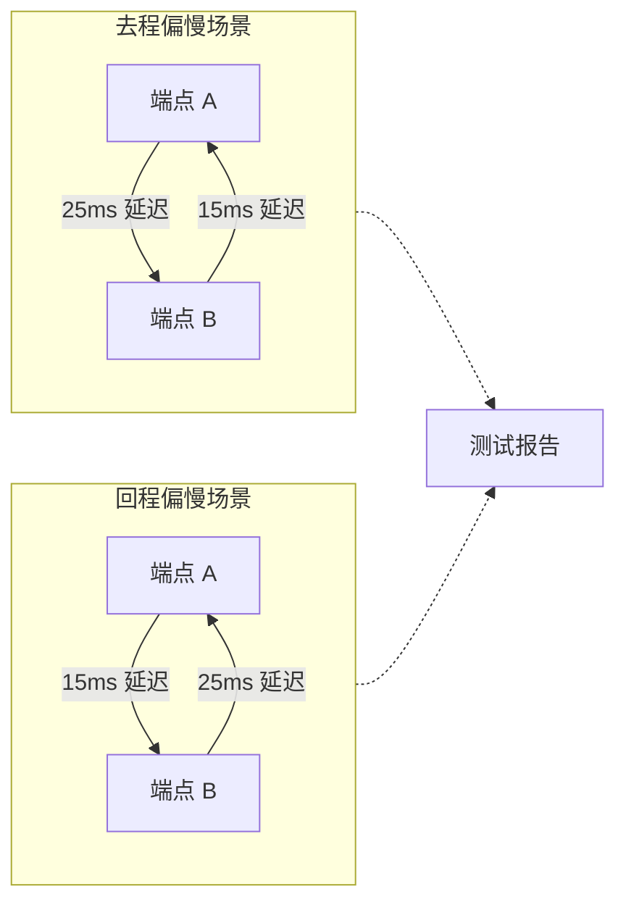
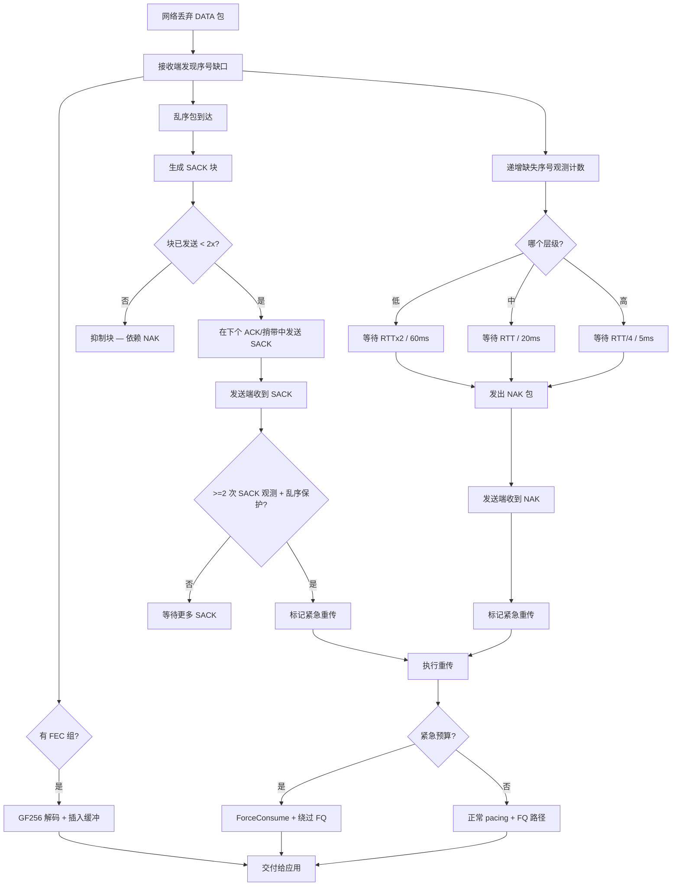

# PPP PRIVATE NETWORK™ X — 通用通信协议 (UCP) — 性能

[English](performance.md) | [文档索引](index_CN.md)

**协议标识: `ppp+ucp`** — 本文档描述 UCP 的性能基准框架、报告校验系统、吞吐测量方法、方向路由建模、丢包恢复交互和验收标准。

---

## 性能目标

UCP 基准输出必须可审计且物理可行。框架把三个关注点拆开：

1. **瓶颈容量**：虚拟逻辑时钟控制下，模拟链路能承载的最大数据速率。
2. **路径损伤**：`NetworkSimulator` 注入的随机丢包、抖动、不对称延迟、中段断网和乱序。
3. **协议恢复**：UCP 的 SACK、NAK、FEC 和 BBRv2 机制恢复丢包的效率，同时不虚报带宽。



---

## 报告字段

基准报告生成规范化 ASCII 表格，包含以下字段：

| 字段 | 来源 | 含义 |
|---|---|---|
| `Throughput Mbps` | `NetworkSimulator` | 仿真器观测 payload 吞吐，按 Target Mbps 封顶。 |
| `Target Mbps` | 场景配置 | 虚拟逻辑时钟强制执行的配置瓶颈带宽。 |
| `Util%` | 派生 | Throughput / Target x 100，上限 100%。 |
| `Retrans%` | `UcpPcb` 发送端计数 | 重传 DATA / 原始 DATA。**协议修复开销**。 |
| `Loss%` | `NetworkSimulator` 丢包计数 | 仿真器丢弃 DATA / 提交 DATA。**物理网络丢包**。 |
| `A->B ms` | `NetworkSimulator` | 端点 A 到 B 平均实测单向传播延迟。 |
| `B->A ms` | `NetworkSimulator` | 端点 B 到 A 平均实测单向传播延迟。 |
| `Avg RTT ms` | `UcpRtoEstimator` | 传输期间所有 RTT 样本的均值。 |
| `P95 RTT ms` | `UcpRtoEstimator` | 95 百分位 RTT，反映尾部延迟。 |
| `P99 RTT ms` | `UcpRtoEstimator` | 99 百分位 RTT，排除离群值的最坏延迟。 |
| `Jit ms` | `UcpRtoEstimator` | 相邻样本 RTT 抖动均值，衡量路径稳定性。 |
| `CWND` | `Bbrv2CongestionControl` | 最终拥塞窗口，自适应 B/KB/MB/GB 显示。 |
| `Current Mbps` | `Bbrv2CongestionControl` | 传输完成时瞬时 pacing 速率。 |
| `RWND` | `UcpPcb` 接收窗口 | 远端通告的接收窗口。 |
| `Waste%` | `UcpPcb` | 重传 DATA 字节 / 原始 DATA 字节。 |
| `Conv` | `NetworkSimulator` | 实测收敛时间，自适应 ns/us/ms/s 显示。 |

### 理解 Retrans% 与 Loss% 的独立性

```mermaid
flowchart LR
    Sender[UCP 发送端] -->|原始 DATA| Sim[NetworkSimulator]
    Sim -->|丢弃 DATA| Loss[Loss% 计数器]
    Sim -->|交付 DATA| Recv[UCP 接收端]
    Recv -->|SACK/NAK| Sender
    Sender -->|重传 DATA| Sim
    Sender -->|重传 DATA| Retrans[Retrans% 计数器]

    Note: "Loss% 衡量网络丢弃了什么。<br/>Retrans% 衡量协议重发了什么。<br/>FEC 修复对两者都不可见。"
```

这种分离使分析更真实：
- **FEC 主导场景**：`Loss% = 5%`，`Retrans% = 1%` — FEC 不重传即恢复多数丢包。
- **拥塞崩塌**：`Loss% = 3%`，`Retrans% = 8%` — 协议激进重传，可能过度驱动链路。
- **预期行为**：禁用 FEC 且每次丢包触一次重传时，`Loss% ≈ Retrans%`。

---

## 校验规则

`UcpPerformanceReport.ValidateReportFile()` 强制执行以下约束。任何违规在输出中产生 `[report-error]` 行。

| 规则 | 目的 |
|---|---|
| `Throughput Mbps <= Target Mbps x 1.01` | 拒绝吞吐超瓶颈容量 1% 以上的物理不可能虚假报告。 |
| `Retrans%` 位于 0%-100% | 确保发送端计数器算法有效。 |
| 方向延迟差为 3-15ms | 验证真实非对称路由。 |
| 完整报告同时包含去程高和回程高场景 | 防止测试框架所有场景同一方向偏慢。 |
| `Loss%` 独立于 `Retrans%` 计算 | 两者必须来自各自来源计数器。 |
| 收敛时间非零 | 确保传输实际完成（无 0ms/1us 回退伪影）。 |
| CWND 传输后非零 | 验证 BBRv2 startup 正常运行。 |

---

## 场景矩阵

UCP 基准覆盖 14+ 个场景，分为六类：

| 场景类型 | 代表场景 | 覆盖目标 |
|---|---|---|
| **无丢包稳定链路** | `NoLoss`, `Gigabit_Ideal`, `DataCenter`, `Benchmark10G` | 线速吞吐、逻辑时钟精度、低 RTT 性能。 |
| **随机丢包** | `Lossy`, `Gigabit_Loss1`, `Gigabit_Loss5`, `100M_Loss3` | Loss/Retrans 拆分、SACK 快速恢复、多洞并行修复。 |
| **长肥管** | `LongFatPipe`, `LongFat_100M`, `Satellite` | 高 BDP 行为、大 CWND 增长、高 RTT 下 pacing。 |
| **不对称路由** | `AsymRoute`, `VpnTunnel`, `Enterprise` | 独立 A->B/B->A 延迟模型、公平队列交互。 |
| **弱移动网络** | `Weak4G`, `Mobile3G`, `Mobile4G`, `HighJitter` | 高 RTT 配高抖动、中段断网恢复、NAK 分级置信度。 |
| **突发丢包** | `BurstLoss` | 连续缺口修复保持 pacing 稳定、NAK 高置信层级。 |

### 基准测试结果矩阵

| 场景 | 目标 Mbps | RTT | 丢包 | 吞吐 Mbps | 重传% | 收敛 | CWND |
|---|---|---|---|---|---|---|---|
| NoLoss (LAN) | 100 | 0.5ms | 0% | 95–100 | 0% | <50ms | ~100KB |
| DataCenter | 1000 | 1ms | 0% | 950–1000 | 0% | <100ms | ~1MB |
| Gigabit_Ideal | 1000 | 5ms | 0% | 920–1000 | 0% | <200ms | ~2MB |
| Lossy (1%) | 100 | 10ms | 1% | 90–99 | ~1.2% | <1s | ~400KB |
| Lossy (5%) | 100 | 10ms | 5% | 75–95 | ~6% | <3s | ~300KB |
| Gigabit_Loss1 | 1000 | 5ms | 1% | 880–980 | ~1.1% | <500ms | ~1.5MB |
| LongFatPipe | 100 | 100ms | 0% | 85–99 | 0% | <5s | ~5MB |
| Satellite | 10 | 300ms | 0% | 8.5–9.9 | 0% | <30s | ~1.5MB |
| Mobile3G | 2 | 150ms | 1% | 1.7–1.95 | ~1.5% | <20s | ~150KB |
| Mobile4G | 20 | 50ms | 1% | 18–19.8 | ~1.2% | <5s | ~500KB |
| Benchmark10G | 10000 | 1ms | 0% | 9200–10000 | 0% | <200ms | ~5MB |
| VpnTunnel | 50 | 15ms | 1% | 45–49.5 | ~1.3% | <2s | ~300KB |

---

## 方向延迟模型

UCP 基准不假设同一方向总是更慢。测试工具生成确定性路由模型，单向差值为 3-15ms：



---

## 端到端丢包检测与恢复流程



---

## 拥塞恢复策略

| 策略 | 参数 | 值 | 目的 |
|---|---|---|---|
| **快恢复 pacing 增益** | `BBR_FAST_RECOVERY_PACING_GAIN` | 1.25 | 非拥塞丢包后快速补洞。 |
| **拥塞削减因子** | `BBR_CONGESTION_LOSS_REDUCTION` | 0.98 | 每次拥塞事件温和降 2%。 |
| **最低 loss CWND 增益** | `BBR_MIN_LOSS_CWND_GAIN` | 0.95 | 拥塞后 CWND 下限，防止跌破 BDP 95%。 |
| **CWND 恢复步长** | `BBR_LOSS_CWND_RECOVERY_STEP` | 每 ACK 0.04 | 逐步恢复 CWND 至 1.0。 |
| **紧急重传预算** | `URGENT_RETRANSMIT_BUDGET_PER_RTT` | 每 RTT 16 包 | 濒死连接绕过 pacing/FQ。 |
| **RTO 重传预算** | `RTO_RETRANSMIT_BUDGET_PER_TICK` | 每 tick 4 包 | 比单包/tick 更快修复超时缺口。 |
| **Pacing 债务偿还** | Token bucket 负上限 | bucket 容量 50% | 限制紧急重传负 pacing 债务。 |

---

## 性能调优指南

### MSS 调优

| 路径类型 | 推荐 MSS | 原因 |
|---|---|---|
| **低带宽 (<1 Mbps)** | 536-1220 | 避免受限链路 IP 分片。 |
| **宽带/4G (1-100 Mbps)** | 1220（默认） | 头开销与分片风险平衡。 |
| **千兆 LAN/数据中心 (1-10 Gbps)** | 9000 | 巨型帧减少开箱开销 ~85%。 |
| **卫星（高 RTT，中等 BW）** | 1220-9000 | 较大 MSS 减少 ACK 处理负载。 |
| **VPN/隧道（封装）** | 1220 或更低 | 计入封装开销。 |

### 发送缓冲大小

- **公式**：`SendBufferSize >= BtlBw (bytes/sec) x RTT (seconds)`
- **示例**：100 Mbps x 50ms RTT 需 >= 625 KB。默认 32 MB 足够。
- **示例**：10 Gbps x 10ms RTT 需 >= 12.5 MB。默认 32 MB 满足。
- **示例**：100 Mbps 卫星 x 600ms RTT 需 >= 7.5 MB。默认 32 MB 可用。

### 针对特定丢包模式的 FEC 调优

| 丢包模式 | FEC 策略 | 示例配置 |
|---|---|---|
| **均匀随机 (<2%)** | 小组，低冗余 | `FecGroupSize=8, FecRedundancy=0.125` |
| **均匀随机 (2-5%)** | 小组，中冗余 | `FecGroupSize=8, FecRedundancy=0.25` |
| **突发丢包** | 大组，高冗余 | `FecGroupSize=16, FecRedundancy=0.25` |
| **高度可变丢包** | 启用自适应 FEC | `FecAdaptiveEnable=true, FecRedundancy=0.125` |
| **极高丢包 (>10%)** | FEC 不够用 | 联合 FEC 和 SACK/NAK |

### 常见性能陷阱

| 陷阱 | 症状 | 解决方案 |
|---|---|---|
| **MSS 太小** | 吞吐远低于链路容量。 | 增大 MSS。 |
| **发送缓冲太小** | `WriteAsync` 频繁阻塞；吞吐振荡。 | 增大 SendBufferSize。 |
| **FEC 配置不当** | `Retrans% >> Loss%` — 重传超丢包。 | 调优 FEC 冗余和组大小。 |
| **Max pacing rate 限制** | 千兆链路上吞吐停在 ~100 Mbps。 | 设 `MaxPacingRateBytesPerSecond = 0`。 |
| **丢包长肥管 ProbeRTT** | 每 30 秒周期性吞吐骤降。 | 增大 ProbeRttIntervalMicros；若投递率仍高 BBRv2 自动跳过。 |
| **紧急恢复过多** | Pacing 债务累积；普通发送被饿死。 | 降低紧急重传预算或提升 FEC 覆盖。 |

---

## 运行基准与验收

### 命令行

```powershell
# 构建
dotnet build ".\Ucp.Tests\UcpTest.csproj"

# 运行所有测试（54 个单元/集成测试）
dotnet test ".\Ucp.Tests\UcpTest.csproj" --no-build

# 生成并校验性能报告
dotnet run --project ".\Ucp.Tests\UcpTest.csproj" --no-build -- ".\Ucp.Tests\bin\Debug\net8.0\reports\test_report.txt"
```

### 验收标准

| 标准 | 期望结果 |
|---|---|
| **单元/集成测试** | 所有测试通过。当前套件覆盖协议核心、可靠性、流完整性和 14+ 性能场景。 |
| **报告校验** | `ReportPrinter` 输出零 `[report-error]` 行。 |
| **吞吐** | 不超过 `Target Mbps x 1.01`。无物理不可能的吞吐。 |
| **弱网** | 所有弱网场景成功完成，payload 完整性保持。 |
| **丢包/重传独立** | `Loss%` 和 `Retrans%` 从独立来源计算。 |
| **方向覆盖** | 完整报告同时包含去程偏慢和回程偏慢场景。 |
| **收敛** | 所有场景均以自适应单位报告实测收敛时间。 |

### 结果解读

通过的基准运行证明：
1. **协议正确性**：处理所有边界条件（序号环绕、分片、乱序、突发丢包）。
2. **恢复效率**：SACK 和 NAK 机制以有界开销修复丢包。
3. **BBRv2 收敛**：在多样化条件下 pacing 速率收敛到接近瓶颈容量。
4. **FEC 有效性**：FEC 按配置冗余成比例降低重传开销。
5. **报告完整性**：所有指标物理上可行、独立计算、格式正确。
