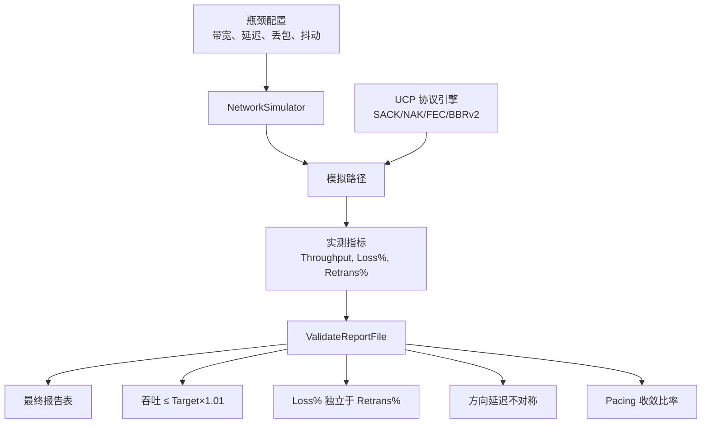
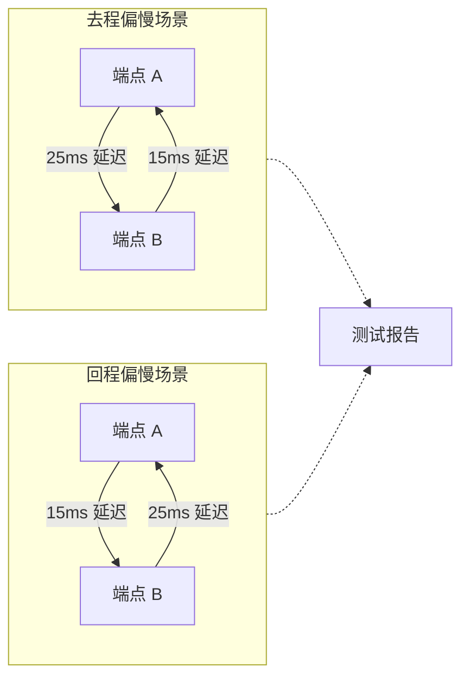
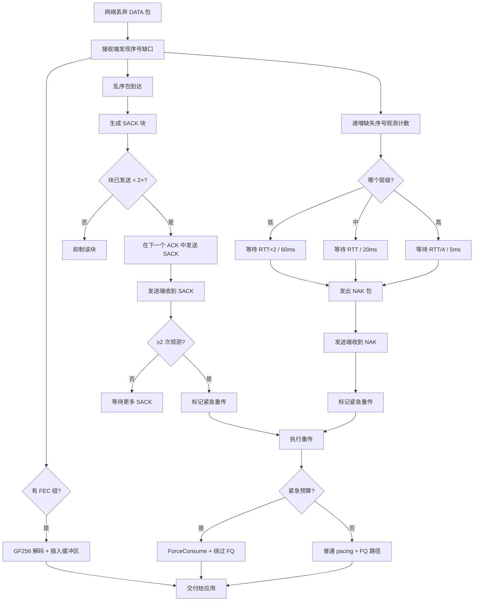

# PPP PRIVATE NETWORK™ X - 通用通信协议 (UCP) — 性能

[English](performance.md) | [文档索引](index_CN.md)

**协议标识: `ppp+ucp`** — 本文档描述 UCP 的性能基准框架、报告校验系统、吞吐测量方法、方向路由建模、丢包恢复交互和验收标准。

## 性能目标

UCP 基准输出必须可审计且物理可行。框架把三个关注点拆开：

1. **瓶颈容量**：虚拟逻辑时钟控制下，模拟链路能承载的最大数据速率。
2. **路径损伤**：`NetworkSimulator` 注入的随机丢包、抖动、不对称延迟、中段断网和乱序。
3. **协议恢复**：UCP 的 SACK、NAK、FEC 和 BBRv2 机制恢复丢包的效率，同时不虚报带宽。

高丢包场景必须展示协议是否高效补洞，且不报告超过配置链路容量的吞吐。报告刻意将 payload 吞吐封顶到 `Target Mbps`，确保进程内调度速度绝不夸大基准结果。



## 报告字段

基准报告生成规范化 ASCII 表格，包含以下字段：

| 字段 | 来源 | 含义 |
|---|---|---|
| `Throughput Mbps` | `NetworkSimulator` | 仿真器观测 payload 吞吐。按 `Target Mbps` 封顶，防止进程内速度夸大结果。 |
| `Target Mbps` | 场景配置 | 虚拟逻辑时钟强制执行的配置瓶颈带宽。 |
| `Util%` | 派生 | `Throughput / Target × 100`，上限 100%。 |
| `Retrans%` | `UcpPcb` 发送端计数 | 协议侧重传 DATA 包数 / 原始 DATA 包数。衡量协议修复开销。 |
| `Loss%` | `NetworkSimulator` 丢包计数 | 仿真器丢弃 DATA 包数 / 提交给仿真器的 DATA 包数。衡量物理网络丢包，与协议恢复无关。 |
| `A->B ms` | `NetworkSimulator` | 端点 A 到 B 平均实测单向传播延迟。 |
| `B->A ms` | `NetworkSimulator` | 端点 B 到 A 平均实测单向传播延迟。 |
| `Avg RTT ms` | `UcpRtoEstimator` | 传输期间所有 RTT 样本的均值。 |
| `P95 RTT ms` | `UcpRtoEstimator` | 95 百分位 RTT。反映尾部延迟。 |
| `P99 RTT ms` | `UcpRtoEstimator` | 99 百分位 RTT。排除离群值的最坏实测延迟。 |
| `Jit ms` | `UcpRtoEstimator` | 相邻样本 RTT 抖动均值。衡量路径稳定性。 |
| `CWND` | `Bbrv2CongestionControl` | 最终拥塞窗口，自适应 `B`/`KB`/`MB`/`GB` 显示。 |
| `Current Mbps` | `Bbrv2CongestionControl` | 传输完成时的瞬时 pacing 速率。 |
| `RWND` | `UcpPcb` 接收窗口 | 远端通告的接收窗口，自适应单位显示。 |
| `Waste%` | `UcpPcb` | 重传 DATA 字节 / 原始 DATA 字节百分比。计入协议开销（头、控制包）。 |
| `Conv` | `NetworkSimulator` | 实测收敛时间：传输的挂钟耗时，自适应 `ns`/`us`/`ms`/`s` 显示。 |

### 理解 Retrans% 与 Loss% 的独立性

报告的关键特性是 `Retrans%` 与 `Loss%` 独立测量：

```mermaid
flowchart LR
    Sender[UCP 发送端] -->|原始 DATA| Sim[NetworkSimulator]
    Sim -->|丢弃 DATA| Loss[Loss% 计数器]
    Sim -->|交付 DATA| Recv[UCP 接收端]
    Recv -->|SACK/NAK| Sender
    Sender -->|重传 DATA| Sim
    Sender -->|重传 DATA| Retrans[Retrans% 计数器]

    Note: "Loss% 衡量网络丢弃了什么。<br/>Retrans% 衡量协议重发了什么。<br/>FEC 修复对两者都不可见。"
```

这种分离使分析更真实：
- **FEC 主导场景**：`Loss% = 5%`，`Retrans% = 1%` — FEC 不重传即恢复多数丢包。
- **拥塞崩塌**：`Loss% = 3%`，`Retrans% = 8%` — 协议激进重传，可能过度驱动链路。
- **预期行为**：禁用 FEC 且每次丢包触一次重传时，`Loss% ≈ Retrans%`。

## 校验规则

`UcpPerformanceReport.ValidateReportFile()` 强制执行以下约束。任何违规在输出中产生 `[report-error]` 行。

| 规则 | 目的 |
|---|---|
| `Throughput Mbps ≤ Target Mbps × 1.01` | 拒绝报告吞吐超瓶颈容量 1% 以上的物理上不可能的虚假报告。1% 容差覆盖浮点测量噪声。 |
| `Retrans%` 位于 0%-100% | 确保发送端计数器算法有效。负值或 >100% 表示计数器溢出或环绕 bug。 |
| 方向延迟差为 3-15ms（A→B 和 B→A 均有值时） | 验证真实非对称路由。更小差异是统计噪声；更大差异表示配置错误。 |
| 完整报告同时包含去程高和回程高场景 | 防止测试框架所有场景都假设同一方向总是更慢。至少一个场景 A→B 偏慢，一个 B→A 偏慢。 |
| `Loss%` 独立于 `Retrans%` 计算 | 验证报告未从一个指标推导另一个，两者必须来自各自来源计数器。 |
| 收敛时间非零 | 确保传输实际完成且解析器正确读取收敛值（无 0ms/1us 回退伪影）。 |
| CWND 传输后非零 | 验证拥塞窗口已增长超过初值，确认 BBRv2 startup 正常运行。 |

## 场景矩阵

UCP 基准覆盖 14 个场景，分为六类：

| 场景类型 | 代表场景 | 覆盖目标 |
|---|---|---|
| **无丢包稳定链路** | `NoLoss`, `Gigabit_Ideal`, `DataCenter`, `Benchmark10G` | 线速吞吐、逻辑时钟精度、低 RTT 性能、高带宽 BBRv2 收敛。 |
| **随机丢包** | `Lossy`, `Gigabit_Loss1`, `Gigabit_Loss5`, `100M_Loss3`, `1G_Loss3` | Loss/Retrans 拆分、SACK 快速恢复、多洞并行修复、丢包下 pacing 稳定。 |
| **长肥管** | `LongFatPipe`, `LongFat_100M`, `Satellite` | 高 BDP 行为、大 CWND 增长与稳定、高 RTT 下 pacing、兼容卫星。 |
| **不对称路由** | `AsymRoute`, `VpnTunnel`, `Enterprise` | 独立 A→B/B→A 延迟模型、不对称带宽下公平队列交互、方向 ACK 路径影响。 |
| **弱移动网络** | `Weak4G`, `Mobile3G`, `Mobile4G`, `HighJitter` | 高 RTT 配高抖动、中段断网恢复、NAK 分级置信度行为、断网后 pacing 稳定。 |
| **突发丢包** | `BurstLoss` | 连续缺口修复并保持 pacing 不塌、SACK 多块行为、NAK 高置信层级激活。 |

## 方向延迟模型

UCP 基准不假设同一方向总是更慢。场景未显式配置方向延迟时，测试工具生成确定性路由模型，单向差值为 3-15ms：



此设计确保：
- ACK 路径性能在有利和不利两个方向均被测试。
- 在不对称带宽延迟积下验证 pacing 行为。
- 报告将延迟测量正确归因到对应方向。

## 丢包检测与恢复端到端流程

下图展示 UCP 所有机制下丢包检测与恢复的端到端流程：



## 拥塞恢复策略

UCP 使用 BBRv2 风格控制，区分随机丢包和拥塞丢包。以下策略参数管理恢复行为：

| 策略 | 参数 | 值 | 目的 |
|---|---|---|---|
| **快恢复 pacing 增益** | `BBR_FAST_RECOVERY_PACING_GAIN` | 1.25 | 非拥塞丢包后快速补洞，不降低吞吐。 |
| **拥塞削减因子** | `BBR_CONGESTION_LOSS_REDUCTION` | 0.98 | 仅在拥塞证据确认后温和降低 `AdaptivePacingGain`。每次事件降 2%。 |
| **最低 loss CWND 增益** | `BBR_MIN_LOSS_CWND_GAIN` | 0.95 | CWND gain 下限。防止单次拥塞事件将窗口打穿到 BDP 的 95% 以下。 |
| **CWND 恢复步长** | `BBR_LOSS_CWND_RECOVERY_STEP` | 每 ACK 0.04 | 拥塞事件后交付恢复时，逐步将 CWND gain 恢复到 1.0。 |
| **紧急重传预算** | `URGENT_RETRANSMIT_BUDGET_PER_RTT` | 每 RTT 16 包 | 允许濒死连接在恢复时绕过 pacing/FQ，同时避免无限突发饿死其他连接。 |
| **RTO 重传预算** | `RTO_RETRANSMIT_BUDGET_PER_TICK` | 每 tick 4 包 | 比单包/tick 更快修复超时缺口，防止高 BDP 路径上多秒停滞。 |
| **Pacing 债务偿还** | Token bucket 负上限 | bucket 容量 50% | 限制紧急重传产生的负 pacing 债务。触及债务上限后后续紧急发送必须等待。 |

## 运行基准与验收

### 命令行

```powershell
# 构建
dotnet build ".\Ucp.Tests\UcpTest.csproj"

# 运行所有测试（54 个单元/集成测试）
dotnet test ".\Ucp.Tests\UcpTest.csproj" --no-build

# 生成并校验性能报告
dotnet run --project ".\Ucp.Tests\UcpTest.csproj" --no-build -- ".\Ucp.Tests\bin\Debug\net8.0\reports\test_report.txt"
```

### 验收标准

| 标准 | 期望结果 |
|---|---|
| **单元/集成测试** | 所有测试通过。当前套件覆盖协议核心（序号环绕、包编解码、RTO 估算）、可靠性（SACK、NAK、FEC）、流完整性（乱序、重复、全双工）和 14 个性能场景。 |
| **报告校验** | `ReportPrinter` 输出零 `[report-error]` 行。`ValidateReportFile()` 每条规则均通过。 |
| **吞吐** | 不超过 `Target Mbps × 1.01`。无场景产生物理上不可能的吞吐。 |
| **弱网** | 所有弱网场景（Weak4G、Mobile3G、Mobile4G）成功完成。payload 完整性保持。中段断网后 pacing 恢复。 |
| **丢包/重传独立** | `Loss%` 和 `Retrans%` 从独立来源计算，反映各自物理含义。 |
| **方向覆盖** | 完整报告同时包含去程偏慢和回程偏慢场景。 |
| **收敛** | 所有场景均以自适应 `ns`/`us`/`ms`/`s` 报告实测收敛时间。无人为 0ms/1us 回退值。 |
| **文档** | README 与 `docs/` 报告口径一致。术语跨所有文件统一。 |

### 结果解读

通过的基准运行证明：
1. **协议正确性**：协议引擎处理所有边界条件（序号环绕、分片、乱序、突发丢包）。
2. **恢复效率**：SACK 和 NAK 机制以有界开销修复丢包，无误报。
3. **BBRv2 收敛**：在多样化网络条件下，pacing 速率收敛到接近瓶颈容量。
4. **FEC 有效性**：FEC 按配置冗余成比例地降低重传开销。
5. **报告完整性**：所有指标物理上可行、独立计算、格式正确。
