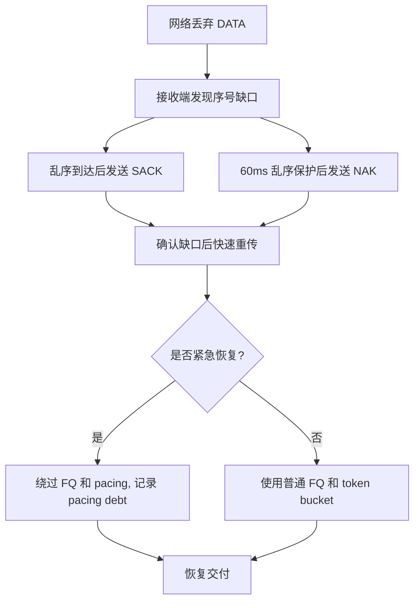

# UCP 性能与报告指南

[English](performance.md) | [文档索引](index_CN.md)

## 目标

UCP 的性能报告必须可信。报告把瓶颈容量、网络损伤、协议恢复拆开统计，因此高丢包场景可以真实展示协议是否高效补洞，而不会假装链路承载了超过配置目标的带宽。

报告会把 payload 吞吐封顶到 `Target Mbps`。本地进程内调度可能比真实网卡更快完成，但报告值仍受模拟器序列化预算约束。

## 报告字段

| 字段 | 含义 |
|---|---|
| `Throughput Mbps` | 仿真器观测 payload 吞吐，并按 `Target Mbps` 封顶。 |
| `Target Mbps` | 场景配置的瓶颈带宽。 |
| `Util%` | `Throughput / Target * 100`，最大 100%。 |
| `Retrans%` | 发送端重传 DATA 包数 / 原始 DATA 包数。 |
| `Loss%` | 仿真器丢弃 DATA 包数 / 进入仿真器的 DATA 包数。 |
| `A->B ms` | A 到 B 的平均单向传播延迟。 |
| `B->A ms` | B 到 A 的平均单向传播延迟。 |
| `Avg/P95/P99/Jit ms` | RTT 样本统计和相邻 RTT 差的平均抖动。 |
| `CWND` | 拥塞窗口，自适应显示 `B`/`KB`/`MB`/`GB`。 |
| `Current Mbps` | BBR 当前瞬时 pacing rate。 |
| `RWND` | 对端通告接收窗口，自适应单位。 |
| `Waste%` | 重传 DATA 包占原始 DATA 包比例。 |
| `Conv ms` | pacing 进入稳定目标带宽区间的估算时间。 |

## 校验规则

`UcpPerformanceReport.ValidateReportFile()` 执行以下约束：

| 规则 | 目的 |
|---|---|
| `Throughput Mbps <= Target Mbps * 1.01` | 拒绝超过物理瓶颈的虚假报告。 |
| `Retrans%` 位于 0%-100% | 保证发送端统计有效。 |
| 有方向延迟的场景差值必须为 3-15ms | 覆盖真实不对称路由，同时避免无限偏差。 |
| 完整报告必须同时包含去程高和回程高场景 | 避免所有场景都假设同一方向更慢。 |
| `Loss%` 独立于 `Retrans%` | 区分网络丢包和协议恢复开销。 |

## 场景矩阵

| 场景类型 | 代表场景 | 覆盖点 |
|---|---|---|
| 无丢包稳定链路 | `NoLoss`, `Gigabit_Ideal`, `DataCenter`, `Benchmark10G` | 线速、逻辑时钟、低 RTT、高带宽。 |
| 随机丢包 | `Lossy`, `Gigabit_Loss1`, `Gigabit_Loss5`, `100M_Loss*`, `1G_Loss3` | Loss/Retrans 拆分、SACK 快恢复。 |
| 长肥管 | `LongFatPipe`, `LongFat_100M`, `Satellite` | 高 BDP、大 CWND、稳定 pacing。 |
| 不对称路由 | `AsymRoute`, `VpnTunnel`, `Enterprise` | 独立 A->B/B->A 延迟模型。 |
| 弱移动网络 | `Weak4G`, `Mobile3G`, `Mobile4G`, `HighJitter` | 高 RTT、高抖动、中段 outage、恢复速度。 |
| 突发丢包 | `BurstLoss` | 连续缺口恢复且 pacing 不崩塌。 |

## 方向延迟模型

基准不会假设同一方向总是更慢。场景未显式配置方向延迟时，`RunLineRateBenchmarkAsync` 会生成确定性的方向模型，并让单向差值处于 3-15ms。`AsymRoute` 等场景则显式使用固定去程/回程延迟。


## 丢包与重传

丢包本身不是错误。只有当丢包导致重传开销过高、pacing 停滞或 payload 完整性失败时，场景才可疑。



SACK 是第一优先级快恢复路径。NAK 是保守兜底路径，因为高抖动路由可能造成几十毫秒乱序。

## 拥塞恢复策略

UCP 使用 BBR 风格控制，不把每次丢包都等同拥塞。

| 策略 | 当前值 | 目的 |
|---|---|---|
| 快恢复 pacing gain | `1.25` | 非拥塞丢包后快速补洞。 |
| 拥塞削减因子 | `0.98` | 仅在确认拥塞后温和降速。 |
| 最低 loss CWND gain | `0.95` | 避免临时丢包把窗口打穿。 |
| CWND 恢复步长 | 每 ACK `0.04` | ACK 恢复后逐步恢复窗口。 |
| 紧急重传预算 | 每 RTT 窗口 `16` 包 | 濒死恢复可绕过平滑，但避免无限突发。 |
| RTO 重传预算 | 每 timer tick `4` 包 | 比单包/tick 更快修复超时缺口。 |

## 运行与验收

```powershell
dotnet build ".\Ucp.Tests\UcpTest.csproj"
dotnet test ".\Ucp.Tests\UcpTest.csproj" --no-build
dotnet run --project ".\Ucp.Tests\UcpTest.csproj" --no-build -- ".\Ucp.Tests\bin\Debug\net8.0\reports\test_report.txt"
```

验收标准：

| 项目 | 期望 |
|---|---|
| 单元/集成测试 | 全部通过；当前套件为 52 个测试。 |
| 报告校验 | `ReportPrinter` 不输出 `[report-error]`。 |
| 吞吐 | 不超过目标带宽；低损耗高带宽场景接近目标。 |
| 弱网 | 传输完成、payload 完整、丢包/outage 后 pacing 恢复。 |
| 文档 | README 与 `docs/` 报告口径一致。 |
