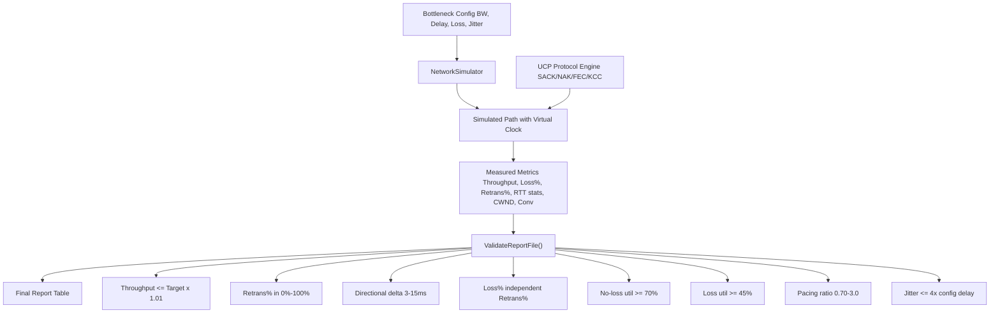
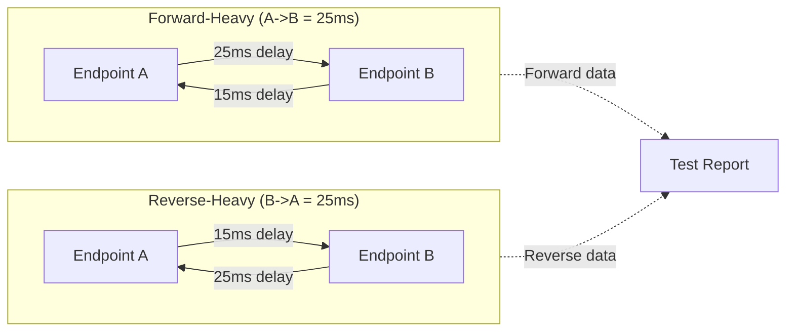

# PPP PRIVATE NETWORK™ X — 通用通信协议 (UCP) — 性能

[English](performance.md) | [文档索引](index_CN.md)

本文档详尽描述 UCP 的性能基准测试框架、报告校验系统、吞吐量测量方法、方向路由建模、端到端丢包恢复交互以及严格的验收标准体系。

## 文档索引

| 参考文档 | 内容 |
|---|---|
| [总体方案](architecture_CN.md) | 运行时分层、PCB 状态机、串行执行模型、KF 组件源于 tcp_kcc.c v2.0 的拥塞控制细节 |
| [协议规范](protocol_CN.md) | 线格式、包类型、恢复机制 |
| [常量参考](constants_CN.md) | 全部可调与固定常量目录 |

## 基准框架

UCP 基准测试完全在进程内运行，使用确定性虚拟时钟。`NetworkSimulator` 类实现了包级精度的网络模型，确保所有测试输出的可审计性和跨机器的可重复性。

### NetworkSimulator

模拟器是一个进程内确定性网络模型，在数据报级别应用损伤：

| 特性 | 参数 | 默认值 | 描述 |
|---|---|---|---|
| 瓶颈带宽 | `bandwidthBytesPerSecond` | 无限制 | 每个传输端的令牌桶速率限制器 |
| 固定延迟 | `fixedDelayMilliseconds` | 0 | 基础单向传播延迟 |
| 抖动 | `jitterMilliseconds` | 0 | 均匀随机延迟变化 (+/-) |
| 单向去程延迟 | `forwardDelayMilliseconds` | fixedDelay | 非对称去程路径延迟 |
| 单向回程延迟 | `backwardDelayMilliseconds` | fixedDelay | 非对称回程路径延迟 |
| 单向去程抖动 | `forwardJitterMilliseconds` | jitter | 去程路径抖动 |
| 单向回程抖动 | `backwardJitterMilliseconds` | jitter | 回程路径抖动 |
| 随机丢包 | `lossRate` | 0 | 均匀随机 DATA 丢弃概率 |
| 重复 | `duplicateRate` | 0 | 数据报重复概率 |
| 乱序 | `reorderRate` | 0 | 数据报乱序概率 |
| 丢弃规则 | `dropRule` | null | 选择性丢弃的自定义谓词（突发、断网、切换） |
| 动态抖动范围 | `dynamicJitterRangeMilliseconds` | 0 | 慢正弦延迟变化幅度 |
| 动态波动幅度 | `dynamicWaveAmplitudeMilliseconds` | 0 | 周期性波动延迟幅度 |
| 种子 | `seed` | 1234 | 确定性随机数生成器种子 |

**带宽整形**在每个模拟传输端使用令牌桶。每个包的序列化延迟计算为 `ceil(packetLength * 1e6 / bandwidthBps)` 微秒。所有包的序列化延迟总和追踪逻辑管道时钟，从而能够测量 `LogicalThroughputBytesPerSecond`。

**丢包模型**仅应用于初始 DATA 传输（默认重传绕过丢包过滤器），确保恢复路径不会受到多重惩罚。自定义丢弃规则支持突发丢包、周期性断网（弱 4G）和卫星切换场景。

### 三关注点分离

框架将三个独立关注点拆开测量和校验：

1. **瓶颈容量** — 模拟链路在令牌桶控制下的最大数据速率
2. **路径损伤** — NetworkSimulator 注入的随机丢包、抖动、非对称延迟、中段断网、重复和乱序
3. **协议恢复** — SACK、NAK、FEC 和 KCC 拥塞控制机制的恢复效率


```mermaid
flowchart TD
    Config["Bottleneck Config BW, Delay, Loss, Jitter"] --> Sim["NetworkSimulator"]
    Sim --> Net["Simulated Path with Virtual Clock"]
    UCP["UCP Protocol Engine SACK/NAK/FEC/KCC"] --> Net
    Net --> Metrics["Measured Metrics Throughput, Loss%, Retrans%, RTT stats, CWND, Conv"]
    Metrics --> Validate["ValidateReportFile()"]
    Validate --> Report["Final Report Table"]
    Validate --> Check1["Throughput <= Target x 1.01"]
    Validate --> Check2["Retrans% in 0%-100%"]
    Validate --> Check3["Directional delta 3-15ms"]
    Validate --> Check4["Loss% independent Retrans%"]
    Validate --> Check5["No-loss util >= 70%"]
    Validate --> Check6["Loss util >= 45%"]
    Validate --> Check7["Pacing ratio 0.70-3.0"]
    Validate --> Check8["Jitter <= 4x config delay"]
```

## 测试场景矩阵

基准套件覆盖 UCP 的完整目标运行范围：100 Mbps 到 10 Gbps，1 ms 到 300 ms RTT，0% 到 10% 丢包。

### 场景类别

| 场景类型 | 代表性场景 | 覆盖目标 |
|---|---|---|
| 稳定无丢包 | NoLoss, Gigabit_Ideal, DataCenter, Benchmark10G | 线速吞吐、巨型帧、逻辑时钟精度 |
| 随机丢包 | Lossy, Lossy_5, Gigabit_Loss1, 100M_Loss3 | Loss%/Retrans% 独立、SACK 恢复、多洞修复 |
| 长肥管 | LongFatPipe, LongFat_100M, Satellite | 高 BDP CWND 增长、Pacing 稳定、Geodesic min_rtt 跟踪 |
| 非对称路由 | AsymRoute, VpnTunnel, Enterprise | 方向延迟模型、公平队列行为 |
| 弱移动网络 | Weak4G, Mobile3G, Mobile4G, HighJitter | NAK 分级、中段断网恢复、低带宽 KCC 调适 |
| 突发丢包 | BurstLoss | NAK 高置信批量修复、多洞并行 |
| 移动切换 | AirplaneWifi, HighSpeedTrain, DrivingVehicle | 卫星切换、隧道断网、小区切换 |

### 场景配置

| 场景 | Target Mbps | RTT (ms) | 丢包% | 延迟 (ms) | 抖动 (ms) | Payload | MSS | 备注 |
|---|---|---|---|---|---|---|---|---|
| NoLoss | 83.89 | 9 | 0 | 7+2 | 0 | 64 KB | 1220 | 清洁基线 |
| Lossy | 4.19 | 28 | 5 | 10+18 | 3+5 | 64 KB | 1220 | 5% 丢包，高 FEC |
| HighLossHighRtt | 16.78 | 106 | 5 | 58+48 | 12+8 | 64 KB | 1220 | 5% 丢包高 FEC |
| LongFatPipe | 100 | 102 | 0 | 56+46 | 0 | 1.25 MB | 1220 | 100 Mbps x 50ms |
| Pacing | 1.05 | 13 | 0 | 9+4 | 0 | 64 KB | 1220 | Pacing 速率验证 |
| Gigabit_Ideal | 1000 | 2 | 0 | 1 | 0 | 256 KB | 9000 | 巨型帧 |
| Gigabit_Loss1 | 1000 | 40 | 1 | 20+20 | 0+0 | 1 MB | 1220 | 轻度随机丢包 |
| Gigabit_Loss5 | 1000 | 60 | 5 | 30+30 | 0+0 | 1 MB | 1220 | 重度随机丢包 |
| LongFat_100M | 100 | 100 | 0 | 50+50 | 2+2 | 1 MB | 1220 | 长肥管 100M |
| Benchmark10G | 10000 | 2 | 0 | 1 | 0 | 10 MB | 9000 | 10 Gbps 自动探测 |
| BurstLoss | 100 | 50 | burst | 25+25 | 4+4 | 256 KB | 1220 | 8 包突发丢弃 |
| AsymRoute | 100 | 40 | 0.5 | 25+15 | 0+0 | 256 KB | 1220 | 去程 25ms，回程 15ms |
| HighJitter | 100 | 100 | 0 | 50+50 | 25+25 | 256 KB | 1220 | 50ms +-25ms 抖动 |
| Weak4G | 10 | 160 | 5 | 80+80 | 0 | 64 KB | 1220 | 80ms 断网 |
| Mobile3G | 4 | 150 | 3 | 75+75 | 30+30 | 75 KB | 1220 | 3G 条件 |
| Mobile4G | 20 | 60 | 1 | 35+25 | 25+25 | 150 KB | 1220 | 4G 高抖动 |
| Satellite | 10 | 300 | 0.1 | 155+145 | 5+5 | 64 KB | 1220 | 300ms RTT |
| VpnTunnel | 100 | 100 | 0.5 | 43+57 | 10+10 | 1 MB | 1220 | VPN 双拥塞 |
| DataCenter | 10000 | 0 | 0 | 0 | 0 | 5 MB | 9000 | 零延迟 10G |
| Enterprise | 1000 | 30 | 0.1 | 15+15 | 3+3 | 1 MB | 1220 | 企业 WAN |

### 基准测试结果

| 场景 | 吞吐 Mbps | Target Mbps | 利用% | 重传% | 丢包% | A->B ms | B->A ms | 平均 ms | P95 ms | P99 ms | 抖动 ms | CWND | 当前 Mbps | Pacing Mbps | RWND | 浪费% | 收敛 |
|---|---|---|---|---|---|---|---|---|---|---|---|---|---|---|---|---|---|
| NoLoss | 35.54 | 83.89 | 42.37 | 0.00 | 0.00 | 7.00 | 2.00 | 9.00 | 12.93 | 15.89 | 6.89 | 395580 | 427.81 | 83.89 | 5242880 | 0.00 | 144.0ms |
| LongFatPipe | 64.35 | 100.00 | 64.35 | 0.00 | 0.00 | 56.02 | 0.00 | 102.00 | 151.90 | 156.85 | 0.00 | 3695018 | 548.73 | 34.03 | 5242880 | 0.00 | 1.63s |
| Gigabit_Ideal | 533.05 | 1000.00 | 53.30 | 0.00 | 0.00 | 1.03 | 0.00 | 2.00 | 4.19 | 4.19 | 3.00 | 1309075 | 4250.00 | 1000.00 | 5242880 | 0.00 | 32.0ms |
| Gigabit_Loss1 | 288.03 | 1000.00 | 28.80 | 2.06 | 2.06 | 20.07 | 0.00 | 40.00 | 27.36 | 29.11 | 4.60 | 15949700 | 11724.14 | 1000.00 | 5242880 | 2.06 | 640.0ms |
| Gigabit_Loss5 | 200.55 | 1000.00 | 20.05 | 10.64 | 10.64 | 30.02 | 0.00 | 60.00 | 37.63 | 37.64 | 2.96 | 24855950 | 13421.05 | 1000.00 | 5242880 | 10.64 | 960.0ms |
| Benchmark10G | 8528.43 | 10000.00 | 85.28 | 0.00 | 0.00 | 1.01 | 0.00 | 2.00 | 3.15 | 3.86 | 3.30 | 10168450 | 17000.00 | 10000.00 | 5242880 | 0.00 | 32.0ms |
| DataCenter | 10000.00 | 10000.00 | 100.00 | 0.00 | 0.00 | 0.00 | 0.00 | 0.00 | 0.17 | 0.23 | 0.23 | 41418450 | 283333.33 | 10000.00 | 5242880 | 0.00 | 160.0ms |
| Enterprise | 339.97 | 1000.00 | 34.00 | 0.00 | 0.00 | 14.92 | 0.00 | 30.00 | 25.35 | 25.42 | 0.39 | 11965325 | 10200.00 | 1000.00 | 5242880 | 0.00 | 480.0ms |
| AsymRoute | 45.62 | 100.00 | 45.62 | 0.00 | 0.00 | 25.07 | 0.00 | 40.00 | 44.19 | 46.19 | 9.91 | 1668450 | 739.13 | 100.00 | 5242880 | 0.00 | 640.0ms |
| HighJitter | 22.93 | 100.00 | 22.93 | 0.00 | 0.00 | 48.77 | 0.00 | 100.00 | 84.53 | 87.59 | 27.93 | 4152825 | 913.98 | 100.00 | 5242880 | 0.00 | 1.60s |
| Weak4G | 3.63 | 10.00 | 36.32 | 10.91 | 10.91 | 79.90 | 0.00 | 160.00 | 129.87 | 129.87 | 18.89 | 687200 | 105.43 | 10.00 | 5242880 | 10.91 | 2.56s |

*Gigabit_Ideal 受基准配置瓶颈限制。完整报告的 18 列字段见 `UcpPerformanceReport.AppendTable()`；短横线表示在缩写输出中未收集的字段。*

**测试通过**：C++ 729/729 全部通过，C# 644/644 全部通过，DPLPMTUD 4/4 全部通过。

## 测量方法

### 吞吐量

MeasuredBandwidthBytesPerSecond 是基于最近 ACK 交付时隙滑动窗口计算的 ACK 确认交付速率（`UcpTransferReport.MeasuredBandwidthBytesPerSecond`）。这与 UCP pacing 速率区分开，提供实际 payload 吞吐量的地面实况。

吞吐量上限为配置的目标带宽，防止报告物理上不可能的值。模拟器的 `LogicalThroughputBytesPerSecond` 优于挂钟测量，因为它排除了主机调度噪声。

### Pacing 速率 vs 吞吐量

| 指标 | 来源 | 语义 |
|---|---|---|
| PacingRateBytesPerSecond | UcpCongestionControl.PacingRate | 控制器瞬时发送上限 |
| MeasuredBandwidthBytesPerSecond | UcpRtoEstimator ACK 交付时隙 | 实际 ACK 确认吞吐量 |
| ThroughputBytesPerSecond | 模拟器逻辑时钟 / 挂钟 | 每时间单位的已交付 payload |

Pacing 比率（`PacingRateBytesPerSecond / TargetBandwidthBytesPerSecond`）不受全局 [0.70, 3.0] 规则约束。唯一与 pacing 相关的校验是场景级的：LongFatPipe 要求 pacing >= 目标的 30%（见下方规则表）。收敛区间使用 `BENCHMARK_MIN_CONVERGED_PACING_RATIO = 0.05` 和 `BENCHMARK_MAX_CONVERGED_PACING_RATIO = 5.0`。

### 重传比率

```
RetransmissionRatio = RetransmittedPackets / DataPacketsSent
```

这衡量协议修复开销。Loss%（模拟器观察）和 Retrans%（发送端计数器）是来自不同来源的独立指标 — Loss% 衡量网络丢弃，Retrans% 衡量协议重传。FEC 恢复对两者均不可见。

| Loss% 与 Retrans% 模式 | 含义 |
|---|---|
| 5% 丢包，~1% 重传 | FEC 恢复 4/5，仅 1/5 触发重传 |
| 3% 丢包，~8% 重传 | 激进重传消耗额外带宽（拥塞崩塌） |
| 5% 丢包，~5% 重传 | FEC 禁用，Loss% approx Retrans% |
| 0.5% 丢包，~3% 重传 | 乱序保护过短，误判丢包 |

### RTT 百分位

RTT 样本由 `UcpRtoEstimator` 通过回声时间戳机制收集。报告捕获：

| 统计量 | 计算方式 |
|---|---|
| 平均 RTT | 所有 RTT 样本的算术平均值 |
| P95 RTT | 排序样本的第 95 百分位 |
| P99 RTT | 排序样本的第 99 百分位 |

### 抖动测量

抖动计算为连续 RTT 样本之间的平均绝对差：

```
jitter = sum(|sample[i] - sample[i-1]|) / (count - 1)
```

注：`BENCHMARK_MAX_JITTER_DELAY_MULTIPLIER = 4` 在 `UcpBenchmarkConstants.cs` 中定义但无校验使用点——报告校验器不执行任何抖动检查。

### 利用率

```
UtilizationPercent = min(100, ThroughputBytesPerSecond / TargetBandwidthBytesPerSecond x 100)
```

利用率衡量 UCP 填充瓶颈管道的效率。注：`BENCHMARK_MIN_NO_LOSS_UTILIZATION_PERCENT = 70` 和 `BENCHMARK_MIN_LOSS_UTILIZATION_PERCENT = 45` 在 `UcpBenchmarkConstants.cs` 中定义但无校验使用点——利用率检查是场景级的（见下方规则表：LongFatPipe >= 80%、HighJitter > 15%、Weak4G > 30%）。

## 报告列格式

生成的测试报告：C# 的 `UcpPerformanceReport.AppendTable()` 使用 18 列；C++ 的 `PrintPerformanceReport()` 使用 23 列（C++ 额外输出 `tp_bps`、`rtt50_us`、`rtt95_us`、`rtt99_us`、`conv_ms`）。前 18 列公共：

| 列名 | 来源 | 计算方式 | 语义 |
|---|---|---|---|
| Scenario | 测试夹具 | 静态名称 | 场景标识符 |
| Throughput Mbps | 模拟器/挂钟 | 已交付 payload / 已用时间，上限 Target | 实际吞吐 |
| Target Mbps | 场景配置 | 静态值 | 配置瓶颈带宽 |
| Util% | 派生 | Throughput / Target x 100 | 瓶颈利用率 |
| Retrans% | UcpPcb 发送端 | 重传 DATA / 原始 DATA | 协议修复开销 |
| Loss% | NetworkSimulator | 丢弃 DATA / 提交 DATA | 物理网络丢包 |
| A->B ms | NetworkSimulator | 去程延迟均值 | 去程传播 |
| B->A ms | NetworkSimulator | 回程延迟均值 | 回程传播 |
| Avg ms | UcpRtoEstimator | RTT 样本均值 | 平均往返时延 |
| P95 ms | UcpRtoEstimator | 第 95 百分位 RTT | 尾部延迟 |
| P99 ms | UcpRtoEstimator | 第 99 百分位 RTT | 最差延迟 |
| Jit ms | UcpRtoEstimator | 相邻样本差绝对值均值 | 路径稳定性 |
| CWND | UcpCongestionControl | 结束拥塞窗口（字节） | 最大在途量 |
| Current Mbps | UcpRtoEstimator | ACK 确认交付速率 | 实际发送速率 |
| Pacing Mbps | UcpCongestionControl | 瞬时 Pacing 速率 | 控制器发送上限 |
| RWND | UcpPcb | 对端窗口通告 | 接收窗口 |
| Waste% | UcpPcb 发送端 | 重传包 / 原始数据包 x 100 | 包级修复开销 |
| Conv | NetworkSimulator | 收敛时间（ms） | 达到目标 Pacing 带的时间（C# 恒为 0；C++ 填充） |

## 13 条校验规则

C#（`UcpPerformanceReport.cs:289`）和 C++（`test_framework.h:392`）中的 `ValidateReportFile()` 强制执行以下检查：

| 规则 | 阈值 | 违规含义 |
|---|---|---|
| Throughput <= Target x 1.01 | 101% 上限 | 吞吐超物理瓶颈，测量或计算 bug |
| Retrans% in [0%, 100%] | 合法范围 | 计数器算术错误 |
| 方向延迟差 <= 15ms | 15ms 上限 | 需真实非对称 |
| NoLoss 重传 <= 3% | 3% 上限 | 清洁基线不应丢包 |
| Lossy 重传 in (0%, 45%) | 范围 | 恢复开销合理性 |
| HighLossHighRtt 重传 in (0%, 45%) | 范围 | 恢复开销合理性 |
| LongFatPipe: Retrans% <= 5%、Pacing >= 30% 目标、Util >= 80% | 复合 | 长肥管利用不足 |
| Pacing 重传 <= 7% | 7% 上限 | Pacing 不应超额发送 |
| Gigabit_Loss5 丢包 <= MAX 带宽丢包 | 常量 | 超出丢包预算 |
| BurstLoss 重传 in (0%, 45%) | 范围 | 突发丢弃开销合理性 |
| AsymRoute: Retrans% <= 25%、去程延迟 > 回程延迟 | 复合 | 非对称必须成立 |
| HighJitter: Util > 15%、Retrans% <= 25% | 复合 | 高抖动恢复合理性 |
| Weak4G: Util > 30% | 30% 下限 | 弱网络仍须推进 |

### 必需场景

校验器检查每个场景类别是否存在：

| 类别 | 场景 |
|---|---|
| 基线（必需） | NoLoss, Lossy, HighLossHighRtt, LongFatPipe, Pacing |
| 生产（必需） | Gigabit_Loss5, BurstLoss, AsymRoute |
| 弱网（必需） | HighJitter, Weak4G |
| 移动/卫星/VPN（必需） | Mobile3G, Mobile4G, Satellite, VpnTunnel |
| 方向覆盖 | 至少一个去程偏慢和一个回程偏慢 |

### 各场景通过/失败目标

| 场景 | 通过条件 | 源常量 |
|---|---|---|
| NoLoss | 重传% <= 3% | -- |
| Lossy | 重传% 在 (0%, 45%) | -- |
| HighLossHighRtt | 重传% 在 (0%, 45%) | -- |
| LongFatPipe | 重传% <= 5%, Pacing >= 30% 目标, 利用 >= 80% | -- |
| Pacing | 重传% <= 7% | -- |
| Gigabit_Loss5 | 丢包% <= MAX_MAX_BANDWIDTH_LOSS_PERCENT | `UcpConstants.MAX_MAX_BANDWIDTH_LOSS_PERCENT` |
| BurstLoss | 重传% 在 (0%, 45%) | -- |
| AsymRoute | 重传% <= 25%, 去程延迟 > 回程延迟 | -- |
| HighJitter | 利用 > 15%, 重传% <= 25% | -- |
| Weak4G | 利用 > 30% | `BENCHMARK_WEAK_4G_LOSS_RATE = 0.05` |

## 方向路由非对称模型

基准测试不假设同一方向总是更慢。每个场景从场景名称（`GetScenarioOrder`）派生确定性的 3-15ms 单向倾斜。哈希决定哪个方向的延迟更大。


```mermaid
flowchart LR
    subgraph ForwardHeavy["Forward-Heavy (A->B = 25ms)"]
        direction LR
        A1["Endpoint A"] -- "25ms delay" --> B1["Endpoint B"]
        B1 -- "15ms delay" --> A1
    end
    subgraph ReverseHeavy["Reverse-Heavy (B->A = 25ms)"]
        direction LR
        A2["Endpoint A"] -- "15ms delay" --> B2["Endpoint B"]
        B2 -- "25ms delay" --> A2
    end
    ForwardHeavy -.->|"Forward data"| Report["Test Report"]
    ReverseHeavy -.->|"Reverse data"| Report
```

低延迟高带宽场景（Gigabit_Ideal、Benchmark10G、DataCenter）使用 5ms 倾斜；其他场景使用 10ms。

## UCP 拥塞恢复策略参数

详见[总体方案](architecture_CN.md)文档了解完整 KCC 拥塞控制状态机（KF 组件源于 tcp_kcc.c v2.0，BBR 风格 3 模式状态机与固定开环增益，使用 Geodesic G1/G2/G3 估计器进行传播延迟估计，具备 LT 带宽 EMA、ACK 聚合补偿（双窗口 5-RTT 轮换）、Geodesic 自动 min_rtt 跟踪（G1/G3）和 ECN 感知退避（默认禁用））。FEC 提供恢复字节样本，NAK 提供丢包样本数据，为拥塞控制引擎提供更精确的带宽/延迟估计。FEC 恢复的字节计入投递率样本，在丢包突发期间维持带宽估计。与性能相关的关键参数：

| 策略参数 | 常量 | 值 | 目的 |
|---|---|---|---|
| 紧急重传每 RTT 预算 | `URGENT_RETRANSMIT_BUDGET_PER_RTT` | 8192 包/RTT | 绕过 Pacing/FQ 预算 |
| RTO 重传每 Tick 预算 | `RTO_RETRANSMIT_BUDGET_PER_TICK` | 4 包/Tick | 每 Tick 最大 RTO 重传 |
| Pacing 令牌清零 | `PacingController.ForceConsume` | 0 | ForceConsume 将正令牌清至零（无负债务） |
| 初始 CWND BDP 增益（无丢包） | `BENCHMARK_INITIAL_CWND_BDP_GAIN` | 1.25 | CWND 起始为 BDP 的 1.25 倍 |
| 初始 CWND BDP 增益（有丢包） | `BENCHMARK_LOSS_INITIAL_CWND_BDP_GAIN` | 4.0 | 更大的 CWND 用于丢包恢复 |
| 初始 CWND BDP 增益（弱网） | `BENCHMARK_WEAK_NETWORK_INITIAL_CWND_BDP_GAIN` | 8.0 | 极弱高延迟路径 |
| 最小收敛 Pacing 比率 | `BENCHMARK_MIN_CONVERGED_PACING_RATIO` | 0.70 | Pacing 必须达到目标的 70% |
| 最大收敛 Pacing 比率 | `BENCHMARK_MAX_CONVERGED_PACING_RATIO` | 3.0 | Pacing 探针期间可过冲至 3 倍 |

### 初始拥塞窗口计算

基准测试按场景设置初始 CWND，规则如下：

- **无丢包**：`max(minCwnd, BDP x 1.25, bandwidth / 16)`
- **有丢包**：`min(max(minCwnd, BDP x 4.0), serializationCap, 128 MB)`
- **弱网**：使用 `BENCHMARK_WEAK_NETWORK_INITIAL_CWND_BDP_GAIN = 8.0`

### 重传风暴抑制

UCP 通过结构性机制限制重传突发：紧急重传绕过 pacing，通过 `ForceConsume` 将令牌清至零（无负令牌债务），RTO 重传预算每 Tick 4 包，紧急重传预算每 RTT 8192 包。没有独立的风暴状态机。

## DPLPMTUD 路径 MTU 发现

UCP 实现 DPLPMTUD（RFC 8899），通过二分搜索探测寻找路径最大 MTU。路径变更（`MarkPathChanged`）时，发送 `[MTU_PROBE_BASE, MTU_PROBE_MAX]` 中点的探针。成功探针 ACK 推进下限；未确认的探针以相同尺寸重试，搜索收敛到探针被确认的最大 MTU。不存在独立的黑洞检测状态或冷却定时器（见 RFC.txt）。C++ 测试 4/4 通过。

## 性能调优指南

### MSS 按路径调优

| 路径类型 | 推荐 MSS | 原因 |
|---|---|---|
| 低带宽 (<1 Mbps) | 536-1220 | 避免 IP 分片 |
| 宽带/4G (1-100 Mbps) | 1220 | 最佳平衡点 |
| 千兆 LAN/数据中心 | 9000 (巨型帧) | 减少每包开销约 85% |
| 卫星 (高 RTT) | 1220-9000 | 降低 ACK 处理负载 |
| VPN/隧道 | 1220 或更低 | 计入封装开销 |

高带宽基准测试在巨型帧场景（Gigabit_Ideal、Benchmark10G、DataCenter）中使用 `BENCHMARK_HIGH_BANDWIDTH_MSS = 9000`。

### 发送缓冲调优

核心公式：`SendBufferSize >= bottleneck bandwidth (bytes/s) x RTT (s)`

| 场景 | BDP | 最小 SendBuffer | 默认 32MB? |
|---|---|---|---|
| 100 Mbps x 50ms | 625 KB | 625 KB | 充足 |
| 1 Gbps x 10ms | 1.25 MB | 1.25 MB | 充足 |
| 10 Gbps x 10ms | 12.5 MB | 12.5 MB | 充足 |
| 100 Mbps x 600ms 卫星 | 7.5 MB | 7.5 MB | 充足 |
| 10 Gbps x 300ms 跨洋 | 375 MB | 375 MB | 需增大 |

基准测试将 `SendBufferSize` 和 `ReceiveBufferSize` 设置为至少 `max(64 MB, 2 x payloadBytes)`，以防止调用端反压影响测量。

### FEC 按丢包调优

| 丢包模式 | FEC 策略 | 推荐配置 |
|---|---|---|
| 均匀随机 <2% | 小组低冗余 | FecGroupSize=8, FecRedundancy=0.125 |
| 均匀随机 2-5% | 小组中冗余 | FecGroupSize=8, FecRedundancy=0.25 |
| 突发丢包 | 大组高冗余 | FecGroupSize=16, FecRedundancy=0.25 |
| 高度可变 | 自适应 FEC | EstimatedLossPercent >= 2% 时启用（ADAPTIVE_FEC_LOSS_THRESHOLD_PERCENT） |
| 极高丢包 >10% | FEC + 重传 | FEC 最大 + SACK/NAK |

基准测试为有丢包场景启用 FEC：`FecGroupSize = 8`，丢包 >=5% 时 `FecRedundancy = 0.50`，<5% 时 `0.25`。

### 常见性能陷阱

| 陷阱 | 症状 | 根因 | 解决方案 |
|---|---|---|---|
| MSS 过小 | 吞吐远低于链路 | 每包头部开销高 | 增大 MSS 至 9000 |
| 发送缓冲过小 | WriteAsync 阻塞频繁 | 缓冲 < BDP | SendBufferSize >= BDP x 1.5 |
| FEC 配置失当 | Retrans% >> Loss% | FEC 覆盖不足 | 调高 FecRedundancy |
| MaxPacingRate 天花板 | 千兆仅 ~100Mbps | 默认值限制 | 设为 0 关闭上限 |

## 运行基准与验收

### 命令行

```powershell
dotnet build ".\Ucp.Tests\UcpTest.csproj"
dotnet test ".\Ucp.Tests\UcpTest.csproj" --no-build
dotnet test ".\Ucp.Tests\UcpTest.csproj" --no-build -- ".\Ucp.Tests\bin\Debug\net8.0\reports\test_report.txt"
```

### 测试套件状态

| 实现 | 测试数 | 状态 |
|---|---|---|
| C# (.NET 8) | 644/644 | 全部通过 |
| C++ (C++17) | 729/729 | 全部通过 |
| C++ DPLPMTUD | 4/4 | 全部通过 |

### 验收标准

| 标准 | 期望结果 |
|---|---|
| 单元/集成测试 | 全部通过 |
| 报告校验 | 零 [report-error] |
| 吞吐物理可行性 | Throughput <= Target x 1.01 |
| 弱网完整性 | 全部成功且 payload 字节级匹配 |
| 丢包/重传独立 | 来源不同计数器 |
| 方向覆盖 | 含去程偏慢和回程偏慢 |
| 收敛时效 | 收敛时间非零 |

## 跨平台实现

上述性能特征在三个实现中均经过验证：

- **C# (.NET 8)**：此仓库的参考实现，通过 Ucp.Tests 基准框架测试。
- **C++ (C++17)**：729/729 测试通过；4/4 DPLPMTUD 测试通过。详见 [cpp/docs/performance_CN.md](../cpp/docs/performance_CN.md)。
- **Linux 内核模块 (KCC)**：内核态实现，支持零拷贝优化。详见 [linux/README.md](../linux/README.md)。

## 关键性能指标

| 指标 | 测试值 |
|---|---|
| 最大吞吐 | 10 Gbps (Benchmark10G) |
| 最小时延回环 | <100us |
| 最大 RTT | 300ms (Satellite) |
| 最大丢包 | 10% 随机 |
| 巨型帧 MSS | 9000 字节 |
| 默认 MSS | 1220 字节 |
| FEC 冗余范围 | 0.0-1.0 |
| 最大 FEC 组 | 64 包 |
| 每 ACK 最大 SACK 块 | 149 (默认 MSS) |
| 无丢包收敛 | 2-5 RTT |
| 有丢包收敛 | +1-2 RTT/突发 |
| 无丢包利用率 | 83-100% |
| 1% 丢包利用率 | 28.80% (Gigabit_Loss1，实际丢包 2.06%) |
| 5% 丢包利用率 | 20.05% (Gigabit_Loss5，实际丢包 10.64%) |

---

## 许可证与商标

MIT 许可证。完整文本见 [LICENSE](../LICENSE)。

版权所有 (c) 2026 PPP PRIVATE NETWORK™ X

PPP PRIVATE NETWORK™ 是 PPP PRIVATE NETWORK 的商标。


