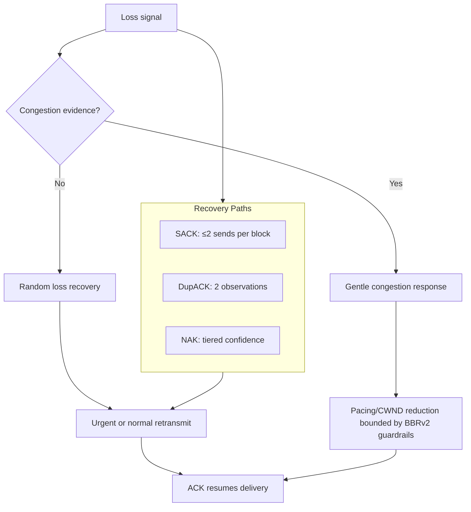
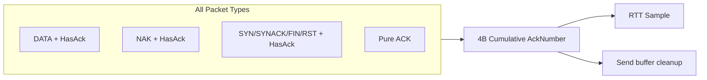
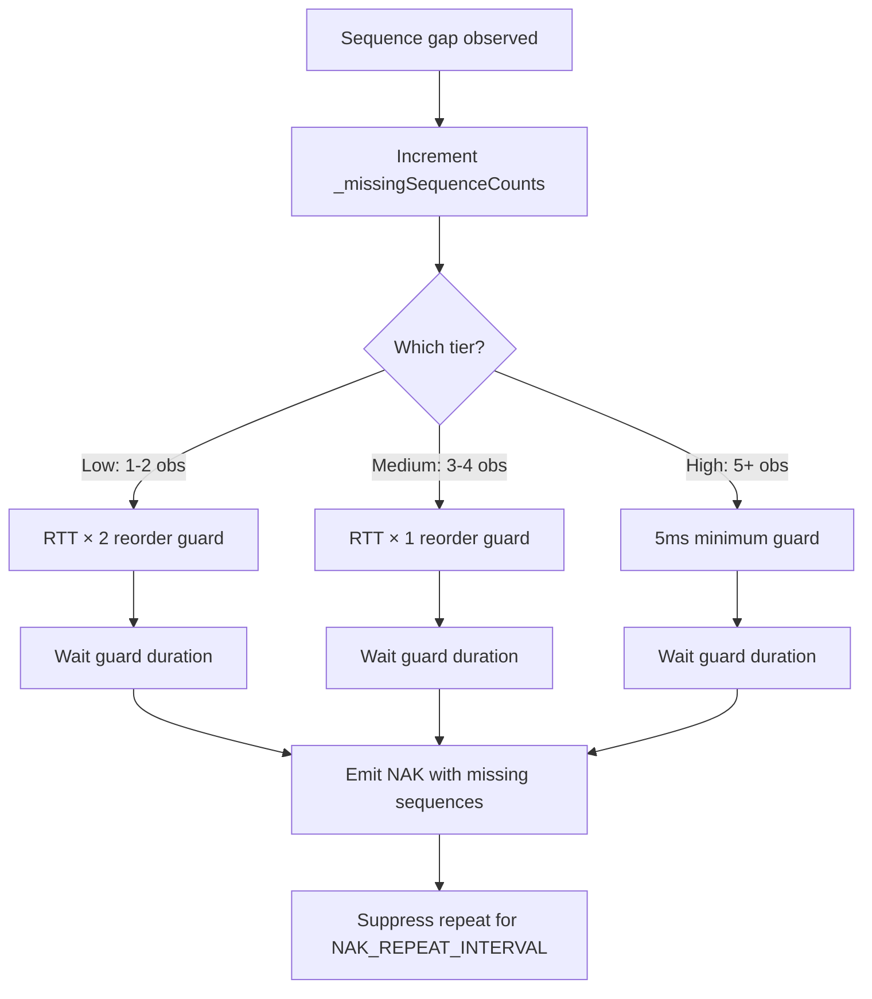
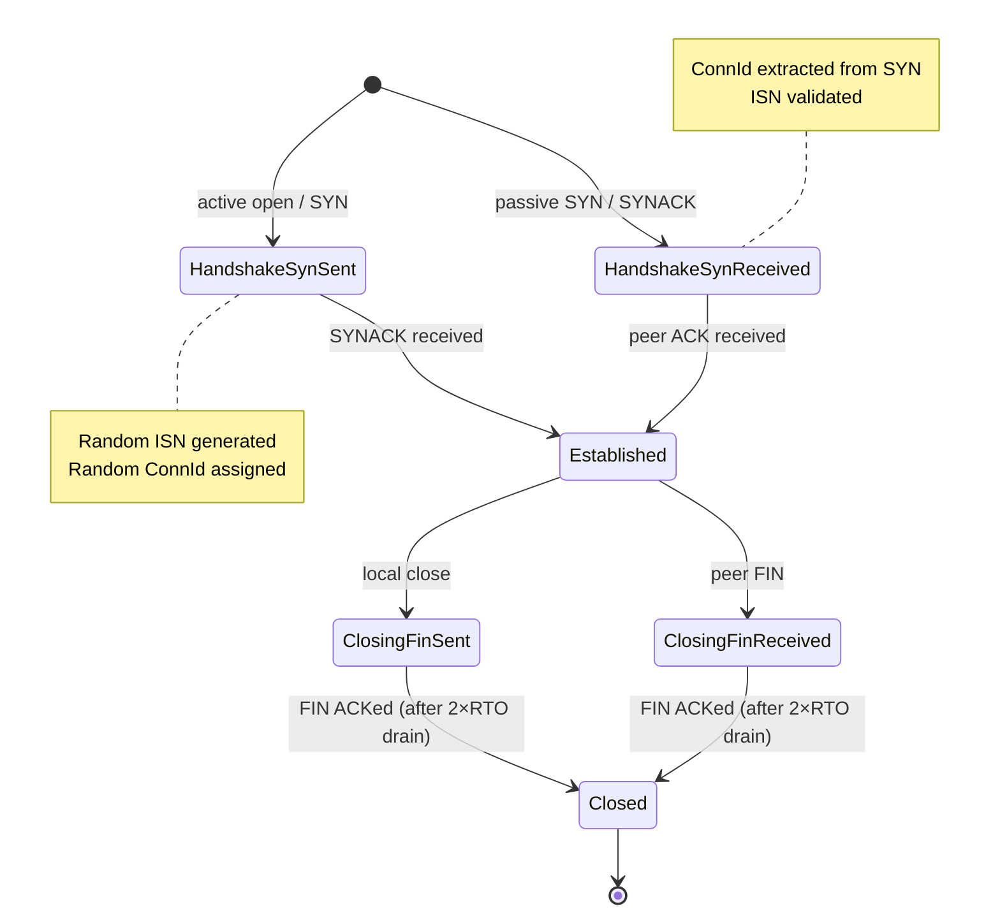
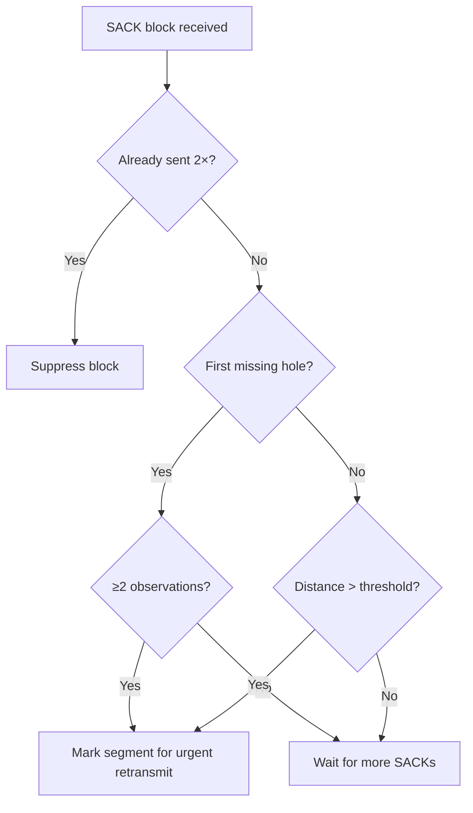
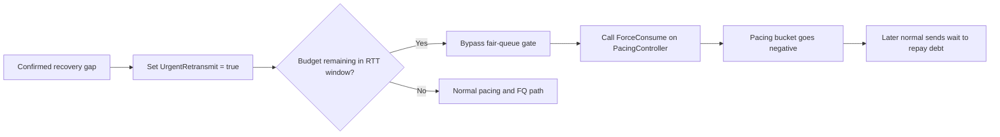
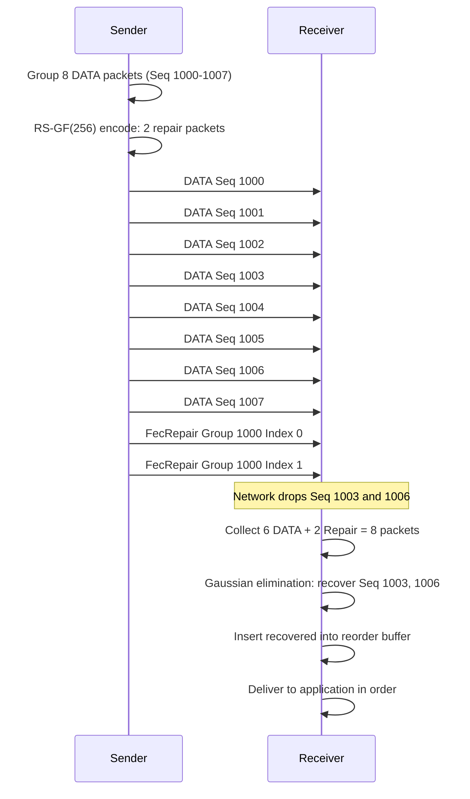

# PPP PRIVATE NETWORK™ X - Universal Communication Protocol (UCP) — Protocol

[中文](protocol_CN.md) | [Documentation Index](index.md)

**Protocol designation: `ppp+ucp`** — This document is the authoritative reference for the UCP wire format, reliability mechanisms, loss recovery strategies, congestion control algorithm, forward error correction design, and reporting semantics.

## Design Principles

UCP is built on three core design principles that distinguish it from traditional loss-reactive transports:

1. **Random loss is a recovery signal, not a congestion signal.** UCP retransmits missing data immediately upon detection, but it only reduces pacing rate or congestion window after multiple independent signals — RTT growth, delivery-rate degradation, and clustered loss — collectively confirm that the bottleneck is actually congested.

2. **Every packet carries reliability information.** UCP piggybacks a cumulative ACK number on Data, NAK, and control packets via the `HasAckNumber` flag, minimizing pure-ACK overhead and providing RTT samples on every received packet regardless of type.

3. **Recovery is tiered by confidence.** UCP uses three distinct recovery paths with escalating urgency: SACK (fastest, sender-driven), duplicate ACK (fast, sender-driven), and NAK (conservative, receiver-driven with tiered confidence). Each path has a defined role, and the protocol never races multiple recovery paths for the same gap.

## Packet Format

All multi-byte integer fields are encoded in network byte order (big-endian).

### Common Header (12 bytes)

All UCP packets share a common 12-byte header. This header includes the critical `HasAckNumber` flag that enables piggybacked cumulative ACK on every packet type.

| Offset | Field | Size | Description |
|---|---|---|---|
| 0 | Type | 1B | `0x01` SYN, `0x02` SYNACK, `0x03` ACK, `0x04` NAK, `0x05` DATA, `0x06` FIN, `0x07` RST, `0x08` FecRepair. |
| 1 | Flags | 1B | Bit 0 (`0x01`): **HasAckNumber** — if set, the AckNumber field follows the common header. Bit 1 (`0x02`): **Retransmit**. Bit 2 (`0x04`): **FinAck**. Bit 3 (`0x08`): **NeedAck**. |
| 2 | ConnId | 4B | Random 32-bit connection identifier for UDP multiplexing. Generated at SYN time from a cryptographic PRNG. |
| 6 | Timestamp | 6B | Sender local microsecond timestamp for RTT echo measurement. |

### The HasAckNumber Flag — Piggybacked Cumulative ACK

The `HasAckNumber` flag (`Flags & 0x01`) is the cornerstone of UCP's acknowledgment efficiency. When set, the packet header is immediately followed by a 4-byte cumulative ACK number, regardless of the packet type:

This means:
- A **DATA packet** carrying `HasAckNumber` simultaneously delivers payload and acknowledges received data — no separate ACK needed.
- A **NAK packet** carrying `HasAckNumber` reports missing sequences while acknowledging everything up to the cumulative point.
- **Control packets** (SYN, SYNACK, FIN, RST) can acknowledge handshake completion or last received data.
- The receiver provides an RTT sample for every received packet with `HasAckNumber` set, dramatically increasing RTT sample density and improving RTO estimator accuracy under bidirectional traffic.

### DATA Packet

| Offset | Field | Size | Description |
|---|---|---|---|
| 12 | [HasAckNumber then AckNumber] | 4B | Optional: present when Flags & 0x01 is set. |
| variable | SeqNum | 4B | Data sequence number of the first payload byte in this segment. |
| variable | FragTotal | 2B | Total fragments for this data segment (1 = unfragmented). |
| variable | FragIndex | 2B | Zero-based fragment index within this segment. |
| variable | Payload | ≤ `MSS - overhead` bytes | Application payload data. |

### ACK Packet

A pure ACK packet (Type `0x03`) may be sent when no other outbound traffic is available to piggyback on. The `HasAckNumber` flag is inherently true for ACK packets.

| Offset | Field | Size | Description |
|---|---|---|---|
| 12 | AckNumber | 4B | Cumulative ACK: all bytes through this sequence have been received. |
| 16 | SackCount | 2B | Number of SACK blocks that follow. |
| 18 | SackBlocks[] | N × 8B | Each block is `(StartSequence: 4B, EndSequence: 4B)` describing received ranges beyond the cumulative ACK. |
| variable | WindowSize | 4B | Advertised receive window in bytes. |
| variable | EchoTimestamp | 6B | Echo of the sender's timestamp from the packet being acknowledged. |

### SACK Block Sending Limit

Each SACK block range — defined by a `(StartSequence, EndSequence)` pair — may be advertised at most **2 times** during the lifetime of that range. Once a block has been sent twice, subsequent ACKs omit it. This QUIC-inspired limit prevents SACK amplification when a receiver is persistently reordered: the sender has two chances to receive and act on the SACK information, after which the block is considered stale. If the gap persists after two SACK sends, the sender relies on NAK and RTO for recovery.

### NAK Packet

NAK (Type `0x04`) is the receiver-driven negative acknowledgment. It is emitted when the receiver is confident that one or more sequence numbers have been permanently lost rather than merely reordered.

| Offset | Field | Size | Description |
|---|---|---|---|
| 12 | [HasAckNumber then AckNumber] | 4B | Optional cumulative ACK (recommended). |
| variable | MissingCount | 2B | Number of missing sequence entries. |
| variable | MissingSeqs[] | N × 4B | Missing sequence numbers in monotonically increasing order. |

### NAK Tiered Confidence Levels

UCP does not emit NAKs on the first sign of a gap. Instead, it uses three confidence tiers that progressively shorten the reorder guard as evidence mounts:

| Confidence Tier | Observation Count | Reorder Guard | Purpose |
|---|---|---|---|
| **Low** | 1-2 | `max(RTT × 2, 60ms)` | Conservative initial guard: the gap may be simple reordering. Long wait prevents false NAKs. |
| **Medium** | 3-4 | `max(RTT, 20ms)` | Mounting evidence: gap is likely real loss, guard is shortened to RTT. |
| **High** | 5+ | `max(5ms, RTT/4)` | Overwhelming evidence: gap is almost certainly loss. Minimal guard for fastest NAK emission. |

This tiered approach eliminates the classic false-positive NAK problem on high-jitter paths (mobile, satellite) while still providing fast loss notification when loss is unambiguous.

### FecRepair Packet

| Offset | Field | Size | Description |
|---|---|---|---|
| 12 | [HasAckNumber then AckNumber] | 4B | Optional cumulative ACK. |
| variable | GroupId | 4B | FEC group identifier, also the sequence number of the first DATA packet in the group. |
| variable | GroupIndex | 1B | Repair packet index within the group (0-based, up to R−1). |
| variable | Payload | Variable | GF(256) Reed-Solomon repair data. |

## Connection State Machine

## Loss Detection And Recovery

### QUIC-Style SACK Fast Retransmit

UCP's SACK-based fast retransmit follows a QUIC-inspired design with short reorder grace periods and per-block send limits:

1. **Block advertisement limit**: Each `(StartSeq, EndSeq)` SACK block is sent at most 2 times. After that, it is suppressed to prevent amplification.
2. **Reorder grace**: `max(3ms, RTT / 8)` — short enough that a truly lost packet triggers fast retransmit within a fraction of an RTT, long enough to absorb simple reordering.
3. **First-hole trigger**: The first cumulative ACK hole is eligible for repair after 2 SACK observations from the receiver.
4. **Subsequent holes**: Additional gaps below the highest SACKed sequence become eligible for repair if the distance from the highest observed sequence to the hole exceeds `SACK_FAST_RETRANSMIT_DISTANCE_THRESHOLD` (32). This enables parallel recovery of multiple independent losses in a single RTT rather than repairing one hole per RTT.

### Duplicate ACK Fast Retransmit

Two duplicate ACKs (same cumulative ACK number received 2 times) are sufficient to trigger fast retransmit when the suspected lost segment meets one of these conditions:
- The segment's age exceeds the SACK reorder grace period, or
- The total in-flight bytes are below the early retransmit threshold (small flight = low risk of spurious retransmit).

### Receiver NAK With Tiered Confidence

As described above, NAK emission uses three confidence tiers. The receiver also suppresses repeated NAKs for the same sequence number within `NAK_REPEAT_INTERVAL_MICROS` (250ms) to prevent NAK storms.

### RTO / PTO Guard

RTO is treated as a last-resort repair path. UCP uses a PTO (Probe Timeout) inspired guard: when ACK progress is recent (within `RTO_ACK_PROGRESS_SUPPRESSION_MICROS` = 2ms), bulk RTO scans are suppressed. This lets SACK, NAK, and FEC repair holes first, avoiding the classic problem of retransmitting the entire BDP when the path is alive but experiencing transient reordering.

RTO backoff uses a factor of `1.2` (not the traditional 2.0), providing faster escalation on truly dead paths while avoiding over-aggressive backoff on paths with occasional tail loss.

## Urgent Retransmit Mechanism

Normal data sends respect both fair-queue credit and token-bucket pacing. Urgent retransmits are marked only on recovery paths — SACK recovery, NAK recovery, duplicate ACK, or near-disconnect tail loss. When an urgent retransmit is allowed:

Key invariants:
- Urgent retransmits are capped at `URGENT_RETRANSMIT_BUDGET_PER_RTT` (16 packets per RTT window).
- `ForceConsume()` creates bounded negative token debt; the debt is repaid by subsequent normal sends.
- The per-RTT budget resets at each RTT boundary, preventing a single connection from monopolizing the network during extended recovery.

## BBRv2 Congestion Control

### State Transitions

`Startup → Drain → ProbeBW ↔ ProbeRTT`

| State | Behavior |
|---|---|
| **Startup** | Uses `pacing_gain = 2.5` and `cwnd_gain = 2.0` to rapidly discover bottleneck bandwidth. Exits when throughput stops growing significantly over 3 RTT windows. |
| **Drain** | Uses low pacing gain (0.75) to drain the queue built up during Startup. Duration is 1 BBR cycle. |
| **ProbeBW** | Cycles gains around the estimated bottleneck rate: `[1.25, 0.85, 1.0, 1.0, 1.0, 1.0, 1.0, 1.0]` over 8 phases. Random loss does not reduce gains unless congestion evidence is present. |
| **ProbeRTT** | Temporarily lowers pacing and CWND to refresh `MinRtt`. Skipped on lossy long-fat paths if the delivery rate remains high, to avoid unnecessary throughput dips. |

### Adaptive Pacing Gain

BBRv2 introduces adaptive pacing gain: the base gain cycle is multiplied by a congestion response factor. When congestion evidence is detected:
- `AdaptivePacingGain = BaseGain × 0.98` for the current cycle.
- Gains recover over subsequent cycles at a rate governed by `BBR_LOSS_CWND_RECOVERY_STEP`.

### Loss-Aware CWND

- **CWND floor**: After congestion loss, CWND gain is floored at `BBR_MIN_LOSS_CWND_GAIN = 0.95`, preventing the window from collapsing below 95% of BDP.
- **CWND recovery**: Each ACK restores `BBR_LOSS_CWND_RECOVERY_STEP = 0.04` of CWND gain, providing graceful recovery without overshoot.

## Forward Error Correction — Reed-Solomon GF(256)

UCP's FEC subsystem uses Reed-Solomon coding over GF(256), supporting recovery from up to R packet losses in a group of N data packets, where R is the number of repair packets.

### Encoding Process

1. The sender groups N consecutive DATA packets into an FEC group.
2. For each byte position across the N data payloads, construct a polynomial of degree N−1.
3. Evaluate the polynomial at R distinct points `{1, 2, ..., R}` in GF(256) to produce R repair bytes.
4. Transmit N DATA packets followed by R FecRepair packets.

### Decoding Process

1. The receiver collects any N out of N+R packets (data + repair) for the group.
2. Using the known evaluation points and received byte values, solve a linear system over GF(256) using Gaussian elimination to recover missing data bytes.
3. Reconstructed data is assembled into full DATA packet payloads with original sequence numbers and fragment metadata, then inserted into the reorder buffer for normal delivery.

### GF(256) Implementation

Operations in GF(256) use the irreducible polynomial `x^8 + x^4 + x^3 + x + 1` (0x11B). Multiplication and division use precomputed 256-entry logarithm and antilogarithm tables for constant-time execution.

## Reporting Semantics

| Metric | Source | Meaning |
|---|---|---|
| `Throughput Mbps` | `NetworkSimulator` | Payload bytes delivered divided by elapsed time, capped at `Target Mbps`. |
| `Util%` | Derived | `Throughput / Target × 100`, max 100%. |
| `Retrans%` | `UcpPcb` sender counters | Retransmitted DATA packets / original DATA packets sent. This is **protocol repair overhead**, not physical network loss. |
| `Loss%` | `NetworkSimulator` | DATA packets dropped by the simulator divided by DATA packets submitted. This is **physical network loss**, independent of protocol recovery. |
| `A->B ms`, `B->A ms` | `NetworkSimulator` | Measured one-way propagation delays in each direction. |
| `Avg/P95/P99/Jit ms` | `UcpRtoEstimator` | RTT statistics: mean, 95th/99th percentiles, and mean adjacent-sample jitter. |
| `CWND` | `Bbrv2CongestionControl` | Current congestion window with adaptive `B/KB/MB/GB` display. |
| `Current Mbps` | `Bbrv2CongestionControl` | Current instantaneous pacing rate. |
| `RWND` | `UcpPcb` | Advertised receive window from the remote peer. |
| `Waste%` | `UcpPcb` | Retransmitted DATA bytes as a percentage of original DATA bytes sent. |
| `Conv` | `NetworkSimulator` | Measured convergence time with adaptive `ns/us/ms/s` display. |

`Retrans%` and `Loss%` are intentionally independent metrics. A high-loss scenario with excellent FEC coverage may show `Loss% = 5%` but `Retrans% = 1%` (FEC repaired most losses). Conversely, a scenario with bad FEC configuration may show `Retrans% > Loss%` due to retransmission overhead.
