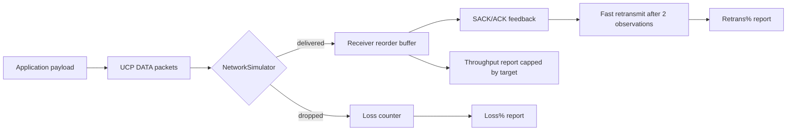

# UCP 协议深度解析 / UCP Protocol Deep Dive

本文件同时服务中文维护者和英文维护者。中文内容解释实现细节和调参动机；English notes mirror the same operational intent so performance reviews can be done without guessing from code alone.

## 1. 设计哲学

### 1.1 丢包不是拥塞

UCP 的核心设计原则是：**随机丢包只触发重传，不触发降速**。降速仅在三重信号同时满足时发生：
- 网络分类器判定当前处于拥塞状态（RTT 持续高于 MinRTT × 1.1）
- 去重后的滑动窗口丢包数超过阈值（>2 次孤立丢包或 ≥3 连续丢包）
- `EstimatedLossPercent` 超过配置的 `MaxBandwidthLossPercent`

这一设计使得 UCP 在有随机丢包的链路上吞吐显著优于传统 TCP（TCP Cubic 会在丢包时直接减半 CWND）。

English: random loss is a recovery signal, not an automatic congestion signal. UCP retransmits missing data immediately, but it only reduces pacing or CWND after RTT growth, delivery-rate degradation, and clustered loss agree that the bottleneck is actually congested.

### 1.2 QUIC 式丢包检测

借鉴 RFC 9002 的设计，UCP 使用双层丢包检测：

**基于 SACK 的包计数检测（kPacketThreshold）**：
- 首个缺失序号需 `MissingAckCount ≥ 2`（连续两次 SACK 观测）且包龄 ≥ `max(5ms, RTT/8)`。
- 首个缺失序号后方有 ≥ 2 个包被 SACK 确认时即可判定为高可信缺口，用于快速补洞。

**基于时间的丢包检测（kTimeThreshold）**：
- 包龄 ≥ `9/8 × smoothedRTT` 且后续有包被 SACK，判定为丢包

English: sender-side fast retransmit is intentionally quick: two SACK observations or two duplicate ACKs are enough to repair a hole after a short reorder grace. Receiver-side NAK is deliberately more conservative so high-jitter reordering is not misreported as loss.

### 1.3 接收端 NAK 状态机

接收端维护缺口追踪状态：
- 每收到一个乱序数据包，对缺口之间的所有序列号递增 `missingCount`
- 当 `missingCount ≥ NAK_MISSING_THRESHOLD`（2 次）且缺口年龄 ≥ `NAK_REORDER_GRACE_MICROS`（60ms），发出 NAK
- 已发出的 NAK 序列号进入 `_nakIssued` 集合，同 RTT 窗口内不再重复

English: NAKs are a receiver-side safety net. They are not the first line of defense on jittery links; SACK drives fast recovery, while NAK waits 60ms to avoid false positives under route jitter.

---

## 2. 包格式

### 2.1 公共头（12 字节，大端序）

| 偏移 | 字段 | 大小 | 说明 |
|---|---|---|---|
| 0 | Type | 1B | 0x01=SYN, 0x02=SYNACK, 0x03=ACK, 0x04=NAK, 0x05=DATA, 0x06=FIN, 0x07=RST, 0x08=FecRepair |
| 1 | Flags | 1B | 0x01=NeedAck, 0x02=Retransmit, 0x04=FinAck |
| 2 | ConnId | 4B | 连接标识符，UDP 多路复用的关键 |
| 6 | Timestamp | 6B | 发送方本地单调微秒时钟，用于 RTT 回显 |

### 2.2 DATA 包

| 偏移 | 字段 | 大小 |
|---|---|---|
| 12 | SeqNum | 4B |
| 16 | FragTotal | 2B |
| 18 | FragIndex | 2B |
| 20 | Payload | ≤ MSS-20 |

### 2.3 ACK 包

| 偏移 | 字段 | 大小 |
|---|---|---|
| 12 | AckNumber | 4B |
| 16 | SackCount | 2B |
| 18 | SackBlocks[] | N×8B |
| — | WindowSize | 4B |
| — | EchoTimestamp | 6B |

### 2.4 NAK 包

| 偏移 | 字段 | 大小 |
|---|---|---|
| 12 | MissingCount | 2B |
| 14 | MissingSeqs[] | N×4B |

### 2.5 FecRepair 包

| 偏移 | 字段 | 大小 |
|---|---|---|
| 12 | GroupId | 4B |
| 16 | GroupIndex | 1B |
| 17 | Payload | 变长 |

---

## 3. 连接状态机

```
INIT → HandshakeSynSent (ActiveOpen/SYN)
INIT → HandshakeSynReceived (Passive/SYN-ACK)
HandshakeSynSent → Established (SYN-ACK received)
HandshakeSynReceived → Established (ACK received)
Established → ClosingFinSent (Local close)
Established → ClosingFinReceived (Peer FIN)
ClosingFinSent → Closed (FIN ACKed)
ClosingFinReceived → Closed (FIN ACKed)
Closed → [terminal]
```

---

## 4. BBRv1 拥塞控制

### 4.1 状态机

```
Startup → Drain → ProbeBW ↔ ProbeRTT
```

- **Startup**: pacing_gain=2.0, cwnd_gain=2.0，快速探测瓶颈带宽。当 `fullBandwidthRounds ≥ 3` 时进入 Drain
- **Drain**: pacing_gain=0.75，排空 Startup 期间堆积的队列。当 inflight ≤ BDP 时进入 ProbeBW
- **ProbeBW**: 8 相位增益循环，动态调整探测强度；轻/中等随机丢包下保持 1.00-1.10 附近的 pacing gain，不因为丢包本身暴力降速
- **ProbeRTT**: pacing_gain=0.85，CWND 减半，刷新 MinRTT。周期 30s，至少持续 100ms

### 4.2 关键估计量

| 估计量 | 计算方法 | 用途 |
|---|---|---|
| `btl_bw` | 最近 10 个 RTT 窗口内的最大 delivery rate | Pacing 速率基准 |
| `MinRtt` | 最近 30s 内的最小 RTT 样本 | BDP 计算分母 |
| `BDP` | `btl_bw × MinRtt` | 目标飞行字节数 |
| `PacingRate` | `btl_bw × PacingGain` | 发送速率 |
| `CWND` | `BDP × CwndGain` | 拥塞窗口 |

English: the exported pacing rate is the controller's current instantaneous rate. Benchmark throughput is separately capped by the simulator bottleneck so the report never claims more bandwidth than the configured path can carry.

### 4.3 丢包分类器

`ClassifyNetworkCondition()` 使用多信号评分：

| 信号 | 阈值 | 得分 |
|---|---|---|
| 投递率下降 | ≤ -15% | +1 |
| RTT 增长 | ≥ 20% | +1 |
| 丢包 + RTT 增长 | ≥ 3% loss + ≥ 10% RTT | +1 |

总分 ≥ 2 → 判定为拥塞。孤立丢包 + RTT 无增长 → 判定为随机丢包。

### 4.4 网络分类器（NetworkClass）

协议在每 200ms 的统计窗口内积累 RTT/丢包/抖动/吞吐比，然后用 8 窗口滑动平均判定网络类型：

| 类型 | 条件 | 策略调整 |
|---|---|---|
| LowLatencyLAN | RTT<5ms, Loss<0.1%, Jitter<3ms | 激进增益 `ProbeBwHighGain` |
| MobileUnstable | Loss>3% 或 Jitter>20ms | 恢复优先增益 `BBR_MODERATE_PROBE_GAIN=1.10` |
| LossyLongFat | RTT>80ms, Loss>1% | 跳过 ProbeRTT，保持管道满载 |
| CongestedBottleneck | 吞吐下降+RTT上升 | 传统拥塞响应，降 pacing_gain |
| SymmetricVPN | RTT>30ms | 标准 BBR 行为 |

English: mobile or unstable links are not automatically throttled. They keep enough pacing gain to refill the pipe quickly after random loss or a short outage, while true congestion still requires RTT and rate evidence.

---

## 5. FEC 前向纠错

### 5.1 工作原理

每组 N 个（默认 8 个）数据包的 payload 进行按位 XOR 生成 1 个修复包。接收端在组内缺失恰好 1 个包且修复包已到达时，通过 XOR 恢复。

### 5.2 编码流程

```
发送端:
  1. 维护 _sendBuffer[N]，每发一个数据包填充一个槽位
  2. 组满后 XOR 所有 payload → repair
  3. 发送 FecRepair 包（GroupId=组首序列号）
  4. 清空缓冲区

接收端:
  1. HandleData 调用 FeedDataPacket(seq, payload) 存入分组缓冲
  2. HandleFecRepair 调用 TryRecoverFromRepair(repair, groupBase)
  3. 若组内缺 1 包 → XOR 恢复 → 插入 _recvBuffer → 触发有序交付
```

---

## 6. Strand 串行模型

每个连接有一个 `SerialQueue`（单消费者队列），所有协议操作都在此队列中串行执行：

- 用户 API 调用 → `_strand.EnqueueAsync(...)`
- 入站数据报 → `_strand.Post(async () => HandleInboundAsync(packet))`
- NAK 包使用 `PostPriority` 插队到队列头部，保证补洞信号优先处理

这一设计避免了锁竞争，同时保持协议状态的一致性。

---

## 7. 网络模拟器

`NetworkSimulator` 提供可配置的测试环境：

| 功能 | 参数 |
|---|---|
| 双向延迟 | `ForwardDelayMs` / `BackwardDelayMs`，独立配置 |
| 抖动 | `ForwardJitterMs` / `BackwardJitterMs`，均匀分布 |
| 动态波 | 默认 `DynamicWaveAmplitudeMs=0`；需要模拟动态路由波动时可显式开启正弦波 |
| 方向偏置 | 通过显式 forward/backward delay 或测试场景稳定哈希创建 A→B 与 B→A 差异 |
| 带宽序列化 | `BandwidthBytesPerSecond` 限制链路速率 |
| 丢包 | `LossRate` 基础丢包率 + `DropRule` 自定义规则 |
| 乱序/重复 | `ReorderRate` / `DuplicateRate` |
| 逻辑时钟 | 高带宽无丢包场景启用虚拟逻辑时钟，排除 OS 线程调度噪声 |

### 7.1 报告口径 / Reporting Semantics

| 字段 | 中文说明 | English |
|---|---|---|
| `Throughput Mbps` | 仿真器观测到的 payload 吞吐，并被链路目标速率封顶，因此不会超过 `Target Mbps`。 | Simulator-observed payload throughput capped by the configured bottleneck. |
| `Retrans%` | 发送端重传开销，等于重传 DATA 包数 / 原始 DATA 包数。 | Sender retransmission overhead, not the physical loss rate. |
| `Loss%` | 仿真器实际丢弃的 DATA 包比例，不包含恢复后的结果。 | Simulator-observed data packet loss before recovery. |
| `A->B ms` / `B->A ms` | 独立方向延迟，测试矩阵覆盖去程高与回程高，方向差保持 3-15ms。 | Independent one-way delays covering both forward-heavy and reverse-heavy paths. |
| `CWND` / `RWND` | 自动按 B/KB/MB/GB 显示，避免人工换算。 | Adaptive byte units to avoid manual conversion. |



English: report metrics intentionally separate path impairment from protocol repair. A high `Loss%` can coexist with a lower `Retrans%` when recovery is efficient, and `Throughput Mbps` cannot exceed the configured target because the simulator clamps it to the bottleneck budget.
