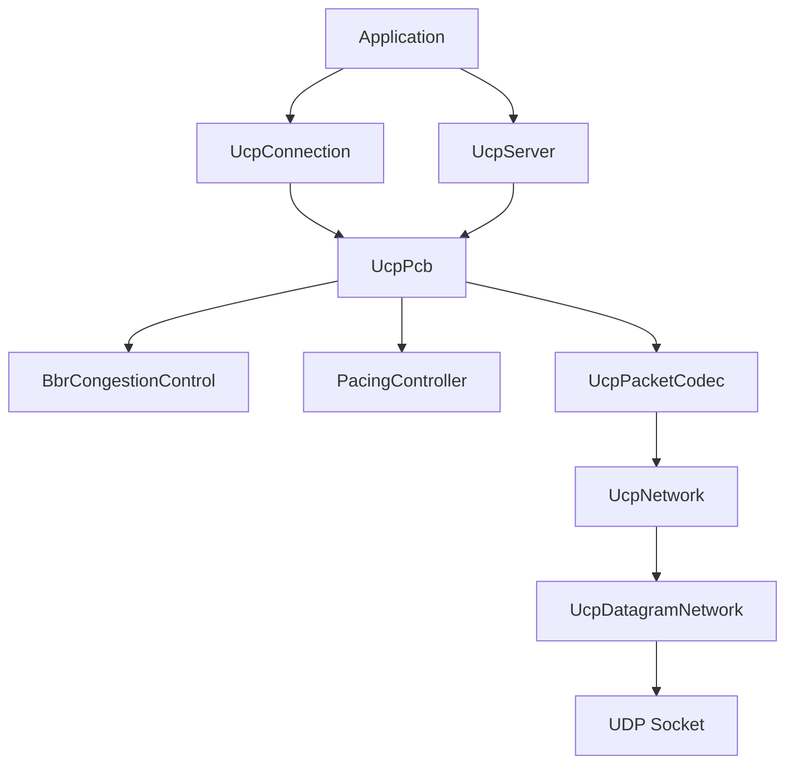
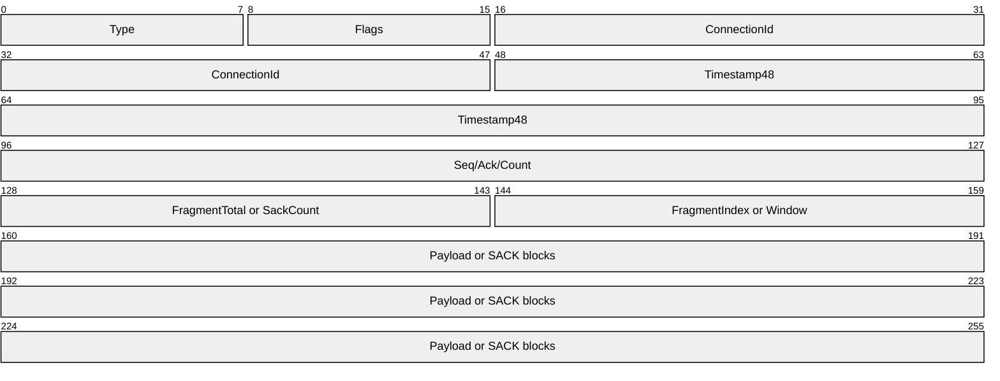
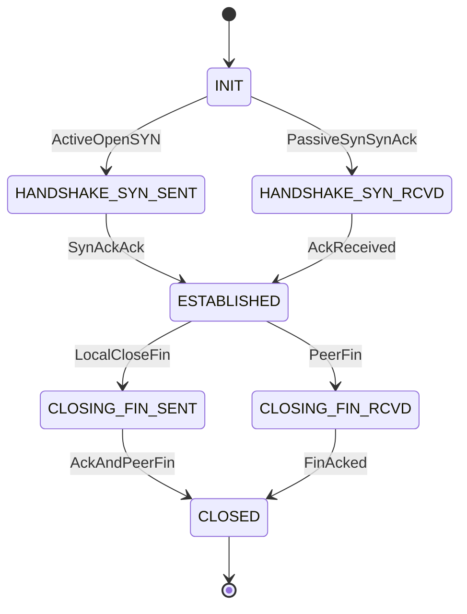
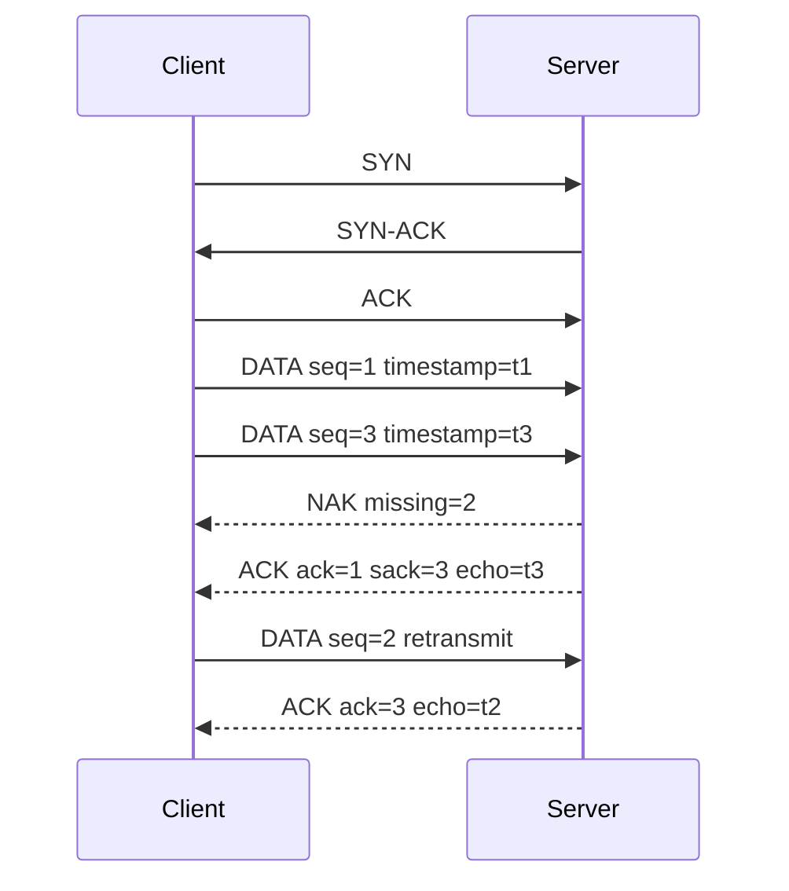
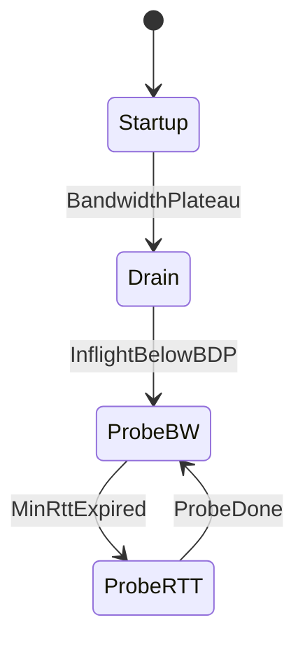
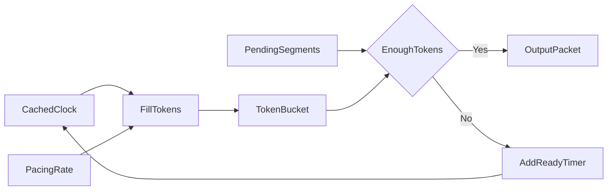
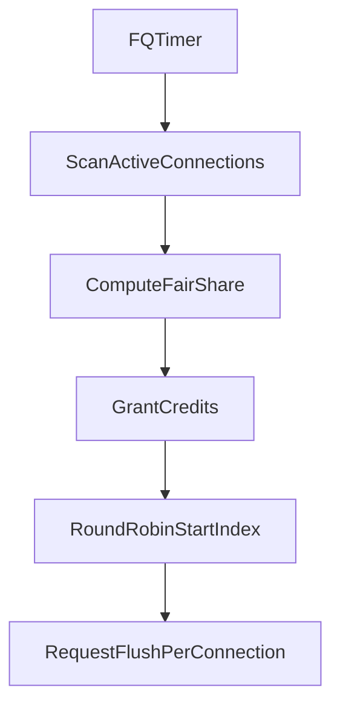

# UCP 协议说明

## 概览

UCP 是运行在 UDP 之上的可靠传输协议，当前工程实现具备：

- 固定公共头格式，大端序编码。
- DATA / ACK / NAK / SYN / SYN-ACK / FIN / RST。
- 累积确认、SACK、NAK、快速重传、RTO 超时重传。
- RTT 时间戳回显。
- BBRv1 风格拥塞控制。
- Pacing 令牌桶。
- 服务端 FQ 公平队列。
- 每连接 strand 串行化处理。
- `UcpNetwork.DoEvents()` 事件循环驱动模式。

## 架构分层图

## 包结构

### 公共头 12B

| 字段 | 大小 | 说明 |
| --- | --- | --- |
| Type | 1B | SYN / SYN-ACK / ACK / NAK / DATA / FIN / RST |
| Flags | 1B | NeedAck / Retransmit / FinAck |
| ConnId | 4B | 连接标识 |
| Timestamp | 6B | 本地单调微秒时间 |

`Timestamp` 来自全局 1ms 缓存单调时钟，协议只要求本地单调递增，不要求与对端时钟同步。

### DATA

| 字段 | 大小 | 说明 |
| --- | --- | --- |
| SeqNum | 4B | 32 位环绕序号 |
| FragTotal | 2B | 总分片数 |
| FragIdx | 2B | 分片索引 |
| Payload | 变长 | 单包不超过 MSS |

### ACK

| 字段 | 大小 | 说明 |
| --- | --- | --- |
| AckNumber | 4B | 累积确认号 |
| SackBlockCount | 2B | SACK 块数量 |
| SackBlocks | N * 8B | Start + End |
| WindowSize | 4B | 接收窗口大小，字节 |
| EchoTimestamp | 6B | 回显最近 DATA 的发送时间 |

### NAK

| 字段 | 大小 | 说明 |
| --- | --- | --- |
| MissingCount | 2B | 缺失序号数 |
| MissingList | N * 4B | 缺失序号列表 |

## 握手与序号同步

SYN / SYN-ACK 会额外携带本端初始发送序号。

这样双方在连接建立前就同步了彼此数据流起点，避免序号接近回绕边界时，首批 DATA 包被错误当作旧包或未来包。

## 连接状态机

## 数据传输时序

## RTT 测量

发送 DATA 时写入本地单调微秒时间到 `Timestamp`。

接收端发送 ACK 时，把最近收到 DATA 的 `Timestamp` 拷贝到 `EchoTimestamp`。

发送端收到 ACK 后：

- `RTT = now_local - EchoTimestamp`
- 不依赖对端时钟同步。

## 可靠传输

- ACK 负责累积确认连续到达的数据。
- SACK 报告乱序区间，避免冗余重传。
- NAK 在同一最早缺口被多次观测后上报，避免乱序场景中的 NAK 风暴。
- 三次重复 ACK 或三次 SACK 越过触发快速重传，并使用 RTT 包龄门限降低误重传。
- RTO 采用 `SRTT + 4 * RTTVAR`，退避因子可配置，默认 1.2，并对退避上限做温和限制。

## BBRv1 与 Pacing

当前实现为更接近生产行为的工程版：

- `btl_bw` 使用最近窗口最大 delivery rate。
- `min_rtt` 使用时间窗口内最小 RTT。
- Startup 在多轮带宽不再显著增长时退出。
- ProbeBW 使用动态 pacing gain，根据最近 1 秒重传率和 RTT 抬升程度调整探测强度。
- ProbeRTT 周期性触发，至少持续配置时长，并在收到接近最小 RTT 的样本后退出；随机丢包不会触发 ProbeRTT。
- Pacing 使用令牌桶，速率上限可配置。

## 令牌桶 Pacing

## FQ 公平调度

服务端每轮按连接 pacing rate 分配信用：

- 仅对仍有待发送数据的连接发额度。
- 信用按速率占比分配。
- 同时裁剪到公平份额上限，避免单连接瞬时霸占带宽。

## 网络驱动

`UcpNetwork` 把协议推进从具体 Socket 中解耦：

- `Input()` 接收一整个 UDP 数据报并按 `ConnectionId` 分发。
- `Output()` 由派生网络实现，默认 `UcpDatagramNetwork` 使用 UDP Socket 发送；发送方通过 `IUcpObject` 暴露 `ConnectionId` 与 `Network`。
- `DoEvents()` 运行到期计时器，驱动 RTO、keepalive、pacing 延迟 flush 和 FQ 调度。
- 计时器内部使用 `SortedDictionary<long, List<Action>>`，键为到期微秒时间。
- 无到期事件时，`DoEvents()` 会 `Thread.Yield()` 或 `Thread.Sleep(1)`，避免空转占满 CPU。

旧式 `UcpServer` / `UcpConnection` 直接构造仍可使用，内部保留后台计时器兼容行为；新代码建议由 `UcpNetwork` 创建对象并显式轮询 `DoEvents()`。

## 可配置项

`UcpConfiguration` 目前覆盖：

- MSS
- 窗口大小
- RTO 上下界
- 退避因子
- 初始带宽
- 最大 pacing 速率
- 初始拥塞窗口
- keepalive / 超时 / ProbeRTT / 定时器粒度
- FQ 轮转周期和服务器出口带宽

配置 API 只有 `UcpConfiguration` 一个类型，公开配置成员采用 .NET PascalCase 命名。

## 性能指标单位

协议内部带宽、pacing 和 delivery rate 使用 bytes/second。测试报告和用户可读表格统一转换为 Mbps，重传率、利用率和带宽浪费率统一显示为百分比。

## 统计与报告

`UcpConnection.GetReport()` 可返回：

- 发送字节数
- 接收字节数
- 数据包数
- 重传比
- RTT
- CWND
- Pacing 速率
- 远端窗口大小

测试项目会把关键场景性能数据写到 `reports/summary.txt`，并生成对齐的纯文本表格 `reports/test_report.txt`。测试脚本会读取并校验该报告，确保关键场景、吞吐、重传比例、pacing 与窗口指标没有缺失或明显异常。
