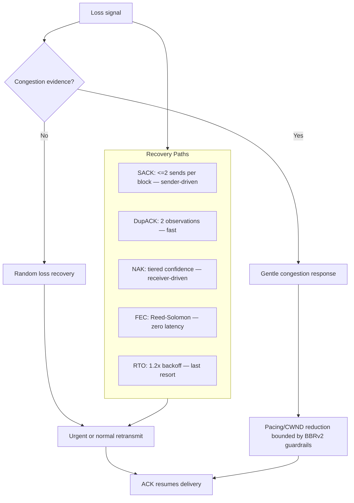
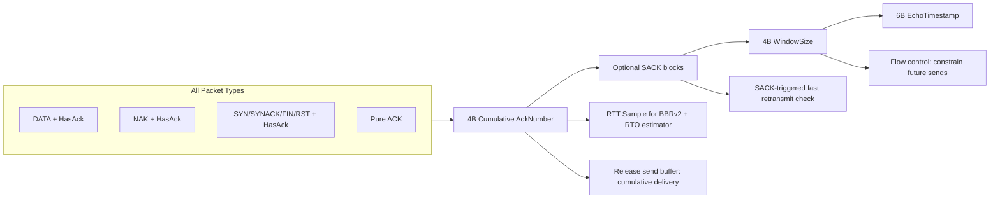
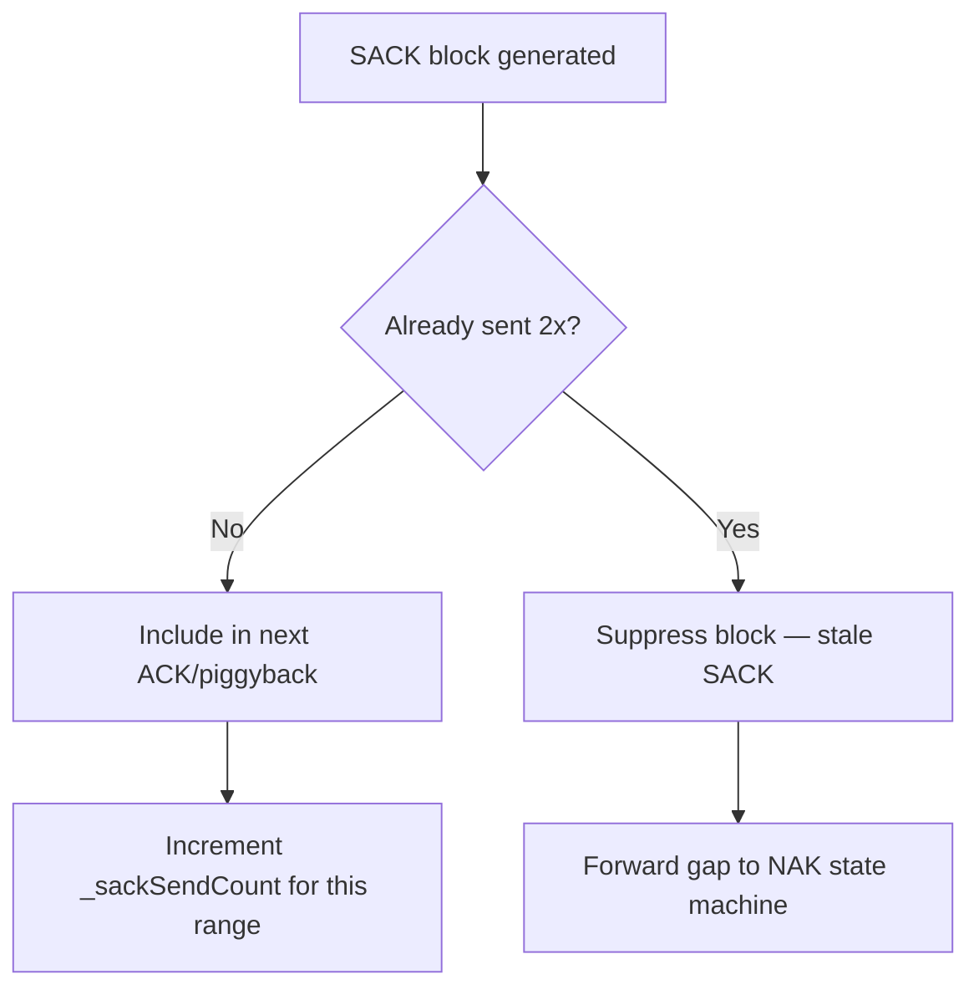
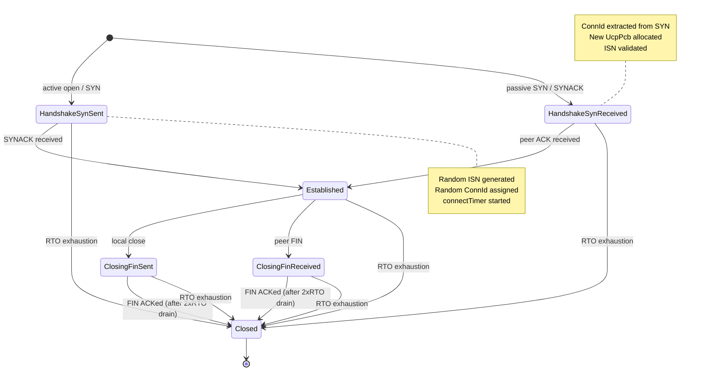
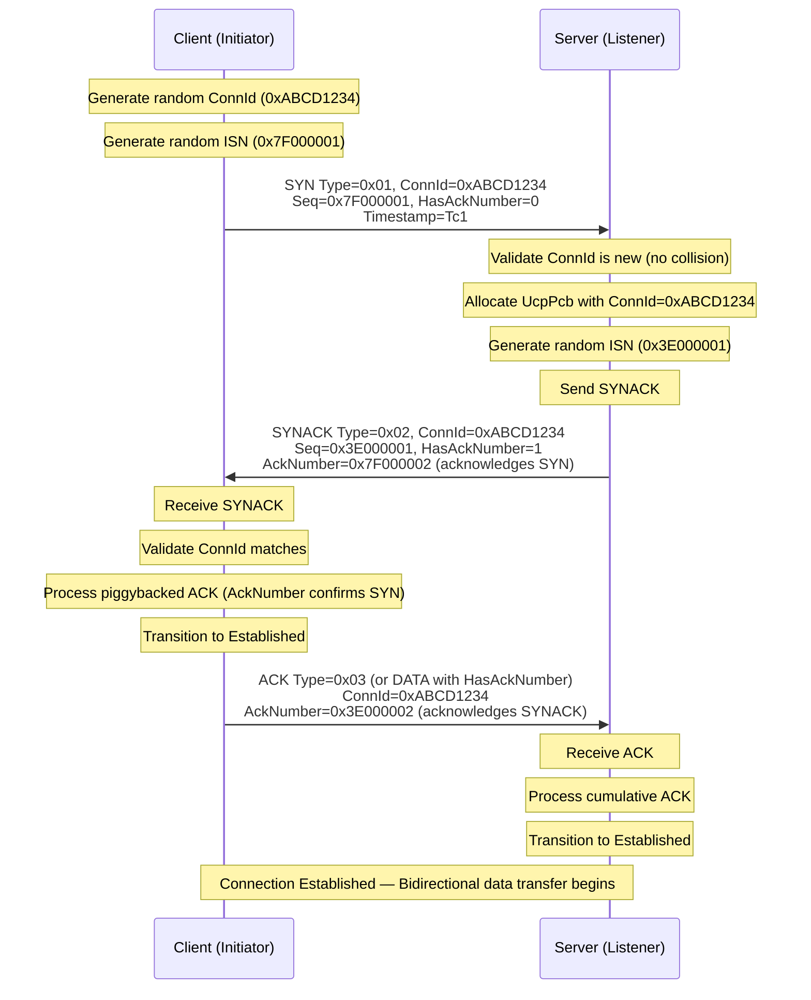
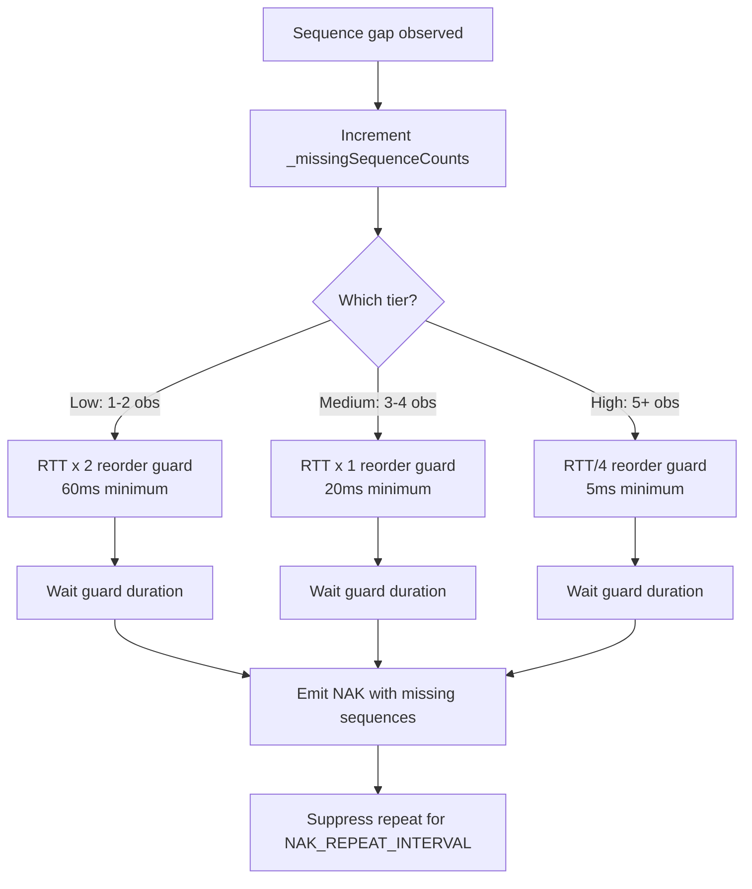
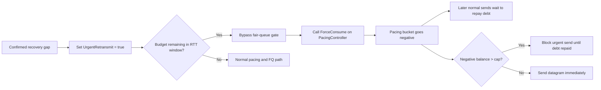
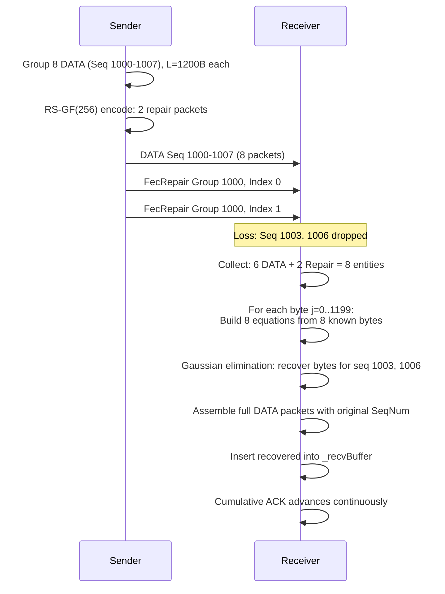

# PPP PRIVATE NETWORK™ X — Universal Communication Protocol (UCP) — Protocol

[中文](protocol_CN.md) | [Documentation Index](index.md)

**Protocol designation: `ppp+ucp`** — This document is the authoritative reference for the UCP wire format, reliability mechanisms, loss recovery strategies, congestion control algorithm, forward error correction design, and reporting semantics.

---

## Design Principles

UCP is built on three core design principles that distinguish it from traditional loss-reactive transports:

1. **Random loss is a recovery signal, not a congestion signal.** UCP retransmits missing data immediately upon detection, but it only reduces pacing rate or congestion window after multiple independent signals — RTT growth, delivery-rate degradation, and clustered loss — collectively confirm that the bottleneck is actually congested.

2. **Every packet carries reliability information.** UCP piggybacks a cumulative ACK number on Data, NAK, and control packets via the `HasAckNumber` flag, minimizing pure-ACK overhead and providing RTT samples on every received packet regardless of type.

3. **Recovery is tiered by confidence.** UCP uses three distinct recovery paths with escalating urgency: SACK (fastest, sender-driven), duplicate ACK (fast, sender-driven), and NAK (conservative, receiver-driven with tiered confidence). Each path has a defined role, and the protocol never races multiple recovery paths for the same gap.



---

## Packet Format

All multi-byte integer fields are encoded in network byte order (big-endian).

### Common Header (12 bytes)

All UCP packets share a common 12-byte header. This header includes the critical `HasAckNumber` flag that enables piggybacked cumulative ACK on every packet type.

| Offset | Field | Size | Description |
|---|---|---|---|
| 0 | Type | 1B | Packet type identifier. |
| 1 | Flags | 1B | Bit flags controlling ACK presence and state. |
| 2 | ConnId | 4B | Random 32-bit connection identifier for UDP multiplexing. |
| 6 | Timestamp | 6B | Sender local microsecond timestamp for RTT echo measurement. |

### Packet Types

| Type Code | Name | Purpose |
|---|---|---|
| `0x01` | SYN | Connection initiation. Carries random ISN and ConnId. |
| `0x02` | SYNACK | Connection acceptance. Echoes the client's ConnId and provides the server's ISN. |
| `0x03` | ACK | Pure acknowledgment packet. Used when no data payload is available to piggyback on. |
| `0x04` | NAK | Negative acknowledgment. Reports missing sequence numbers. |
| `0x05` | DATA | Application payload data. Carries sequence number and optional piggybacked ACK. |
| `0x06` | FIN | Graceful connection termination request. |
| `0x07` | RST | Hard connection reset. Indicates an unrecoverable error. |
| `0x08` | FecRepair | Forward error correction repair packet. Carries GF(256) repair data. |

### Flags Bit Layout

| Bit | Mask | Name | Description |
|---|---|---|---|
| 0 | `0x01` | **HasAckNumber** | If set, the AckNumber field follows the common header immediately. |
| 1 | `0x02` | **Retransmit** | Indicates this packet is a retransmission. |
| 2 | `0x04` | **FinAck** | Acknowledges the peer's FIN. |
| 3 | `0x08` | **NeedAck** | Requests immediate acknowledgment from the peer. |

### The HasAckNumber Flag — Piggybacked Cumulative ACK

The `HasAckNumber` flag (`Flags & 0x01`) is the cornerstone of UCP's acknowledgment efficiency. When set, the packet header is immediately followed by a 4-byte cumulative ACK number, regardless of the packet type:



**Piggyback Overhead Analysis:**

For a typical DATA packet without SACK blocks:
- Piggyback overhead: 4 (AckNumber) + 0 (SackCount=0) + 4 (WindowSize) + 6 (EchoTimestamp) = **14 bytes**
- At default MSS (1220 bytes): overhead = 14/1220 = **1.15%**
- At jumbo MSS (9000 bytes): overhead = 14/9000 = **0.16%**

### DATA Packet Layout

| Offset | Field | Size | Description |
|---|---|---|---|
| 0 | Common Header | 12B | Type=0x05, Flags (may include HasAckNumber), ConnId, Timestamp |
| 12 | [AckNumber] | 4B | Optional: present when Flags & HasAckNumber is set |
| variable | SeqNum | 4B | Data sequence number (first payload byte in this segment) |
| variable | FragTotal | 2B | Total fragments for this segment (1 = unfragmented) |
| variable | FragIndex | 2B | Zero-based fragment index within this segment |
| variable | Payload | <= MSS-overhead | Application payload data |

### ACK Packet Layout

| Offset | Field | Size | Description |
|---|---|---|---|
| 0 | Common Header | 12B | Type=0x03, ConnId, Timestamp |
| 12 | AckNumber | 4B | Cumulative ACK: all bytes through this sequence have been received |
| 16 | SackCount | 2B | Number of SACK blocks that follow (0-255) |
| 18 | SackBlocks[] | N x 8B | Each block: StartSequence(4B) + EndSequence(4B) — received ranges beyond cumulative ACK |
| variable | WindowSize | 4B | Advertised receive window in bytes (flow control) |
| variable | EchoTimestamp | 6B | Echo of sender's timestamp from the packet being acknowledged |

### SACK Block Sending Limit

Each SACK block range — defined by a `(StartSequence, EndSequence)` pair — may be advertised at most **2 times** during the lifetime of that range. Once a block has been sent twice, subsequent ACKs omit it. This QUIC-inspired limit prevents SACK amplification when a receiver is persistently reordered: the sender has two chances to receive and act on the SACK information, after which the block is considered stale.



### NAK Packet Layout

| Offset | Field | Size | Description |
|---|---|---|---|
| 0 | Common Header | 12B | Type=0x04, ConnId, Timestamp |
| 12 | [AckNumber] | 4B | Optional: present when Flags & HasAckNumber is set (recommended) |
| variable | MissingCount | 2B | Number of missing sequence entries (0-256) |
| variable | MissingSeqs[] | N x 4B | Missing sequence numbers in monotonically increasing order |

### FecRepair Packet Layout

| Offset | Field | Size | Description |
|---|---|---|---|
| 0 | Common Header | 12B | Type=0x08, ConnId, Timestamp |
| 12 | [AckNumber] | 4B | Optional: present when Flags & HasAckNumber is set |
| variable | GroupId | 4B | FEC group identifier (sequence number of first DATA packet in group) |
| variable | GroupIndex | 1B | Repair packet index within group (0-based, up to R-1) |
| variable | Payload | variable | GF(256) Reed-Solomon repair data |

---

## Connection State Machine



### State Transition Details

| Transition | Trigger | Outbound | Timer Started | Timer Stopped |
|---|---|---|---|---|
| Init -> HandshakeSynSent | `ConnectAsync()` | SYN with random ISN + ConnId | connectTimer | — |
| Init -> HandshakeSynReceived | Server receives SYN | SYNACK with server ISN | connectTimer | — |
| HandshakeSynSent -> Established | SYNACK received, ACK processed | — | — | connectTimer |
| HandshakeSynReceived -> Established | ACK received from client | — | — | connectTimer |
| Established -> ClosingFinSent | `Close()` / `CloseAsync()` | FIN with FinAck if needed | disconnectTimer | keepAliveTimer |
| Established -> ClosingFinReceived | FIN received from peer | ACK of FIN | disconnectTimer | keepAliveTimer |
| ClosingFinSent -> Closed | Peer ACKs FIN | — | — | disconnectTimer |
| ClosingFinReceived -> Closed | Local FIN sent + ACKed | — | — | disconnectTimer |
| Any -> Closed | RTO count > MaxRetransmissions | RST (optional) | — | all timers |

---

## Sequence Number Arithmetic

UCP uses 32-bit sequence numbers with standard TCP-inspired comparison rules. All sequence comparisons use unsigned arithmetic with a 2^31 window for unambiguous ordering:

```
seq_a > seq_b if: (uint)(seq_a - seq_b) < 2^31
seq_a < seq_b if: (uint)(seq_b - seq_a) < 2^31
```

This provides unambiguous ordering for up to 2^31 (2.1 billion) outstanding sequence numbers — far more than any practical send buffer can hold.

**Sequence space usage per connection:**
- **ISN**: Randomly generated at SYN time (cryptographic PRNG)
- **DATA sequences**: ISN + 1, ISN + 2, ... (monotonically increasing)
- **ACK sequences**: Cumulative — the next expected byte
- **SACK ranges**: (StartSeq, EndSeq) pairs, inclusive of Start, exclusive of End
- **Wrap-around**: After 2^32, wraps to 0; comparison uses 2^31 window

---

## Handshake Process



The SYN and SYNACK packets both support piggybacked ACK via the `HasAckNumber` flag. This enables connection migration where a re-SYN carries acknowledgment of previously received data.

---

## Loss Detection And Recovery

### Complete Recovery Flow

```mermaid
flowchart TD
    Drop[Network drops DATA packet] --> Gap[Receiver detects gap]

    Gap --> OutOfOrder[Subsequent packet arrives above gap]
    OutOfOrder --> SackGen[UcpSackGenerator creates SACK block]
    SackGen --> SackLimit{Block sent < 2x?}
    SackLimit -->|Yes| SackSend[Include in next ACK/piggyback]
    SackLimit -->|No| SackSuppress[Suppress block]

    SackSend --> SackRecv[Sender receives SACK]
    SackRecv --> SackEval{>=2 SACK observations?}
    SackEval -->|Yes| SackReGrace{elapsed > max(3ms, RTT/8)?}
    SackEval -->|No| SackWait[Wait for more SACKs]
    SackReGrace -->|Yes| SackRepair[Mark for urgent retransmit]
    SackReGrace -->|No| SackWait

    Gap --> ObsCount[Increment _missingSequenceCounts[seq]]
    ObsCount --> NakTier{Confidence tier?}
    NakTier -->|Low: 1-2| NakGuard1[Guard: max(RTTx2, 60ms)]
    NakTier -->|Medium: 3-4| NakGuard2[Guard: max(RTT, 20ms)]
    NakTier -->|High: 5+| NakGuard3[Guard: max(RTT/4, 5ms)]
    NakGuard1 --> NakSup{Repeat suppressed?}
    NakGuard2 --> NakSup
    NakGuard3 --> NakSup
    NakSup -->|Yes| NakWait[Skip — wait for suppression expiry]
    NakSup -->|No| NakEmit[Emit NAK]

    NakEmit --> NakRecv[Sender receives NAK]
    NakRecv --> NakRepair[Mark for urgent retransmit]

    Gap --> FecCheck{FEC recovery possible?}
    FecCheck -->|Yes| FecRepair[GF256 Gaussian elimination]
    FecRepair --> Insert[Insert recovered DATA into recv buffer]
    FecCheck -->|No| WaitForRepair[Wait for retransmission]

    SackRepair --> Repair[Execute retransmission]
    NakRepair --> Repair

    Repair --> UrgentBudget{Urgent budget remaining?}
    UrgentBudget -->|Yes| Force[ForceConsume + bypass FQ]
    UrgentBudget -->|No| Normal[Normal pacing + FQ path]

    Force --> Deliver[Deliver to application]
    Normal --> Deliver
    Insert --> Deliver
```

### QUIC-Style SACK Fast Retransmit

Key parameters governing SACK-based recovery:

| Parameter | Value | Meaning |
|---|---|---|
| `SACK_FAST_RETRANSMIT_THRESHOLD` | 2 | Number of SACK observations before repair eligibility |
| `SACK_FAST_RETRANSMIT_MIN_REORDER_GRACE_MICROS` | 3,000 | Minimum sender-side reorder grace (3ms) |
| `SACK_FAST_RETRANSMIT_DISTANCE_THRESHOLD` | 32 | Distance threshold for parallel multi-hole repair |
| `SACK_BLOCK_MAX_SENDS` | 2 | Maximum SACK block advertisement count |
| `DUPLICATE_ACK_THRESHOLD` | 2 | Number of duplicate ACKs for fast retransmit |

### NAK Tiered Confidence Levels



| Confidence Tier | Observation Count | Reorder Guard Formula | Absolute Minimum | Purpose |
|---|---|---|---|---|
| **Low** | 1-2 | `max(RTT x 2, 60ms)` | 60ms | Conservative: prevent false NAKs on jittery paths |
| **Medium** | 3-4 | `max(RTT, 20ms)` | 20ms | Evidence mounting: shorten guard to ~1 RTT |
| **High** | 5+ | `max(RTT/4, 5ms)` | 5ms | Overwhelming: minimal guard for fastest NAK emission |

### RTO / PTO Guard

RTO is treated as a last-resort repair path. Key behaviors:

- **RTO backoff**: Multiplicative factor of 1.2 (milder than TCP's 2.0)
- **ACK progress suppression**: If ACK progress occurred within `RTO_ACK_PROGRESS_SUPPRESSION_MICROS` (2ms), bulk RTO scanning is suppressed
- **Budget per tick**: Maximum `RTO_RETRANSMIT_BUDGET_PER_TICK` (4) packets retransmitted per timer tick
- **Escalation**: 200ms -> 240ms -> 288ms -> 346ms -> ... -> 15s max

---

## Urgent Retransmit Mechanism



Key invariants:
- Urgent retransmits are capped at `URGENT_RETRANSMIT_BUDGET_PER_RTT` (16 packets per RTT window).
- `ForceConsume()` creates bounded negative token debt (max 50% of bucket capacity).
- The per-RTT budget resets at each RTT boundary, preventing a single connection from monopolizing the network.

---

## BBRv2 Congestion Control

### State Transitions

```
Startup -> Drain -> ProbeBW <-> ProbeRTT
```

| State | Behavior | Pacing Gain | CWND Gain | Exit Condition |
|---|---|---|---|---|
| **Startup** | Rapidly probe for bottleneck bandwidth | 2.5 | 2.0 | Throughput plateau for 3 RTT windows |
| **Drain** | Drain excess queue from Startup | 0.75 | — | Inflight < BDP x target |
| **ProbeBW** | Steady-state cycling around BtlBw | [1.25, 0.85, 1.0x6] | 2.0 | 30s ProbeRTT interval |
| **ProbeRTT** | Refresh MinRTT estimate | 1.0 | 4 packets | 100ms elapsed |

### Adaptive Pacing Gain

BBRv2 introduces adaptive pacing gain: the base gain cycle is multiplied by a congestion response factor:

- `AdaptivePacingGain = BaseGain x CongestionFactor`
- `CongestionFactor` defaults to 1.0 (no congestion)
- On congestion evidence: `CongestionFactor *= 0.98` (2% reduction)
- Recovery: Factor increases by `BBR_LOSS_CWND_RECOVERY_STEP` (0.04) per ACK toward 1.0

### Loss-Aware CWND

- **CWND floor**: After congestion loss, CWND gain is floored at `BBR_MIN_LOSS_CWND_GAIN = 0.95`
- **CWND recovery**: Each ACK restores `BBR_LOSS_CWND_RECOVERY_STEP = 0.04` of CWND gain

---

## Forward Error Correction — Reed-Solomon GF(256)

### Mathematical Foundation

UCP's FEC uses Reed-Solomon coding over GF(256) with irreducible polynomial `x^8 + x^4 + x^3 + x + 1` (0x11B).

**Encoding**: For a group of N data packets with payload length L bytes each:
1. For each byte position j (0 to L-1), form vector v = [data[0][j], data[1][j], ..., data[N-1][j]]
2. Generate R repair bytes: repair[i][j] = Σ(k=0 to N-1) (data[k][j] * α^(i*k)) in GF(256)
   where α is a primitive element and i ranges from 1 to R
3. Group repair bytes into R FecRepair packets

**Decoding**: When M packets are lost (M <= R):
1. Collect N received packets (data + repair) for the group
2. For each byte position, solve the linear system A*x = b over GF(256) using Gaussian elimination
3. Recover M missing data bytes per position
4. Assemble recovered bytes into DATA packets with original sequence numbers



### GF(256) Implementation

- **Irreducible polynomial**: `x^8 + x^4 + x^3 + x + 1` = 0x11B
- **Log/antilog tables**: 256-entry log table (0x00 maps to special value), 512-entry antilog table
- **Addition**: XOR (byte-level)
- **Multiplication**: `a * b = antilog[(log[a] + log[b]) mod 255]` (O(1))
- **Division**: `a / b = antilog[(log[a] - log[b] + 255) mod 255]` (O(1))

---

## Reporting Semantics

| Metric | Source | Meaning |
|---|---|---|
| `Throughput Mbps` | `NetworkSimulator` | Payload bytes delivered divided by elapsed time, capped at `Target Mbps`. |
| `Util%` | Derived | `Throughput / Target x 100`, max 100%. |
| `Retrans%` | `UcpPcb` sender counters | Retransmitted DATA / original DATA. **Protocol repair overhead**, not physical network loss. |
| `Loss%` | `NetworkSimulator` | Simulator-dropped DATA / submitted DATA. **Physical network loss**, independent of protocol recovery. |
| `A->B ms`, `B->A ms` | `NetworkSimulator` | Measured one-way propagation delays per direction. |
| `Avg/P95/P99/Jit ms` | `UcpRtoEstimator` | RTT statistics: mean, 95th/99th percentiles, mean adjacent-sample jitter. |
| `CWND` | `Bbrv2CongestionControl` | Current congestion window with adaptive B/KB/MB/GB display. |
| `Current Mbps` | `Bbrv2CongestionControl` | Instantaneous pacing rate at transfer completion. |
| `RWND` | `UcpPcb` | Advertised receive window from the remote peer. |
| `Waste%` | `UcpPcb` | Retransmitted DATA bytes / original DATA bytes. |
| `Conv` | `NetworkSimulator` | Measured convergence time with adaptive ns/us/ms/s display. |

`Retrans%` and `Loss%` are intentionally independent metrics. A high-loss scenario with excellent FEC coverage may show `Loss% = 5%` but `Retrans% = 1%` (FEC repaired most losses). A scenario with bad FEC configuration may show `Retrans% > Loss%` due to retransmission overhead.
