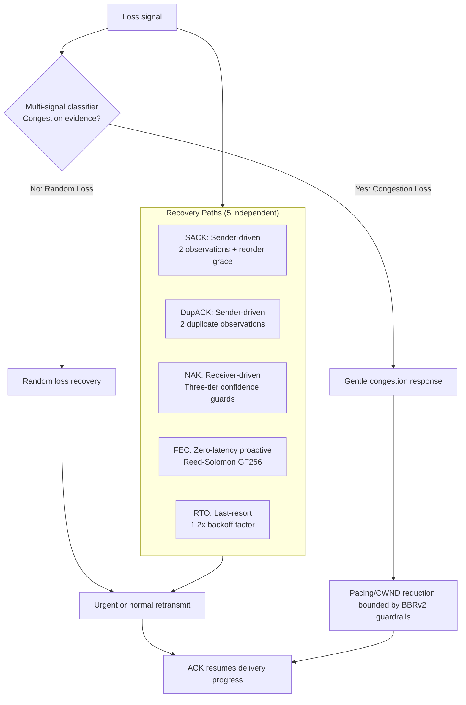
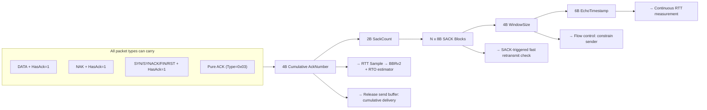
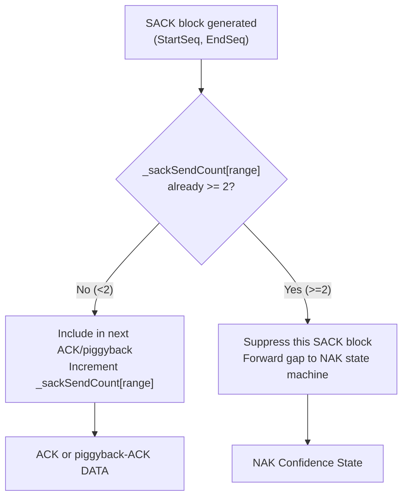
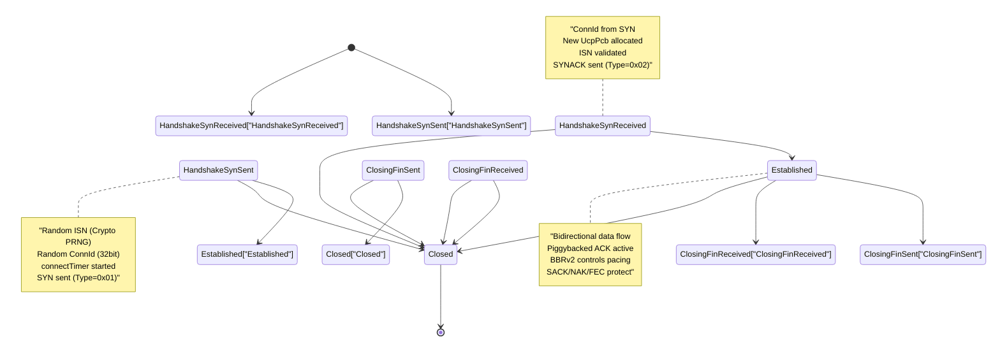
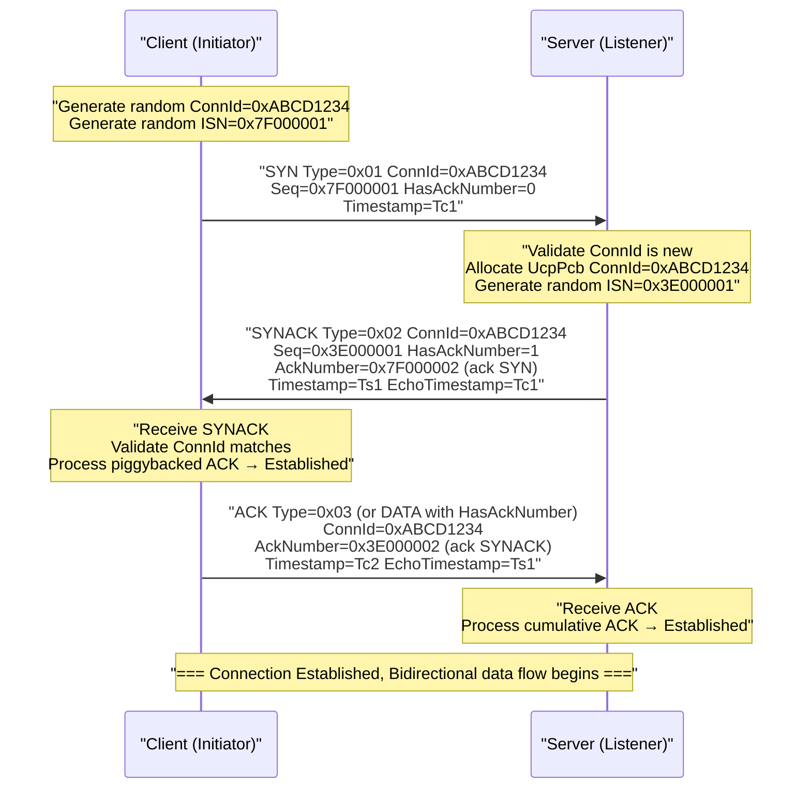
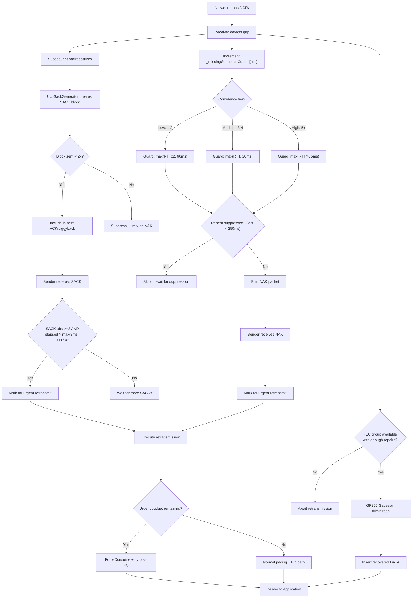
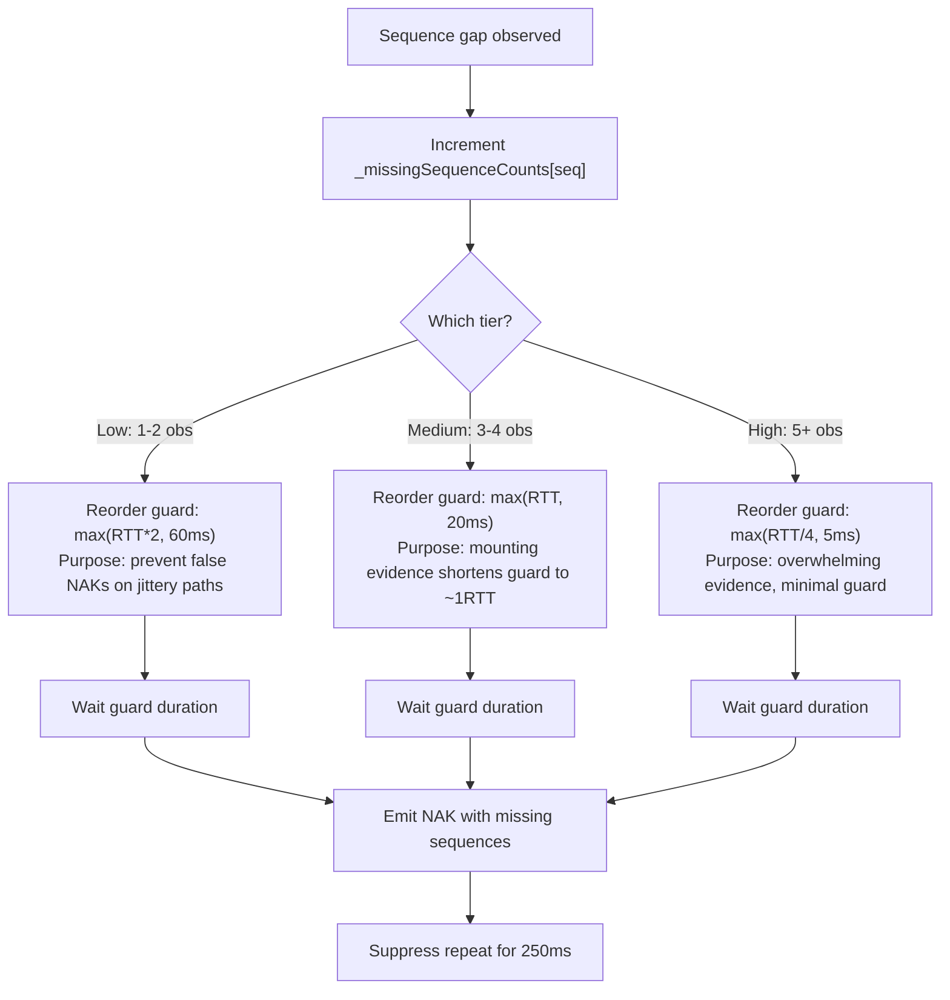
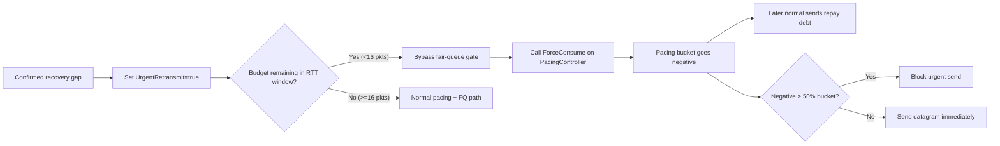
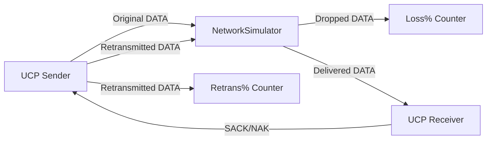

# PPP PRIVATE NETWORK™ X — Universal Communication Protocol (UCP) — Protocol Specification

[中文](protocol_CN.md) | [Documentation Index](index.md)

**Protocol designation: `ppp+ucp`** — This document is the authoritative specification of UCP's wire format, reliability mechanisms, loss recovery strategies, congestion control algorithm, forward error correction design, and reporting semantics. All multi-byte integer fields are encoded in network byte order (big-endian).

---

## Design Principles

UCP is built on three core design principles that fundamentally distinguish it from traditional loss-reactive transport protocols:

1. **Random loss is a recovery signal, not a congestion signal.** UCP retransmits missing data immediately through one of multiple recovery paths upon detection. But it only reduces pacing rate or congestion window after multiple independent signals—RTT inflation, delivery-rate degradation, and clustered loss—collectively confirm bottleneck congestion.

2. **Every packet carries reliability information.** UCP piggybacks a cumulative ACK number on DATA, NAK, and all control packets (SYN/SYNACK/FIN/RST) via the `HasAckNumber` flag. This minimizes pure-ACK overhead and provides continuous RTT samples on every received packet regardless of type.

3. **Recovery is tiered by confidence, never racing.** UCP uses five independent recovery paths (SACK, DupACK, NAK, FEC, RTO), each with a clearly defined role and trigger. For the same gap, the protocol activates only the most appropriate path—never racing multiple paths.



---

## Packet Format

### Common Header (12 bytes — mandatory for all packet types)

| Offset | Field | Size | Description |
|---|---|---|---|
| 0 | `Type` | 1B | Packet type identifier |
| 1 | `Flags` | 1B | Bit flags controlling ACK presence and packet state |
| 2 | `ConnId` | 4B | Random 32-bit connection identifier for UDP multiplexing and IP-agnostic session tracking |
| 6 | `Timestamp` | 6B | Sender local microsecond timestamp for RTT echo measurement |

### Packet Type Enumeration

| Type Code | Name | Payload Meaning |
|---|---|---|
| `0x01` | **SYN** | Connection initiation. Carries client's random ISN, random ConnId, and initial config. |
| `0x02` | **SYNACK** | Connection acceptance. Echoes client ConnId, provides server's random ISN. Supports `HasAckNumber` to piggyback-ack the client's SYN. |
| `0x03` | **ACK** | Pure acknowledgment. Cumulative ACK, SACK blocks, receive window, and timestamp echo. |
| `0x04` | **NAK** | Negative acknowledgment. Reports up to 256 missing sequence numbers. Supports `HasAckNumber`. |
| `0x05` | **DATA** | Application payload. Sequence number, fragmentation info, and optional piggybacked ACK. |
| `0x06` | **FIN** | Graceful connection termination. Carries final sequence number. Supports `HasAckNumber`. |
| `0x07` | **RST** | Hard connection reset. Indicates unrecoverable error. |
| `0x08` | **FecRepair** | Forward error correction repair. Carries group identifier, repair index, and GF(256) RS repair data. Supports `HasAckNumber`. |

### Flags Bit Layout

| Bit | Mask | Name | Description |
|---|---|---|---|
| 0 | `0x01` | **HasAckNumber** | If set, a 4-byte AckNumber field follows the common header immediately |
| 1 | `0x02` | **Retransmit** | Indicates this packet is a retransmission (not first send) |
| 2 | `0x04` | **FinAck** | Acknowledges the peer's FIN |
| 3 | `0x08` | **NeedAck** | Requests immediate acknowledgment from the peer |
| 4-7 | — | **Reserved** | Must be zero |

---

## HasAckNumber — Piggybacked Cumulative ACK

The `HasAckNumber` flag is the cornerstone of UCP's acknowledgment efficiency:



### Piggyback Overhead Evaluation

| Scenario | Piggyback Fields | Overhead Bytes | MSS | Overhead % |
|---|---|---|---|---|
| Pure DATA (no SACK) | AckNumber(4)+SackCount(2)+WindowSize(4)+EchoTimestamp(6) | 16 bytes | 1220 | 1.31% |
| Pure DATA (no SACK) | Same | 16 bytes | 9000 | 0.18% |
| DATA + 3 SACK blocks | Above + 3×8=24 bytes | 40 bytes | 1220 | 3.28% |

---

## Detailed Packet Layouts

### DATA Packet

| Offset | Field | Size | Description |
|---|---|---|---|
| 0 | `CommonHeader` | 12B | Type=0x05, Flags (may include HasAckNumber/Retransmit/NeedAck), ConnId, Timestamp |
| 12 | `[AckNumber]` | 4B | Optional: present when `Flags & HasAckNumber` is set |
| variable | `SeqNum` | 4B | Data sequence number of the first payload byte in this segment |
| variable | `FragTotal` | 2B | Total fragments for this segment. 1 = unfragmented |
| variable | `FragIndex` | 2B | Zero-based fragment index within this segment |
| variable | `Payload` | ≤ MSS−overhead | Application data |

### ACK Packet

| Offset | Field | Size | Description |
|---|---|---|---|
| 0 | `CommonHeader` | 12B | Type=0x03, ConnId, Timestamp |
| 12 | `AckNumber` | 4B | Cumulative ACK: all bytes through this sequence received |
| 16 | `SackCount` | 2B | Number of SACK blocks that follow (0-255, default max 149) |
| 18 | `SackBlocks[]` | N×8B | Each block: (StartSequence(4B), EndSequence(4B)). Start inclusive, End exclusive |
| variable | `WindowSize` | 4B | Advertised receive window in bytes (flow control) |
| variable | `EchoTimestamp` | 6B | Echo of the acknowledged packet's Timestamp field |

### SACK Block Send Limit

Each SACK block range may be advertised at most **2 times** during its lifetime:



### NAK Packet

| Offset | Field | Size | Description |
|---|---|---|---|
| 0 | `CommonHeader` | 12B | Type=0x04, Flags (recommend HasAckNumber), ConnId, Timestamp |
| 12 | `[AckNumber]` | 4B | Optional: strongly recommended |
| variable | `MissingCount` | 2B | Number of missing sequence entries (1-256) |
| variable | `MissingSeqs[]` | N×4B | Missing sequence numbers in ascending order |

### FecRepair Packet

| Offset | Field | Size | Description |
|---|---|---|---|
| 0 | `CommonHeader` | 12B | Type=0x08, Flags, ConnId, Timestamp |
| 12 | `[AckNumber]` | 4B | Optional |
| variable | `GroupId` | 4B | FEC group identifier (sequence of first DATA in group) |
| variable | `GroupIndex` | 1B | Repair packet index within group (0-based, 0 to R−1) |
| variable | `Payload` | variable | GF(256) Reed-Solomon repair data (same length as DATA payload) |

---

## Sequence Number Arithmetic

UCP uses 32-bit sequence numbers with TCP-inspired comparison rules:

```
seq_a > seq_b  iff  (uint)(seq_a - seq_b) < 2^31
seq_a < seq_b  iff  (uint)(seq_b - seq_a) < 2^31
```

This provides unambiguous ordering for up to 2^31 (~2.1 billion) outstanding sequence numbers.

**Sequence space usage:**
- **ISN**: Randomly generated at SYN time (cryptographic PRNG)
- **DATA SeqNums**: ISN+1, ISN+2, ... (monotonically increasing)
- **Cumulative ACK**: Next expected byte
- **SACK Ranges**: (StartSeq, EndSeq) pairs, Start inclusive, End exclusive
- **NAK Missing Seqs**: Sequence numbers of missing DATA packets
- **Wrap-around**: Resets to 0 after 2^32; comparison always uses the 2^31 window rule

---

## Connection State Machine



### State Transition Details

| Transition | Trigger | Outbound | Start Timer | Stop Timer |
|---|---|---|---|---|
| Init → HandshakeSynSent | `ConnectAsync()` | SYN (random ISN + ConnId) | connectTimer | — |
| Init → HandshakeSynReceived | Server receives valid SYN | SYNACK (server ISN, piggyback ACK of client SYN) | connectTimer | — |
| HandshakeSynSent → Established | SYNACK received, piggyback ACK processed | ACK (or DATA with HasAck) | — | connectTimer |
| HandshakeSynReceived → Established | Client ACK received | — | — | connectTimer |
| Established → ClosingFinSent | `Close()`/`CloseAsync()` | FIN | disconnectTimer | keepAliveTimer |
| Established → ClosingFinReceived | Peer FIN received | ACK of FIN (FinAck flag set) | disconnectTimer | keepAliveTimer |
| ClosingFinSent → Closed | Peer ACKs local FIN | — | — | disconnectTimer |
| ClosingFinReceived → Closed | Local FIN sent + ACKed | — | — | disconnectTimer |
| Any → Closed | Retransmission count > `MaxRetransmissions` | RST (optional) | — | all timers |

---

## Three-Way Handshake



---

## Loss Detection and Recovery Flow

### Complete Multi-Path Recovery Decision Tree



---

## SACK Fast Retransmit Parameters

| Parameter | Value | Meaning |
|---|---|---|
| `SACK_FAST_RETRANSMIT_THRESHOLD` | 2 | SACK observations needed before first hole is eligible for repair |
| `SACK_FAST_RETRANSMIT_MIN_REORDER_GRACE_MICROS` | 3,000 µs | Minimum sender-side reorder grace. Actual = `max(3ms, RTT/8)` |
| `SACK_FAST_RETRANSMIT_DISTANCE_THRESHOLD` | 32 seqs | Additional holes below highest SACK are repairable when beyond this distance |
| `SACK_BLOCK_MAX_SENDS` | 2 | Max times a single SACK range is advertised before suppression |
| `DUPLICATE_ACK_THRESHOLD` | 2 | Duplicate ACKs to trigger fast retransmit |

---

## NAK Three-Tier Confidence



| Tier | Observations | Guard Formula | Abs Minimum | Intent |
|---|---|---|---|---|
| **Low** | 1-2 | `max(RTT × 2, 60ms)` | 60ms | Conservative: gap may be reordering. Ample time on jittery paths |
| **Medium** | 3-4 | `max(RTT, 20ms)` | 20ms | Evidence accumulating: high probability real loss. Shorten guard |
| **High** | 5+ | `max(RTT/4, 5ms)` | 5ms | Overwhelming evidence: almost certainly real loss. Fastest NAK emission |

Additional constraints: 250ms repeat suppression per sequence, max 256 sequences per NAK packet.

---

## Urgent Retransmit Mechanism



---

## BBRv2 Congestion Control

### State Transitions

```
Startup → Drain → ProbeBW ↔ ProbeRTT
```

| State | Behavior | Pacing Gain | CWND Gain | Exit |
|---|---|---|---|---|
| **Startup** | Rapidly probe bottleneck | 2.5 | 2.0 | 3 RTT rounds without throughput growth |
| **Drain** | Drain excess queue | 0.75 | — | Inflight < BDP × target |
| **ProbeBW** | Steady-state cycling | [1.25, 0.85, 1.0×6] | 2.0 | Every 30s → ProbeRTT (skip on lossy LFNs) |
| **ProbeRTT** | Refresh MinRTT | 1.0 | 4 pkts | 100ms elapsed |

### Adaptive Pacing Gain

- `AdaptivePacingGain = BaseGain × CongestionFactor`
- `CongestionFactor` defaults to 1.0
- On congestion evidence: `CongestionFactor *= 0.98`
- Recovery: `CongestionFactor += 0.04` per ACK toward 1.0

### Core Estimates

| Estimate | Computation | Purpose |
|---|---|---|
| `BtlBw` | Max delivery rate over `BbrWindowRtRounds` RTT windows, EWMA smoothed | Pacing rate base |
| `MinRtt` | Minimum observed RTT in 30s ProbeRTT interval | BDP denominator |
| `BDP` | `BtlBw × MinRtt` | Target in-flight bytes |
| `PacingRate` | `BtlBw × AdaptivePacingGain` | Instantaneous send rate enforced by token bucket |
| `CWND` | `BDP × CWNDGain` with guardrails (floor 0.95×BDP) | Maximum in-flight bytes |

---

## Forward Error Correction — Reed-Solomon GF(256)

### Mathematical Foundation

**Encoding (sender):** For a group of N DATA packets each L bytes payload:
1. For each byte position j (0 to L−1), form vector `v = [data[0][j], ..., data[N-1][j]]`
2. Generate R repair bytes: `repair[i][j] = Σ(k=0 to N-1) (data[k][j] × α^(i×k))` in GF(256)
3. Group repair bytes into R FecRepair packets

**Decoding (receiver):** When M packets are lost (M ≤ R):
1. Collect all N received independent entities for the group
2. For each byte position, build GF(256) linear system `A × x = b`
3. Gaussian elimination over GF(256) to solve for x
4. Extract L bytes per missing DATA packet, assemble with original SeqNums

### GF(256) Implementation

- **Irreducible polynomial**: `x^8 + x^4 + x^3 + x + 1` = `0x11B`
- **Log/antilog tables**: 256-entry log, 512-entry antilog (double-length for modulo overflow)
- **Addition**: XOR (byte-level, hardware native)
- **Multiplication**: O(1) `antilog[(log[a] + log[b]) mod 255]`
- **Division**: O(1) `antilog[(log[a] - log[b] + 255) mod 255]`

---

## Reporting Semantics

| Metric | Source | Meaning |
|---|---|---|
| `Throughput Mbps` | `NetworkSimulator` virtual clock | Delivered payload bytes / elapsed time, capped at Target Mbps |
| `Target Mbps` | Scenario config | Configured bottleneck bandwidth |
| `Util%` | Derived | Throughput / Target × 100, capped at 100% |
| `Retrans%` | `UcpPcb` sender counters | Retransmitted DATA / original DATA. **Protocol repair overhead** |
| `Loss%` | `NetworkSimulator` drop counter | Simulator-dropped DATA / submitted DATA. **Physical network loss** |
| `A→B ms`, `B→A ms` | `NetworkSimulator` timestamps | Measured one-way propagation delay per direction |
| `Avg RTT ms` | `UcpRtoEstimator` | Mean of all RTT samples |
| `P95/P99 RTT ms` | `UcpRtoEstimator` | 95th/99th percentile RTT |
| `Jit ms` | `UcpRtoEstimator` | Mean adjacent-sample RTT jitter |
| `CWND` | `BbrCongestionControl` | Final congestion window with adaptive units |
| `Current Mbps` | `BbrCongestionControl` | Instantaneous pacing rate at transfer completion |
| `RWND` | `UcpPcb` receiver window | Remote peer's advertised receive window |
| `Waste%` | `UcpPcb` | Retransmitted bytes / original bytes |
| `Conv` | `NetworkSimulator` | Measured convergence time (adaptive ns/us/ms/s units) |

### Retrans% vs Loss% Independence



This independence enables realistic evaluation:
- **FEC-dominant**: `Loss%=5%`, `Retrans%=1%` — FEC recovered most without retransmission
- **Congestion collapse**: `Loss%=3%`, `Retrans%=8%` — protocol aggressively retransmitting, overdriving link
- **Expected baseline**: `Loss% ≈ Retrans%` with FEC disabled (each loss → one retransmit)
