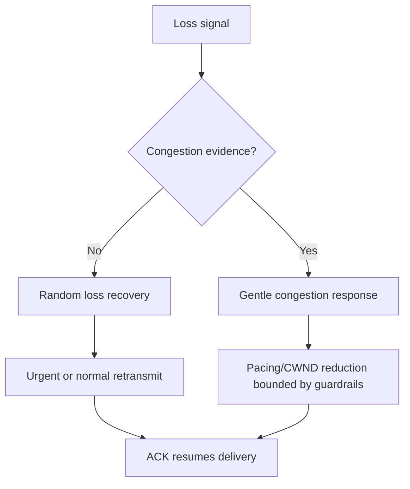
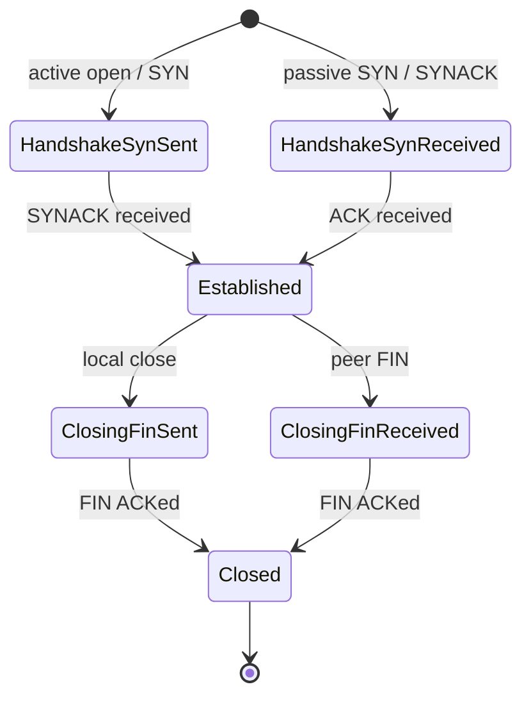
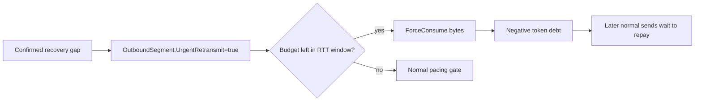
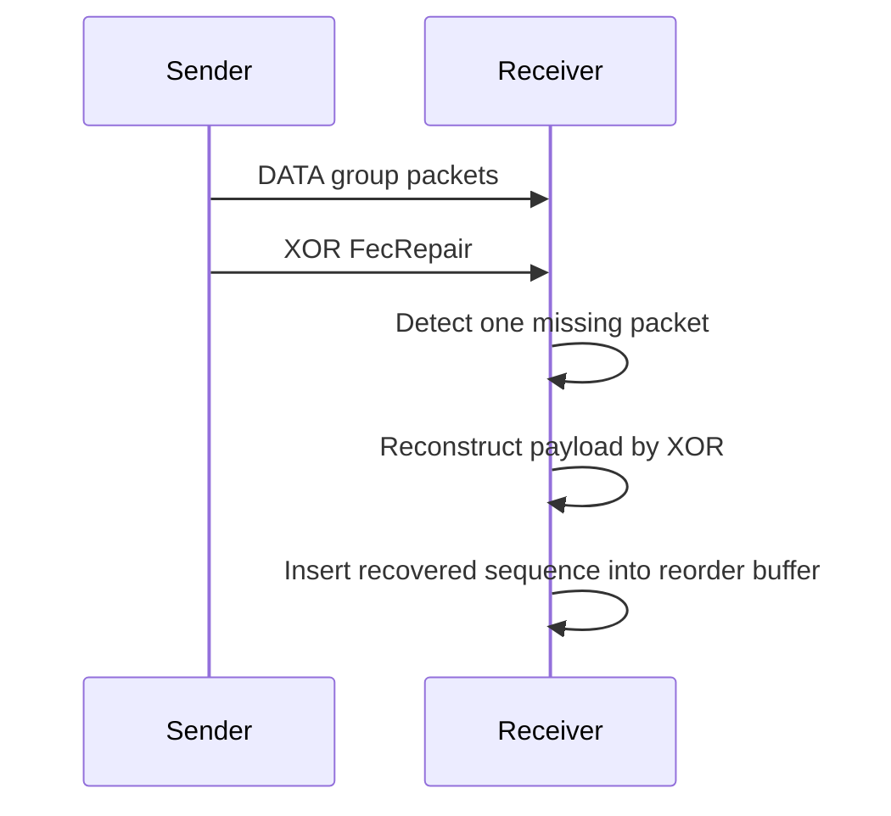

# UCP Protocol Deep Dive

[中文](protocol_CN.md) | [Documentation Index](index.md)

## Design Principles

Random loss is a recovery signal, not an automatic congestion signal. UCP retransmits missing data immediately, but it only reduces pacing or CWND after RTT growth, delivery-rate degradation, and clustered loss agree that the bottleneck is actually congested.

## Packet Format

All multi-byte integer fields are encoded big-endian.

### Common Header

| Offset | Field | Size | Description |
|---|---|---|---|
| 0 | Type | 1B | `0x01` SYN, `0x02` SYNACK, `0x03` ACK, `0x04` NAK, `0x05` DATA, `0x06` FIN, `0x07` RST, `0x08` FecRepair. |
| 1 | Flags | 1B | `0x01` NeedAck, `0x02` Retransmit, `0x04` FinAck. |
| 2 | ConnId | 4B | Connection identifier for UDP multiplexing. |
| 6 | Timestamp | 6B | Sender local microsecond timestamp for RTT echo. |

### DATA Packet

| Offset | Field | Size |
|---|---|---|
| 12 | SeqNum | 4B |
| 16 | FragTotal | 2B |
| 18 | FragIndex | 2B |
| 20 | Payload | Up to `MSS - 20` bytes |

### ACK Packet

| Offset | Field | Size |
|---|---|---|
| 12 | AckNumber | 4B |
| 16 | SackCount | 2B |
| 18 | SackBlocks[] | `N * 8B` |
| variable | WindowSize | 4B |
| variable | EchoTimestamp | 6B |

### NAK Packet

| Offset | Field | Size |
|---|---|---|
| 12 | MissingCount | 2B |
| 14 | MissingSeqs[] | `N * 4B` |

### FecRepair Packet

| Offset | Field | Size |
|---|---|---|
| 12 | GroupId | 4B |
| 16 | GroupIndex | 1B |
| 17 | Payload | Variable |

## Connection State Machine

## Loss Detection

### SACK Fast Retransmit

Sender-side SACK recovery uses a short QUIC-style reorder grace: `max(3ms, RTT / 8)`. The first cumulative ACK hole can be repaired after two observations. Additional reported holes below the highest SACKed sequence can also be repaired after confirmed SACK observations, which lets random independent losses recover in parallel instead of one RTT at a time.

### Duplicate ACK Fast Retransmit

Two duplicate ACKs are enough to arm fast retransmit when the suspected lost segment is old enough or the outstanding flight is small enough for early retransmit.

### Receiver NAK

NAK is conservative by design. The receiver waits for `NAK_MISSING_THRESHOLD` observations and an RTT-aware reorder guard before emitting a NAK, then suppresses repeats for `NAK_REPEAT_INTERVAL_MICROS`. High-confidence gaps can shorten the guard, but never to a fixed tiny value that would mistake jitter for loss.

### RTO / PTO Guard

RTO is treated as a last-resort repair path. When ACK progress is recent, UCP suppresses bulk timeout scans and lets SACK, NAK, and FEC repair holes first. This mirrors QUIC PTO behavior and avoids retransmitting the whole BDP when the path is alive but reordered.

## Urgent Retransmit

Normal data sends respect both fair-queue credit and token-bucket pacing. Urgent retransmits are marked only on recovery paths such as SACK, NAK, duplicate ACK, RTO, or near-disconnect tail loss. When allowed by the per-RTT budget, they bypass fair queue and pacing gates and call `PacingController.ForceConsume()` to create bounded pacing debt.

This keeps dying connections alive without allowing unbounded bursts.

## BBRv1 Congestion Control

### States

`Startup -> Drain -> ProbeBW <-> ProbeRTT`

| State | Behavior |
|---|---|
| Startup | Uses `pacing_gain=2.5` and `cwnd_gain=2.0` to discover bottleneck bandwidth. |
| Drain | Uses low pacing gain to drain startup queue, then enters ProbeBW. |
| ProbeBW | Cycles gains around the estimated bottleneck rate. Random loss does not collapse the pipe. |
| ProbeRTT | Temporarily lowers pacing/CWND to refresh MinRTT. Lossy long-fat paths avoid unnecessary ProbeRTT. |

### Core Estimates

| Estimate | Calculation | Purpose |
|---|---|---|
| `BtlBw` | Max delivery rate over recent RTT windows | Pacing-rate base. |
| `MinRtt` | Minimum observed RTT in the ProbeRTT interval | BDP denominator. |
| `BDP` | `BtlBw * MinRtt` | Target in-flight bytes. |
| `PacingRate` | `BtlBw * PacingGain` | Send rate. |
| `CWND` | `BDP * CwndGain` plus guardrails | In-flight cap. |

The exported pacing rate is the controller's instantaneous rate. Benchmark throughput is separately capped by the simulator bottleneck.

## FEC

UCP can generate one or more GF(256) repair packets per FEC group. Recovery succeeds when the receiver has at least as many independent repair packets as missing DATA packets. Recovered packets retain the original sequence number and fragment metadata so cumulative ACK and stream delivery remain correct.

## Reporting Semantics

`Retrans%` is sender repair overhead. `Loss%` is simulator-observed DATA loss before recovery. These values are intentionally independent.
