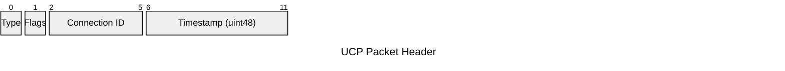
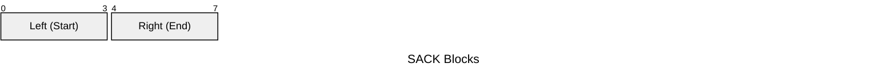
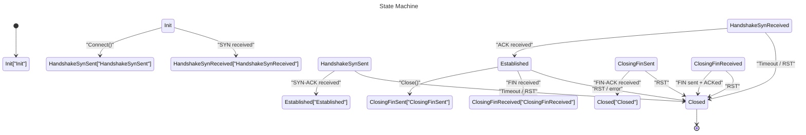
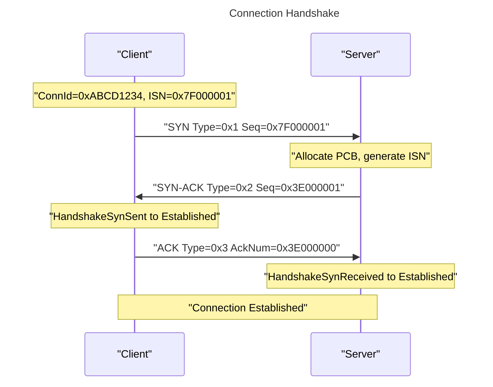

# PPP PRIVATE NETWORK™ X — Universal Communication Protocol (UCP) — Wire Protocol Specification

[Chinese](protocol_CN.md) | [Documentation Index](index.md)

This document defines the UCP wire protocol: packet encoding, connection lifecycle, reliability mechanisms, and flow control. All multi-byte integer fields use network byte order (big-endian).

## Documentation Index

| Reference Document | Content |
|---|---|
| [Architecture](architecture.md) | Runtime layering, PCB state machine, strand execution model |
| [API Reference](api.md) | Public API surface, configuration parameters, usage examples |
| [Constants Reference](constants.md) | All tunable and fixed constants catalog |

## Packet Format

### Common Header (12 bytes)

Every UCP packet begins with a 12-byte header:


```mermaid
---
title: "UCP Packet Header"
---
packet-beta
   0-0: "Type"
   1-1: "Flags"
   2-5: "Connection ID"
   6-11: "Timestamp (uint48)"
```

| Offset | Size | Field | Description |
|---|---|---|---|
| 0 | 1 | Type | uint8 packet type identifier |
| 1 | 1 | Flags | uint8 bit flags |
| 2 | 4 | ConnectionId | uint32 random identifier for UDP demultiplexing |
| 6 | 6 | Timestamp | uint48 sender microsecond timestamp for RTT measurement |

### Hex Dump — Common Header

```
Offset  Hex Bytes                       Field
------  ------------------------------  ------------------------------------
 0-0    05                              Type = 0x5 (DATA)
 1-1    08                              Flags = HasAckNumber
 2-5    12 34 56 78                     ConnectionId = 0x12345678
 6-11   00 00 00 0A 5B C0               Timestamp = 678848 us
```

## Packet Types

| Code | Name | Direction | Description |
|---|---|---|---|
| 0x1 | SYN | Client to Server | Connection request, carries ISN and SessionKey |
| 0x2 | SYN-ACK | Server to Client | Connection acceptance, echoes client ISN, provides server ISN |
| 0x3 | ACK | Bidirectional | Pure cumulative acknowledgment with SACK blocks, window, echo |
| 0x4 | NAK | Bidirectional | Negative acknowledgment listing specific missing sequences |
| 0x5 | DATA | Bidirectional | Application payload with optional piggybacked ACK |
| 0x6 | FIN | Bidirectional | Graceful connection teardown request |
| 0x7 | RST | Bidirectional | Hard connection reset, immediate teardown |
| 0x8 | FEC Repair | Bidirectional | Forward error correction parity repair packet |

## Packet Flags

The Flags byte (offset 1) encodes several boolean attributes of the packet. Multiple flags may be combined using bitwise OR.

| Bit | Mask | Name | Description |
|---|---|---|---|
| 0 | 0x01 | NeedAck | Receiver sends immediate acknowledgment, bypassing delayed-ACK timer |
| 1 | 0x02 | Retransmit | Packet is a retransmission; RTT not sampled (Karn algorithm) |
| 2 | 0x04 | FinAck | Acknowledgment of a received FIN during teardown |
| 3 | 0x08 | HasAckNumber | Packet carries piggybacked cumulative ACK fields |
| 4-5 | 0x30 | PriorityMask | 2-bit priority field (0=Background, 1=Normal, 2=Interactive, 3=Urgent) |
| 6 | 0x40 | MtuProbe | Packet is an MTU probe for path MTU discovery |
| 7 | 0x80 | PathChallenge | Packet carries a connection migration challenge |

## Piggybacked ACK

Every DATA packet can carry acknowledgment information for the reverse direction, eliminating separate ACK packets on bidirectional flows. When the `HasAckNumber` flag (bit 3) is set, the type-specific header is followed by:

| Field | Size | Description |
|---|---|---|
| AckNumber | 4 | uint32 cumulative acknowledgment sequence number |
| SackBlockCount | 2 | uint16 number of SACK blocks (0-149) |
| SACK Blocks | N x 8 | Each block: Left(4) + Right(4) sequence numbers, big-endian |
| WindowSize | 4 | uint32 receiver advertised window in bytes |
| EchoTimestamp | 6 | uint48 echoed sender timestamp for RTT computation |

This is cumulative ACK (like TCP), not selective-only. AckNumber confirms delivery of all sequences below it. SACK blocks provide additional selective information about out-of-order received ranges beyond the cumulative point.

## SACK Format

Selective Acknowledgment blocks encode contiguous received ranges. The sender uses SACK information to identify exactly which packets need retransmission without waiting for timeout.


```mermaid
---
title: "SACK Blocks"
---
packet-beta
  0-3: "Left (Start)"
  4-7: "Right (End)"
```

- Up to 149 SACK blocks per packet
- Each block is a [Left, Right] pair of uint32 sequence numbers
- Left is inclusive, Right is inclusive (the block covers sequences Left through Right)
- Blocks ordered by increasing Left (ascending)
- Each SACK block range may be advertised at most 2 times to prevent amplification

## Detailed Packet Layouts

### DATA Packet (Type=0x5)

| Offset | Size | Field | Notes |
|---|---|---|---|
| 0 | 12 | CommonHeader | Type=0x5, Flags include NeedAck, HasAckNumber etc. |
| 12 | 4 | SequenceNumber | Data sequence number |
| 16 | 2 | FragmentTotal | Total fragments in message (1 = unfragmented) |
| 18 | 2 | FragmentIndex | Zero-based fragment index |
| [20] | [4] | [AckNumber] | Present if HasAckNumber flag set |
| [24] | [2] | [SackBlockCount] | uint16, 0-149 |
| [26] | [N x 8] | [SACK Blocks] | N = SackBlockCount |
| [..] | [4] | [WindowSize] | uint32 advertised receive window |
| [..] | [6] | [EchoTimestamp] | uint48 echoed timestamp |
| .. | N | Payload | Application data |

### Hex Dump — DATA with Piggybacked ACK

```
Offset  Hex Bytes                       Field
------  ------------------------------  ------------------------------------
 0-0    05                              Type = 0x5 (DATA)
 1-1    08                              Flags = HasAckNumber
 2-5    12 34 56 78                     ConnectionId = 0x12345678
 6-11   00 00 00 0A 5B C0               Timestamp = 678848 us
12-15   00 00 00 01                     SequenceNumber = 1
16-17   00 01                           FragmentTotal = 1
18-19   00 00                           FragmentIndex = 0
20-23   00 00 00 05                     AckNumber = 5
24-25   00 00                           SackBlockCount = 0
26-29   00 00 40 00                     WindowSize = 16384
30-35   00 00 00 0A 5B C0               EchoTimestamp = 678848 us
36-40   48 65 6C 6C 6F                  Payload = "Hello"
```

### ACK Packet (Type=0x3)

| Offset | Size | Field |
|---|---|---|
| 0 | 12 | CommonHeader |
| 12 | 4 | AckNumber |
| 16 | 2 | SackBlockCount (0-149) |
| 18 | N x 8 | SACK Blocks |
| .. | 4 | WindowSize |
| .. | 6 | EchoTimestamp |

### Control Packet (SYN=0x1 / SYN-ACK=0x2 / FIN=0x6 / RST=0x7)

| Offset | Size | Field | Notes |
|---|---|---|---|
| 0 | 12 | CommonHeader | Type as appropriate |
| [12] | [4] | [AckNumber] | Present if HasAckNumber flag set |
| [..] | [4] | [SequenceNumber] | Present for SYN/SYN-ACK |
| [..] | [8] | [SessionKey] | Present for SYN/SYN-ACK; uint64 |

Control packets carry optional fields that are included based on the HasAckNumber flag, HasSequenceNumber, and SessionKey presence. The decoder checks remaining buffer bytes to determine field presence.

### Hex Dump — SYN Packet

```
Offset  Hex Bytes                       Field
------  ------------------------------  ------------------------------------
 0-0    01                              Type = 0x1 (SYN)
 1-1    00                              Flags = None
 2-5    AB CD 12 34                     ConnectionId = 0xABCD1234
 6-11   00 00 00 00 00 01               Timestamp = 1 us
12-15   00 00 0F 00                     SequenceNumber = 3840 (ISN)
16-23   00 00 00 00 00 00 00 01         SessionKey = 1
```

### NAK Packet (Type=0x4)

| Offset | Size | Field |
|---|---|---|
| 0 | 12 | CommonHeader |
| 12 | 4 | AckNumber (last contiguous sequence before gaps) |
| 16 | 2 | MissingCount (1-256) |
| 18 | N x 4 | MissingSequences[] — uint32 ascending |

NAK is the receiver explicit loss signal. Unlike SACK (which lists what was received), NAK lists what was not received. This is more efficient for sparse loss reporting.

### FEC Repair Packet (Type=0x8)

| Offset | Size | Field |
|---|---|---|
| 0 | 12 | CommonHeader |
| 12 | 4 | GroupId — FEC group identifier |
| 16 | 1 | GroupIndex — repair index within group |
| 17 | N | Payload — GF(256) parity data |

FEC repair packets carry Reed-Solomon parity data enabling recovery of lost DATA packets without retransmission. GroupId links repairs to a specific group of data packets; GroupIndex distinguishes multiple repairs within the same group.

## Connection State Machine

UCP is a pure control protocol with CID round-robin switching, FEC forward error correction, and SACK/NAK recovery. UCP connections follow a 7-state lifecycle with transitions driven by packet events and timers. FEC and NAK feed delivery samples into the KCC (Geodesic Congestion Control, KF component from tcp_kcc.c v2.0) congestion control for accurate bandwidth/delay estimation. The KCC congestion control uses a 3-mode FSM (STARTUP → DRAIN → PROBE_BW); min_rtt tracking is handled automatically by the geodesic G1/G3 estimator.


```mermaid
---
title: "State Machine"
---
stateDiagram-v2
    [*] --> Init["Init"]
    Init --> HandshakeSynSent["HandshakeSynSent"]: "Connect()"
    Init --> HandshakeSynReceived["HandshakeSynReceived"]: "SYN received"

    HandshakeSynSent --> Established["Established"]: "SYN-ACK received"
    HandshakeSynReceived --> Established: "ACK received"

    Established --> ClosingFinSent["ClosingFinSent"]: "Close()"
    Established --> ClosingFinReceived["ClosingFinReceived"]: "FIN received"

    ClosingFinSent --> Closed["Closed"]: "FIN-ACK received"
    ClosingFinReceived --> Closed: "FIN sent + ACKed"

    HandshakeSynSent --> Closed: "Timeout / RST"
    HandshakeSynReceived --> Closed: "Timeout / RST"
    Established --> Closed: "RST / error"
    ClosingFinSent --> Closed: "RST"
    ClosingFinReceived --> Closed: "RST"

    Closed --> [*]
```

### State Transitions

| Transition | Trigger | Outbound | Timer Start | Timer Stop |
|---|---|---|---|---|
| Init to HandshakeSynSent | ConnectAsync() | SYN | connectTimer | — |
| Init to HandshakeSynReceived | SYN received | SYN-ACK | connectTimer | — |
| HandshakeSynSent to Established | SYN-ACK received | ACK or DATA | — | connectTimer |
| HandshakeSynReceived to Established | ACK received | — | — | connectTimer |
| Established to ClosingFinSent | Close() | FIN | disconnectTimer | keepAliveTimer |
| Established to ClosingFinReceived | FIN received | FIN-ACK | disconnectTimer | keepAliveTimer |
| ClosingFinSent to Closed | FIN-ACK received | — | — | disconnectTimer |
| ClosingFinReceived to Closed | FIN sent + ACKed | — | — | disconnectTimer |
| Any to Closed | RST or MaxRetrans | RST optional | — | all timers |

## Connection Handshake

The three-way handshake establishes a connection:


```mermaid
---
title: "Connection Handshake"
---
sequenceDiagram
    participant C as "Client"
    participant S as "Server"

    Note over C: "ConnId=0xABCD1234, ISN=0x7F000001"
    C->>S: "SYN Type=0x1 Seq=0x7F000001"

    Note over S: "Allocate PCB, generate ISN"
    S->>C: "SYN-ACK Type=0x2 Seq=0x3E000001"

    Note over C: "HandshakeSynSent to Established"
    C->>S: "ACK Type=0x3 AckNum=0x3E000000"

    Note over S: "HandshakeSynReceived to Established"
    Note over C,S: "Connection Established"
```

1. Client sends SYN with a random ConnectionId and initial sequence number (ISN)
2. Server receives SYN, allocates a Protocol Control Block (PCB), generates its own ISN, and responds with SYN-ACK
3. Client receives SYN-ACK, transitions to Established, and sends an ACK
4. Server receives the ACK, transitions to Established — data transfer may begin

## Flow Control

UCP uses receiver-driven window-based flow control:

**Receiver Window**: Every ACK and piggybacked ACK carries a `WindowSize` field (uint32, bytes). This indicates the receiver available buffer space. The sender must not exceed this limit when transmitting new data.

**Window Update**: The receiver sends an ACK (or piggybacks one on DATA) whenever the available window changes significantly, ensuring the sender always has a current view of buffer capacity.

**Zero Window**: When the receiver buffer is full, WindowSize is set to 0. The sender stops transmitting data. The C++ implementation periodically sends a keepalive probe (every ZERO_WINDOW_PROBE_INTERVAL) until the receiver advertises a non-zero window; the C# implementation resumes on the next ACK-carrying window update.

**Congestion Window vs Receive Window**: The sendable upper limit is min(cwnd, peer-declared receive window); the initial cwnd is NOT a fixed 10-packet cap. The KCC congestion controller derives cwnd from the BDP estimate, but the peer's advertised `WindowSize` is the authoritative hard cap on bytes in flight (standard TCP/QUIC flow control).

**Flow Control Direction**: Each direction is flow-controlled independently. The receiver window in DATA packets controls the reverse path, while the window in ACK packets controls the forward path.

## Sequence Number Arithmetic

UCP uses 32-bit unsigned sequence numbers with modular arithmetic inspired by TCP:

```
seq_a > seq_b  iff  (uint32)(seq_a - seq_b) < 2^31
seq_a < seq_b  iff  (uint32)(seq_b - seq_a) < 2^31
```

This provides unambiguous ordering for up to 2^31 (~2.1 billion) outstanding sequence numbers. Sequence numbers wrap around to 0 after 2^32 - 1.

## Cross-Platform Implementations

This wire protocol specification is implemented across three platforms sharing identical wire format and semantics:

- **C# (.NET 8)**: Reference implementation in this repository. See [api.md](api.md) for public API.
- **C++ (C++17)**: Native implementation with Boost.Asio event loop. See [cpp/README_EN.md](../cpp/README_EN.md) and [cpp/docs/index_EN.md](../cpp/docs/index_EN.md).
- **Linux Kernel Module (KCC)**: In-kernel implementation within the Linux TCP/IP stack. See [linux/README.md](../linux/README.md).

---

## License and Trademark

MIT License. See [LICENSE](../LICENSE) for full text.

Copyright (c) 2026 PPP PRIVATE NETWORK™ X

PPP PRIVATE NETWORK™ is a trademark of PPP PRIVATE NETWORK.
