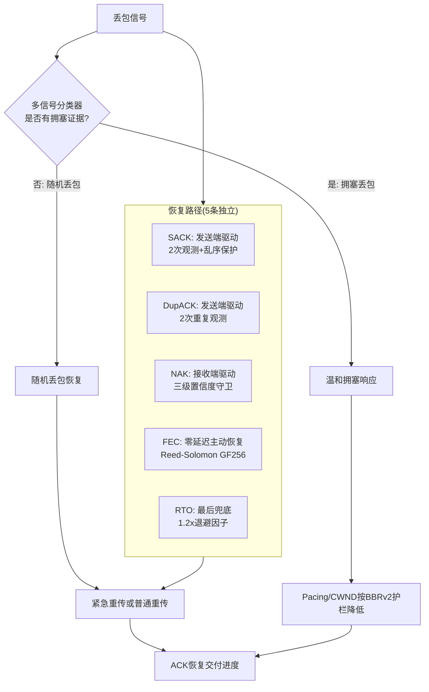
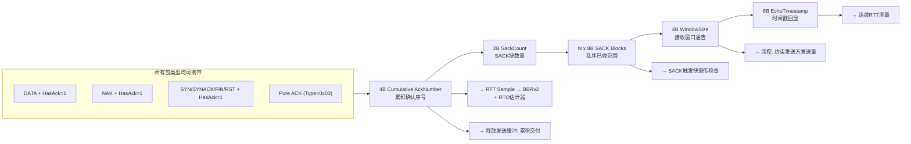
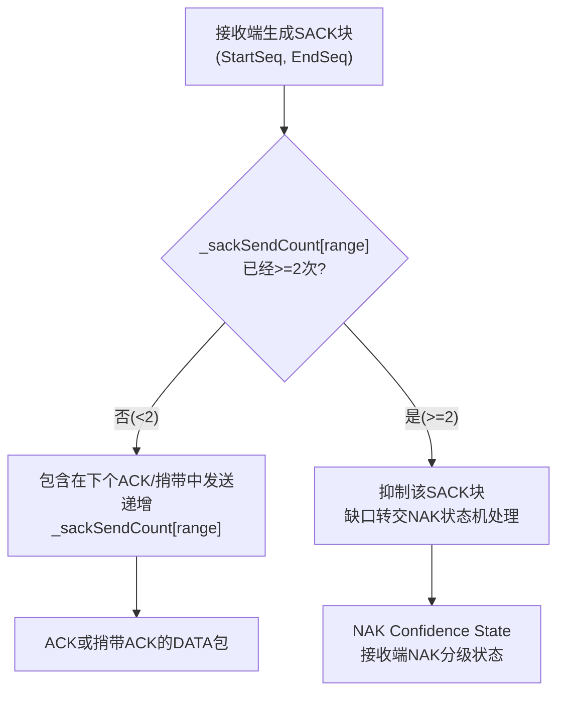
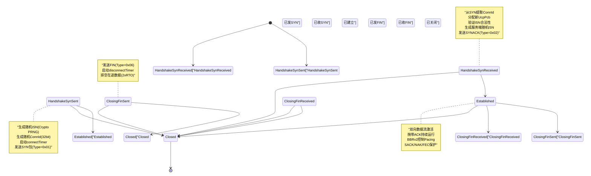
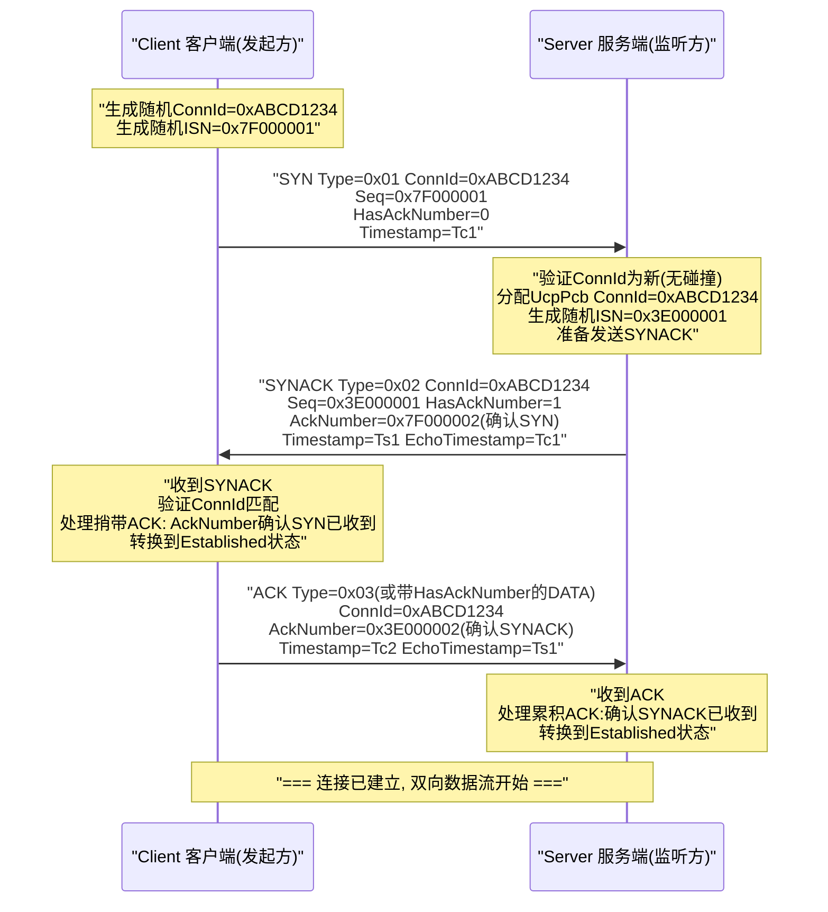
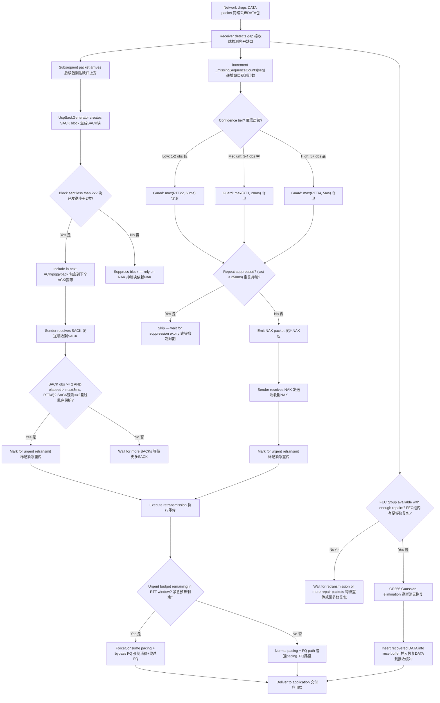
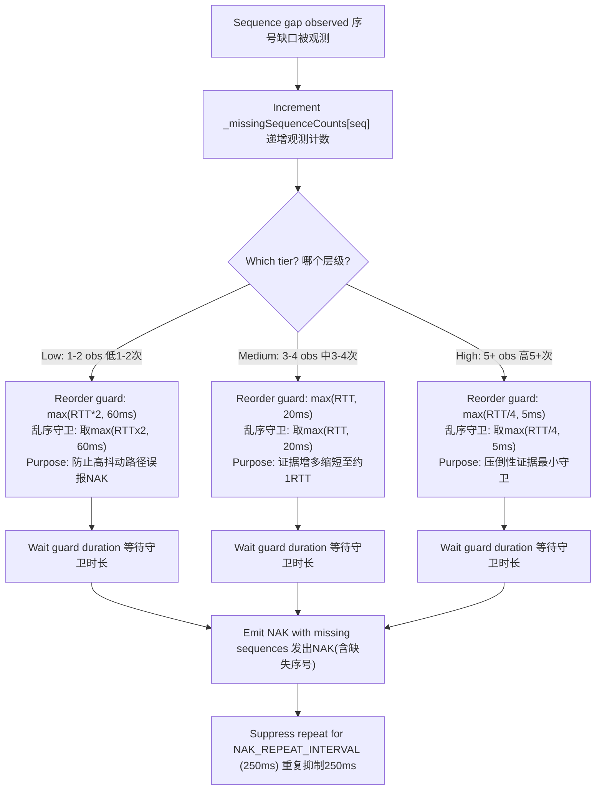
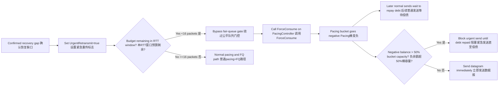

# PPP PRIVATE NETWORK™ X — 通用通信协议 (UCP) — 协议规范

[English](protocol.md) | [文档索引](index_CN.md)

**协议标识: `ppp+ucp`** — 本文档是 UCP 线格式、可靠性机制、丢包恢复策略、拥塞控制算法、前向纠错设计及报告口径的权威规范。所有多字节整数字段使用网络字节序（大端序）。

---

## 设计原则

UCP 基于三个核心设计原则，使其从根本上区别于传统的丢包反应式传输协议：

1. **随机丢包是恢复信号，而非拥塞信号。** UCP 在检测到缺失数据时立即通过多条恢复路径之一触发重传。但仅有当多个独立信号 — RTT 膨胀、投递率下降和聚集丢包 — 共同验证瓶颈确实拥塞后，才降低 pacing 速率或拥塞窗口。这一原则直接来源于对现代无线网络丢包模式的经验观察。

2. **每个包都携带可靠性信息。** UCP 通过 `HasAckNumber` 标志在 DATA、NAK 和所有控制包（SYN/SYNACK/FIN/RST）中捎带累积 ACK 号。这种设计最小化纯 ACK 包开销（纯 ACK 包仅在无可捎带数据时发送），并对收到的每个包（无论类型）提供连续 RTT 样本，消除了 TCP 的 ACK 压缩问题。

3. **恢复按置信度分级，从不竞速。** UCP 使用五条独立的恢复路径（SACK、DupACK、NAK、FEC、RTO），每条具有明确定义的角色和触发条件。对于同一缺口，协议仅触发最合适的恢复路径，绝不同时启动多条路径竞速恢复。



---

## 包格式

### 公共头（12 字节 — 所有包类型强制）

所有 UCP 包共享一个 12 字节的公共头。此头包含关键的 `HasAckNumber` 标志（`Flags & 0x01`），使所有包类型都能捎带累积 ACK。

| 偏移 | 字段 | 大小 | 说明 |
|---|---|---|---|
| 0 | `Type` | 1 字节 | 包类型标识（见下表） |
| 1 | `Flags` | 1 字节 | 位标志，控制 ACK 存在性和包状态 |
| 2 | `ConnId` | 4 字节 | 随机 32 位连接标识，用于 UDP 多路复用和 IP 无关会话追踪 |
| 6 | `Timestamp` | 6 字节 | 发送方本地微秒时间戳，用于 RTT 回显测量 |

### 包类型枚举

| 类型码 | 名称 | 负载含义 |
|---|---|---|
| `0x01` | **SYN** | 连接发起。携带客户端随机 ISN、随机 ConnId 和初始配置参数。 |
| `0x02` | **SYNACK** | 连接接受。回显客户端 ConnId，提供服务端随机 ISN。支持 `HasAckNumber` 捎带确认客户端 SYN。 |
| `0x03` | **ACK** | 纯确认包。当无数据 payload 可供捎带时发送。携带累积 ACK、SACK 块、接收窗口和时间戳回显。 |
| `0x04` | **NAK** | 否定确认。报告接收端检测到的缺失序号。可携带最多 256 个缺失序号。支持 `HasAckNumber`。 |
| `0x05` | **DATA** | 应用负载数据。携带序号、分片信息和可选捎带 ACK。UCP 的核心数据承载包。 |
| `0x06` | **FIN** | 优雅连接终止请求。携带最终序号。支持 `HasAckNumber`。 |
| `0x07` | **RST** | 硬连接重置。表示不可恢复错误（超最大重传次数、协议违规等）。 |
| `0x08` | **FecRepair** | 前向纠错修复包。携带组标识、修复索引和 GF(256) RS 修复数据。支持 `HasAckNumber`。 |

### Flags 位布局

| 位 | 掩码 | 名称 | 说明 |
|---|---|---|---|
| 0 | `0x01` | **HasAckNumber** | 若置位，AckNumber 字段（4 字节）紧随公共头之后出现。这是 UCP 捎带 ACK 模型的核心机制。 |
| 1 | `0x02` | **Retransmit** | 指示此包为重传（非首次发送）。用于区分原始发送和重传以正确统计 Retrans%。 |
| 2 | `0x04` | **FinAck** | 确认对端的 FIN。在 FIN 包的 ACK 响应中置位，通过闭合状态转换。 |
| 3 | `0x08` | **NeedAck** | 请求对端立即发送确认。用于加速特定包的确认（如握手完成前的最后一步）。 |
| 4-7 | — | **保留** | 预留未来使用，当前必须为 0。 |

---

## HasAckNumber — 捎带累积 ACK 模型

`HasAckNumber` 标志是 UCP 确认效率的基石。当该位置位时，包公共头后紧接以下 ACK 相关字段：



### 捎带开销分析

| 场景 | 捎带字段 | 开销字节 | MSS | 开销百分比 |
|---|---|---|---|---|
| 纯 DATA（无 SACK） | AckNumber(4) + SackCount=0(2) + WindowSize(4) + EchoTimestamp(6) | 16 字节 | 1220 | 1.31% |
| 纯 DATA（无 SACK） | 同上 | 16 字节 | 9000 | 0.18% |
| DATA + 3 SACK 块 | 上述 + 3×8=24 字节 | 40 字节 | 1220 | 3.28% |
| 纯 ACK 包（149 SACK 块） | AckNumber(4) + SackCount(2) + 149×8 + Window(4) + Echo(6) | ~1208 字节 | — | ACK 包不含应用数据 |

---

## 详细包布局

### DATA 包布局

| 偏移 | 字段 | 大小 | 说明 |
|---|---|---|---|
| 0 | `CommonHeader` | 12B | Type=0x05, Flags（可含 HasAckNumber/Retransmit/NeedAck）, ConnId, Timestamp |
| 12 | `[AckNumber]` | 4B | 可选：当 `Flags & HasAckNumber` 置位时出现 |
| 可变 | `SeqNum` | 4B | 本分段首个 payload 字节的数据序号 |
| 可变 | `FragTotal` | 2B | 此数据段总分片数。1 = 未分片（最常见的场景） |
| 可变 | `FragIndex` | 2B | 此分片在段内的 0 起始索引。仅 FragTotal>1 时有意义 |
| 可变 | `Payload` | ≤ MSS-开销 | 应用数据负载。实际可用大小 = MSS - 公共头(12) - [AckNumber(4)] - SeqNum(4) - FragTotal(2) - FragIndex(2) |

### ACK 包布局

| 偏移 | 字段 | 大小 | 说明 |
|---|---|---|---|
| 0 | `CommonHeader` | 12B | Type=0x03, ConnId, Timestamp |
| 12 | `AckNumber` | 4B | 累积 ACK：此序号之前的所有字节已连续收到 |
| 16 | `SackCount` | 2B | 后续 SACK 块数量（0-255）。受 MSS 容量限制，默认最多 149 |
| 18 | `SackBlocks[]` | N×8B | 每个 SACK 块为 (StartSequence(4B), EndSequence(4B))，表示超出累积 ACK 但已收到的序号范围。Start 包含，End 不包含。 |
| 可变 | `WindowSize` | 4B | 通告接收窗口（字节），用于流控。发送方不得超过此值发送未确认数据 |
| 可变 | `EchoTimestamp` | 6B | 被确认包中 Timestamp 字段的回显，用于精确 RTT 计算（发送方减当前时间） |

### SACK 块发送上限

每个 SACK 块范围 `(StartSeq, EndSeq)` 在其生命周期内最多在 ACK 包中通告 **2 次**。此 QUIC 启发式限制防止持续乱序下的 SACK 放大攻击：



### NAK 包布局

| 偏移 | 字段 | 大小 | 说明 |
|---|---|---|---|
| 0 | `CommonHeader` | 12B | Type=0x04, Flags（推荐置 HasAckNumber 捎带最新 ACK），ConnId, Timestamp |
| 12 | `[AckNumber]` | 4B | 可选：当 `Flags & HasAckNumber` 置位时出现（强烈推荐） |
| 可变 | `MissingCount` | 2B | 缺失序号条目数（1-256, 上限 `MAX_NAK_SEQUENCES_PER_PACKET`） |
| 可变 | `MissingSeqs[]` | N×4B | 缺失序号，按单调递增顺序排列。每项 4 字节，总条目 ≤ 256 |

### FecRepair 包布局

| 偏移 | 字段 | 大小 | 说明 |
|---|---|---|---|
| 0 | `CommonHeader` | 12B | Type=0x08, Flags, ConnId, Timestamp |
| 12 | `[AckNumber]` | 4B | 可选：`Flags & HasAckNumber` |
| 可变 | `GroupId` | 4B | FEC 组标识（组内首个 DATA 包的序号），用于接收端按组聚合 |
| 可变 | `GroupIndex` | 1B | 组内修复包索引（0 起始，最大 R−1，R 为修复包数量） |
| 可变 | `Payload` | 变长 | GF(256) Reed-Solomon 修复数据，长度与组内 DATA 包负载长度相同 |

---

## 序号算术

UCP 使用 32 位序号配标准 TCP 启发式比较规则。所有序号比较使用无符号算术配 2^31 比较窗口实现无歧义排序：

```
seq_a > seq_b  当且仅当  (uint)(seq_a - seq_b) < 2^31
seq_a < seq_b  当且仅当  (uint)(seq_b - seq_a) < 2^31
```

这为最多 2^31（约 21 亿）个在途序号提供无歧义排序，远超任何实际发送缓冲可容纳的范围（32 MB / 1220 字节 ≈ 26,000 个包）。

**序号空间使用：**
- **ISN**：连接 SYN 时随机生成（加密级 PRNG）
- **DATA SeqNums**：ISN+1, ISN+2, ...（单调递增）
- **Cumulative ACK**：累积确认 — 下一个期望接收的字节序号
- **SACK Ranges**：(StartSeq, EndSeq) 对，Start 包含，End 不包含
- **NAK Missing Seqs**：缺失 DATA 包的序号
- **环绕**：超过 2^32 后归零，比较始终使用 2^31 窗口规则

---

## 连接状态机



### 状态转换明细

| 转换 | 触发条件 | 出站动作 | 启动定时器 | 停止定时器 |
|---|---|---|---|---|
| Init → HandshakeSynSent | 客户端 `ConnectAsync()` | 发送 SYN（含随机 ISN + ConnId） | connectTimer | — |
| Init → HandshakeSynReceived | 服务端收到合法 SYN | 发送 SYNACK（含服务端 ISN，捎带 ACK 确认客户端 SYN） | connectTimer | — |
| HandshakeSynSent → Established | 收到 SYNACK，处理捎带 ACK | 发送 ACK（或捎带 ACK 的 DATA） | — | connectTimer |
| HandshakeSynReceived → Established | 收到客户端 ACK | — | — | connectTimer |
| Established → ClosingFinSent | 本地调用 `Close()`/`CloseAsync()` | 发送 FIN | disconnectTimer | keepAliveTimer |
| Established → ClosingFinReceived | 收到对端 FIN | 发送 FIN 的 ACK（FinAck 标志置位） | disconnectTimer | keepAliveTimer |
| ClosingFinSent → Closed | 对端 ACK 了本端 FIN | — | — | disconnectTimer |
| ClosingFinReceived → Closed | 本地 FIN 被发送并被对端 ACK | — | — | disconnectTimer |
| 任意 → Closed | RTO 重试次数 > `MaxRetransmissions` | RST（可选发送） | — | 全部定时器 |

---

## 三次握手序列



---

## 丢包检测与恢复流程

### 完整多路径恢复决策树



---

## SACK 快速重传参数

| 参数 | 值 | 含义 |
|---|---|---|
| `SACK_FAST_RETRANSMIT_THRESHOLD` | 2 | 首个缺失缺口所需 SACK 观测次数方可修复。匹配 QUIC 的设计选择，平衡恢复速度与误判风险 |
| `SACK_FAST_RETRANSMIT_MIN_REORDER_GRACE_MICROS` | 3,000 µs | 最小发送端乱序保护期。实际保护 = `max(3ms, RTT/8)`，在高 RTT 路径上自动延长 |
| `SACK_FAST_RETRANSMIT_DISTANCE_THRESHOLD` | 32 序号 | 最高 SACK 序号以下的额外缺口，当距离超过此阈值时可并行修复。使多洞并行恢复成为可能 |
| `SACK_BLOCK_MAX_SENDS` | 2 | 单 SACK 块范围的最大通告次数。2 次后抑制该块以防止 SACK 放大 |
| `DUPLICATE_ACK_THRESHOLD` | 2 | 触发快速重传所需相同累积 ACK 值重复次数 |

---

## NAK 三级置信度

UCP 的 NAK 机制是业界独有的分级置信度恢复路径：



| 置信层级 | 观测次数 | 乱序守卫公式 | 绝对最小值 | 设计意图 |
|---|---|---|---|---|
| **低 (Low)** | 1-2 次 | `max(RTT × 2, 60ms)` | 60ms | 保守初始守卫：缺口可能仅为简单丢包乱序。在抖动路径上（如 4G RTT 50ms±30ms）给予充足时间让乱序包到达，防止误报 NAK。 |
| **中 (Medium)** | 3-4 次 | `max(RTT, 20ms)` | 20ms | 证据积累：多次观测同一缺口说明真实丢包概率大幅上升。守卫缩短至约一个 RTT，平衡确认信心与恢复速度。 |
| **高 (High)** | 5+ 次 | `max(RTT/4, 5ms)` | 5ms | 压倒性证据：缺口几乎确认为真实丢包。最小守卫确保最快可能的 NAK 发出，近乎接近发送端 SACK 恢复速度。 |

额外约束：
- **重复抑制**：同一序号连续 NAK 间隔 ≥ `NAK_REPEAT_INTERVAL_MICROS` (250ms)，防止 NAK 风暴
- **每包上限**：单个 NAK 包最多携带 `MAX_NAK_SEQUENCES_PER_PACKET` (256) 个缺失序号，支持批量报告

---

## 紧急重传机制



关键约束：
- 每 RTT 窗口紧急重传上限：`URGENT_RETRANSMIT_BUDGET_PER_RTT` = 16 包
- `ForceConsume()` 产生有界负 Token 债务（最大 bucket 容量的 50%）
- 每 RTT 预算在新 RTT 估计时重置，保证跨连接公平性

---

## BBRv2 拥塞控制

### 状态转换与参数

```
Startup → Drain → ProbeBW ↔ ProbeRTT
```

| 状态 | 行为 | Pacing 增益 | CWND 增益 | 退出条件 |
|---|---|---|---|---|
| **Startup** | 快速探测瓶颈带宽 | 2.5 | 2.0 | 连续 3 RTT 窗口吞吐不再增长（带宽平台出现） |
| **Drain** | 排空 Startup 累积的瓶颈队列 | 0.75 | — | 在途 < `BDP × target_cwnd_gain` |
| **ProbeBW** | 围绕 BtlBw 稳态循环 | [1.25, 0.85, 1.0×6] | 2.0 | 每 30s 触发 ProbeRTT（丢包长肥管自动跳过） |
| **ProbeRTT** | 刷新 MinRTT 估计 | 1.0 | 4 包 | 持续 100ms 后返回 ProbeBW |

### 自适应 Pacing 增益

BBRv2 引入自适应 pacing 增益：基础增益循环乘以拥塞响应因子：

- `AdaptivePacingGain = BaseGain × CongestionFactor`
- `CongestionFactor` 默认为 1.0（无拥塞）
- 拥塞证据确认时：`CongestionFactor *= 0.98`（每次仅降 2%，远温和于 TCP 的 50% 减半）
- 恢复：`CongestionFactor` 每 ACK 递增 `BBR_LOSS_CWND_RECOVERY_STEP(0.04)` 恢复至 1.0

### 丢包感知 CWND

- **CWND 下限**：拥塞丢包后 `CWND_gain` 下限为 `BBR_MIN_LOSS_CWND_GAIN = 0.95`，即 CWND 不低于 BDP 的 95%
- **CWND 恢复**：每次 ACK 恢复 `BBR_LOSS_CWND_RECOVERY_STEP = 0.04` 的 CWND 增益

### 核心估计量

| 估计量 | 计算方式 | 用途 |
|---|---|---|
| `BtlBw` | 最近 `BbrWindowRtRounds` 个 RTT 窗口的最大投递率（字节/秒），经 EWMA 短时滤波平滑 | Pacing 速率基准 |
| `MinRtt` | 最近 30s（ProbeRTT 间隔）内的最小观测 RTT | BDP 分母，对子 BDP 准确计算至关重要 |
| `BDP` | `BtlBw × MinRtt` | 目标在途字节数 — BBR 的运行最优点 |
| `PacingRate` | `BtlBw × AdaptivePacingGain` | Token Bucket 强制执行的瞬时发送速率 |
| `CWND` | `BDP × CWNDGain` 配合护栏（下限 0.95×BDP） | 最大在途字节数上限 |

---

## 前向纠错 — Reed-Solomon GF(256)

### 数学基础

**编码（发送端）**：对含 N 个各 L 字节 payload 的 DATA 包组：
1. 对每一字节位置 j（0 到 L−1），构造向量 `v = [data[0][j], data[1][j], ..., data[N-1][j]]`
2. 生成 R 个修复字节：`repair[i][j] = Σ(k=0 to N-1) (data[k][j] × α^(i×k))` 在 GF(256) 中进行
   其中 α 为本原元，i 从 1 到 R
3. 将各位置的 R 个修复字节分组为 R 个 FecRepair 包（每包 L 字节）

**解码（接收端）**：当 M 个包丢失（M ≤ R）：
1. 收集该组中所有已收到的 N 个独立实体（已收 DATA + 已收 Repair）
2. 对每一字节位置 j，构建 GF(256) 上的线性方程组 `A × x = b`
   - A 是 N×N 的 Vandermonde 型矩阵（从已收包的行系数构造）
   - b 是收到的 N 个已知字节值
   - x 是待求的原始 N 个数据字节
3. 使用 GF(256) 高斯消元求解 x
4. 从 x 中提取缺失 DATA 包的 L 个字节，组装为完整 DATA 包
5. 恢复的 DATA 包保留其原始序号（SeqNum）和分片元数据（FragTotal, FragIndex）

### GF(256) 实现细节

- **不可约多项式**：`x^8 + x^4 + x^3 + x + 1` = 0x11B
- **对数/反对数表**：256 项 log 表（0x00 映射为特殊值表示未定义），512 项 antilog 表（双倍长度支持模 255 加法后的溢出查询）
- **加法**：按位 XOR（字节级，硬件原生支持）
- **乘法**：O(1) 查表 `antilog[(log[a] + log[b]) mod 255]`
- **除法**：O(1) 查表 `antilog[(log[a] - log[b] + 255) mod 255]`

---

## 报告口径定义

| 指标 | 数据来源 | 语义 |
|---|---|---|
| `Throughput Mbps` | `NetworkSimulator` 虚拟时钟 | 已交付 payload 字节 / 实际耗时，按 Target Mbps 封顶（不超过 Target×1.01）。反映协议实际实现的吞吐。 |
| `Target Mbps` | 场景配置文件 | 虚拟逻辑时钟强制执行的配置瓶颈带宽。用以对比实际吞吐。 |
| `Util%` | 派生计算 | `Throughput / Target × 100`，上限 100%。反映瓶颈利用率。 |
| `Retrans%` | `UcpPcb` 发送端计数器 | `重传 DATA 包数 / 原始 DATA 包数`。**协议修复开销**，反映为重传而消耗的额外带宽。 |
| `Loss%` | `NetworkSimulator` 丢包计数器 | `仿真器丢弃 DATA 包数 / 提交 DATA 包数`。**物理网络丢包率**，与协议恢复行为完全独立。 |
| `A→B ms`, `B→A ms` | `NetworkSimulator` 时间戳 | 各方向实测的单向传播延迟。用于验证非对称路由模型。 |
| `Avg RTT ms` | `UcpRtoEstimator` | 传输期间所有 RTT 样本的算术均值。 |
| `P95 RTT ms` | `UcpRtoEstimator` | 95 百分位 RTT。指示尾部延迟 — 95% 的包在此 RTT 内确认。 |
| `P99 RTT ms` | `UcpRtoEstimator` | 99 百分位 RTT。排除极少数离群值后的最坏延迟。 |
| `Jit ms` | `UcpRtoEstimator` | 相邻 RTT 样本间差值绝对值的均值。衡量路径稳定性。 |
| `CWND` | `BbrCongestionControl` | 传输结束时当前拥塞窗口，自适应 B/KB/MB/GB 单位显示。 |
| `Current Mbps` | `BbrCongestionControl` | 传输结束时的瞬时 pacing 速率。 |
| `RWND` | `UcpPcb` 对端窗口通告 | 远端对等体通告的接收窗口大小。 |
| `Waste%` | `UcpPcb` 发送端计数器 | `重传 DATA 字节数 / 原始 DATA 字节数`。与 Retrans% 类似但以字节为单位。 |
| `Conv` | `NetworkSimulator` 虚拟时钟 | 实测收敛时间，自适应 ns/us/ms/s 单位显示。从首包到稳态吞吐的持续时间。 |

### Retrans% 与 Loss% 的独立性

```mermaid
flowchart LR
    Sender["UCP Sender 发送端"] -->|"Original DATA 原始DATA"| Sim["NetworkSimulator 网络模拟器"]
    Sim -->|"Dropped DATA 丢弃的DATA"| Loss["Loss% Counter 丢包计数器"]
    Sim -->|"Delivered DATA 交付的DATA"| Recv["UCP Receiver 接收端"]
    Recv -->|"SACK/NAK 丢包报告"| Sender
    Sender -->|"Retransmitted DATA 重传DATA"| Sim
    Sender -->|"Retransmitted DATA 重传DATA"| Retrans["Retrans% Counter 重传计数器"]
    
    Note: "Loss%测量网络丢弃了什么<br/>Retrans%测量协议重发了什么<br/>FEC修复对两者均不可见"
```

此独立性使真实分析成为可能：
- **FEC 主导场景**：`Loss% = 5%`, `Retrans% = 1%` — FEC 在不重传的情况下恢复了大多数丢包
- **拥塞崩塌场景**：`Loss% = 3%`, `Retrans% = 8%` — 协议在激进重传，可能过度驱动链路导致额外丢包
- **预期行为**：禁用 FEC 时 `Loss% ≈ Retrans%`（每次丢包触发一次重传，无放大）
