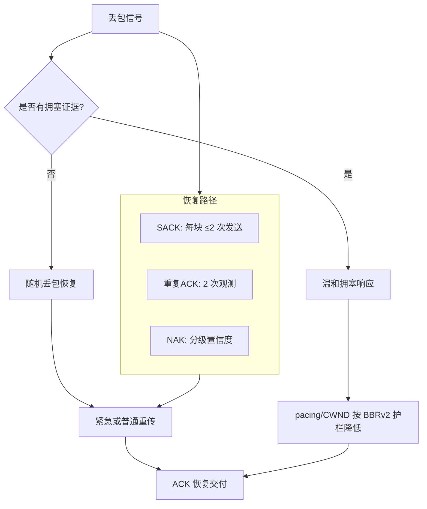
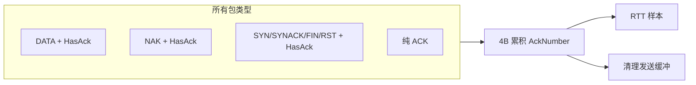
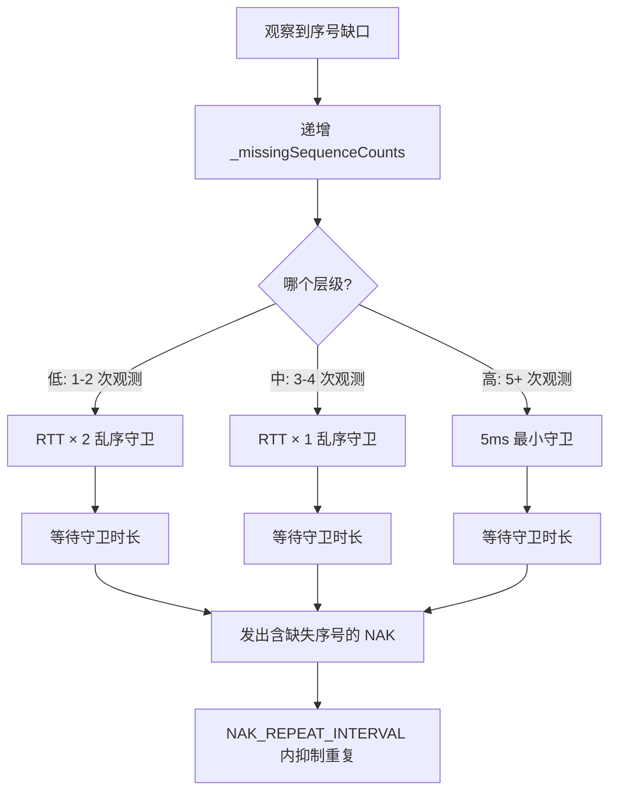
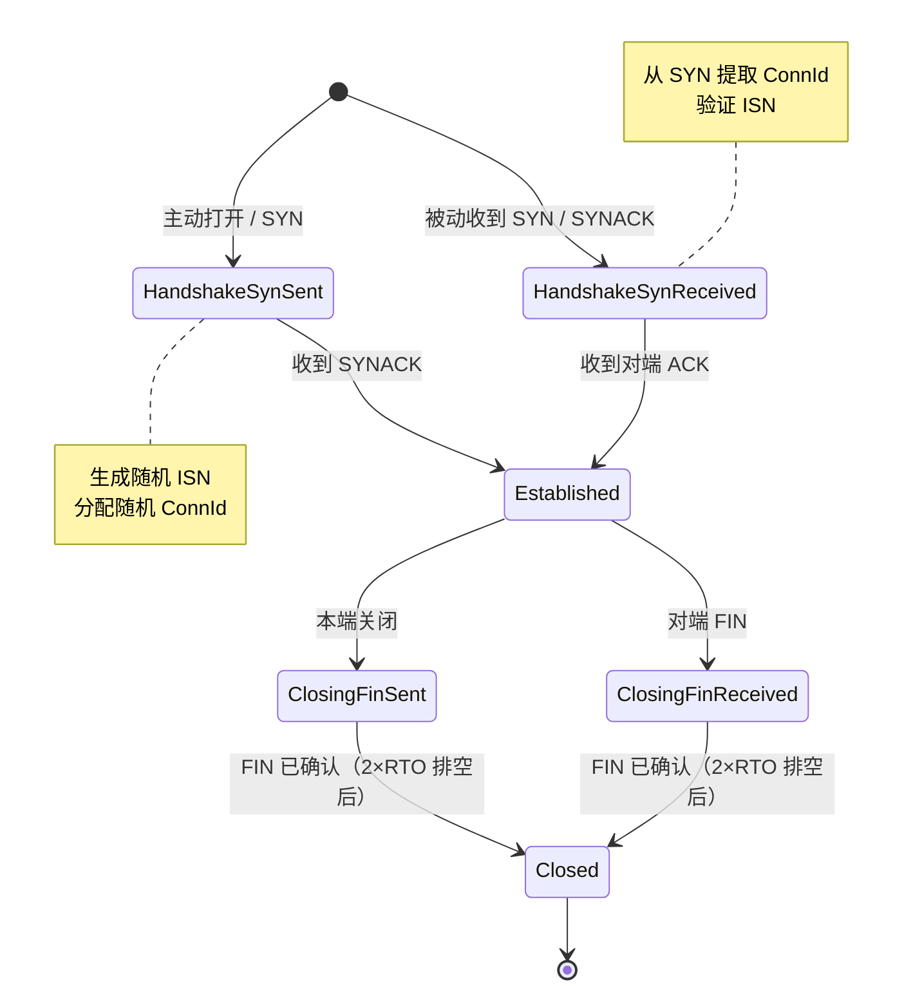
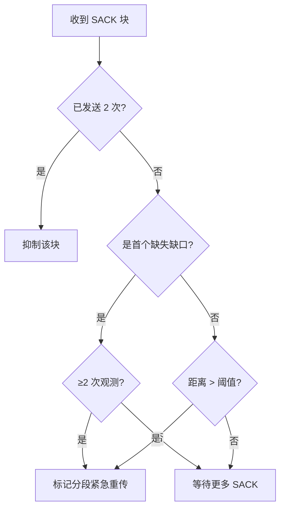
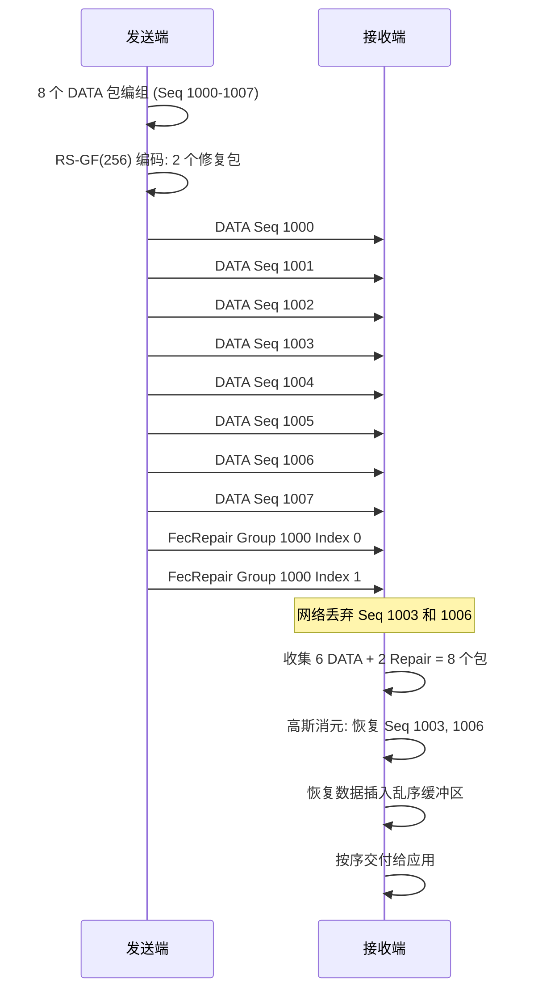

# PPP PRIVATE NETWORK™ X - 通用通信协议 (UCP) — 协议

[English](protocol.md) | [文档索引](index_CN.md)

**协议标识: `ppp+ucp`** — 本文档是 UCP 线格式、可靠性机制、丢包恢复策略、拥塞控制算法、前向纠错设计及报告口径的权威规范。

## 设计原则

UCP 基于三个核心设计原则，使其区别于传统的丢包反应式传输协议：

1. **随机丢包是恢复信号，而非拥塞信号。** UCP 在检测到缺失数据时立即重传，但仅有当 RTT 增长、投递率下降、聚集丢包三个独立信号共同证明瓶颈拥塞时，才降低 pacing 速率或拥塞窗口。

2. **每个包都携带可靠性信息。** UCP 通过 `HasAckNumber` 标志在 DATA、NAK 和控制包中捎带累积 ACK 号，最小化纯 ACK 开销，并对收到的每个包（无论类型）提供 RTT 样本。

3. **恢复按置信度分级。** UCP 使用三条不同且紧迫性递增的恢复路径：SACK（最快，发送端驱动）、重复 ACK（快，发送端驱动）和 NAK（保守，接收端驱动，分级置信度）。每条路径各司其职，协议绝不为同一缺口同时启动多条恢复路径。

## 包格式

所有多字节整数字段使用网络字节序（大端序）。

### 公共头（12 字节）

所有 UCP 包共享 12 字节公共头。此头包含关键的 `HasAckNumber` 标志，支持在所有包类型上捎带累积 ACK。

| 偏移 | 字段 | 大小 | 说明 |
|---|---|---|---|
| 0 | Type | 1B | `0x01` SYN, `0x02` SYNACK, `0x03` ACK, `0x04` NAK, `0x05` DATA, `0x06` FIN, `0x07` RST, `0x08` FecRepair。 |
| 1 | Flags | 1B | Bit 0 (`0x01`): **HasAckNumber** — 若置位则 AckNumber 字段紧随公共头。Bit 1 (`0x02`): **Retransmit**。Bit 2 (`0x04`): **FinAck**。Bit 3 (`0x08`): **NeedAck**。 |
| 2 | ConnId | 4B | 随机 32 位连接标识，用于 UDP 多路复用。SYN 时通过加密 PRNG 生成。 |
| 6 | Timestamp | 6B | 发送方本地微秒时间戳，用于 RTT 回显测量。 |

### HasAckNumber 标志 — 捎带累积 ACK

`HasAckNumber` 标志（`Flags & 0x01`）是 UCP 确认效率的基石。置位时，包头后紧接 4 字节累积 ACK 号，无论包类型如何：

这意味着：
- 携带 `HasAckNumber` 的 **DATA 包**同时交付负载并确认已收数据，无需单独发送 ACK。
- 携带 `HasAckNumber` 的 **NAK 包**报告缺失序号，同时确认累积点之前的所有数据。
- **控制包**（SYN、SYNACK、FIN、RST）可确认握手完成或最后收到数据。
- 每个带 `HasAckNumber` 标志的收包都为接收方提供一次 RTT 样本，大幅提高双向流量下 RTT 样本密度，改善 RTO 估计精度。

### DATA 包

| 偏移 | 字段 | 大小 | 说明 |
|---|---|---|---|
| 12 | [HasAckNumber 后 AckNumber] | 4B | 可选：Flags & 0x01 置位时出现。 |
| 可变 | SeqNum | 4B | 本分段首个 payload 字节的数据序号。 |
| 可变 | FragTotal | 2B | 本数据分段的总分片数（1 = 未分片）。 |
| 可变 | FragIndex | 2B | 本分段中从零开始的分片索引。 |
| 可变 | Payload | ≤ `MSS - overhead` 字节 | 应用数据负载。 |

### ACK 包

纯 ACK 包（Type `0x03`）在无其他出站流量可捎带时发送。ACK 包的 `HasAckNumber` 标志本质为真。

| 偏移 | 字段 | 大小 | 说明 |
|---|---|---|---|
| 12 | AckNumber | 4B | 累积 ACK：此序号之前（含）的所有字节已收到。 |
| 16 | SackCount | 2B | 后续 SACK 块数量。 |
| 18 | SackBlocks[] | N × 8B | 每块为 `(StartSequence: 4B, EndSequence: 4B)`，描述超出累积 ACK 的已收范围。 |
| 可变 | WindowSize | 4B | 通告接收窗口（字节）。 |
| 可变 | EchoTimestamp | 6B | 被确认包发送方时间戳的回显。 |

### SACK 块发送限制

每个 SACK 块范围（由 `(StartSequence, EndSequence)` 对定义）在其生命周期内最多通告 **2 次**。一旦块已发送两次，后续 ACK 将省略它。这种 QUIC 启发的限制防止接收端持续乱序时的 SACK 放大：发送端有两次机会接收并响应 SACK 信息，之后该块被视为过期。若两次 SACK 发送后缺口依然存在，发送端依赖 NAK 和 RTO 进行恢复。

### NAK 包

NAK（Type `0x04`）是接收端驱动的否定确认。当接收端确信一个或多个序号已永久丢失而非仅乱序时才发出。

| 偏移 | 字段 | 大小 | 说明 |
|---|---|---|---|
| 12 | [HasAckNumber 后 AckNumber] | 4B | 可选累积 ACK（推荐）。 |
| 可变 | MissingCount | 2B | 缺失序号条目数。 |
| 可变 | MissingSeqs[] | N × 4B | 缺失序号，单调递增排列。 |

### NAK 分级置信度

UCP 不会在首次发现缺口时就发出 NAK，而是使用三个置信层级，随着证据积累逐步缩短乱序守卫：

| 置信层级 | 观测次数 | 乱序守卫 | 目的 |
|---|---|---|---|
| **低** | 1-2 | `max(RTT × 2, 60ms)` | 保守初始守卫：缺口可能只是乱序。长等待防止误报 NAK。 |
| **中** | 3-4 | `max(RTT, 20ms)` | 证据增多：缺口很可能是真丢包，守卫缩短到 RTT。 |
| **高** | 5+ | `max(5ms, RTT/4)` | 压倒性证据：缺口几乎确定为丢包。最小守卫以最快速度发出 NAK。 |

这种分级方法消除了高抖动路径（移动、卫星）上的经典 NAK 误报问题，同时在丢包明确时仍能快速通知。

### FecRepair 包

| 偏移 | 字段 | 大小 | 说明 |
|---|---|---|---|
| 12 | [HasAckNumber 后 AckNumber] | 4B | 可选累积 ACK。 |
| 可变 | GroupId | 4B | FEC 组标识，也是组内首个 DATA 包的序号。 |
| 可变 | GroupIndex | 1B | 组内修复包索引（从 0 开始，最多 R−1）。 |
| 可变 | Payload | 变长 | GF(256) Reed-Solomon 修复数据。 |

## 连接状态机

## 丢包检测与恢复

### QUIC 风格 SACK 快速重传

UCP 基于 SACK 的快速重传采用 QUIC 启发式设计，配合短乱序保护期和每块发送限制：

1. **块通告限制**：每个 `(StartSeq, EndSeq)` SACK 块最多发送 2 次，之后抑制以防放大。
2. **乱序保护**：`max(3ms, RTT / 8)` — 足够短让真丢包在 RTT 几分之一时间内触发快重传；足够长吸收简单乱序。
3. **首个缺口触发**：首个累积 ACK 缺口在接收端 2 次 SACK 观测后可修复。
4. **后续缺口**：最高 SACK 序号以下的额外缺口，若从最高观测序号到该缺口的距离超过 `SACK_FAST_RETRANSMIT_DISTANCE_THRESHOLD` (32) 则可修复，支持同 RTT 内并行恢复多个独立丢包。

### 重复 ACK 快速重传

收到两次重复 ACK（同一累积 ACK 号收到 2 次）即可触发快速重传，前提是疑似丢失分段满足以下之一：
- 分段年龄超过 SACK 乱序保护期，或
- 总在途字节低于早期重传阈值（小在途量 = 伪重传风险低）。

### 接收端分级置信度 NAK

如上所述，NAK 发送使用三个置信层级。接收端还在 `NAK_REPEAT_INTERVAL_MICROS`（250ms）内对同一序号抑制重复 NAK，防止 NAK 风暴。

### RTO / PTO 守卫

RTO 被视为最后的修复路径。UCP 使用 PTO（探测超时）启发式守卫：当 ACK 近期有进展（`RTO_ACK_PROGRESS_SUPPRESSION_MICROS` = 2ms 内），批量 RTO 扫描被抑制。这让 SACK、NAK 和 FEC 先修复缺口，避免路径存活但短暂乱序时重传整个 BDP。

RTO 退避使用 1.2 系数（非传统 2.0），在真正死链上更快升级，同时在偶尔尾丢包的路径上避免过于激进的退避。

## 紧急重传机制

普通 DATA 发送同时遵循公平队列 credit 和 token-bucket pacing。紧急重传仅在恢复路径上标记 — SACK 恢复、NAK 恢复、重复 ACK 或接近断连尾丢包时。紧急重传允许时：

关键不变式：
- 紧急重传上限为 `URGENT_RETRANSMIT_BUDGET_PER_RTT`（每 RTT 窗口 16 包）。
- `ForceConsume()` 创建有界负 token 债务；债务由后续普通发送偿还。
- 每 RTT 预算在每个 RTT 边界重置，防止单个连接在长时间恢复中独占网络。

## BBRv2 拥塞控制

### 状态转换

`Startup → Drain → ProbeBW ↔ ProbeRTT`

| 状态 | 行为 |
|---|---|
| **Startup** | 使用 `pacing_gain = 2.5` 和 `cwnd_gain = 2.0` 快速探测瓶颈带宽。当吞吐在 3 个 RTT 窗口内不再显著增长时退出。 |
| **Drain** | 使用低 pacing 增益 (0.75) 排空 Startup 期间积累的队列。持续 1 个 BBR 周期。 |
| **ProbeBW** | 围绕估计瓶颈速率循环增益：8 阶段 `[1.25, 0.85, 1.0, 1.0, 1.0, 1.0, 1.0, 1.0]`。随机丢包不会降低增益，除非拥塞证据成立。 |
| **ProbeRTT** | 临时降低 pacing 和 CWND 刷新 `MinRtt`。若丢包长肥路径上投递率仍高则跳过，避免不必要的吞吐骤降。 |

### 自适应 Pacing 增益

BBRv2 引入自适应 pacing 增益：基础增益循环乘以拥塞响应因子。检测到拥塞证据时：
- `AdaptivePacingGain = BaseGain × 0.98`（当前循环）。
- 增益在后续循环中按 `BBR_LOSS_CWND_RECOVERY_STEP` 速率恢复。

### 丢包感知 CWND

- **CWND 下限**：拥塞丢包后 CWND 增益下限为 `BBR_MIN_LOSS_CWND_GAIN = 0.95`，防止窗口跌破 BDP 的 95%。
- **CWND 恢复**：每个 ACK 恢复 `BBR_LOSS_CWND_RECOVERY_STEP = 0.04` 的 CWND 增益，平稳恢复无过冲。

## 前向纠错 — Reed-Solomon GF(256)

UCP 的 FEC 子系统使用 GF(256) 上的 Reed-Solomon 编码，支持从 N 个数据包组中恢复最多 R 个丢包（R 为修复包数量）。

### 编码过程

1. 发送端将 N 个连续 DATA 包编为一个 FEC 组。
2. 对 N 个数据负载的每个字节位置，构造 N−1 次多项式。
3. 在 GF(256) 上对 R 个不同点 `{1, 2, ..., R}` 求值，产生 R 个修复字节。
4. 发送 N 个 DATA 包后接 R 个 FecRepair 包。

### 解码过程

1. 接收端收集该组的 N+R 个包中任意 N 个（数据 + 修复）。
2. 使用已知求值点和收到的字节值，在 GF(256) 上通过高斯消元求解线性方程组以恢复缺失数据字节。
3. 重构数据组装为完整 DATA 包负载，保留原始序号和分片元数据，然后插入乱序缓冲区正常交付。

### GF(256) 实现

GF(256) 运算使用不可约多项式 `x^8 + x^4 + x^3 + x + 1` (0x11B)。乘法和除法使用预计算 256 项对数/反对数表，常数时间执行。

## 报告口径

| 指标 | 来源 | 含义 |
|---|---|---|
| `Throughput Mbps` | `NetworkSimulator` | 已交付 payload 字节 / 耗时，按 `Target Mbps` 封顶。 |
| `Util%` | 派生 | `Throughput / Target × 100`，上限 100%。 |
| `Retrans%` | `UcpPcb` 发送端计数 | 重传 DATA 包 / 原始 DATA 包。这是**协议修复开销**，非物理网络丢包。 |
| `Loss%` | `NetworkSimulator` | 模拟器丢弃 DATA 包 / 提交的 DATA 包。这是**物理网络丢包**，与协议恢复无关。 |
| `A->B ms`, `B->A ms` | `NetworkSimulator` | 各方向实测单向传播延迟。 |
| `Avg/P95/P99/Jit ms` | `UcpRtoEstimator` | RTT 统计：均值、95/99 百分位、相邻样本平均抖动。 |
| `CWND` | `Bbrv2CongestionControl` | 当前拥塞窗口，自适应 `B/KB/MB/GB` 显示。 |
| `Current Mbps` | `Bbrv2CongestionControl` | 当前瞬时 pacing 速率。 |
| `RWND` | `UcpPcb` | 对端通告接收窗口。 |
| `Waste%` | `UcpPcb` | 重传 DATA 字节 / 原始 DATA 字节百分比。 |
| `Conv` | `NetworkSimulator` | 实测收敛时间，自适应 `ns/us/ms/s` 显示。 |

`Retrans%` 和 `Loss%` 刻意保持独立。一个高丢包但 FEC 覆盖良好的场景可能 `Loss% = 5%` 但 `Retrans% = 1%`（FEC 修复了多数丢包）。反之，FEC 配置不当可能导致 `Retrans% > Loss%`（重传开销叠加）。
