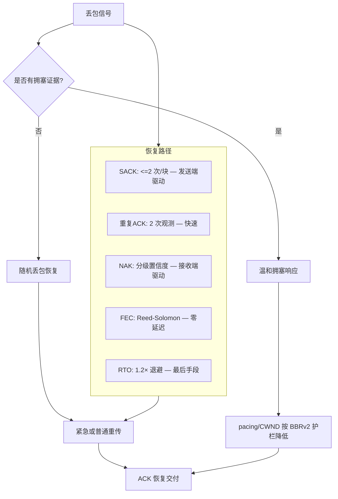
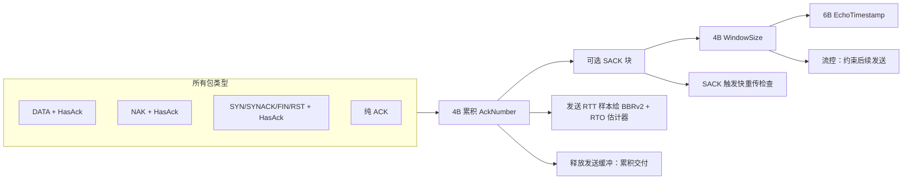
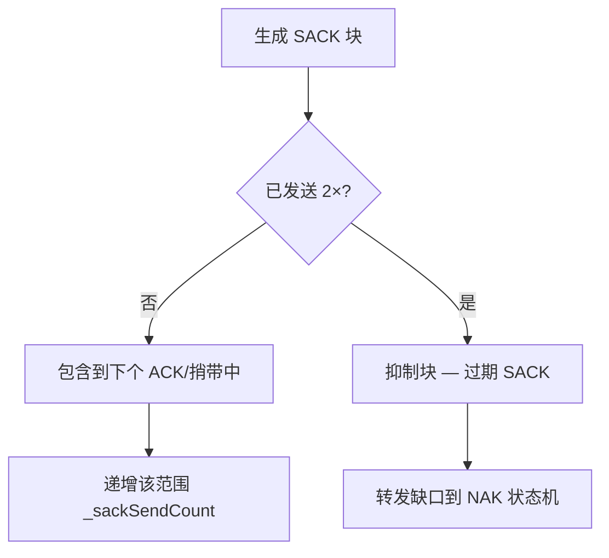
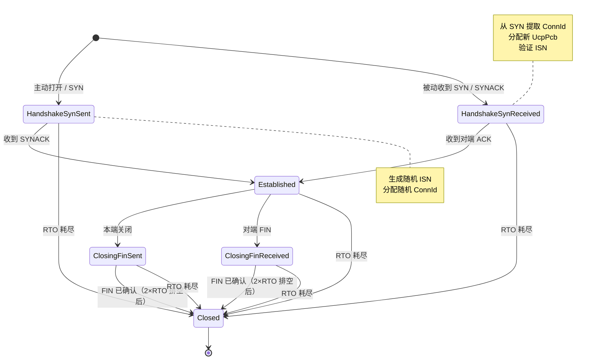
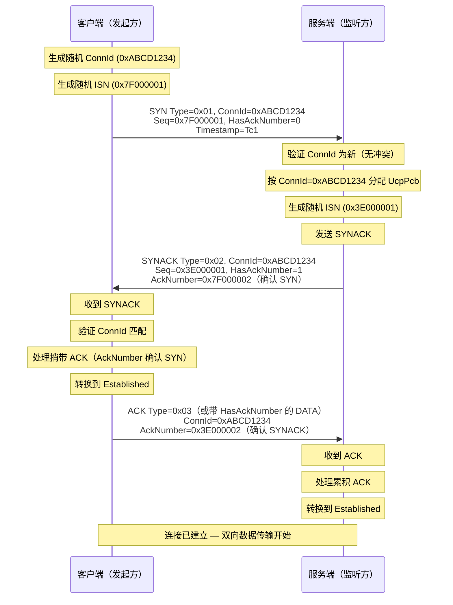
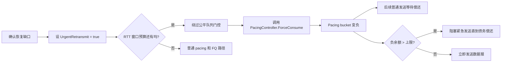

# PPP PRIVATE NETWORK™ X — 通用通信协议 (UCP) — 协议

[English](protocol.md) | [文档索引](index_CN.md)

**协议标识: `ppp+ucp`** — 本文档是 UCP 线格式、可靠性机制、丢包恢复策略、拥塞控制算法、前向纠错设计及报告口径的权威规范。

---

## 设计原则

UCP 基于三个核心设计原则，使其区别于传统的丢包反应式传输协议：

1. **随机丢包是恢复信号，而非拥塞信号。** UCP 在检测到缺失数据时立即重传，但仅有当 RTT 增长、投递率下降、聚集丢包三个独立信号共同证明瓶颈拥塞时，才降低 pacing 速率或拥塞窗口。

2. **每个包都携带可靠性信息。** UCP 通过 `HasAckNumber` 标志在 DATA、NAK 和控制包中捎带累积 ACK 号，最小化纯 ACK 开销，并对收到的每个包（无论类型）提供 RTT 样本。

3. **恢复按置信度分级。** UCP 使用三条不同且紧迫性递增的恢复路径：SACK（最快，发送端驱动）、重复 ACK（快，发送端驱动）和 NAK（保守，接收端驱动，分级置信度）。每条路径各司其职，协议绝不为同一缺口同时启动多条恢复路径。



---

## 包格式

所有多字节整数字段使用网络字节序（大端序）。

### 公共头（12 字节）

所有 UCP 包共享 12 字节公共头。此头包含关键的 `HasAckNumber` 标志，支持在所有包类型上捎带累积 ACK。

| 偏移 | 字段 | 大小 | 说明 |
|---|---|---|---|
| 0 | Type | 1B | 包类型标识。 |
| 1 | Flags | 1B | 位标志，控制 ACK 存在性和状态。 |
| 2 | ConnId | 4B | 随机 32 位连接标识，用于 UDP 多路复用。 |
| 6 | Timestamp | 6B | 发送方本地微秒时间戳，用于 RTT 回显测量。 |

### 包类型

| 类型码 | 名称 | 作用 |
|---|---|---|
| `0x01` | SYN | 连接发起。携带随机 ISN 和 ConnId。 |
| `0x02` | SYNACK | 连接接受。回显客户端 ConnId 并提供服务端 ISN。 |
| `0x03` | ACK | 纯确认包。无可捎带数据负载时使用。 |
| `0x04` | NAK | 否定确认。报告缺失序号。 |
| `0x05` | DATA | 应用负载数据。携带序号和可选捎带 ACK。 |
| `0x06` | FIN | 优雅连接终止请求。 |
| `0x07` | RST | 硬连接重置。表示不可恢复错误。 |
| `0x08` | FecRepair | 前向纠错修复包。携带 GF(256) 修复数据。 |

### Flags 位布局

| 位 | 掩码 | 名称 | 说明 |
|---|---|---|---|
| 0 | `0x01` | **HasAckNumber** | 若置位则 AckNumber 字段紧随公共头。 |
| 1 | `0x02` | **Retransmit** | 表示此包为重传。 |
| 2 | `0x04` | **FinAck** | 确认对端 FIN。 |
| 3 | `0x08` | **NeedAck** | 请求对端立即确认。 |

### HasAckNumber 标志 — 捎带累积 ACK

`HasAckNumber` 标志（`Flags & 0x01`）是 UCP 确认效率的基石。置位时，包头后紧接 4 字节累积 ACK 号，无论包类型如何：



**捎带开销分析：**

典型无 SACK 块的 DATA 包：
- 捎带开销：4(AckNumber) + 0(SackCount=0) + 4(WindowSize) + 6(EchoTimestamp) = **14 字节**
- 默认 MSS（1220 字节）：开销 = 14/1220 = **1.15%**
- 巨型 MSS（9000 字节）：开销 = 14/9000 = **0.16%**

### DATA 包布局

| 偏移 | 字段 | 大小 | 说明 |
|---|---|---|---|
| 0 | Common Header | 12B | Type=0x05, Flags（可含 HasAckNumber）, ConnId, Timestamp |
| 12 | [AckNumber] | 4B | 可选：Flags & HasAckNumber 置位时出现 |
| 可变 | SeqNum | 4B | 本分段首个 payload 字节的数据序号 |
| 可变 | FragTotal | 2B | 本分段总分片数（1 = 未分片） |
| 可变 | FragIndex | 2B | 本分段中从零开始的分片索引 |
| 可变 | Payload | ≤ MSS-开销 | 应用数据负载 |

### ACK 包布局

| 偏移 | 字段 | 大小 | 说明 |
|---|---|---|---|
| 0 | Common Header | 12B | Type=0x03, ConnId, Timestamp |
| 12 | AckNumber | 4B | 累积 ACK：此序号之前所有字节已收到 |
| 16 | SackCount | 2B | 后续 SACK 块数量（0-255） |
| 18 | SackBlocks[] | N × 8B | 每块：StartSequence(4B) + EndSequence(4B) — 超出累积 ACK 的已收范围 |
| 可变 | WindowSize | 4B | 通告接收窗口字节数（流控） |
| 可变 | EchoTimestamp | 6B | 被确认包发送方时间戳的回显 |

### SACK 块发送限制

每个 SACK 块范围在其生命周期内最多通告 **2 次**。超过后抑制该块，发送端依赖 NAK 和 RTO 恢复：



### NAK 包布局

| 偏移 | 字段 | 大小 | 说明 |
|---|---|---|---|
| 0 | Common Header | 12B | Type=0x04, ConnId, Timestamp |
| 12 | [AckNumber] | 4B | 可选：Flags & HasAckNumber 置位时出现（推荐） |
| 可变 | MissingCount | 2B | 缺失序号条目数（0-256） |
| 可变 | MissingSeqs[] | N × 4B | 缺失序号，单调递增排列 |

### FecRepair 包布局

| 偏移 | 字段 | 大小 | 说明 |
|---|---|---|---|
| 0 | Common Header | 12B | Type=0x08, ConnId, Timestamp |
| 12 | [AckNumber] | 4B | 可选：Flags & HasAckNumber 置位时出现 |
| 可变 | GroupId | 4B | FEC 组标识（组内首个 DATA 包的序号） |
| 可变 | GroupIndex | 1B | 组内修复包索引（0 起始，最多 R−1） |
| 可变 | Payload | 变长 | GF(256) Reed-Solomon 修复数据 |

---

## 连接状态机



---

## 序号算术

UCP 使用 32 位序号配标准 TCP 启发式比较规则。所有序号比较使用无符号算术配 2^31 窗口实现无歧义排序：

```
seq_a > seq_b 当: (uint)(seq_a - seq_b) < 2^31
seq_a < seq_b 当: (uint)(seq_b - seq_a) < 2^31
```

这为最多 2^31（21 亿）个在途序号提供无歧义排序，远超任何实际发送缓冲容量。

---

## 握手过程



---

## 丢包检测与恢复

### 完整恢复流程

```mermaid
flowchart TD
    Drop[网络丢弃 DATA 包] --> Gap[接收端检测缺口]

    Gap --> OutOfOrder[后续包到达缺口上方]
    OutOfOrder --> SackGen[UcpSackGenerator 创建 SACK 块]
    SackGen --> SackLimit{块已发送 < 2×?}
    SackLimit -->|是| SackSend[包含到下个 ACK/捎带中]
    SackLimit -->|否| SackSuppress[抑制块]

    SackSend --> SackRecv[发送端收到 SACK]
    SackRecv --> SackEval{>=2 次 SACK 观测?}
    SackEval -->|是| SackReGrace{已过 > max(3ms, RTT/8)?}
    SackEval -->|否| SackWait[等待更多 SACK]
    SackReGrace -->|是| SackRepair[标记紧急重传]
    SackReGrace -->|否| SackWait

    Gap --> ObsCount[递增 _missingSequenceCounts[seq]]
    ObsCount --> NakTier{置信层级?}
    NakTier -->|低: 1-2| NakGuard1[守卫: max(RTT×2, 60ms)]
    NakTier -->|中: 3-4| NakGuard2[守卫: max(RTT, 20ms)]
    NakTier -->|高: 5+| NakGuard3[守卫: max(RTT/4, 5ms)]
    NakGuard1 --> NakSup{重复抑制?}
    NakGuard2 --> NakSup
    NakGuard3 --> NakSup
    NakSup -->|是| NakWait[跳过 — 等待抑制过期]
    NakSup -->|否| NakEmit[发出 NAK]

    NakEmit --> NakRecv[发送端收到 NAK]
    NakRecv --> NakRepair[标记紧急重传]

    Gap --> FecCheck{FEC 恢复可行?}
    FecCheck -->|是| FecRepair[GF256 高斯消元]
    FecRepair --> Insert[插入恢复 DATA 到接收缓冲]
    FecCheck -->|否| WaitForRepair[等待重传]

    SackRepair --> Repair[执行重传]
    NakRepair --> Repair

    Repair --> UrgentBudget{紧急预算剩余?}
    UrgentBudget -->|是| Force[ForceConsume + 绕过 FQ]
    UrgentBudget -->|否| Normal[正常 pacing + FQ 路径]

    Force --> Deliver[交付给应用]
    Normal --> Deliver
    Insert --> Deliver
```

### NAK 分级置信度

| 置信层级 | 观测次数 | 乱序守卫公式 | 绝对最小值 | 目的 |
|---|---|---|---|---|
| **低** | 1-2 | `max(RTT × 2, 60ms)` | 60ms | 保守：防止抖动路径误报 NAK |
| **中** | 3-4 | `max(RTT, 20ms)` | 20ms | 证据增多：守卫缩短至约 1 RTT |
| **高** | 5+ | `max(RTT/4, 5ms)` | 5ms | 压倒性：最小守卫最快发出 NAK |

---

## 紧急重传机制



---

## BBRv2 拥塞控制

### 状态转换

```
Startup → Drain → ProbeBW ↔ ProbeRTT
```

| 状态 | 行为 | Pacing 增益 | CWND 增益 | 退出条件 |
|---|---|---|---|---|
| **Startup** | 快速探测瓶颈带宽 | 2.5 | 2.0 | 3 RTT 窗口吞吐不再增长 |
| **Drain** | 排空 Startup 累积队列 | 0.75 | — | 在途 < BDP × 目标 |
| **ProbeBW** | 围绕 BtlBw 稳态循环 | [1.25, 0.85, 1.0×6] | 2.0 | 30s ProbeRTT 间隔 |
| **ProbeRTT** | 刷新 MinRTT 估计 | 1.0 | 4 包 | 100ms 已过 |

---

## 前向纠错 — Reed-Solomon GF(256)

### 数学基础

UCP 的 FEC 使用 GF(256) 上 Reed-Solomon 编码，不可约多项式 `x^8 + x^4 + x^3 + x + 1` (0x11B)。

**编码**：对含 N 个各 L 字节负载的数据包组：
1. 对每字节位置 j，构造向量 v = [data[0][j], ..., data[N-1][j]]
2. 生成 R 个修复字节：repair[i][j] = Σ(k=0 到 N-1) (data[k][j] × α^(i×k)) 在 GF(256) 中
3. 分组修复字节为 R 个 FecRepair 包

**解码**：当 M 个包丢失（M ≤ R）：
1. 收集该组的 N 个已收实体（数据 + 修复）
2. 对每字节位置，在 GF(256) 上用高斯消元求解线性方程组
3. 恢复每位置 M 个缺失数据字节
4. 将恢复字节组装为保留原始序号的 DATA 包

---

## 报告口径

| 指标 | 来源 | 含义 |
|---|---|---|
| `Throughput Mbps` | `NetworkSimulator` | 已交付 payload 字节 / 耗时，按 Target Mbps 封顶。 |
| `Util%` | 派生 | Throughput / Target × 100，上限 100%。 |
| `Retrans%` | `UcpPcb` 发送端计数 | 重传 DATA / 原始 DATA。**协议修复开销**，非物理网络丢包。 |
| `Loss%` | `NetworkSimulator` | 仿真器丢弃 DATA / 提交 DATA。**物理网络丢包**，与协议恢复无关。 |
| `A->B ms`, `B->A ms` | `NetworkSimulator` | 各方向实测单向传播延迟。 |
| `Avg/P95/P99/Jit ms` | `UcpRtoEstimator` | RTT 统计：均值、95/99 百分位、相邻样本平均抖动。 |
| `CWND` | `Bbrv2CongestionControl` | 当前拥塞窗口，自适应 B/KB/MB/GB 显示。 |
| `Current Mbps` | `Bbrv2CongestionControl` | 传输完成时瞬时 pacing 速率。 |
| `RWND` | `UcpPcb` | 对端通告接收窗口。 |
| `Conv` | `NetworkSimulator` | 实测收敛时间，自适应 ns/us/ms/s 显示。 |

`Retrans%` 和 `Loss%` 刻意保持独立。高丢包 FEC 好的场景可能 `Loss% = 5%` 但 `Retrans% = 1%`（FEC 修复多数丢包）。FEC 配置不当可能 `Retrans% > Loss%`（重传开销叠加）。
