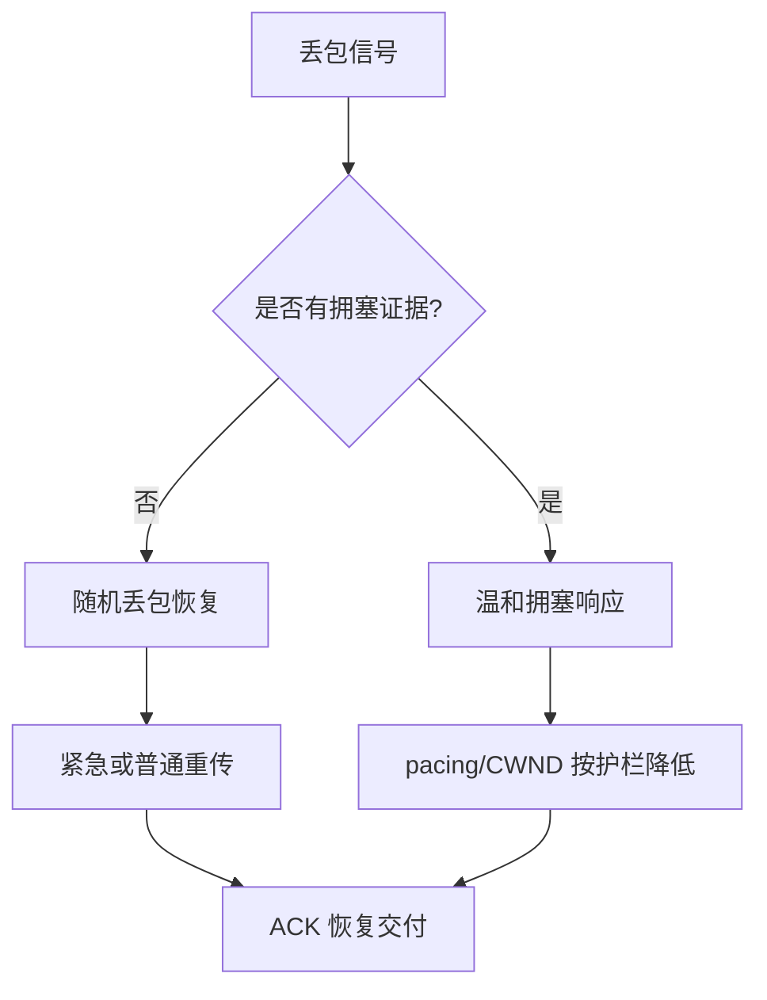
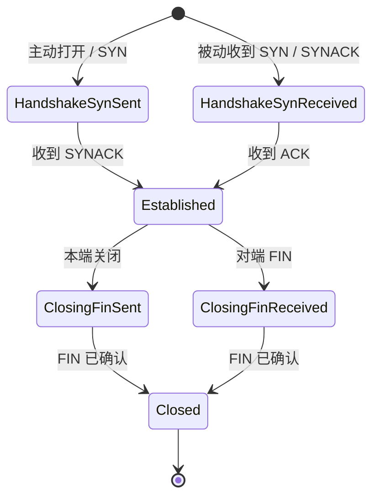
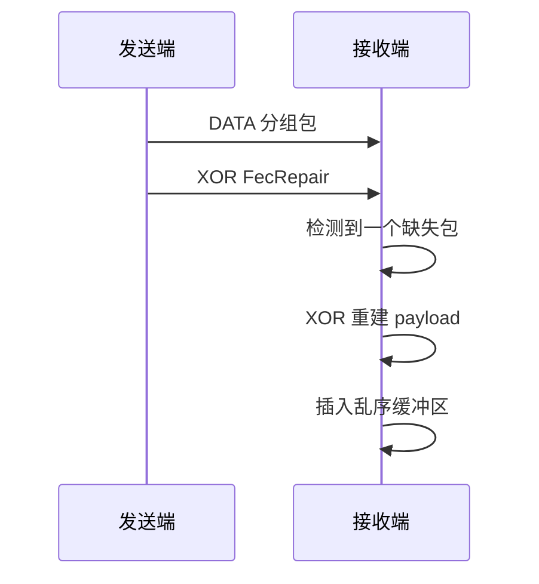

# UCP 协议深度解析

[English](protocol.md) | [文档索引](index_CN.md)

## 设计原则

随机丢包是恢复信号，不是自动拥塞信号。UCP 会立即重传缺失数据，但只有 RTT 增长、投递率下降、聚集丢包共同证明瓶颈拥塞时，才降低 pacing 或 CWND。

## 包格式

所有多字节整数字段使用大端序。

### 公共头

| 偏移 | 字段 | 大小 | 说明 |
|---|---|---|---|
| 0 | Type | 1B | `0x01` SYN, `0x02` SYNACK, `0x03` ACK, `0x04` NAK, `0x05` DATA, `0x06` FIN, `0x07` RST, `0x08` FecRepair。 |
| 1 | Flags | 1B | `0x01` NeedAck, `0x02` Retransmit, `0x04` FinAck。 |
| 2 | ConnId | 4B | UDP 多路复用连接标识。 |
| 6 | Timestamp | 6B | 发送方本地微秒时间戳，用于 RTT 回显。 |

### DATA 包

| 偏移 | 字段 | 大小 |
|---|---|---|
| 12 | SeqNum | 4B |
| 16 | FragTotal | 2B |
| 18 | FragIndex | 2B |
| 20 | Payload | 最大 `MSS - 20` 字节 |

### ACK 包

| 偏移 | 字段 | 大小 |
|---|---|---|
| 12 | AckNumber | 4B |
| 16 | SackCount | 2B |
| 18 | SackBlocks[] | `N * 8B` |
| 可变 | WindowSize | 4B |
| 可变 | EchoTimestamp | 6B |

### NAK 包

| 偏移 | 字段 | 大小 |
|---|---|---|
| 12 | MissingCount | 2B |
| 14 | MissingSeqs[] | `N * 4B` |

### FecRepair 包

| 偏移 | 字段 | 大小 |
|---|---|---|
| 12 | GroupId | 4B |
| 16 | GroupIndex | 1B |
| 17 | Payload | 变长 |

## 连接状态机

## 丢包检测

### SACK 快速重传

发送端 SACK 恢复使用较短的 QUIC-style 乱序保护：`max(5ms, RTT / 8)`。首个累计 ACK 缺口两次观测后即可修复。低于最高 SACK 序号的其他已报告缺口也可在确认后并行修复，避免随机独立丢包每 RTT 只补一个洞。

### 重复 ACK 快速重传

两个重复 ACK 即可触发快速重传，前提是疑似丢失分段已足够旧，或在途包足够少可以执行 early retransmit。

### 接收端 NAK

NAK 故意保守。接收端等待 `NAK_MISSING_THRESHOLD` 次观测和 60ms 乱序保护后才发 NAK，并用 `NAK_REPEAT_INTERVAL_MICROS` 抑制重复 NAK。

## 紧急重传

普通 DATA 发送同时遵循 fair-queue credit 和 token-bucket pacing。紧急重传只在 SACK、NAK、重复 ACK、RTO、接近断连的 tail loss 等恢复路径上标记。若 RTT 窗口预算允许，它会绕过 FQ 和 pacing gate，并调用 `PacingController.ForceConsume()` 形成有界 pacing debt。

这能让濒死连接快速救活，同时避免无限突发。

## BBRv1 拥塞控制

### 状态

`Startup -> Drain -> ProbeBW <-> ProbeRTT`

| 状态 | 行为 |
|---|---|
| Startup | 使用 `pacing_gain=2.0` 和 `cwnd_gain=2.0` 探测瓶颈带宽。 |
| Drain | 使用低 pacing gain 排空 Startup 队列，然后进入 ProbeBW。 |
| ProbeBW | 围绕估计瓶颈速率循环探测；随机丢包不会打崩管道。 |
| ProbeRTT | 临时降低 pacing/CWND 刷新 MinRTT；丢包长肥路径避免不必要 ProbeRTT。 |

### 核心估计量

| 估计量 | 计算 | 作用 |
|---|---|---|
| `BtlBw` | 最近 RTT 窗口最大 delivery rate | pacing rate 基准。 |
| `MinRtt` | ProbeRTT 周期内最小 RTT | BDP 分母。 |
| `BDP` | `BtlBw * MinRtt` | 目标在途字节数。 |
| `PacingRate` | `BtlBw * PacingGain` | 发送速率。 |
| `CWND` | `BDP * CwndGain` 加护栏 | 在途上限。 |

导出的 pacing rate 是控制器当前瞬时速率。基准吞吐另由仿真器瓶颈封顶。

## FEC

UCP 可为每个 FEC 组生成一个 XOR 修复包。当组内恰好缺失一个 DATA 包且 repair 包可用时可恢复。

## 报告口径

`Retrans%` 是发送端恢复开销。`Loss%` 是仿真器在恢复前观测到的 DATA 丢包率。二者必须保持独立。
