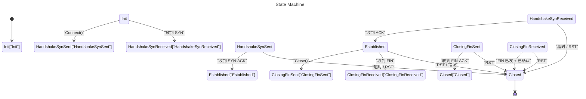
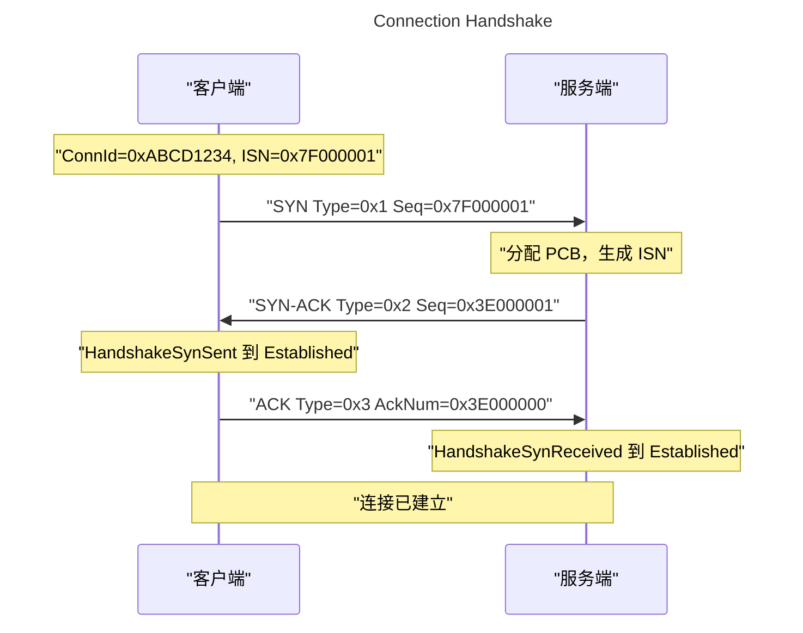

# 通用通信协议 (UCP) — 传输协议规范

[English](protocol.md) | [文档索引](index_CN.md)

本文档定义 UCP 传输协议：包格式、编码解码、连接生命周期、可靠性机制和流控制。所有多字节整数字段使用网络字节序（大端序）。

## 文档索引

| 参考文档 | 内容 |
|---|---|
| [总体方案](architecture_CN.md) | 运行时分层、PCB 状态机、串行执行模型 |
| [API 参考](api_CN.md) | 公开 API 接口、配置参数、使用示例 |
| [常量参考](constants_CN.md) | 全部可调与固定常量目录 |

## 包格式

### 公共头部（12 字节）

每个 UCP 包以一个 12 字节的头部开始：


```mermaid
---
title: "UCP Packet Header"
---
packet-beta
   0-0: "Type"
   1-1: "Flags"
   2-5: "Connection ID"
   6-11: "Timestamp (uint48)"
```

| 偏移 | 大小 | 字段 | 说明 |
|---|---|---|---|
| 0 | 1 | Type | uint8 包类型标识 |
| 1 | 1 | Flags | uint8 位标志 |
| 2 | 4 | ConnectionId | uint32 随机连接标识符，用于 UDP 多路分解 |
| 6 | 6 | Timestamp | uint48 发送方微秒时间戳，用于 RTT 测量 |

### 十六进制转储 — 公共头部

```
偏移    十六进制字节                    字段
------  ------------------------------  ------------------------------------
 0-0    05                              Type = 0x5 (DATA)
 1-1    08                              Flags = HasAckNumber
 2-5    12 34 56 78                     ConnectionId = 0x12345678
 6-11   00 00 00 0A 5B C0               Timestamp = 678848 us
```

## 包类型

| 码值 | 名称 | 方向 | 说明 |
|---|---|---|---|
| 0x1 | SYN | 客户端到服务端 | 连接请求，携带 ISN 和 SessionKey |
| 0x2 | SYN-ACK | 服务端到客户端 | 连接确认，回显客户端 ISN，提供服务端 ISN |
| 0x3 | ACK | 双向 | 纯累积确认，携带 SACK 块、窗口和时间戳回显 |
| 0x4 | NAK | 双向 | 否定确认，列出特定缺失序号 |
| 0x5 | DATA | 双向 | 应用负载数据，可选捎带 ACK |
| 0x6 | FIN | 双向 | 优雅关闭连接 |
| 0x7 | RST | 双向 | 硬重置，立即断开 |
| 0x8 | FEC Repair | 双向 | 前向纠错修复包 |

## 包标志

Flags 字节（偏移 1）编码数据包的若干布尔属性。多个标志可通过按位 OR 组合使用。

| 位 | 掩码 | 名称 | 说明 |
|---|---|---|---|
| 0 | 0x01 | NeedAck | 接收方应立即确认，绕过延迟 ACK 定时器 |
| 1 | 0x02 | Retransmit | 此包为重传；不用于 RTT 采样（Karn 算法） |
| 2 | 0x04 | FinAck | 确认已收到 FIN |
| 3 | 0x08 | HasAckNumber | 包携带捎带累积 ACK 字段 |
| 4-5 | 0x30 | PriorityMask | 2 位优先级字段（0=后台，1=普通，2=交互，3=紧急） |
| 6 | 0x40 | MtuProbe | 用于路径 MTU 发现的探测包 |
| 7 | 0x80 | PathChallenge | 携带连接迁移挑战 |

## 捎带 ACK

每个 DATA 包可携带反向方向的确认信息，无需在双向传输中发送单独的 ACK 包。当设置 `HasAckNumber` 标志（位 3）时，类型特定头部之后附加以下字段：

| 字段 | 大小 | 说明 |
|---|---|---|
| AckNumber | 4 | uint32 累积确认序号 |
| SackBlockCount | 2 | uint16 SACK 块数量（0-149） |
| SACK 块 | N x 8 | 每个块：Left(4) + Right(4) 序号，大端序 |
| WindowSize | 4 | uint32 接收方通告窗口（字节） |
| EchoTimestamp | 6 | uint48 回显的发送方时间戳，用于 RTT 计算 |

这是累积 ACK（类似 TCP），而非纯选择性确认。AckNumber 确认此序号之前的所有数据已送达。SACK 块提供累积点之外的无序接收范围的附加信息。

## SACK 格式

选择性确认块编码连续的已接收范围。发送方利用 SACK 信息精确识别需要重传的包。


```mermaid
---
title: "SACK Blocks"
---
packet-beta
  0-3: "Left (Start)"
  4-7: "Right (End)"
```

- 每包最多 149 个 SACK 块
- 每个块为 [Left, Right] 形式的 uint32 序号对
- Left 包含，Right 包含
- 块按 Left 递增排序
- 每个 SACK 块范围最多通告 2 次，防止放大攻击

## 详细包布局

### DATA 包（Type=0x5）

| 偏移 | 大小 | 字段 | 说明 |
|---|---|---|---|
| 0 | 12 | CommonHeader | Type=0x5 |
| 12 | 4 | SequenceNumber | 数据序号 |
| 16 | 2 | FragmentTotal | 消息总分片数（1 = 未分片） |
| 18 | 2 | FragmentIndex | 基于零的分片索引 |
| [20] | [4] | [AckNumber] | 设置 HasAckNumber 标志时出现 |
| [24] | [2] | [SackBlockCount] | uint16，0-149 |
| [26] | [N x 8] | [SACK Blocks] | N = SackBlockCount |
| [..] | [4] | [WindowSize] | uint32 通告接收窗口 |
| [..] | [6] | [EchoTimestamp] | uint48 回显时间戳 |
| .. | N | Payload | 应用数据 |

### 十六进制转储 — 带捎带 ACK 的 DATA

```
偏移    十六进制字节                    字段
------  ------------------------------  ------------------------------------
 0-0    05                              Type = 0x5 (DATA)
 1-1    08                              Flags = HasAckNumber
 2-5    12 34 56 78                     ConnectionId = 0x12345678
 6-11   00 00 00 0A 5B C0               Timestamp = 678848 us
12-15   00 00 00 01                     SequenceNumber = 1
16-17   00 01                           FragmentTotal = 1
18-19   00 00                           FragmentIndex = 0
20-23   00 00 00 05                     AckNumber = 5
24-25   00 00                           SackBlockCount = 0
26-29   00 00 40 00                     WindowSize = 16384
30-35   00 00 00 0A 5B C0               EchoTimestamp = 678848 us
36-40   48 65 6C 6C 6F                  Payload = "Hello"
```

### 十六进制转储 — 带 2 个 SACK 块的 DATA

```
偏移    十六进制字节                    字段
------  ------------------------------  ------------------------------------
 0-0    05                              Type = 0x5 (DATA)
 1-1    08                              Flags = HasAckNumber
 2-5    12 34 56 78                     ConnectionId = 0x12345678
 6-11   00 00 00 0A 5B C0               Timestamp = 678848 us
12-15   00 00 00 01                     SequenceNumber = 1
16-17   00 01                           FragmentTotal = 1
18-19   00 00                           FragmentIndex = 0
20-23   00 00 00 03                     AckNumber = 3
24-25   00 02                           SackBlockCount = 2
26-29   00 00 00 05                     SACK Left = 5
30-33   00 00 00 08                     SACK Right = 8
34-37   00 00 00 0A                     SACK Left = 10
38-41   00 00 00 0E                     SACK Right = 14
42-45   00 00 40 00                     WindowSize = 16384
46-51   00 00 00 0A 5B C0               EchoTimestamp = 678848 us
 52-56   48 65 6C 6C 6F                  Payload = "Hello"
```

### ACK 包（Type=0x3）

| 偏移 | 大小 | 字段 |
|---|---|---|
| 0 | 12 | CommonHeader |
| 12 | 4 | AckNumber |
| 16 | 2 | SackBlockCount（0-149） |
| 18 | N x 8 | SACK 块 |
| .. | 4 | WindowSize |
| .. | 6 | EchoTimestamp |

### 控制包（SYN=0x1 / SYN-ACK=0x2 / FIN=0x6 / RST=0x7）

| 偏移 | 大小 | 字段 | 说明 |
|---|---|---|---|
| 0 | 12 | CommonHeader | 对应类型 |
| [12] | [4] | [AckNumber] | 设置 HasAckNumber 标志时出现 |
| [..] | [4] | [SequenceNumber] | SYN/SYN-ACK 时出现 |
| [..] | [8] | [SessionKey] | SYN/SYN-ACK 时出现；uint64 |

控制包携带可选字段。解码器根据 HasAckNumber 标志、HasSequenceNumber 和剩余缓冲区大小确定字段是否存在。

### 十六进制转储 — SYN 包

```
偏移    十六进制字节                    字段
------  ------------------------------  ------------------------------------
 0-0    01                              Type = 0x1 (SYN)
 1-1    00                              Flags = None
 2-5    AB CD 12 34                     ConnectionId = 0xABCD1234
 6-11   00 00 00 00 00 01               Timestamp = 1 us
12-15   00 00 0F 00                     SequenceNumber = 3840 (ISN)
16-23   00 00 00 00 00 00 00 01         SessionKey = 1
```

### NAK 包（Type=0x4）

| 偏移 | 大小 | 字段 |
|---|---|---|
| 0 | 12 | CommonHeader |
| 12 | 4 | AckNumber（缺口前最后连续序号） |
| 16 | 2 | MissingCount（1-256） |
| 18 | N x 4 | MissingSequences[] — 递增 uint32 |

NAK 是接收方显式丢包信号。与 SACK 列出已收到范围不同，NAK 列出未收到的特定序号。在稀疏丢包场景下更加高效。

### FEC 修复包（Type=0x8）

| 偏移 | 大小 | 字段 |
|---|---|---|
| 0 | 12 | CommonHeader |
| 12 | 4 | GroupId — FEC 组标识 |
| 16 | 1 | GroupIndex — 组内修复包索引 |
| 17 | N | Payload — GF(256) 奇偶校验数据 |

FEC 修复包携带 Reed-Solomon 奇偶校验数据，可在无需重传的情况下恢复丢失的 DATA 包。GroupId 将修复包链接到特定的数据包组；GroupIndex 区分组内多个修复包。

## 连接状态机

UCP 是纯控制协议，提供 CID 轮换切换、FEC 前向纠错和 SACK/NAK 恢复。UCP 连接遵循 7 状态生命周期，转换由包事件和定时器驱动。FEC 和 NAK 为 KCC（Geodesic Congestion Control，KF 组件源于 tcp_kcc.c v2.0）拥塞控制提供投递样本，以实现精确的带宽/延迟估计。KCC 拥塞控制使用 3 模式 FSM（STARTUP → DRAIN → PROBE_BW）；min_rtt 跟踪由 Geodesic G1/G3 估计器自动处理。


```mermaid
---
title: "State Machine"
---
stateDiagram-v2
    [*] --> Init["Init"]
    Init --> HandshakeSynSent["HandshakeSynSent"]: "Connect()"
    Init --> HandshakeSynReceived["HandshakeSynReceived"]: "收到 SYN"

    HandshakeSynSent --> Established["Established"]: "收到 SYN-ACK"
    HandshakeSynReceived --> Established: "收到 ACK"

    Established --> ClosingFinSent["ClosingFinSent"]: "Close()"
    Established --> ClosingFinReceived["ClosingFinReceived"]: "收到 FIN"

    ClosingFinSent --> Closed["Closed"]: "收到 FIN-ACK"
    ClosingFinReceived --> Closed: "FIN 已发 + 已确认"

    HandshakeSynSent --> Closed: "超时 / RST"
    HandshakeSynReceived --> Closed: "超时 / RST"
    Established --> Closed: "RST / 错误"
    ClosingFinSent --> Closed: "RST"
    ClosingFinReceived --> Closed: "RST"

    Closed --> [*]
```

### 状态转换

| 转换 | 触发 | 出站动作 | 启动定时器 | 停止定时器 |
|---|---|---|---|---|
| Init 到 HandshakeSynSent | ConnectAsync() | SYN | connectTimer | — |
| Init 到 HandshakeSynReceived | 收到 SYN | SYN-ACK | connectTimer | — |
| HandshakeSynSent 到 Established | 收到 SYN-ACK | ACK 或 DATA | — | connectTimer |
| HandshakeSynReceived 到 Established | 收到 ACK | — | — | connectTimer |
| Established 到 ClosingFinSent | Close() | FIN | disconnectTimer | keepAliveTimer |
| Established 到 ClosingFinReceived | 收到 FIN | FIN-ACK | disconnectTimer | keepAliveTimer |
| ClosingFinSent 到 Closed | 收到 FIN-ACK | — | — | disconnectTimer |
| ClosingFinReceived 到 Closed | FIN 已发 + 已确认 | — | — | disconnectTimer |
| 任意 到 Closed | RST 或超过最大重传 | RST 可选 | — | 全部定时器 |

## 连接握手

三次握手建立连接：


```mermaid
---
title: "Connection Handshake"
---
sequenceDiagram
    participant C as "客户端"
    participant S as "服务端"

    Note over C: "ConnId=0xABCD1234, ISN=0x7F000001"
    C->>S: "SYN Type=0x1 Seq=0x7F000001"

    Note over S: "分配 PCB，生成 ISN"
    S->>C: "SYN-ACK Type=0x2 Seq=0x3E000001"

    Note over C: "HandshakeSynSent 到 Established"
    C->>S: "ACK Type=0x3 AckNum=0x3E000000"

    Note over S: "HandshakeSynReceived 到 Established"
    Note over C,S: "连接已建立"
```

1. 客户端发送 SYN，携带随机 ConnectionId 和初始序号（ISN）
2. 服务端收到 SYN，分配协议控制块（PCB），生成自己的 ISN，响应 SYN-ACK
3. 客户端收到 SYN-ACK，转换到 Established，发送 ACK
4. 服务端收到 ACK，转换到 Established — 数据传输开始

## 流控制

UCP 使用接收方驱动的基于窗口的流控制：

**接收窗口**：每个 ACK 和捎带 ACK 携带 `WindowSize` 字段（uint32，字节），指示接收方可用的缓冲区空间。发送方在发送新数据时不得超过此限制。

**窗口更新**：当可用窗口显著变化时，接收方发送 ACK（或在 DATA 上捎带），确保发送方始终拥有最新的缓冲区容量视图。

**零窗口**：当接收方缓冲区满时，WindowSize 设为 0。发送方停止数据发送，定期用单字节包探测，直到接收方通告非零窗口。

**拥塞窗口与接收窗口**：可发送上限为 min(cwnd, 对端宣告的接收窗口)；初始 cwnd 并非固定的 10 包上限。KCC 拥塞控制器从 BDP 估计推导 cwnd，但对端宣告的 `WindowSize` 才是在途字节的权威硬上限（标准 TCP/QUIC 流量控制）。

**流控制方向**：每个方向独立进行流控制。DATA 包中的接收窗口控制反向路径，ACK 包中的窗口控制正向路径。

## 序号算术

UCP 使用 32 位无符号序号和模算术，受 TCP 启发：

```
seq_a > seq_b  当且仅当  (uint32)(seq_a - seq_b) < 2^31
seq_a < seq_b  当且仅当  (uint32)(seq_b - seq_a) < 2^31
```

这为最多 2^31（约 21 亿）个在途序号提供无歧义排序。序号在达到 2^32 - 1 后回绕到 0。

## 跨平台实现

本传输协议规范在三个平台上实现，共享完全相同的线格式和语义：

- **C# (.NET 8)**：此仓库中的参考实现。公开 API 详见 [api_CN.md](api_CN.md)。
- **C++ (C++17)**：原生实现，使用 Boost.Asio 事件循环。详见 [cpp/README_CN.md](../cpp/README_CN.md) 和 [cpp/docs/index_CN.md](../cpp/docs/index_CN.md)。
- **Linux 内核模块 (KCC)**：Linux TCP/IP 协议栈内的内核态实现。详见 [linux/README.md](../linux/README.md)。

---

## 许可证与商标

MIT 许可证。完整文本见 [LICENSE](../LICENSE)。

版权所有 (c) 2026 PPP PRIVATE NETWORK™ X

PPP PRIVATE NETWORK™ 是 PPP PRIVATE NETWORK 的商标。
